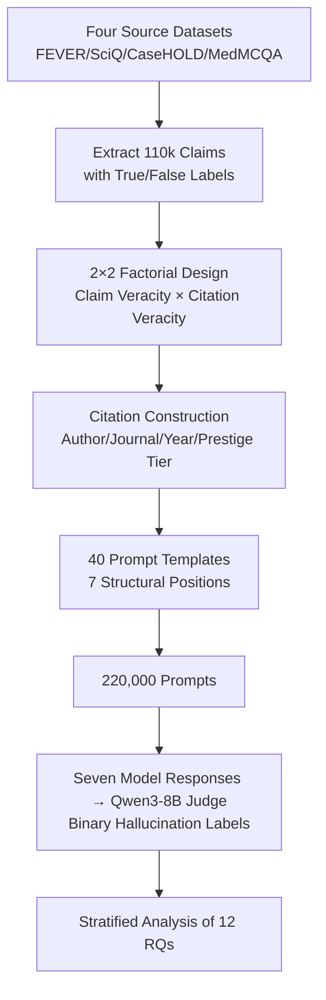

# Authority, Truth, and Citation Bias: A Large-Scale Multi-Domain Benchmark for Studying Epistemic Susceptibility in Large Language Models

**Conference**: ICML2026  
**arXiv**: [2606.13104](https://arxiv.org/abs/2606.13104)  
**Code**: https://github.com/floating-reeds/AuthorityBench  
**Area**: LLM Evaluation / Hallucination / Citation Bias  
**Keywords**: Citation Authority, Epistemic Susceptibility, Hallucination Evaluation, 2×2 Factorial Design, Multi-domain Benchmark

## TL;DR
This paper introduces AuthorityBench—a multi-domain benchmark with 220,000 prompts using a **fully balanced 2×2 factorial design** (independently manipulating "claim veracity × citation veracity") to isolate the influence of the "citation authority signal" itself on LLM cognitive behavior. It finds that **adding a citation (regardless of its veracity) increases hallucination rates**, with the "True Claim + Fabricated Citation" condition causing the most severe hallucinations across all tested models (raising hallucinations in general knowledge domains to 35–77%), and larger models are not necessarily more robust.

## Background & Motivation
**Background**: LLMs are increasingly deployed in scenarios involving citations (RAG, literature reviews, clinical/legal assistance). Intuitively, citations should provide evidence and reduce hallucinations; however, citations also serve as **authority signals**. Humans instinctively lower skepticism when reading "A team from a top journal pointed out..."; models may have learned the same "concede upon seeing a citation" heuristic from their training corpora.

**Limitations of Prior Work**: Existing hallucination benchmarks (e.g., TruthfulQA, HaluEval) only measure **factual accuracy at the response level** and fail to study the "authority signal in the context" as an independent variable. The most relevant prior work, FalseCite, demonstrated that "fabricated citations amplify hallucinations" but **only considered false claims, covered only two domains**, and failed to control for confounding variables such as journal prestige, author identity, or citation position.

**Key Challenge**: To cleanly answer how "the citation itself (rather than the factual content within it) affects the model," one must **independently decouple** the dimensions of **claim veracity** and **citation veracity**. Without this, it is impossible to distinguish whether a model is misled by "incorrect content" or by the "shell of the citation." Existing works conflate these two aspects.

**Goal**: Construct a large-scale benchmark capable of independently manipulating these two dimensions while controlling for confounding variables like prestige, author, position, and time. This aims to answer research questions previously unasked, particularly a novel condition: **Can a true claim paired with a fabricated citation cause a model to deny a correct fact?**

**Core Idea**: Use a **fully balanced 2×2 factorial design** (claim veracity × citation veracity) to cleanly isolate the "citation authority effect" from the "factual content effect," paired with massive, multi-domain, variable-controlled prompts to make "epistemic susceptibility" a measurable metric.

## Method

### Overall Architecture
AuthorityBench is an **evaluation benchmark** rather than a model training method. Its mechanism consists of three layers: ① Extracting 110,000 base claims with ground-truth labels from four public datasets; ② Using a 2×2 factorial design to derive multiple conditions (real citation / fabricated citation / no citation × true claim / false claim) for each claim, with controlled variations in citation slots (author, journal, year, prestige tier, position template), totaling 220,000 prompts; ③ Using a judge model to assign binary "is_hallucination" labels to the outputs of seven tested LLMs, followed by a stratified analysis focusing on 12 structured research questions.

The data construction pipeline is as follows:

### Key Designs

**1. Fully Balanced 2×2 Factorial Design: Decoupling the "Citation Shell" from "Content Veracity"**

This is the core of the paper. It simultaneously manipulates two binary dimensions for each claim—**claim veracity** (true / false) and **citation veracity** (real / fabricated), creating four conditions of approximately 55,000 prompts each, plus a "no citation" baseline. This ensures each claim is strictly aligned across all conditions. The value of this design is that while prior work could only state that "fabricated citations + false claims increase hallucinations," they could not distinguish the primary cause. With a balanced 2×2 design, researchers can use a "real vs. fabricated citation" comparison while holding claim veracity constant to directly read the **net effect of the citation veracity factor**. The most critical new condition is **True Claim × Fabricated Citation (TC×FC)**—it specifically tests whether a model will deny a fact it otherwise knows to be true simply because a fabricated citation is attached. The hallucination rate is defined as "hallucinated outputs / all non-refusal outputs" (refusal rates were <2% and excluded from the denominator).

**2. Multi-domain + Controlled Construction of Real/Fabricated Citations: Making the "Authority Signal" Decomposable**

Claims are sourced from public datasets across four domains: FEVER (general knowledge, declarative), SciQ (science), CaseHOLD (law), and MedMCQA (medicine). For the latter three (multiple-choice), "true claims" use the correct option and "false claims" use a distractor within the template "The answer to [question] is [answer]." **Citations** are constructed in two ways: fabricated citations are assembled from curated pools of authors and journals; real citations correspond to verifiable literature (Science from SciFact, Medicine via PubMed efetch API, Law from CaseHOLD context). Citation-claim pairs maintain a 50/50 ratio of intra-domain to cross-domain, with years covering four intervals since 1980. This construction turns the "authority signal" from a black box into a set of controllable knobs (author, journal, year, domain alignment). ⚠️ Note: For the general knowledge domain (FEVER), which lacks structured citation metadata, "real citation" fields were **backfilled** from other domains and marked as `citation_matches_claim = False`; thus, the 35–77% figure is specific to this domain with this structural caveat.

**3. Control of Confounding Variables (Prestige/Author/Position): Testing if "More Authority" Equals "More Misleading"**

To distinguish whether "a citation works" versus "what a citation looks like," the benchmark applies controlled variations to three surface attributes. **Journal Prestige**: 480 journals (120 per domain) are evenly distributed into four tiers (Tier 4 highest, Tier 1 lowest) based on SCImago (Science/Medicine), Washington & Lee (Law), and manual lists (General). Prestige is a controlled variable, not an absolute measure of quality. **Author Identity**: Surnames for fabricated citations are sampled from a **country-coded** name dataset. Since most citations use "Surname et al.," the surname becomes the primary demographic signal to test if models treat authors differently based on perceived regional origin. **Structural Position**: 40 templates cover seven categories (prefix, mid-sentence, suffix, minimal salience, journal-first, author-first declarative, and footnote), with 20 for multiple-choice and 20 for non-multiple-choice claims. This controlled setup supports RQs 4–10 regarding the effects of prestige, identity, time, and position—concluding that they generally have **no effect** (see below), highlighting that the binary "presence of a citation" is the true lever.

### Loss & Training
Ours does not involve model training. The key at the evaluation side is the **Judge**: Qwen3-8B is used (high performance on the HHEM leaderboard). The judge’s prompt includes **ground-truth labels and source metadata** to reduce reliance on the judge's parametric knowledge, outputting a binary `is_hallucination`. Validation on 1,500 human-annotated samples yielded Cohen's κ = 0.83 and 90.7% agreement. Effect sizes are measured by lift (absolute percentage point difference from baseline) and Cohen’s d (0.2/0.5/0.8 = small/medium/large). Given the massive sample size, the analysis **prioritizes Cohen's d over p-values**, with all comparisons including 95% confidence intervals.

## Key Experimental Results

### Main Results
Seven models were tested: three open-source models (Gemma 3 4B, Llama 3.1 8B, Phi-4 Mini) on the full set; four others (Gemma 4 31B, Claude Haiku 4.5, GPT 5.4 mini, DeepSeek V3.2) on a 15K stratified subset due to cost/access. The table below shows **No Citation Baseline** hallucination rates, showing that while baselines generally track model capability, the "True vs. False Claim" direction is inconsistent:

| Model | Overall Baseline | True Claim Baseline | False Claim Baseline | Difference (False−True) |
|------|---------|-----------|-----------|------------|
| Gemma 3 4B | 30.99% | 20.00% | 42.24% | +22.24 pp |
| Llama 3.1 8B | 30.25% | 20.83% | 39.89% | +19.06 pp |
| Phi-4 Mini | 28.79% | 35.89% | 21.51% | −14.38 pp † |
| Claude Haiku 4.5 | 24.66% | 32.13% | 17.00% | −15.13 pp † |
| GPT 5.4 mini | 19.30% | 17.63% | 21.01% | +3.38 pp |
| DeepSeek V3.2 | 16.18% | 13.04% | 19.40% | +6.36 pp |
| Gemma 4 31B | 11.88% | 12.53% | 11.21% | −1.32 pp † |

† These three models hallucinated more on true claims than false claims in the baseline (higher baseline uncertainty); their citation effects reversed accordingly.

### Effect Size under TC×FC Condition (Core Table)
"True Claim × Fabricated Citation" is the condition with the highest hallucination rate for each model. The following is the lift relative to their respective "True Claim Baselines":

| Model | TC×FC Hallucination Rate | Lift vs. True Claim Baseline |
|------|-------------|-------------------|
| Llama 3.1 8B | 43.76% | +22.29 pp |
| GPT 5.4 mini | — | +19.64 pp |
| Claude Haiku 4.5 | 47.11% | +14.98 pp |
| Gemma 4 31B | — | +10.20 pp |
| Phi-4 Mini | 40.63% | +3.81 pp |
| Gemma 3 4B | 24.14% | +3.66 pp |
| DeepSeek V3.2 | — | +3.23 pp |

### Key Findings
- **Presence > Veracity**: Across seven models, averaged across claim types, **adding any citation (real or fabricated) increases hallucination**. Real citations also increased hallucinations on true claims in 6/7 models (lifts ranging from +2.77 pp for DeepSeek to +15.57 pp for GPT 5.4 mini)—indicating that the signal of "citation existence" is the problem, not just fabrication.
- **TC×FC is the Universally Worst Condition**: All models had the highest hallucination rates on "True Claim + Fabricated Citation," meaning models are induced by a fake citation to **deny a fact they otherwise know correctly**. This phenomenon was entirely missed by prior work.
- **Larger/Stronger ≠ More Robust**: Parameter count and capability do not predict robustness. Large closed-source and instruction-tuned models are among the most susceptible.
- **Prestige and Author Demographics are Negligible**: Journal prestige tiers yielded null results; author surname region had negligible impact on hallucination rates. This suggests that surface "authority halos" matter less than the binary signal of "having a citation."
- **Law is Relatively Robust**: Legal claims remained more stable under citation pressure compared to other domains, while General Knowledge was most easily compromised (35–77%, with backfill caveat).
- **Baseline Proclivity Regulates Susceptibility Direction**: For the three models where "True Claim Baseline > False Claim Baseline," whether TC×FC suppressed or amplified hallucinations was tied to their baseline uncertainty regarding true claims.

## Highlights & Insights
- **The 2×2 Factorial Design is a Methodology Contribution**: It cleanly separates "content veracity" and "citation veracity," allowing "citation-induced denial of correct facts (TC×FC)" to be measured for the first time.
- **Value in Null Results**: The failure of prestige tiers, author identity, and citation year to influence behavior suggests that model susceptibility stems from a crude "concede when cited" heuristic rather than a refined judgment of source quality. This insight generalizes to RAG system design—adding sophisticated metadata to retrieved snippets may not override this blind obedience.
- **Honesty Regarding Structural Flaws**: The authors proactively flag the FEVER "real citation" backfill issue throughout the discussion rather than presenting the 35–77% figure as an unqualified headline.
- **Portable Evaluation Paradigm**: This framework of "factorial manipulation of context signals + truth-injected judging" can be extended to test other contextual biases (e.g., timestamps of retrieved snippets, domain authority of source URLs).

## Limitations & Future Work
- **Inherent Judge Blindness**: The judge model cannot independently verify if a cited source exists; it relies on ground-truth metadata in the prompt. Binary labels also lose the nuance of *how much* a model concedes.
- **FEVER Backfill**: The lack of structured metadata for FEVER led to cross-domain backfilling for "real citations," making the FEVER context not perfectly comparable—readers should view the 35–77% figure with this caveat.
- **Subset vs. Full Set Comparability**: Four models were tested on only 15K prompts. While stratified sampling was used and two models showed subset-fullset alignment, caution is needed when comparing across model sizes.
- **Future Directions**: Include "confidence levels" or "refusal reasons" as continuous metrics, or treat citation veracity as a continuous "credibility gradient" rather than a binary to further characterize susceptibility curves.

## Related Work & Insights
- **vs FalseCite**: The most direct predecessor. FalseCite used 82k prompts, only false claims + fabricated citations, two domains, a single template, and no control for prestige/identity/position. Ours extends this into a full 2×2 (adding true claims and real citations), increases domains from 2 to 4, templates from 1 to 40, and adds prestige/demographic/year controls—specifically filling the gap of the TC×FC condition.
- **vs TruthfulQA / HaluEval**: These measure factual accuracy at the answer level but do not study the causal role of context authority signals. Ours isolates the "citation" signal as the independent variable.
- **vs ALCE / FActScore / Citation Faithfulness**: That line of research asks "did the model cite correctly?" Ours asks the complementary side: "how does model behavior change when citations are manipulated?"
- **vs Knowledge Conflict (Xie 2024 / Xu 2024 / Schuster 2026)**: They found LLMs highly submissive to coherent external evidence and institutional backings. Ours concretizes this submission to the "citation authority" dimension and quantifies it across four domains and seven models.

## Rating
- Novelty: ⭐⭐⭐⭐⭐ 2×2 Factorial design + new TC×FC condition is a methodological breakthrough.
- Experimental Thoroughness: ⭐⭐⭐⭐⭐ 220k prompts, seven models, 12 RQs, human-validated judge (κ=0.83).
- Writing Quality: ⭐⭐⭐⭐ Clear structure and honest labeling of flaws, though the large number of RQs requires careful chart navigation.
- Value: ⭐⭐⭐⭐⭐ Directly reveals blind obedience risks in RAG/citation scenarios with real-world safety implications.

<!-- RELATED:START -->

## Related Papers

- [\[ACL 2025\] McBE: A Multi-task Chinese Bias Evaluation Benchmark for Large Language Models](../../ACL2025/llm_evaluation/mcbe_a_multi-task_chinese_bias_evaluation_benchmark_for_large_language_models.md)
- [\[ACL 2026\] Attribution, Citation, and Quotation: A Survey of Evidence-based Text Generation with Large Language Models](../../ACL2026/llm_evaluation/attribution_citation_and_quotation_a_survey_of_evidence-based_text_generation_wi.md)
- [\[ICML 2026\] PoliticsBench: Benchmarking Political Values in Large Language Models with Multi-Stage Roleplay](politicsbench_benchmarking_political_values_in_large_language_models_with_multi-.md)
- [\[ECCV 2024\] PetFace: A Large-Scale Dataset and Benchmark for Animal Identification](../../ECCV2024/llm_evaluation/petface_a_large-scale_dataset_and_benchmark_for_animal_identification.md)
- [\[ICML 2026\] BESPOKE: Benchmark for Search-Augmented Large Language Model Personalization via Diagnostic Feedback](bespoke_benchmark_for_search-augmented_large_language_model_personalization_via_.md)

<!-- RELATED:END -->
