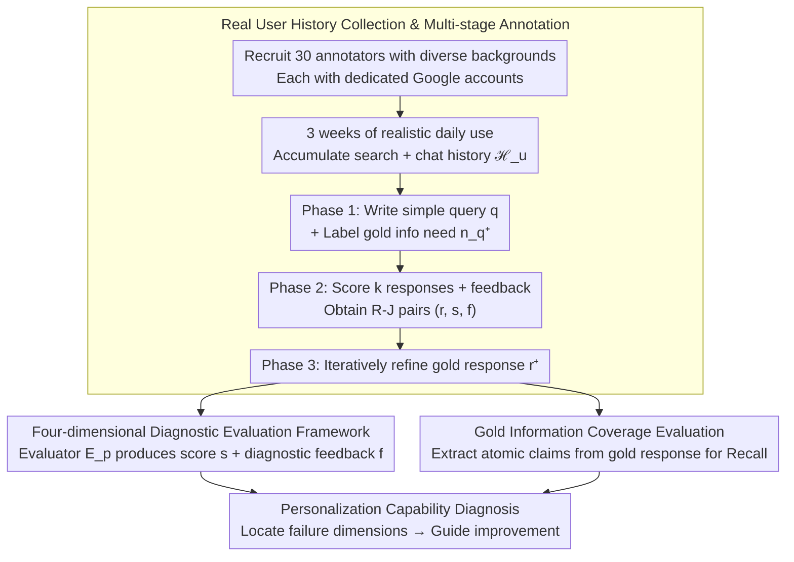

# BESPOKE: Benchmark for Search-Augmented Large Language Model Personalization via Diagnostic Feedback

**Conference**: ICML2026  
**arXiv**: [2509.21106](https://arxiv.org/abs/2509.21106)  
**Code**: https://github.com/augustinLib/BESPOKE  
**Area**: LLM Evaluation  
**Keywords**: Personalized Evaluation, Search-Augmented LLM, User Preferences, Diagnostic Feedback, Benchmark  

## TL;DR
The Bespoke benchmark is proposed, collecting 2,870 sessions through three weeks of real-world chat and search history from 30 annotators. It constructs an evaluation framework containing fine-grained preference scores and diagnostic feedback to systematically evaluate the personalization capabilities of search-augmented LLMs. Results show that current models do not exceed an average score of 60 under any configuration, with the personalization bottleneck lying in history reasoning rather than generation.

## Background & Motivation

**Background**: Search-augmented LLMs (e.g., ChatGPT, Gemini) integrate retrieved information via RAG to answer user queries, significantly reducing cognitive load. Recent systems have begun utilizing user chat and search histories to personalize responses.

**Limitations of Prior Work**: Despite continuous enhancements in personalization capabilities, systematic evaluation of these systems remains severely insufficient. Existing benchmarks like LaMP-QA are limited to specific domain QA interactions such as StackExchange and cannot cover real-world open web scenarios; RAG-QA Arena and Search Arena only provide binary preference judgments, lacking fine-grained diagnosis of personalization quality.

**Key Challenge**: The same query may correspond to entirely different information needs and presentation preferences across different user backgrounds (e.g., one user focuses on environmental impact and prefers narrative explanations, while another focuses on performance metrics and prefers concise lists). However, there is a lack of an evaluation benchmark that possesses both "real user history" and "diagnostic feedback" to comprehensively assess this personalization capability.

**Goal**: Construct a personalized search-augmented LLM evaluation benchmark that is both realistic (real user history) and diagnostic (fine-grained preference scores + feedback).

**Key Insight**: Effective personalization evaluation requires two key elements: realistic user interaction history to characterize preferences, and reasoning over that history to infer information needs. These two elements are addressed simultaneously through long-term, deeply involved human annotation.

**Core Idea**: Recruit 30 annotators from diverse backgrounds to use dedicated Google accounts for 3 weeks of real-world daily searching and chatting. After collecting complete user histories, annotators write their own queries and provide four-dimensional scores plus diagnostic feedback for model responses, forming a complete closed loop for training personalized evaluators.

## Method

### Overall Architecture
Bespoke aims to solve the problem of "how to realistically and finely evaluate the personalization capabilities of search-augmented LLMs." For a user $u$ and query $q$, the user history is defined as $\mathcal{H}_u = \{\mathcal{S}_u, \mathcal{C}_u\}$ (search history + chat history). The model must first infer information needs $n_q$ from the history, then retrieve and generate a personalized response $r$. The benchmark is built across three stages: first, collecting long-term user history with real accounts; second, having annotators write queries, score responses, and produce gold responses in stages; finally, converting these annotations into a four-dimensional + information recall diagnostic evaluation framework.

### Key Designs

**1. Real User History Collection & Multi-stage Annotation: Trading long-term daily use for data with authentic preferences**

Existing benchmarks either rely on synthetic personas or are limited to specific domain QA like StackExchange, which fails to reflect the complexity and diversity of real user behavior. Bespoke recruits 30 annotators from different backgrounds (Shannon evenness of background distribution reaches 0.91), providing each with a dedicated Google account for 3 weeks of real daily searching and chatting, ultimately accumulating 2,870 sessions (2,153 search + 717 chat, average 95.67 per person). After obtaining the full history, annotation proceeds in three stages: (1) annotators write a simple query $q$ based on their own history and label its gold information need $n_q^+$; (2) they score $k$ sampled responses across four dimensions and write diagnostic feedback, forming Response-Judgment (R-J) pairs; (3) they produce a gold response $r^+$ through iterative refinement. Since queries, scores, and gold responses all originate from the same "person actually possessing that history," the preference signals are authentic rather than external conjectures.

**2. Four-dimensional Diagnostic Evaluation Framework: Not just judging good or bad, but pointing out failures**

Binary preference judgments (chosen/reject) can only state which response is better but cannot pinpoint where personalization specifically failed. Bespoke deconstructs personalization quality into four dimensions: Need Alignment, Content Depth, Tone, and Explanation Style, making evaluation diagnostic. The evaluator $\mathcal{E}_p$ is based on a few-shot GPT-5 setup: it first generates a query-specific gold rubric $\mathcal{R}_q^+$ from the set of R-J pairs $\mathcal{D}_q$ for that query, then combines examples and gold information needs to produce both scores and feedback for new responses, i.e., $(s, f) = \mathcal{E}(\mathcal{D}_q, \mathcal{R}_q^+, n_q^+, q, \hat{r})$. Here, the feedback $f$ is used not only for evaluation but also specifies the direction for improvement, serving as a supervisory signal for subsequent personalized system optimization, extending "evaluation" into a "evaluation → diagnosis → improvement" loop.

**3. Gold Information Coverage Evaluation: Measuring information delivery via atomic claim recall**

In open web scenarios, responses are often redundant or include irrelevant content, making overall scores difficult to reflect "whether the key information was actually delivered." To address this, atomic claims are first extracted from the gold response $r^+$ using GPT-5, and unverifiable ones are manually filtered out, leaving the gold information set $\mathcal{I}_q^+ = \{i_{q,1}^+, \dots, i_{q,n}^+\}$. During evaluation, each atomic claim is judged for correct expression in the model response $\hat{r}$ to calculate recall $\text{Recall}(\hat{r}) = |\mathcal{I}_{\hat{r}}| / |\mathcal{I}_q^+|$. Mapping information coverage to claim granularity characterizes whether the response actually stated what needed to be said more accurately than paragraph-level comparison.

## Key Experimental Results

### Main Results: Search-Augmented LLM Personalization Evaluation

Evaluating 6 models under different user context construction configurations (best configuration: query-aware + history selection + profile):

| Model | Need Align. | Content Depth | Tone | Style | Recall | Avg. |
|------|------------|---------------|------|-------|--------|------|
| o3-search (Best) | 59.07 | 63.73 | 85.20 | 73.87 | 30.53 | **62.48** |
| Gemini-2.5-Pro | 56.40 | 60.27 | 84.40 | 72.40 | 25.32 | 59.76 |
| Gemini-2.5-Flash | 55.73 | 61.03 | 82.83 | 71.73 | 28.09 | 59.88 |
| pplx-sonar | 55.80 | 59.90 | 85.13 | 72.37 | 25.50 | 59.74 |
| pplx-sonar-reasoning| 54.27 | 57.47 | 83.33 | 70.67 | 23.93 | 57.93 |
| GPT-4o-search | 53.80 | 57.20 | 84.83 | 69.93 | 19.23 | 57.00 |
| o3-search (No Personalization) | 51.60 | 57.47 | 78.53 | 70.00 | 22.05 | 55.93 |

### Meta-evaluation: Evaluator Consistency with Human Judgment

| Evaluator Config | Pearson Corr. (Avg.) | Spearman Corr. (Avg.) | Feedback Acc. (Avg.) |
|-----------|---------------------|----------------------|---------------------|
| w/o Personalization | 0.470 | 0.477 | 0.360 |
| w/o Feedback | 0.809 | 0.814 | 0.801 |
| **w/ Feedback (Bespoke)** | **0.847** | **0.853** | **0.881** |

### Key Findings

- **User context significantly improves personalization**: All models showed improvements across metrics after introducing user history, but Recall remained the lowest (maximum only 30.53%), indicating that accurate information delivery remains extremely challenging.
- **Query-aware profile > Static profile > Raw history**: Dynamically constructing user profiles relevant to the query is more effective than full history or fixed profiles.
- **Bottleneck is reasoning, not generation**: In Oracle experiments where gold information needs were directly provided, o3-search’s Need Alignment soared to 83.47 and Tone to 88.13, showing that models have the capability to generate personalized responses, but inferring preferences from history remains the primary bottleneck.
- **Reasoning models are more sensitive to search quality**: After injecting 70% noise, Sonar-Reasoning's average performance dropped by 23.13%, far exceeding Sonar's 16.78%.

## Highlights & Insights
- First personalization search LLM benchmark to feature both real user history and diagnostic feedback, with data collection spanning 3 weeks, 30 annotators, and 2,870 real sessions.
- Diagnostic feedback is used not only for evaluation but also as a supervisory signal for personalization system improvement, forming an "evaluation → diagnosis → improvement" loop.
- Query expansion (CoT/Pseudo-history) can increase history retrieval nDCG@10 from 0.082 to over 0.38, providing a practical solution for efficient user history retrieval.
- The open-source evaluator can use open-source models (GPT-oss-120B, Qwen3-235B) instead of GPT-5 while maintaining high consistency.

## Limitations & Future Work
- Only 30 annotators were involved; while diversity is high, the scale is limited and may not cover all real user types.
- The evaluation framework relies on LLM-as-judge; although meta-evaluation shows high consistency, inherent bias risks remain.
- History collection was limited to 3 weeks; long-term preference drift has not yet been considered.
- Atomic claim extraction and judgment for the Recall metric rely on GPT-5, potentially introducing cascading errors.

## Related Work & Insights
- **LaMP Series** (Salemi et al.): Early personalization benchmarks based on synthetic personas, limited to specific domains like StackExchange.
- **Search Arena** (Miroyan et al.): Search LLM evaluation in open web settings, but only provides binary preference judgments.
- **RAG-QA Arena** (Han et al.): Long-context QA evaluation, but limited to professional domains without personalization dimensions.
- Bespoke's "query expansion + history retrieval" paradigm can inspire the design of future personalized RAG systems.

## Rating
- Novelty: 9/10 — First personalized search LLM benchmark combining real history with four-dimensional diagnostic feedback.
- Experimental Thoroughness: 9/10 — 6 models, multiple configuration ablations, meta-evaluation, Oracle experiments, and noise robustness analysis.
- Writing Quality: 8/10 — Clear structure, though some mathematical notation and table density are high.
- Value: 8/10 — Fills an important gap in personalized search LLM evaluation; diagnostic feedback design has practical utility.

<!-- RELATED:START -->

## Related Papers

- [\[ICML 2026\] HiPER: Hierarchical Reinforcement Learning with Explicit Credit Assignment for Large Language Model Agents](hiper_hierarchical_reinforcement_learning_with_explicit_credit_assignment_for_la.md)
- [\[NeurIPS 2025\] Bayesian Evaluation of Large Language Model Behavior](../../NeurIPS2025/llm_evaluation/bayesian_evaluation_of_large_language_model_behavior.md)
- [\[AAAI 2026\] Lost in Benchmarks? Rethinking Large Language Model Benchmarking with Item Response Theory](../../AAAI2026/llm_evaluation/lost_in_benchmarks_rethinking_large_language_model_benchmarking_with_item_respon.md)
- [\[ACL 2026\] ReCoQA: A Benchmark for Tool-Augmented and Multi-Step Reasoning in Real Estate Question and Answering](../../ACL2026/llm_evaluation/recoqa_a_benchmark_for_tool-augmented_and_multi-step_reasoning_in_real_estate_qu.md)
- [\[ICML 2026\] DEI: Diversity in Evolutionary Inference for Quality-Diversity Search](dei_diversity_in_evolutionary_inference_for_quality-diversity_search.md)

<!-- RELATED:END -->
