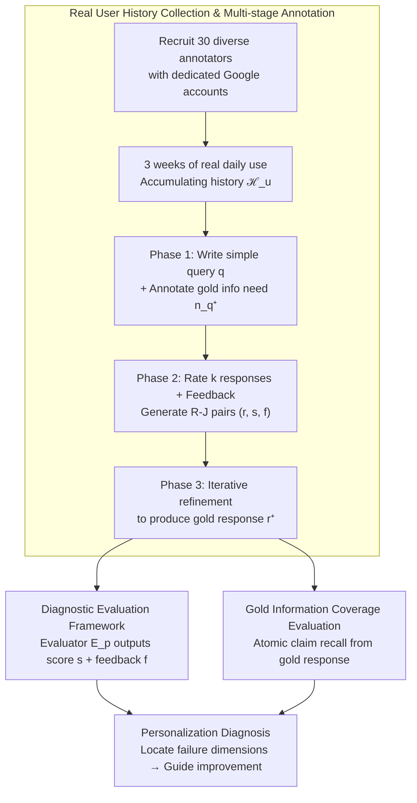

# BESPOKE: Benchmark for Search-Augmented Large Language Model Personalization via Diagnostic Feedback

**Conference**: ICML2026  
**arXiv**: [2509.21106](https://arxiv.org/abs/2509.21106)  
**Code**: https://github.com/augustinLib/BESPOKE  
**Area**: LLM Evaluation  
**Keywords**: Personalization evaluation, search-augmented LLMs, user preferences, diagnostic feedback, Benchmark  

## TL;DR
The Bespoke benchmark is proposed, collecting 2,870 sessions from 30 annotators over 3 weeks of real chat and search history. It constructs an evaluation framework with fine-grained preference ratings and diagnostic feedback to systematically assess the personalization capabilities of search-augmented LLMs. Findings indicate that current models score below 60 on average across all configurations, with the bottleneck for personalization lying in history reasoning rather than generation.

## Background & Motivation

**Background**: Search-augmented LLMs (e.g., ChatGPT, Gemini) integrate retrieved information via RAG to answer user queries, significantly reducing cognitive load. Recent systems have begun leveraging user chat and search histories to personalize responses.

**Limitations of Prior Work**: Despite growing personalization capabilities, systematic evaluation of these systems remains insufficient. Existing benchmarks like LaMP-QA are restricted to domain-specific QA interactions such as StackExchange, failing to cover real open-web scenarios. RAG-QA Arena and Search Arena only provide binary preference judgments, lacking fine-grained diagnosis of personalization quality.

**Key Challenge**: The same query may correspond to entirely different information needs and presentation preferences depending on the user background (e.g., one user focusing on environmental impact with narrative explanations, another on performance metrics with concise lists). However, there is a lack of an evaluation benchmark that combines "real user history" with "diagnostic feedback" for a comprehensive assessment of such capabilities.

**Goal**: Construct a personalization benchmark for search-augmented LLMs that is both realistic (real user history) and diagnostic (fine-grained preference ratings and feedback).

**Key Insight**: Effective personalization evaluation requires two key elements: real user interaction history to characterize preferences, and reasoning over that history to infer information needs. These elements are addressed through long-term, deeply involved human annotation.

**Core Idea**: 30 annotators from diverse backgrounds were recruited to conduct real daily searches and chats using dedicated Google accounts for 3 weeks. After collecting complete user histories, annotators wrote their own queries and provided four-dimensional ratings and diagnostic feedback on model responses, forming a complete loop for training personalized evaluators.

## Method

### Overall Architecture
Bespoke aims to solve the problem of "how to realistically and granularly evaluate the personalization capabilities of search-augmented LLMs." For a user $u$ with query $q$, user history is defined as $\mathcal{H}_u = \{\mathcal{S}_u, \mathcal{C}_u\}$ (search history + chat history). The model must first infer the information need $n_q$ from the history, then retrieve and generate a personalized response $r$. The benchmark is built across three stages: collecting long-term user history via real accounts, multi-stage annotation (query writing, scoring, and gold response generation) by annotators, and finally establishing a diagnostic evaluation framework based on four dimensions and information recall.

### Key Designs

**1. Real User History Collection & Multi-stage Annotation: Trading long-term daily use for authentic preference data**

Existing benchmarks rely on synthetic personas or domain-specific QA like StackExchange, which fail to reflect the complexity and diversity of real user behavior. Bespoke recruits 30 annotators from varied backgrounds (Shannon evenness of background distribution reaches 0.91). Each uses a dedicated Google account for 3 weeks of real daily searching and chatting, accumulating 2,870 sessions (2,153 searches + 717 chats, averaging 95.67 per person). After obtaining complete histories, annotation proceeds in three stages: (1) Annotators write a simple query $q$ based on their history and label the gold information need $n_q^+$; (2) They rate $k$ sampled responses across four dimensions and write diagnostic feedback, forming Response-Judgment (R-J) pairs; (3) Gold responses $r^+$ are produced through iterative refinement. Since queries, ratings, and gold responses all originate from the person who "truly owns the history," the preference signals are authentic rather than externally guessed.

**2. Four-Dimensional Diagnostic Evaluation Framework: Identifying specific failure points**

Binary preference judgments (chosen/rejected) only indicate which response is better without locating where personalization specifically fails. Bespoke decomposes personalization quality into four dimensions: Need Alignment, Content Depth, Tone, and Explanation Style. The evaluator $\mathcal{E}_p$ is based on a GPT-5 few-shot setting. It first generates a query-specific gold rubric $\mathcal{R}_q^+$ from the set of R-J pairs $\mathcal{D}_q$ for that query, then combines examples and gold needs to produce both scores and feedback for a new response: $(s, f) = \mathcal{E}(\mathcal{D}_q, \mathcal{R}_q^+, n_q^+, q, \hat{r})$. The feedback $f$ is not only for evaluation; it points toward improvement and can be used as a supervision signal for optimizing personalization systems, extending "evaluation" into an "evaluation → diagnosis → improvement" loop.

**3. Gold Information Coverage Evaluation: Measuring information delivery via atomic claim recall**

In open-web scenarios, responses are often redundant or contain irrelevant content, making overall scores poor indicators of whether "key information was delivered." Thus, GPT-5 is used to extract atomic claims from the gold response $r^+$. After manual filtering of unverifiable claims, a gold information set $\mathcal{I}_q^+ = \{i_{q,1}^+, \dots, i_{q,n}^+\}$ is established. During evaluation, each atomic claim is checked for correct expression in the model response $\hat{r}$ to calculate recall: $\text{Recall}(\hat{r}) = |\mathcal{I}_{\hat{r}}| / |\mathcal{I}_q^+|$. Measuring coverage at the claim level characterizes whether the response actually communicated what was necessary more accurately than whole-string comparisons.

## Key Experimental Results

### Main Results: Personalization Evaluation of Search-Augmented LLMs

Performance of 6 models across different user context configurations (Best config: query-aware + history selection + profile):

| Model | Need Align. | Content Depth | Tone | Style | Recall | Avg. |
|------|------------|---------------|------|-------|--------|------|
| o3-search (Best Config) | 59.07 | 63.73 | 85.20 | 73.87 | 30.53 | **62.48** |
| Gemini-2.5-Pro | 56.40 | 60.27 | 84.40 | 72.40 | 25.32 | 59.76 |
| Gemini-2.5-Flash | 55.73 | 61.03 | 82.83 | 71.73 | 28.09 | 59.88 |
| pplx-sonar | 55.80 | 59.90 | 85.13 | 72.37 | 25.50 | 59.74 |
| pplx-sonar-reasoning | 54.27 | 57.47 | 83.33 | 70.67 | 23.93 | 57.93 |
| GPT-4o-search | 53.80 | 57.20 | 84.83 | 69.93 | 19.23 | 57.00 |
| o3-search (No Personalization) | 51.60 | 57.47 | 78.53 | 70.00 | 22.05 | 55.93 |

### Key Findings

- **User context significantly improves personalization**: All models showed improvement across metrics when user history was included. However, Recall remained consistently the lowest (peak at only 30.53%), indicating that precise information delivery remains highly challenging.
- **Query-aware profile > Static profile > Raw history**: Dynamically constructing a query-relevant user profile is more effective than using full history or fixed profiles.
- **Bottleneck in reasoning, not generation**: In Oracle experiments providing gold info needs directly, o3-search's Need Alignment jumped to 83.47 and Tone to 88.13. This suggests models possess the capability to generate personalized responses, but inferring preferences from history remains the primary bottleneck.
- **Reasoning models are more sensitive to search quality**: After injecting 70% noise, Sonar-Reasoning's average performance dropped by 23.13%, far exceeding Sonar’s 16.78%.

## Highlights & Insights
- The first personalization benchmark for search LLMs to combine real user history with diagnostic feedback, involving 3 weeks of data collection and 2,870 real sessions.
- Diagnostic feedback serves not just for evaluation but as a supervision signal for system improvement, creating a closed loop.
- Query expansion (CoT/Pseudo-history) can increase history retrieval nDCG@10 from 0.082 to over 0.38, providing a practical solution for efficient history retrieval.
- Open-source evaluators can use open-weights models (e.g., GPT-oss-120B, Qwen3-235B) instead of GPT-5 while maintaining high consistency.

## Limitations & Future Work
- The number of annotators is limited to 30; while diversity is high, the scale may not cover all real-world user types.
- The evaluation framework relies on LLM-as-judge; despite high consistency in meta-evaluation, inherent bias risks remain.
- History collection spans only 3 weeks, so long-term preference drift is not yet addressed.
- Atomic claim extraction and judgment for the Recall metric depend on GPT-5, potentially introducing cascading errors.

## Related Work & Insights
- **LaMP Series** (Salemi et al.): Early personalization benchmarks based on synthetic personas, limited to specific domains like StackExchange.
- **Search Arena** (Miroyan et al.): Search LLM evaluation in open-web settings, but limited to binary preference judgments.
- **RAG-QA Arena** (Han et al.): Long-text QA evaluation, but restricted to professional domains without personalization dimensions.
- The "query expansion + history retrieval" paradigm in Bespoke could inspire the design of future personalized RAG systems.

## Rating
- Novelty: 9/10 — First benchmark combining real history with four-dimensional diagnostic feedback for personalized search LLMs.
- Experimental Thoroughness: 9/10 — 6 models, multi-config ablations, meta-evaluation, Oracle experiments, and noise robustness analysis.
- Writing Quality: 8/10 — Clear structure, though some mathematical notation and tables are dense.
- Value: 8/10 — Fills a critical gap in personalized search LLM evaluation; diagnostic feedback design has practical utility.

<!-- RELATED:START -->

## Related Papers

- [\[ICML 2026\] Prescriptive Scaling Reveals the Evolution of Language Model Capabilities](prescriptive_scaling_reveals_the_evolution_of_language_model_capabilities.md)
- [\[ICML 2026\] Estimating Tail Risks in Language Model Output Distributions](estimating_tail_risks_in_language_model_output_distributions.md)
- [\[ICML 2026\] Authority, Truth, and Citation Bias: A Large-Scale Multi-Domain Benchmark for Studying Epistemic Susceptibility in Large Language Models](authority_truth_and_citation_bias_a_large-scale_multi-domain_benchmark_for_study.md)
- [\[ICML 2026\] HiPER: Hierarchical Reinforcement Learning with Explicit Credit Assignment for Large Language Model Agents](hiper_hierarchical_reinforcement_learning_with_explicit_credit_assignment_for_la.md)
- [\[ICLR 2026\] Don't Pass@k: A Bayesian Framework for Large Language Model Evaluation](../../ICLR2026/llm_evaluation/dont_passk_a_bayesian_framework_for_large_language_model_evaluation.md)

<!-- RELATED:END -->
