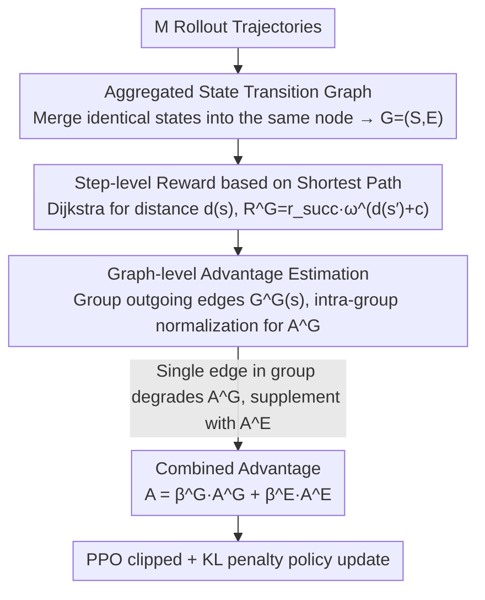

# Beyond Trajectory-Level Attribution: Graph-Based Credit Assignment for Agentic Reinforcement Learning

**Conference**: ICML 2026  
**arXiv**: [2605.26684](https://arxiv.org/abs/2605.26684)  
**Code**: [https://github.com/langfengQ/verl-agent/tree/master/recipe/GraphGPO](https://github.com/langfengQ/verl-agent/tree/master/recipe/GraphGPO)  
**Area**: Reinforcement Learning  
**Keywords**: Credit Assignment, Graph-Structured Policy Optimization, Multi-turn Agent Tasks, State Transition Graph, Critic-free RL  

## TL;DR

Ours proposes GraphGPO, which aggregates all rollout trajectories into a unified state transition graph. By leveraging global shortest path information on the graph to calculate distance-based advantages for each step, it achieves finer-grained credit assignment than trajectory-level attribution, significantly outperforming GRPO and GiGPO on ALFWorld, WebShop, and Sokoban.

## Background & Motivation

**Background**: Group-based reinforcement learning methods (such as GRPO) have achieved great success in LLM post-training. Their core advantage is discarding the resource-intensive critic model, relying solely on verifiable rewards and intra-group statistics to estimate advantages. Several recent works have extended GRPO to multi-turn agent tasks.

**Limitations of Prior Work**: Credit assignment in GRPO and its variants essentially relies on trajectory-level attribution—all steps in a successful trajectory receive positive credit, while all steps in a failed trajectory are punished. However, in multi-turn tasks, this attribution suffers from severe misalignment: approximately 22% of steps in failed trajectories actually advance the task goal, while about 65% of steps in successful trajectories do not effectively advance the task. Redundant steps are wrongly rewarded, and valuable failed steps are wrongly punished.

**Key Challenge**: Trajectory-level success/failure signals are too coarse to reflect the true contribution of intermediate steps to the task goal. Even though GiGPO introduced step-level advantages, its step-level reward $R^S = \lambda^{T-i} R(\boldsymbol{\tau})$ still depends on the final trajectory outcome $R(\boldsymbol{\tau})$, failing to truly decouple from trajectory-level attribution.

**Goal**: Design a step-level credit assignment method purely based on global state structure, without an additional critic model and without introducing significant computational overhead.

**Key Insight**: If the states from all rollout trajectories are merged into a single directed graph, the connectivity of the graph can be used to determine how far each state is from the goal. This allows for assigning rewards based on "distance reduction" for each step—entirely independent of the final outcome of the trajectory containing that step.

**Core Idea**: Aggregate all rollout trajectories into a unified state transition graph, define step-level rewards using shortest path distances, and calculate advantages using intra-group statistics for homologous edges on the graph.

## Method

### Overall Architecture

The pipeline of GraphGPO consists of three steps: (1) Aggregating $M$ rollout trajectories of the same task into a directed state transition graph $\mathcal{G} = (\mathcal{S}, \mathcal{E})$; (2) Calculating the shortest distance $d(s)$ from each state to the target state $s_{\text{succ}}$ using the Dijkstra algorithm on the graph; (3) Computing graph-level step-rewards and advantages for each edge based on distance, and finally performing PPO-style policy optimization combined with trajectory-level advantages.

### Key Designs

1. **Aggregated State Transition Graph**:

   All states from $M$ trajectories are treated as nodes, and all transitions as directed edges, with identical states merged into a single node. The node set is $\mathcal{S} = \bigcup_{m,t} \{s_t^m\}$, and an edge $(s, \boldsymbol{a}, s', c(s,\boldsymbol{a})) \in \mathcal{E}$ represents executing action $\boldsymbol{a}$ in state $s$ to transition to $s'$ with cost $c$. This explicitly represents state sharing and path crossing across different trajectories—for example, the first half of a failed trajectory might connect to the second half of a successful trajectory via a shared state.

2. **Step-level Reward based on Shortest Path**:

   For each state $s$, the shortest distance to the goal is calculated recursively: $d(s) = \min_{(s,a,s',c) \in \mathcal{E}} (c(s,\boldsymbol{a}) + d(s'))$, where $d(s_{\text{succ}})=0$ and for unreachable states $d(s)=d_{\max}+1$. A graph-level step-reward is then defined as $R^G(s, \boldsymbol{a}, s') = r_{\text{succ}} \cdot \omega^{d(s') + c(s,\boldsymbol{a})}$, where $\omega \in (0,1)$ is a distance discount factor. This means transitions closer to the goal receive higher rewards, regardless of the trajectory's ultimate success.

3. **Graph-level Advantage Estimation and Combined Optimization**:

   All outgoing edges from the same starting state $s$ are grouped as $G^G(s)$, and the standardized advantage $A^G = (R^G - \mu) / \sigma$ is calculated within the group. When there is only one edge in the group, $A^G = 0$, so it is combined with the trajectory-level advantage: $A(s,\boldsymbol{a},s') = \beta^G A^G + \beta^E A^E(\boldsymbol{\tau})$. Finally, policy updates are performed using the PPO clipped objective with KL penalty. The authors prove that graph-level advantages possess monotonicity (greater distance reduction yields larger advantage) and variance reduction properties (conditional variance does not exceed trajectory-level feedback).

## Key Experimental Results

| Benchmark | Model | GRPO | GiGPO | GraphGPO | Gain (vs GRPO) |
|------|------|------|-------|----------|------------|
| ALFWorld | Qwen2.5-1.5B | 77.86% | 90.88% | **92.71%** | +14.85% |
| ALFWorld | Qwen2.5-7B | 83.33% | 94.27% | **95.31%** | +11.98% |
| WebShop (Succ.) | Qwen2.5-1.5B | 71.35% | 73.83% | **78.65%** | +7.30% |
| WebShop (Succ.) | Qwen2.5-7B | 75.00% | 78.38% | **80.31%** | +5.31% |
| Sokoban 6×6 | Qwen2.5-VL-3B | 67.1% | 76.92% | **86.98%** | +19.88% |

| Ablation/Feature | Conclusion |
|----------|------|
| Removing $A^E$ | Both methods decrease, but GraphGPO still outperforms GiGPO by 20.57% on Sokoban. |
| Dynamic Sampling (+DS) | GraphGPO + DS reaches **98.43%** on ALFWorld and **85.68%** on WebShop. |
| Computational Overhead | Graph construction 0.108s + advantage calculation 0.025s, accounting for only 0.04% of total per-round time. |
| Training Dynamics | Convergence is significantly faster in early training, especially when success rates are low. |

## Highlights & Insights

- **Value Extraction from Failed Trajectories**: Through the graph structure, effective steps within failed trajectories can receive positive advantages because they actually shorten the distance to the goal, which is impossible for traditional trajectory-level attribution.
- **Natural Punishment for Redundancy/Loops**: Steps that form loops in the graph necessarily increase the distance ($d(s_{t+1}) > d(s_t)$), naturally receiving lower advantages without additional penalty mechanisms.
- **Near-Zero Extra Overhead**: Requires only one additional Dijkstra shortest path search per training iteration, with complexity $O((|\mathcal{V}|+|\mathcal{E}|) \log |\mathcal{V}|)$, taking 0.133s vs. a total duration of 291s.
- **Theoretical Guarantees**: Proved advantage monotonicity (Proposition 4.1) and conditional variance reduction (Proposition 4.2), providing analytical support for the method's effectiveness.

## Limitations & Future Work

- **Deterministic Environment Assumption**: State merging on the graph requires the environment to be deterministic (the same action in the same state leads to the same successor). The effectiveness of state merging may decrease in stochastic environments.
- **Dependency on Manual State Definition**: Requires defining what constitutes the "same state" (deterministic parts of environmental observations are used in the paper); state equivalence judgment might be difficult for open-domain tasks like free-text dialogue.
- **Simplification of Cost Function $c(s,\boldsymbol{a})$ to 1**: All transition costs were set to 1 in experiments. The effect of non-uniform costs (e.g., real-world time or monetary costs of tool calls) remains unexplored.
- **Graph Construction Limited to Single Iteration**: The graph for each iteration is built only on current rollout data, without accumulating historical experience across iterations.

## Related Work & Insights

- **GRPO** (Shao et al., 2024): The foundation for group-level RL; GraphGPO retains its core critic-free advantage.
- **GiGPO** (Feng et al., 2025b): Introduces step-level grouping but still relies on trajectory outcomes; GraphGPO fully decouples via graph structure.
- **PPO** (Schulman et al., 2017): The policy optimization objective of GraphGPO follows the PPO clipped objective framework.
- Insight: The graph structure perspective provides a new path for RL credit assignment. Similar ideas could be applied to Chain-of-Thought scenarios like code generation or mathematical reasoning.

## Rating

- Novelty: ⭐⭐⭐⭐ — The idea of aggregating trajectories into a state transition graph for credit assignment is novel and intuitive.
- Experimental Thoroughness: ⭐⭐⭐⭐ — Covers both text and vision agent tasks, with complete ablations and overhead analysis.
- Writing Quality: ⭐⭐⭐⭐ — Clear motivation, intuitive diagrams, and close integration of theory and experiments.
- Value: ⭐⭐⭐⭐ — Provides a practical, low-cost credit assignment improvement for LLM agent RL training.

<!-- RELATED:START -->

## Related Papers

- [\[ICML 2026\] HiPER: Hierarchical Reinforcement Learning with Explicit Credit Assignment for Large Language Model Agents](hiper_hierarchical_reinforcement_learning_with_explicit_credit_assignment_for_la.md)
- [\[ICML 2026\] Agent World Model: Infinity Synthetic Environments for Agentic Reinforcement Learning](agent_world_model_infinity_synthetic_environments_for_agentic_reinforcement_lear.md)
- [\[ICML 2026\] On Effectiveness and Efficiency of Agentic Tool-calling and RL Training](on_effectiveness_and_efficiency_of_agentic_tool-calling_and_rl_training.md)
- [\[ICML 2026\] From Human-Level AI Tales to AI Leveling Human Scales](from_human-level_ai_tales_to_ai_leveling_human_scales.md)
- [\[ACL 2026\] Multi-Task Reinforcement Learning for Enhanced Multimodal LLM-as-a-Judge](../../ACL2026/llm_evaluation/multi-task_reinforcement_learning_for_enhanced_multimodal_llm-as-a-judge.md)

<!-- RELATED:END -->
