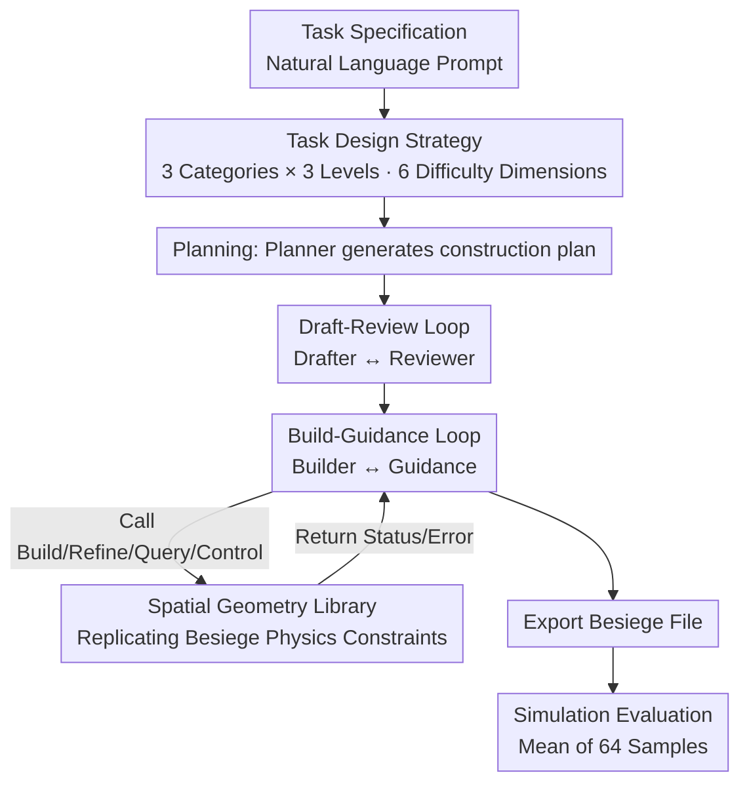

# BuildArena: A Physics-Aligned Interactive Benchmark of LLMs for Engineering Construction

**Conference**: ICML2026  
**arXiv**: [2510.16559](https://arxiv.org/abs/2510.16559)  
**Code**: https://github.com/AI4Science-WestlakeU/BuildArena  
**Area**: LLM Evaluation / Embodied AI / Engineering Construction  
**Keywords**: LLM Benchmark, Physics Simulation, 3D Construction, Agent Workflow, Besiege  

## TL;DR
BuildArena places LLMs into the physical sandbox game Besiege, requiring them to use natural language to build bridges, vehicles, and rockets brick by brick. By using a physics engine for simulation and scoring, it systematically evaluates for the first time the engineering construction capability of LLMs to "translate language into functional physical structures." Results indicate that only GPT-5 is marginally competent on hard tasks, while most other models almost entirely fail at the Hard level.

## Background & Motivation
**Background**: The ideal form of engineering construction automation is for a system to automatically design, manufacture, and assemble structures based on user prompts like "design a rocket for a Mars mission." LLMs, with their broad knowledge, strong reasoning, and planning capabilities, are natural candidates for this path.

**Limitations of Prior Work**: However, existing LLM benchmarks primarily focus on mathematics and programming in pure text or static environments, lacking interaction with the physical world. Existing physical reasoning datasets (e.g., PHYRE) only test "understanding physics" rather than "multi-step construction." While procedural 3D/CAD generation can produce models, it rarely verifies whether the designs can be assembled or function under real physical conditions.

**Key Challenge**: Engineering construction is inherently an **incremental, constraint-driven** process—structures are assembled step-by-step, where each new component must connect to existing structures while satisfying physical feasibility (e.g., avoiding collisions). This requires a combination of "breadth of knowledge × depth of analysis." Currently, no framework exists to evaluate whether LLMs can translate natural language specifications into **physically sound and functional** assemblies.

**Goal**: To address two sub-problems: (1) how to construct a task set that covers the spectrum of engineering difficulty and is scalable; (2) how to enable text-based LLMs to operate in a 3D construction space with physical constraints and automatically evaluate the results.

**Key Insight**: The authors leverage Besiege—a physics simulation sandbox game validated by a global community for its "conformity to human physical intuition." It provides a high-fidelity physical environment but lacks an interface for LLM natural language operation.

**Core Idea**: BuildArena establishes a three-stage customizable pipeline of "Task Definition → LLM Agent Construction → Physics Simulation Evaluation." It replicates an **open-source 3D spatial geometry calculation library** as a language interface for Besiege, allowing LLMs to build incrementally via natural language and receive objective scores through physics simulation.

## Method

### Overall Architecture
BuildArena is an evaluation **framework** rather than a single model. The input is a natural language task specification (goal + constraints + test procedure + metrics), and the output is an objective score from the Besiege simulation. The pipeline consists of three customizable components: **Task Definition**, **LLM Agent Construction**, and **Simulation Evaluation**. Task specifications are fed into an agent workflow composed of five LLM entities. This workflow builds the structure step-by-step by calling the spatial geometry library, exports it as a Besiege-compatible file, and finally runs a simulation script to record trajectories and metrics. To ensure reliability, each "task-model" pair is sampled 64 times to calculate the mean.

### Key Designs

**1. Scalable Task Design Strategy: Defining a Task Spectrum via 6 Engineering Difficulty Dimensions**

To measure "engineering capability," one must define what makes engineering difficult. The authors abstract 6 difficulty dimensions from engineering practice: **Quantization** (explicit numerical reasoning), **Robustness** (tolerance to single-point failure), **Scale** (span/load/module count), **Compositionality** (depth of hierarchical sub-structure integration), **Precision** (geometric strictness of placement/orientation), and **Ambiguity** (clarity of instructions). These dimensions are instantiated into three representative task categories: **Transport** (directional movement, measured by distance), **Support** (bridges spanning gaps, measured by max load), and **Lift** (rockets: Lv.1 measures thrust-to-weight ratio $\text{TWR}$, where $\text{TWR}\gg 1$ is feasible; Lv.2/3 measures max altitude). Each category has Easy/Medium/Hard levels. For instance, Transport Lv.1 removes explicit "build a four-wheeled vehicle" instructions and uses dimension-specific cargo to test instruction understanding and large-scale assembly. Hard tasks (Support Lv.2/3, Lift Lv.3) require hundreds of actions with iterative environment feedback.

**2. Five-Agent Collaborative Workflow: Decomposing "Construction" into Executable Dialogues**

LLMs cannot output a functional structure in one shot; they must iterate like humans. A **unified baseline workflow** is designed where all entities use the same LLM, distinguished only by prompts for fair comparison. It follows a coarse-to-fine structure with five entities: Planner, Drafter, Reviewer, Builder, and Guidance (plus a Controller for Transport). The process involves: a **Planning Phase** where the Planner converts descriptions into a structured plan; a **Draft-Review Loop** where the Drafter provides designs and the Reviewer critiques them; and a **Build-Guidance Loop** where Guidance provides high-level suggestions and the Builder translates them into geometric library commands. The library updates the state and returns descriptive feedback or error messages until completion.

**3. 3D Spatial Geometry Library: An Open-Source Language Interface for Besiege**

Since Besiege only offers a GUI for humans and lacks a symbolic/programming API for LLMs, the authors **replicated** an open-source spatial geometry library that mirrors Besiege's construction logic and physical constraints. The library receives LLM actions and parameters, calculates state updates, and performs physical constraint checks (e.g., collisions). It either returns a human-readable state description or explains the failure for illegal moves. Actions are categorized into **Build, Refine, Query, and Control**. Validation on a 49-module machine showed negligible differences compared to Besiege: position error $<1.5\times10^{-6}$ and orientation error $<2.5\times10^{-5}$ degrees. This library exposes "incremental, constraint-driven physical assembly" to text-based LLMs.

### Loss & Training
BuildArena is an evaluation framework and does not train models. Evaluation involves 64 samples per "task-LLM" pair. Performance metrics include: module count (complexity), success rate (proportion of trials meeting criteria), and task-specific performance (distance / load / TWR / altitude). Cost metrics include cumulative input/output tokens and total requests. Model ranking is determined by the rank aggregation of success rates and performance across tasks.

## Key Experimental Results

### Main Results
Evaluation of 9 frontier models (GPT-5, GPT-4o, Claude-4, Grok-4, Gemini-2.0, DeepSeek-3.1, Qwen-3, Kimi-K2, Seed-1.6) and 3 open-weight models. The table below excerpts the **Success Rate (%)** across three levels:

| Task | Model | Lv.1 Success Rate | Lv.2 Success Rate | Lv.3 Success Rate |
|------|------|------|------|------|
| Transport | GPT-5 | 78.1 | 23.4 | 26.6 |
| Transport | Claude-4 | 17.2 | 4.7 | 15.6 |
| Transport | Gemini-2.0 | 1.6 | 1.6 | 1.6 |
| Support | GPT-5 | 85.9 | 59.4 | 10.9 |
| Support | Seed-1.6 | 45.3 | 9.4 | 3.1 |
| Support | GPT-4o | 40.6 | 0.0 | 0.0 |
| Lift | GPT-5 | 95.3 | 10.9 | 17.2 |
| Lift | Grok-4 | 31.2 | 31.2 | 3.1 |
| Lift | Seed-1.6 | 6.2 | 0.0 | 0.0 |

GPT-5 maintains a 10.9% success rate on Support Hard, whereas most other frontier models drop to zero at the Hard level. Lift is the most challenging category due to precise module alignment and strict assembly requirements.

### Key Findings
- **Discriminative Difficulty Configuration**: Performance decreases as difficulty increases across all tasks. The Hard level distinguishes elite models while most models fail, proving the benchmark's discriminative power.
- **Workflow Effectiveness**: Successful constructions validate that multi-agent collaboration (e.g., iterative reflection) is necessary for long-sequence planning.
- **Geometric Library Utility**: The library covers diverse actions (attach, remove, rotate, translate), successfully bridging the gap between LLMs and the physical world.
- **Performance Gap**: GPT-5 is the only model consistently producing feasible structures for most Hard tasks, highlighting that LLM physical construction capability remains rudimentary.

## Highlights & Insights
- **Geometric Replication of a Closed-Source Engine**: Replicating Besiege's logic as an open-source library is a significant engineering contribution. With position errors $<1.5\times10^{-6}$, it provides LLMs with feedback identical to human GUI operations without needing the original game's source code.
- **Task Generator Approach**: Using 6 engineering dimensions to instantiate tasks, rather than hard-coding them, makes the benchmark inherently scalable. This methodology can transition to any embodied task.
- **Pluggable Framework**: Since tasks, workflows, and simulators are all customizable, BuildArena serves as both a leaderboard and a research platform for testing "smarter agent orchestration."

## Limitations & Future Work
- **Dependency on Besiege**: Module spaces and physical rules are defined by Besiege; generalizability to real-world CAD or robotic assembly remains an open question.
- **High Computational Cost**: 64 samples per task require significant token and request overhead, limiting the number of models and tasks that can be evaluated at scale.
- **Baseline Constraints**: The requirement that all agents share the same LLM version for fairness may underestimate the potential ceiling of more sophisticated heterogeneous agent architectures.
- **Metric Inconsistency**: Metrics for Lift Lv.1 (TWR) and Lv.2/3 (altitude) are different and cannot be compared directly across levels.

## Related Work & Insights
- **vs. PHYRE / Physics Reasoning**: While prior datasets test "understanding physics" (predicting outcomes), BuildArena tests "multi-step incremental construction," representing a leap from passive understanding to active creation.
- **vs. Procedural 3D / CAD Generation**: Previous works focus on generation quality but rarely verify if designs work under physical constraints. BuildArena closes the loop by forcing results through a simulator.
- **vs. BesiegeField**: Along with concurrent work, this is the first benchmark to enable LLMs to perform 3D structure construction via natural language in a physics-constrained environment.

## Rating
- **Novelty**: ⭐⭐⭐⭐⭐ First physics-aligned interactive benchmark for language-driven 3D engineering construction.
- **Experimental Thoroughness**: ⭐⭐⭐⭐ Extensive coverage of frontier and open models, though limited to the Besiege environment.
- **Writing Quality**: ⭐⭐⭐⭐ Clear explanation of the framework, geometry library validation, and difficulty dimensions.
- **Value**: ⭐⭐⭐⭐⭐ Serves as both an evaluation tool and a research platform for AI for Engineering.

<!-- RELATED:START -->

## Related Papers

- [\[NeurIPS 2025\] Toward Engineering AGI: Benchmarking the Engineering Design Capabilities of LLMs](../../NeurIPS2025/llm_evaluation/toward_engineering_agi_benchmarking_the_engineering_design_capabilities_of_llms.md)
- [\[ACL 2026\] Beyond Marginal Distributions: A Framework to Evaluate the Representativeness of Demographic-Aligned LLMs](../../ACL2026/llm_evaluation/beyond_marginal_distributions_a_framework_to_evaluate_the_representativeness_of_.md)
- [\[ICLR 2026\] PRISM-Physics: Causal DAG-Based Process Evaluation for Physics Reasoning](../../ICLR2026/llm_evaluation/prism-physics_causal_dag-based_process_evaluation_for_physics_reasoning.md)
- [\[ACL 2025\] PhysReason: A Comprehensive Benchmark towards Physics-Based Reasoning](../../ACL2025/llm_evaluation/physreason_a_comprehensive_benchmark_towards_physics-based_reasoning.md)
- [\[ACL 2026\] EngiBench: A Benchmark for Evaluating Large Language Models on Engineering Problem Solving](../../ACL2026/llm_evaluation/engibench_a_benchmark_for_evaluating_large_language_models_on_engineering_proble.md)

<!-- RELATED:END -->
