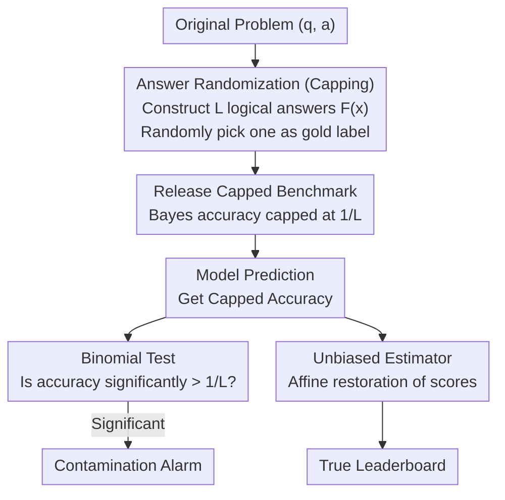

# CapBencher: Give Your LLM Benchmark a Built-in Alarm for Test-Set Overfitting

**Conference**: ICML 2026  
**arXiv**: [2505.18102](https://arxiv.org/abs/2505.18102)  
**Code**: https://github.com/TakashiIshida/capbencher  
**Area**: LLM Evaluation  
**Keywords**: LLM Benchmarking, Data Contamination Detection, Bayes Accuracy, Test-set Overfitting, Leaderboard Defense  

## TL;DR
CapBencher injects randomness into each problem (generating multiple logically correct answers and randomly selecting one as the gold label) to cap the Bayes accuracy of a benchmark at a controllable level (e.g., 50%). This enables black-box statistical detection of data contamination in publicly released benchmarks—any model with an accuracy significantly exceeding the Bayes upper bound is flagged as contaminated.

## Background & Motivation

**Background**: Building modern LLM benchmarks is increasingly expensive—FrontierMath required 60+ professional mathematicians (including IMO gold medalists and Fields Medalists), and Humanity's Last Exam aggregated contributions from 1,000+ experts across 50 countries. Once these high-investment benchmarks release answers on the internet, they risk being intentionally or unintentionally included in LLM training data.

**Limitations of Prior Work**: The mainstream strategy is "private evaluation": keeping the benchmark private and requiring participants to submit models or predictions to a server. However, this fails to defend against "leaderboard hacking" via repeated queries and lacks effective statistical detection. Existing contamination detection methods (e.g., Min-k%/Min-k%++) either require access to model logits (unavailable for closed-source models) or use canary strings (which can be maliciously removed) and do not support rigorous statistical testing.

**Key Challenge**: Publicly releasing benchmarks facilitates open evaluation in the community, but public answers lead to data contamination and test-set overfitting—there is a fundamental conflict between "openness" and "evaluation security."

**Goal**: Design a benchmark release protocol that allows open evaluation without fully exposing the true answers, while providing a built-in contamination detection mechanism.

**Key Insight**: The authors observe that if the Bayes accuracy upper bound of a benchmark can be controlled, any model performance exceeding this bound constitutes statistical evidence of contamination. The key insight is that benchmark designers can proactively lower the Bayes accuracy.

**Core Idea**: Prepare multiple logically correct answers for each question and randomly select one as the gold label. This "caps" the Bayes accuracy, allowing the benchmark to function for both evaluation and contamination alarming.

## Method

### Overall Architecture
The core idea of CapBencher is that instead of passively detecting contamination after the fact, designers should proactively make the "gold label" random during release, so that models memorizing the answers expose their own flaws. It operates in two phases: the **Release Phase** injects randomness into each original benchmark pair $(q,a)$ to produce a capped version $(q',a')$ with obfuscated answers; the **Detection Phase** uses a one-sided binomial test to judge if a model's accuracy significantly exceeds a pre-defined Bayes upper bound. Three key designs address how to construct random answers, how to classify exceeding the bound as contamination, and how to maintain ranking capability despite obfuscated answers.

### Key Designs

**1. Answer Randomization (Capping): Proactively Capping Bayes Accuracy**

Public answers are absorbed by training data because each question has a single, deterministic gold label—once a model memorizes it, it can achieve a perfect score. CapBencher constructs a set $F(x)$ of $L$ **logically correct** answers for each question $x$, then uniformly and randomly selects one as the official gold label $Y'$. For example, "3×6=?" could be rewritten as "Select a random number from $[1,5]$ and add it to the answer," making the correct answer 17 or 19 instead of a fixed 18. Even if a model understands the underlying logic, it cannot know which label was selected for this instance, capping its expected hit rate at $1/L$. $L$ acts as a "knob": increasing it makes detection more sensitive (placing reasonable performance further from the bound) but increases the variance of capped scores. Implementation strategies include **Obfuscation** (true labels hidden, for direct-answer/MCQ) and **Disclosure allowed** (primary labels visible, random tags added).

**2. Binomial Test: Translating "Exceeding the Bound" into Statistical Evidence**

With $1/L$ as the bound, contamination detection becomes a clean hypothesis testing problem. The null hypothesis $H_0$ is: "The true performance of the model does not exceed Bayes accuracy $\alpha$." Under this hypothesis, the number of correct answers in $n$ problems follows a binomial distribution $\text{Binom}(n,\alpha)$. The one-sided p-value for observing $k$ correct answers is:

$$p = \sum_{i=k}^{n}\binom{n}{i}\alpha^{i}(1-\alpha)^{n-i}.$$

If the p-value is sufficiently small, the null hypothesis is rejected, and contamination is flagged. By the Karlin-Rubin theorem, this is a Uniformly Most Powerful (UMP) test. When the exact Bayes accuracy is unknown, the upper bound $1/L$ (from Corollary 1) is substituted for $\alpha$. Unlike Min-k%, which requires tuning AUC thresholds on a validation set, the binomial test provides an exact p-value even for small samples and requires only the model's binary outputs.

**3. Unbiased Estimator: Restoring Rankings with Obfuscated Answers**

Randomized answers introduce a side effect: capped scores no longer reflect the true performance on the original benchmark. The authors prove a clean affine relationship between the two:

$$s_{\text{capped}}(X) = \Big(\frac{1}{L} - \frac{L-1}{L(K-1)}\Big)\,s_{\text{orig}}(X) + \frac{L-1}{L(K-1)},$$

where $K$ is the number of options and $L$ is the number of random answers. Since this is a linear transformation, an unbiased estimator $\hat{A}$ for the original score can be derived. The cost is a modest increase in variance (e.g., standard deviation on MMLU increases from 0.003 to 0.012). Empirical results show a Kendall's $\tau = 0.92$, meaning ranking information is largely preserved.

## Key Experimental Results

### Main Results: Contamination Detection

Experiments using continued pre-training for contamination were conducted across 12 benchmarks and multiple model families (Llama, Qwen, DeepSeek):

| Model | Benchmark | Uncontaminated Acc | Contaminated Acc | Bayes Upper Bound | Result |
|------|-----------|------------|------------|-----------|---------|
| Qwen 2.5-14B | GSM8K | ~40% | >50% | 50% | ✅ Detected (fewer epochs) |
| Qwen 2.5-3B | GSM8K | ~35% | >50% | 50% | ✅ Detected (more epochs) |
| Llama 3.2-3B-Iter | GSM8K (α=50%) | — | >50% | 50% | ✅ Detected at epoch 6 |
| Llama 3.2-3B-Iter | GSM8K (α=25%) | — | >25% | 25% | ✅ Detected at epoch 5 |
| Llama 3.2-3B-Iter | GSM8K (α=10%) | — | >10% | 10% | ✅ Detected at epoch 4 |

### Comparison with Baselines

| Detection Method | Internal Access | Evolvable/Bypass | Statistical Test | Success on All Benchmarks |
|---------|------------|---------|------------|-------------------|
| CapBencher | ❌ | Partial (RE) | ✅ Exact p-value | ✅ All datasets |
| Canary String | ✅ (log prob) | ✅ (Delete canary) | ❌ Approximate | ✅ Unstable |
| Min-k% | ✅ (logits) | — | ❌ No theoretical threshold | ❌ (Failed on GPQA) |
| Min-k%++ | ✅ (logits) | — | ❌ No theoretical threshold | ❌ (Failed on GPQA) |

### Leaderboard Hacking Detection (Model Merging)

| Model | Accuracy (%) | Detected? |
|------|-----------|-----------|
| Qwen 2.5-7B-Instruct | 39.87 ± 2.32 | — |
| DeepSeek-R1-Distill-Qwen-7B | 40.02 ± 2.01 | — |
| Qwen 2.5-Math-7B-Instruct | 41.02 ± 2.12 | — |
| Merged Model (1+2+3) | 56.52 ± 2.04 | ✅ Sig. > 50% |

### Key Findings
- Larger models are detected as contaminated in fewer epochs (consistent with Carlini et al. 2023), indicating CapBencher is more sensitive for larger models.
- Lowering the Bayes accuracy (e.g., from 50% → 10%) allows earlier detection but increases score variance—there is a trade-off between sensitivity and precision.
- Cross-lingual experiments show that contamination on MMLU-ProX is detectable across all languages, while GSM8K (without chain-of-thought) is primarily detectable in European languages, suggesting CoT reduces cross-lingual detectability.
- Reverse Engineering (RE) experiments show that even when provided with obfuscated answers and randomization rules, current frontier models cannot reliably recover the true label (RE accuracy on HLE-MC remains far below 50%).

## Highlights & Insights
- **Proactive Benchmark Defense**: Unlike passive detection, CapBencher allows designers to embed detection mechanisms at release—effectively "installing an alarm" in the benchmark. This mindset can be applied to other data leakage scenarios.
- **Leveraging Classical Statistics**: The work flips the classical concept of "estimating Bayes error" into "controlling Bayes accuracy," turning a passive theoretical tool into an active design parameter.
- **Rank Preservation through Affine Transformation**: The affine relationship between capped and original scores ensures monotonicity, guaranteeing that model rankings remain reliable.

## Limitations & Future Work
- Randomized labels may still leak weak signals (e.g., answer 19 implies the ground truth might be 18 or 20), which future models might exploit for reverse engineering.
- For open-ended generation tasks, constructing a set of "logically correct labels" $F(x)$ is difficult, limiting applicability.
- The variance of capped scores increases with $L$, which significantly reduces ranking correlation on small-scale benchmarks (e.g., $\tau$ drops to 0.67 on GPQA-diamond).
- Future directions include stronger obfuscation strategies, cryptographic extensions like Zero-Knowledge Proofs, and robustness assessments against stronger RE attackers.

## Related Work & Insights
- **Contamination Detection**: Min-k% (requires logits) and canary strings (vulnerable to removal). CapBencher unifies "defense" and "detection."
- **Dynamic Benchmarking**: LiveBench and DynaBench use continuous generation but are limited to domains with automatic solvers. CapBencher applies to expert-level problems without efficient algorithms.
- **Bayes Error Estimation**: Classic statistical work (Fukunaga & Hostetler 1975) provides a theoretical foundation, though CapBencher is unique in "designing" rather than just "estimating" accuracy.

<!-- RELATED:START -->

## Related Papers

- [\[AAAI 2026\] LLM-as-a-Judge for Scalable Test Coverage Evaluation](../../AAAI2026/llm_evaluation/llm-as-a-judge_for_scalable_test_coverage_evaluation_accuracy_operational_reliab.md)
- [\[ACL 2026\] MultiFileTest: A Multi-File-Level LLM Unit Test Generation Benchmark and Impact of Error Fixing Mechanisms](../../ACL2026/llm_evaluation/multifiletest_a_multi-file-level_llm_unit_test_generation_benchmark_and_impact_o.md)
- [\[NeurIPS 2025\] Your Pre-trained LLM is Secretly an Unsupervised Confidence Calibrator](../../NeurIPS2025/llm_evaluation/your_pre-trained_llm_is_secretly_an_unsupervised_confidence_calibrator.md)
- [\[ACL 2026\] How Hypocritical Is Your LLM Judge? Listener–Speaker Asymmetries in the Pragmatic Competence of Large Language Models](../../ACL2026/llm_evaluation/how_hypocritical_is_your_llm_judge_listener-speaker_asymmetries_in_the_pragmatic.md)
- [\[ICML 2026\] REAL：把回归感知奖励塞进 RL，让 LLM-as-a-Judge 学会"差一分也是差"](real_regression-aware_reinforcement_learning_for_llm-as-a-judge.md)

<!-- RELATED:END -->
