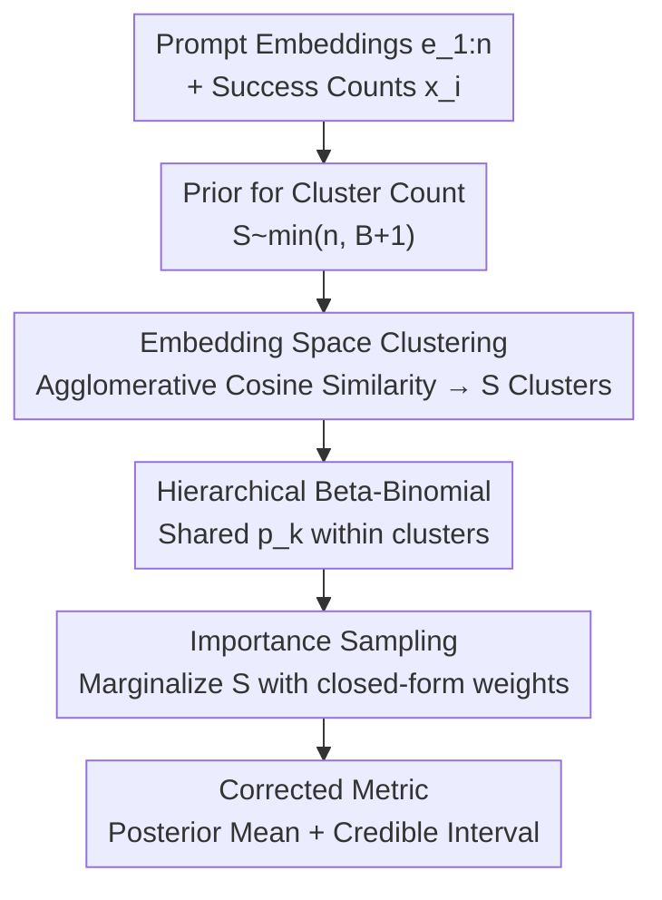

# Correcting Prompt Dependence in LLM Benchmarks: A Bayesian Hierarchical Model with Embedding-Space Clustering

**Conference**: ICML2026  
**arXiv**: [2510.05709](https://arxiv.org/abs/2510.05709)  
**Code**: TBD  
**Area**: LLM Evaluation / Bayesian Statistics  
**Keywords**: LLM Benchmarks, Prompt Dependence, Bayesian Hierarchical Model, Embedding Clustering, Effective Sample Size  

## TL;DR
The authors argue that mainstream LLM benchmark metrics rely on two frequently violated assumptions: a sufficient number of evaluations (permitting the Central Limit Theorem) and independence between prompts. They propose BHM-ESC, a Bayesian Hierarchical Model with "Embedding-Space Clustering": it groups semantically similar prompts into clusters sharing a success probability, and infers the number of clusters as an unknown variable. This provides more reliable performance estimates that correct for prompt dependence under small sample sizes, reducing Mean Absolute Error (MAE) by 4–73% and increasing Expected Log Posterior Density (ELPD) by 40–450 on adversarial robustness benchmarks.

## Background & Motivation
**Background**: Benchmarking is the primary means of evaluating LLMs. To quantify sampling fluctuations, recent work suggests repeating the same benchmark multiple times and using sample means, confidence intervals, and p-values for model comparison.

**Limitations of Prior Work**: Two implicit assumptions often fail in practice. First, due to compute constraints, the number of repetitions is often too low to satisfy the sample size requirements of the Central Limit Theorem (CLT), making sample means and p-values unreliable. Second, standard metrics assume prompts are independent and identically distributed (i.i.d.) with equal weights, but prompts in many benchmarks are highly correlated—especially in adversarial datasets where prompts are iteratively constructed around known vulnerabilities, naturally forming clusters.

**Key Challenge**: Treating $n$ correlated prompts as $n$ independent samples overestimates the "effective sample size," leading to inflated confidence in statistical conclusions. Near-duplicate prompts within a cluster contribute little new information beyond the first instance. Consequently, means are biased, uncertainty is underestimated, and downstream model comparisons may be misleading.

**Goal**: (1) Provide empirical evidence that benchmark prompts form semantic clusters and that the number of effective independent samples is significantly lower than the nominal prompt count; (2) Propose a metric that is both robust under small samples and corrected for prompt dependence.

**Key Insight**: By embedding prompts into a sentence vector space and measuring clustering tendency with the Hopkins statistic, the authors find that all tested benchmarks (or their sub-categories) score >0.6 (where 0.5 is the null hypothesis for random distribution), proving that cluster structures are prevalent. Since these structures arise from semantic similarity, clustering in the embedding space allows for information pooling within clusters.

**Core Idea**: Use a Bayesian Hierarchical Model to explicitly model prompt dependence. Semantically similar prompts are grouped into a cluster sharing a single task success probability. By treating the "number of clusters" as an unknown random variable inferred from the data, the model remains generalizable to any benchmark without requiring pre-existing task labels.

## Method

### Overall Architecture
For a dataset with $n$ prompts, the input to BHM-ESC consists of the success counts $x_i$ from $m$ repetitions per prompt and the sentence embeddings $e_{1:n}$. The output is a corrected performance estimate (posterior mean and credible interval). The pipeline is as follows: assign a prior to the "number of clusters $S$" as an unknown random variable → for each sampled $S$, use agglomerative cosine similarity clustering to partition prompts into $S$ clusters → use a Beta-Binomial hierarchical model within clusters to share a success probability $p_k$ → use importance sampling to marginalize out $S$ and obtain the target posterior $\pi(\bar p\mid x_{1:n})$ → aggregate into the corrected metric. The key innovation is learning the cluster count from data, making it "plug-and-play" for any benchmark.

### Key Designs

**1. Embedding-Space Clustering with Unknown $S$: Letting the model decide "how many independent topics" exist**

This addresses the overestimation of effective sample size and the need for manual labels. The authors treat the cluster count $S$ as a random variable with a diffuse prior:

$$B\sim\text{Binomial}(50n,0.01),\qquad S=\min(n,B+1),$$

with an expectation of approximately $0.5n+1$. This covers a reasonable range of cluster counts while bounding $S$ by $n$. Given $S$, agglomerative cosine similarity clustering (using all-MiniLM-L6-v2 embeddings) partitions the prompts into $S$ disjoint clusters $\mathcal{C}_1,\dots,\mathcal{C}_S$. By conditioning on a deterministic partition for a given $S$ (rather than treating cluster assignments as random variables), the model avoids the over-parameterization and overfitting typical of fully Bayesian clustering on small samples. This makes the approach "benchmark-agnostic" and robust.

**2. Hierarchical Beta-Binomial Pooling: Sharing success probabilities to shift uncertainty to the topic level**

This addresses the issue where near-duplicate prompts are treated as independent samples. For prompt $i$ in cluster $k$, the number of successes in $m$ trials is modeled via a Binomial distribution sharing a success probability $p_k$:

$$x_i\mid p_k\sim\text{Binomial}(m,p_k),\ i\in\mathcal{C}_k,\qquad p_k\sim\text{Beta}(1,1).$$

The $\text{Beta}(1,1)$ prior is uniform on $[0,1]$. Sharing $p_k$ within a cluster acknowledges that semantically similar prompts should have similar success probabilities, correctly pooling redundant information rather than double-counting it. The overall success probability $\bar p$ is an equally weighted mixture of cluster-level distributions. This pools fluctuations across independent clusters and quantifies uncertainty at the topic level—the core mechanism for restoring the true effective sample size.

**3. Importance Sampling with Closed-Form Weights: Bypassing non-analytical posteriors in small samples**

This addresses the lack of a closed-form solution for the target posterior $\pi(\bar p\mid x_{1:n})$ and the failure of CLT. Since $\bar p$ is a deterministic function of $p_{1:S}$ and $S$, the joint posterior decomposes as:

$$\pi(p_{1:S},S\mid x_{1:n})\propto\pi(S)\,\pi(p_{1:S}\mid x_{1:n},S)\,\pi(x_{1:n}\mid S).$$

This enables importance sampling: sample $S$ from the prior $\pi(S)$, determine the clusters, and sample $p_{1:S}$ from the analytical conditional posterior. The importance weights are proportional to the marginal likelihood $\pi(x_{1:n}\mid S)$. After integrating out $p_{1:S}$, each cluster corresponds to the normalization constant of a Beta distribution, yielding a closed-form marginal likelihood:

$$\pi(x_{1:n}\mid S)=\prod_{k=1}^{S}\frac{1}{\beta(1,1)}\Big(\prod_{i\in\mathcal{C}_k}\binom{m}{x_i}\Big)\beta\Big(1+\textstyle\sum_{i\in\mathcal{C}_k}x_i,\ 1+\sum_{i\in\mathcal{C}_k}(m-x_i)\Big).$$

Normalized weights yield weighted samples approximating the joint posterior. Calculating the average of $p_{1:S}$ for each sample produces the unbiased corrected metric (weighted mean and credible interval). The closed-form weights make inference efficient and unbiased for small samples.

## Key Experimental Results

### Empirical Evidence: Benchmark prompts are indeed clustered
Using all-MiniLM-L6-v2 embeddings and the Hopkins statistic (>0.5 indicates non-random clustering) with 1000 resamples: all benchmarks/sub-categories scored >0.6, with particularly high values for adversarial Garak subsets.

| Benchmark (Subset) | Hopkins Mean | Std. Error |
|--------------------|--------------|------------|
| MMLU·World History | 0.896        | 0.0007     |
| Garak·Latent Injection | 0.880    | 0.0017     |
| Garak·Repeat       | 0.814        | 0.0005     |
| HellaSwag          | 0.723        | 0.0000     |
| GSM8K              | 0.707        | 0.0000     |
| HarmBench·Copyright| 0.609        | 0.0003     |

### Main Results
Evaluated on 4 Garak adversarial benchmarks across two architectures (Pythia-2.8B / Mamba-2.8B), with 25 evaluation samples per prompt and 10,000 posterior samples. Reporting ELPD (higher is better) and MAE (lower is better). Results for Mamba-2.8B on the AnsiRaw benchmark:

| Method | ELPD ↑ | MAE ↓ | Description |
|--------|--------|-------|-------------|
| BAYES (S=1) | -566.3 | 45.5 | No clustering; all prompts in one cluster |
| FREQ (naive) | -565.6 | 45.5 | Frequentist sample mean + Wald interval |
| BHM-ESC-Mini | -132.8 | 12.2 | Ours (MiniLM embeddings) |
| BHM-ESC-TF   | -97.2  | 10.7 | Ours (TF-IDF embeddings) |
| ORACLE       | -115.2 | 12.9 | Upper bound using manual independent labels |

Overall, BHM-ESC reduces MAE by 4–73% and improves ELPD by 20–450 log-probability units. Performance across different embedding spaces is similar, suggesting gains come from structural recovery rather than specific embedding artifacts.

### Key Findings
- Current practices systematically overestimate the effective independent sample size by 1.3–5.6×. Treating $n$ correlated prompts as independent leads to inflated statistical confidence. The inferred cluster count $S$ in BHM-ESC reveals the true effective sample size.
- Corrections can substantially alter conclusions. On certain benchmarks, BHM-ESC provides model comparisons (means and uncertainties) that differ significantly from baselines; for example, it may determine that model robustness is more homogeneous than frequency-based metrics suggest.
- Internal validity is supported by three factors: BHM-ESC scores closely follow the oracle, posterior similarity matrices align with manual semantic judgments, and the model is robust to the choice of the diffuse prior for $S$.
- BHM-ESC provides the greatest value when prompts have strong mutual dependencies and cluster sizes are imbalanced.

## Highlights & Insights
- Shifting the focus of "LLM evaluation reliability" from "running more trials" to "correctly modeling correlations" identifies the root cause of the problem: overestimation of the effective sample size.
- The tradeoff of "unknown $S$ + deterministic intra-cluster clustering" is clever: it avoids over-parameterization of fully Bayesian clustering in small samples while removing the need for manual task labels.
- The use of closed-form marginal likelihoods for importance sampling allows for unbiased and fast inference without MCMC, providing a reusable statistical engineering pattern.
- The methodology extends beyond LLMs to any evaluation scenario where samples are naturally clustered but treated as independent, correcting for overconfident uncertainty.

## Limitations & Future Work
- The assumption of a shared success probability $p_k$ within a cluster is a simplification; future work could allow for intra-cluster heterogeneity via hyper-priors.
- Cluster assignment uses deterministic agglomerative clustering and does not model assignment uncertainty. Alternatives like Bayesian latent space clustering or DBSCAN/k-means could be explored, though they involve tradeoffs in complexity and hyperparameter sensitivity.
- When prompt boundaries are not clearly defined, rigid partitioning may be sub-optimal, as evidenced by the oracle occasionally performing slightly worse than the model.
- Currently designed for single-turn benchmarks. Multi-turn benchmarks would require concatenating embeddings across turns for clustering, which remains to be validated.

## Related Work & Insights
- **vs. Bayesian Uncertainty Estimation (Longjohn et al. / Ross et al.)**: Prior work used Bayesian methods to improve LLM evaluation uncertainty but did not explicitly model prompt dependence. This paper merges Bayesian small-sample robustness with dependence correction.
- **vs. Task-Label Dependent Modeling (Bowyer et al. / Luettgau et al.)**: Previous approaches required predefined task labels as an oracle. This paper infers the structure directly from the embedding space, removing the dependency on labels.
- **vs. Frequentist Methods (Sample Mean + Wald Interval)**: CLT fails under small samples, making frequentist intervals unreliable. BHM-ESC provides calibrated posterior uncertainty and superior ELPD/MAE.

## Rating
- Novelty: ⭐⭐⭐⭐⭐ Integrating unknown cluster count inference into a hierarchical model to correct prompt dependence is highly original.
- Experimental Thoroughness: ⭐⭐⭐⭐ Covers multiple benchmarks, architectures, and embeddings, including oracle comparisons and sensitivity analyses, though focused heavily on adversarial benchmarks.
- Writing Quality: ⭐⭐⭐⭐⭐ Rigorous logic flowing from hypothesis violation to empirical evidence, model formulation, and inference.
- Value: ⭐⭐⭐⭐⭐ Addresses a fundamental methodological pain point in LLM evaluation with a generalizable approach.

<!-- RELATED:START -->

## Related Papers

- [\[ICML 2025\] Hyperband-based Bayesian Optimization for Black-box Prompt Selection](../../ICML2025/llm_evaluation/hyperband-based_bayesian_optimization_for_black-box_prompt_selection.md)
- [\[ICML 2026\] HiPER: Hierarchical Reinforcement Learning with Explicit Credit Assignment for Large Language Model Agents](hiper_hierarchical_reinforcement_learning_with_explicit_credit_assignment_for_la.md)
- [\[NeurIPS 2025\] Bayesian Evaluation of Large Language Model Behavior](../../NeurIPS2025/llm_evaluation/bayesian_evaluation_of_large_language_model_behavior.md)
- [\[ICML 2026\] Multi$^2$: Hierarchical Multi-Agent Decision-Making with LLM-Based Agents in Interactive Environments](multi2_hierarchical_multi-agent_decision-making_with_llm-based_agents_in_interac.md)
- [\[AAAI 2026\] Lost in Benchmarks? Rethinking Large Language Model Benchmarking with Item Response Theory](../../AAAI2026/llm_evaluation/lost_in_benchmarks_rethinking_large_language_model_benchmarking_with_item_respon.md)

<!-- RELATED:END -->
