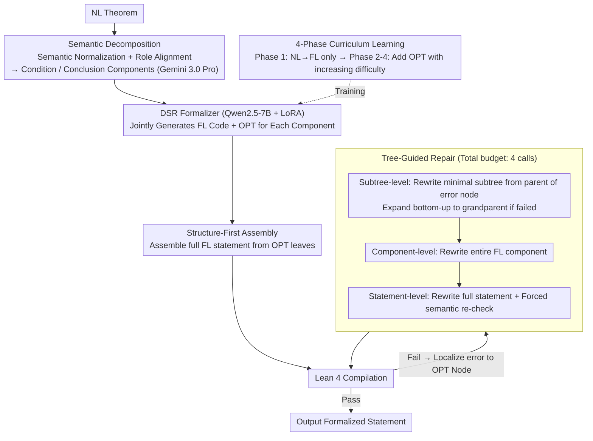

# Decompose, Structure, and Repair: A Neuro-Symbolic Framework for Autoformalization via Operator Trees

**Conference**: ICML 2026  
**arXiv**: [2604.19000](https://arxiv.org/abs/2604.19000)  
**Code**: https://github.com/XiaoyangLiu-sjtu/DSR  
**Area**: LLM Reasoning / Formal Mathematics / Neuro-Symbolic  
**Keywords**: Autoformalization, Lean 4, Operator Tree, Curriculum Learning, Tree-Guided Repair  

## TL;DR
This paper proposes the DSR (Decompose-Structure-Repair) neuro-symbolic framework, which decomposes the formalization of natural language theorems into three stages: "decomposing NL components → joint generation of FL components and Operator Trees (OPT) → hierarchical repair based on subtree localization." Using a 7B model, it sets new SOTAs on ProverBench / ProofNet / PRIME and releases PRIME, a graduate-level Lean 4 benchmark consisting of 156 problems.

## Background & Motivation

**Background**: Statement autoformalization aims to automatically translate natural language (NL) mathematical statements into formal languages (FL) verifiable by Interactive Theorem Provers (ITP) such as Isabelle, Coq, or Lean. Recent mainstream approaches have evolved from neural machine translation to LLM-driven paradigms, including few-shot prompting, SFT on formal corpora, and systems augmented with RL, RAG, or tool feedback. Recent iterative architectures like ARIA (graph-of-thought) and SITA (structure-to-instance) have also emerged.

**Limitations of Prior Work**: Despite evolving strategies, almost all methods treat autoformalization as a one-time, end-to-end "flat string" generation task, predicting Lean code as a linear sequence of tokens. This leads to two consequences:
1. Models fail to explicitly capture the inherent nested structure of mathematical statements (quantifiers, operator precedence, condition-conclusion splits), often generating code that is locally erroneous but globally plausible.
2. If compilation fails, the predominant repair strategy is to regenerate the entire statement (statement-level repair), which is computationally wasteful and risks breaking correct parts of the code—leading to "syntax passing but semantic drift."

**Key Challenge**: The correctness of formalized code is **structural** (a single error in an OPT node invalidates the entire tree), yet both generation and repair are **linear**. The lack of an addressable intermediate representation for local intervention makes it difficult to achieve both correct modification and global logical consistency.

**Goal**: To introduce an explicit **hierarchical intermediate representation** for autoformalization, ensuring that (a) during training, the model learns the topological skeleton of mathematical statements; and (b) during repair, "surgical" precision can be achieved by localizing errors to specific subtrees and rewriting only the minimal substructures.

**Key Insight**: The authors noted that the Lean Language Server can parse FL code into an Operator Tree (OPT, where operators are internal nodes and arguments are ordered child nodes). By requiring the model to **jointly generate the corresponding OPT** alongside the linear Lean code, the OPT serves as both a "structural prior" (regularization during training) and a "repair blueprint" (addressable during inference).

**Core Idea**: Reconstruct autoformalization into a modular *Decompose → Structure → Repair* pipeline. First, decompose the NL statement into condition/conclusion components; second, jointly predict the FL code and OPT for each component; finally, use the OPT to localize compilation errors to subtrees and perform bottom-up hierarchical repair.

## Method

### Overall Architecture
DSR aims to translate natural language theorems into formal statements that pass Lean 4 compilation while preserving the original meaning. It divides the process into a three-stage pipeline: First, Semantic Decomposition (using Gemini 3.0 Pro) normalizes the text into NL components labeled as *Condition* or *Conclusion*. Second, the DSR Formalizer (Qwen2.5-7B-Instruct fine-tuned via LoRA) performs Structured Translation, jointly outputting FL code and an OPT for each component. Finally, Structure-First Assembly builds the statement from OPT leaf nodes for Lean compilation. If compilation fails, Tree-Guided Repair localizes errors to OPT nodes for hierarchical repair across subtree, component, and statement levels. The core throughout is the OPT, which is developed via a four-phase curriculum learning strategy (indicated by dashed lines in the diagram as it occurs during training).

### Key Designs

**1. OPT as a Joint Generation Target: Providing an Addressable Structural Map for Linear Code**
Purely linear generation of Lean code often fails due to mismatched parentheses or unclosed scopes. More subtly, it can lead to "local errors in globally plausible code" where logical errors cannot be localized within a token sequence. DSR requires the model to output the operator tree alongside the FL code, representing the recursive topology $T=(V,E,\ell)$ with operators as parents and arguments as children. It adapts the OPT representation from ASSESS with two modifications: first, the granularity is shifted from statement to component; second, **parentheses nodes are explicitly preserved** to maintain token-level alignment between linear code and the tree. This enables a fail-safe fallback to the FL component if OPT parsing fails. This approach provides a dual benefit: joint OPT output acts as structural regularization during training, while the OPT's addressable sub-structures enable precise repair during inference.

**2. Four-Phase Curriculum Learning Based on OPT Complexity: Decoupling Logic and Topology Learning**
Training a 7B model to simultaneously learn complex mathematical logic and hierarchical topology can lead to optimization failures. In ablations, adding OPT without curriculum learning caused Pass@1 SC on PRIME to drop from 22.44% to 19.87%. To address this, training is divided into difficulty gradients. Using 283,958 triplets of ⟨NL component, FL component, FL OPT⟩, samples are categorized as simple, moderate, or complex based on *tree depth, width, and node count*. Phase 1 focuses solely on NL→FL components ($\text{lr}=2\times10^{-4}$). Phases 2-4 introduce joint OPT prediction with increasing complexity and step-wise learning rate decay to $1\times10^{-5}$, using a replay mechanism (10-30% data from previous phases) to prevent forgetting. This curriculum stabilized convergence, raising Pass@1 SC on PRIME to 23.08%.

**3. Three-Level Tree-Guided Repair: Using LLM as a Subtree Replacer rather than a Full Rewriter**
Standard statement-level repair often rewrites the entire statement upon compilation failure, which is inefficient and risks introducing errors into previously correct parts. DSR leverages OPT addressability for surgical repair. When Lean reports an error at a coordinate (row, col), it is mapped to the smallest erroneous node $v$ in the OPT. Repair then proceeds bottom-up: at the Subtree-Level, the minimal subtree from the parent of $v$ is rewritten. If this fails, it expands to the grandparent, up to the component boundary. If still unresolved, it moves to Component-Level rewriting, and finally to Statement-Level rewriting as a fallback, which includes a forced semantic re-check. Each level is limited to one call (total budget of 4), ensuring fairness against baselines. Ablations show that while global rewriting might achieve higher Syntax Check (SC) rates, Tree-Guided Repair consistently yields higher Consistency Check (CC) scores (e.g., 84.00 vs 82.77 on ProverBench), proving that limiting randomness to suspicious subtrees is key to semantic fidelity.

### Loss & Training
The Qwen2.5-7B-Instruct model is fine-tuned via LoRA using standard next-token cross-entropy. The target sequence is the concatenation of `FL component <SEP> FL OPT`. The curriculum phases use a batch size of 128 (64 for the final phase), 1 epoch per phase, and a warmup ratio of 0.03–0.10. The inference budget is 4 LLM calls.

## Key Experimental Results

### Main Results

| Dataset | Metric | DSR (7B) | Best Baseline | Gain |
|---------|--------|----------|---------------|----------|
| ProverBench | CC | **84.00** | Goedel-V2-32B 83.38 | +0.62 |
| ProofNet | CC | **79.51** | Goedel-V2-32B 70.89 | **+8.62** |
| PRIME (graduate) | CC | **67.95** | Goedel-V2-32B 66.67 | +1.28 |
| ProofNet | SC | **87.33** | Goedel-V2-32B 77.63 | +9.70 |

Note: All methods are limited to 4 inference calls. Baselines include both Pass@4 and Global Repair (N=4) settings; the best performing is reported. DSR 7B consistently outperforms 32B models like Goedel-V2 and ATF-32B.

### Ablation Study

| Configuration | ProverBench Pass@4 CC | ProofNet Pass@4 CC | PRIME Pass@4 CC | Note |
|---------------|-----------------------|--------------------|-----------------|------|
| Baseline (Linear Lean only) | 30.46 | 16.71 | 25.00 | Simple NL→FL component seq2seq |
| + Operator Tree | 32.31 (+1.85) | 18.06 (+1.35) | 21.15 (−3.85) | Drop on PRIME → Optimization barrier |
| + Curriculum Learning | **33.54 (+3.08)** | **19.41 (+2.70)** | **26.28 (+1.28)** | OPT + Curriculum yields stable gains |

Repair strategy ablation: DSR vs. DSR-Global (same formalizer, different repair) shows ProofNet CC of 79.51 vs. 76.01 (+3.50), demonstrating that tree-guided repair preserves semantics better.

### Key Findings
- **OPT requires curriculum learning to be effective**: Adding OPT supervision alone decreases Pass@1 SC on difficult benchmarks like PRIME, indicating that simultaneous learning of logic and topology is burdensome for 7B models. Difficulty gradients are essential for positive gains.
- **The SC-CC gap highlights baseline semantic drift**: Kimina-Autoformalizer-7B achieves 83.02% SC but only 56.87% CC (a 26.15% gap) on ProofNet. DSR reduces this gap to 7.82%, showing that OPT supervision constrains the model to generate semantically consistent code rather than just code that "happens to compile."
- **Higher complexity increases DSR's advantage**: While DSR marginally leads on the simpler ProverBench (+0.62%), its lead grows on graduate-level PRIME (+1.28%) and ProofNet. Structural priors are most valuable for deeply nested theorems.

## Highlights & Insights
- **Joint "Code + Tree" generation is a low-cost structural regularizer**: Requiring the model to output one additional token sequence (linearized OPT) provides a semantic anchor during training and an addressable map during inference with high ROI.
- **Treating LLM as a "subtree replacer" rather than a "full rewriter"** restricts randomness to the minimal suspicious region. This logic can extend to any task where structures are mostly correct but locally flawed (e.g., SQL, configurations, DSLs).
- **The PRIME benchmark is a significant standalone contribution**: 156 graduate-level Lean 4 problems with expert annotations and informal proofs. It is suitable for both autoformalization and Automated Theorem Proving (ATP) research.

## Limitations & Future Work
- OPT construction depends on tools like the Lean Language Server, making the current approach specific to Lean 4. Migration to Coq or Isabelle would require new OPT extraction tools.
- The decomposition stage relies on Gemini 3.0 Pro, introducing dependencies on closed-source APIs.
- The forced "semantic double-check" in the final repair stage consumes an inference budget call even if local repair succeeded, potentially limiting iteration depth.
- Lack of standalone evaluation of the DSR Formalizer without repair; it is difficult to isolate the marginal contribution of training improvements vs. repair strategies.
- Integration with retrieval-based methods like DRIFT is identified as a future direction but not yet experimentally verified.

## Related Work & Insights
- **vs. ARIA / SITA**: These focus on external organization (planning or instantiation), whereas DSR focuses on internal intermediate representation. OPTs are directly verifiable by the compiler, offering higher machine readability than ad-hoc plans.
- **vs. DRIFT (Zhang et al. 2026)**: DRIFT uses decomposition for external concept retrieval, while DSR uses it for dimensionality reduction and OPT generation. The two are orthogonal and complementary.
- **vs. ASSESS (Liu et al. 2026)**: DSR adopts ASSESS's OPT but applies it at the component level and preserves parentheses for token-level alignment required by subtree repair.
- **vs. Goedel-V2-Formalizer-32B**: DSR 7B outperforms this massive model on ProofNet CC by 8.62%, providing strong evidence that "structure > scale" in formalization tasks.

## Rating
- Novelty: ⭐⭐⭐⭐ OPT is established in MIR, but joint FL+OPT generation for hierarchical repair is a novel application.
- Experimental Thoroughness: ⭐⭐⭐⭐ Three benchmarks, dual baseline settings, and extensive ablations on training and repair.
- Writing Quality: ⭐⭐⭐⭐ Concepts of OPT's dual role are well-articulated; repair trajectory visualizations are intuitive.
- Value: ⭐⭐⭐⭐ Significant contribution to neuro-symbolic methods in formal mathematics; demonstrates efficiency of structural priors.

<!-- RELATED:START -->

## Related Papers

- [\[AAAI 2026\] Towards a Common Framework for Autoformalization](../../AAAI2026/llm_evaluation/towards_a_common_framework_for_autoformalization.md)
- [\[ACL 2025\] StrucText-Eval: Evaluating LLM's Reasoning on Structure-Rich Text](../../ACL2025/llm_evaluation/structext_eval.md)
- [\[ICML 2026\] Margin-Adaptive Confidence Ranking for Reliable LLM Judgement](margin-adaptive_confidence_ranking_for_reliable_llm_judgement.md)
- [\[ICML 2026\] CapBencher: Give Your LLM Benchmark a Built-in Alarm for Test-Set Overfitting](capbencher_give_your_llm_benchmark_a_built-in_alarm_for_test-set_overfitting.md)
- [\[ICML 2026\] Toward Training Superintelligent Software Agents through Self-Play SWE-RL](toward_training_superintelligent_software_agents_through_self-play_swe-rl.md)

<!-- RELATED:END -->
