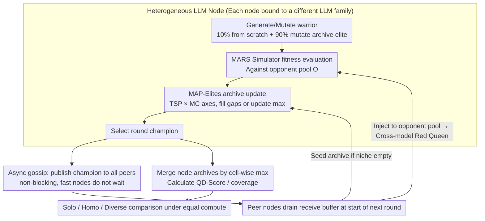

# DEI: Diversity in Evolutionary Inference for Quality-Diversity Search

**Conference**: ICML 2026  
**arXiv**: [2605.27130](https://arxiv.org/abs/2605.27130)  
**Code**: Extension based on SakanaAI/drq open-source implementation, promised release upon publication  
**Area**: Optimization / Evolutionary Algorithms / Quality-Diversity / LLM as Operators  
**Keywords**: Quality-Diversity, MAP-Elites, Heterogeneous LLM Ensemble, Asynchronous gossip, Program synthesis  

## TL;DR
This paper proposes DEI, which treats multiple **LLMs from different families** as heterogeneous mutation operators distributed across different nodes. By using fully asynchronous gossip to broadcast champions of each round, it creates cross-model adversarial pressure. In Core War program synthesis tasks, it achieves a +124% QD-Score and +28% archive coverage compared to single-node baselines under equal total computational budget.

## Background & Motivation

**Background**: Replacing manual genetic operators with LLMs has become mainstream. Works like FunSearch, Evolution through Large Models, and OPRO use LLMs for "mutation"—taking an old solution and a prompt to output an improved variant. The MAP-Elites/QD framework maintains an archive gridded by "behavioral characteristics (BC)," aiming to find a population of solutions that are both high-quality and diverse. Digital Red Queen (DRQ, kumar2026) further preserves the champion of each round as the next round's opponent, creating Red Queen co-evolutionary pressure.

**Limitations of Prior Work**: Current "distributed LLM searches" simply replicate the same model across $N$ workers, relying on sampling temperature for diversity. This is equivalent to parallelizing the same generative distribution $N$ times—any solutions systematically avoided by that model (e.g., specific Redcode templates GPT-family models tend not to write) will remain empty voids in the archive. Neither FunSearch nor AlphaEvolve addresses this problem; although AlphaEvolve uses two models, they are from the same family (large/small), aiming to save compute rather than seek diversity.

**Key Challenge**: QD aims to "cover the entire behavioral space," but every LLM has deep-seated inductive biases ("writing preferences" from training corpora and alignment). **Samples from a single distribution can never fill the union of multiple distributions**—parallelization only scales compute, not the coverage of the prior.

**Goal**: Under a fixed **total LLM call budget**, prove that "QD search with a heterogeneous model ensemble" is strictly superior to "parallel QD search with the same model" and a single node. Provide an engineering implementation capable of tolerating latency variances between models (e.g., a local 35B Qwen might be 10× slower than a cloud frontier model).

**Key Insight**: Treat "model identity" itself as a source of diversity in QD. Each node runs an LLM from a different family, allowing them to occupy the niches they are best suited for in the behavioral space. The champions of peers are injected into a node's own opponent pool and archive via gossip, forming a "cross-model Red Queen."

**Core Idea**: Upgrade parallel computation to **parallel cognition**—diversity stems from differences in model priors rather than temperature sampling.

## Method

### Overall Architecture
DEI preserves the single-node pipeline of DRQ (zero code changes) and wraps it with an asynchronous communication layer, allowing $N$ nodes running different LLMs to feed each other champions. Each node is a dual-component entity: a local MAP-Elites optimizer running a Quality-Diversity search and a fully asynchronous communication layer responsible for broadcasting its champion and injecting received peer champions into its own opponent pool and archive. The local optimizer maintains a 2D archive with behavioral axes **TSP** (warrior code length × mean survival time) and **MC** (proportion of in-core addresses touched during battle), storing the warrior with the highest fitness in each cell. In each round of $T$ LLM calls, 10% are generated from scratch and 90% are mutations of an elite sampled from the archive. Fitness is calculated as $f(w_i,\mathcal{O})=\sum_{\tau\in\mathcal{T}}\frac{N}{|\mathcal{T}|}\frac{A^i_\tau}{\sum_{o\in\mathcal{O}}A^o_\tau}$ via battles against opponent set $\mathcal{O}$ in the MARS simulator. New solutions replace archive entries if they fill an empty cell or refresh the highest score. Three experimental conditions—Solo (1 node), Homo Ensemble (4 nodes, same model), and Diverse Ensemble (4 nodes, diverse models: GPT-5.4-mini / Claude Sonnet 4.6 / GPT-5.2 / Claude Haiku 4.5)—share the same **total** call budget (per-node quota scaled by $1/N$) for fair comparison.

### Key Designs

**1. Heterogeneous LLMs as Mutation Operators + Cross-model Red Queen: Model Identity as Diversity Source**

Traditional parallel EA assumes mutation operators are fixed, relying on temperature for worker diversity—replicated generation from one distribution. DEI assigns each node an LLM from a different family as the MAP-Elites mutation/generation operator and lets round champions enter the opponent pool via gossip: $\mathcal{O}_i \leftarrow \mathcal{O}_i \cup \mathcal{R}$. Crucially, the fitness formula $f(w_i,\mathcal{O})$ explicitly depends on the opponent set $\mathcal{O}$. When a GPT node encounters a "fortress warrior" written by Claude (utilizing Claude's preferred patterns) as an opponent, GPT must evolve solutions to counter it to score high—this provides "cross-distribution adversarial pressure" unattainable in single-node self-play. To quantify this complementarity, the paper defines niche novelty $\eta=\mathbb{E}[\mathbf{1}[\mathbf{bc}(w)\notin \mathcal{A}_i^{(r-1)}]]$, representing the proportion of received peer champions falling into empty cells of one's own archive. In experiments, the Diverse condition $\eta \approx 0.45$ was significantly higher than Homo ($0.09$–$0.35$), confirming that heterogeneous models indeed "fill each other's blind spots." This elevates "which LLM to use" to a first-order diversity source for QD.

**2. Fully Asynchronous Gossip Champion Sharing: Tolerating Latency Variance**

The primary engineering hurdle of heterogeneity is latency variance—local MLX Qwen-35B takes ~10s/call, while cloud frontiers take ~2s/call, a 10× difference. If "end-of-round synchronization barriers" were used, frontier models would idle while waiting for the 35B model, causing the addition of a slow node to drag down throughput. DEI uses non-blocking all-gather: a node publishes its champion immediately upon selection and drains it at the start of the next round. While a slow node might receive a champion from several rounds ago, delayed champions are still valuable for filling gaps or refreshing elites in the cumulative QD archive. Using a Yggdrasil overlay provides stable IPv6 addresses for NAT traversal. This design ensures that "adding a slow laptop node" is strictly additive, which is a prerequisite for scaling out heterogeneous solutions.

**3. Equal Compute Comparison Protocol: Decoupling Computational and Diversity Gains**

QD literature is often criticized for simply spending more compute. To prove diversity-driven gains, DEI ensures Solo, Homo, and Diverse conditions share the same **total** LLM call budget—e.g., 250 iters/round for Solo vs. 4 nodes × 62 iters/round ≈ 248 calls. It reports tiered metrics: individual node champion generality (win rate against human-written warriors $\mathcal{H}$) and niche novelty at the individual level, and merged archive QD-Score and coverage (taking the best per cell across nodes) at the aggregate level. This reveals that while Homo merged QD-Scores exceed Solo (29.85 vs 20.46), only Diverse merged significantly leads in coverage (80.6% vs 63.0%). Coverage gains are attributed solely to heterogeneous priors.

### Loss & Training
The entire process is gradient-free; LLM calls occur at inference, and archive updates follow standard MAP-Elites replacement logic. Each node has $T$ calls per round ($T \approx 62$ for 4 nodes, $T=250$ for Solo). MARS is configured for an 8000-instruction core, 80,000 cycles per match, and 20 matches per warrior pair. Prompts for generation and mutation are reused from the DRQ repository.

## Key Experimental Results

### Main Results
All conditions share the total LLM call budget. Fitness is evaluated against the round champion pool in MARS; final generality is reported as win rate against a human-written set $\mathcal{H}$.

| Model / Condition | Peak Generality | Niche Novelty η | Notes |
|------------|----------------|-----------------|------|
| Diverse Ensemble (Claude Sonnet 4.6) | **0.850 ± 0.087** | 0.483 ± 0.120 | Best overall, highest η |
| Homo Ensemble (Claude Sonnet 4.6) | 0.825 ± 0.106 | 0.348 ± 0.039 | Parallel homo stronger than solo |
| Solo DRQ (Claude Sonnet 4.6) | 0.775 ± 0.035 | — | Single node baseline |
| Diverse Ensemble (GPT-5.4-mini) | 0.767 ± 0.076 | 0.422 ± 0.072 | Diverse > Homo > Solo |
| Homo Ensemble (GPT-5.4-mini) | 0.725 ± 0.029 | 0.119 ± 0.013 | η much lower than diverse |
| Diverse Ensemble (Claude Haiku 4.5) | **0.700 ± 0.050** | 0.443 ± 0.132 | Solo 0.650, Homo only 0.538 |

Merged archive (Equal compute comparison, final round):

| Condition | Coverage | QD-Score | vs Solo |
|------|----------|----------|-----------|
| Solo | 63.0% | 20.46 | Baseline |
| Homo merged | 59.0% | 29.85 | Coverage -4pt, QD +46% |
| **Diverse merged** | **80.6%** | **45.90** | **Coverage +28%, QD +124%** |

### Ablation Study
The "ablation" is equivalent to degrading Diverse to Homo or Solo (included in the main table). Supplementary observations:

| Comparison | Key Metric | Description |
|------|---------|------|
| Diverse vs Homo (4 models × 4 nodes) | Generality | Diverse wins on 4/4 models; gain is model-agnostic |
| Diverse vs Homo (merged QD-Score) | 45.90 vs 29.85 (+54%) | Diversity is the main driver under equal compute |
| Diverse vs Homo (merged Coverage) | 80.6% vs 59.0% (+22pt) | Coverage gain **only** appears in heterogeneous conditions |
| Niche novelty η (Homo → Diverse) | 0.09–0.35 → 0.42–0.48 | Significant increase in champions falling into empty niches |

### Key Findings
- **Homogeneous parallelization only boosts QD-Score, not coverage**: Homo merged coverage (59%) was lower than Solo (63%), indicating redundant niche exploration. Only heterogeneous priors pushed coverage past 80%.
- **Small models benefit most from diversity**: Claude Haiku 4.5 rose from 0.650 (solo) to 0.700 (diverse). Weaker models "piggyback" on stronger models' champions to reach niches they cannot generate themselves.
- **Async gossip makes slow nodes purely beneficial**: Without synchronization barriers, adding a local MLX node strictly increases coverage without dragging down frontier node throughput.

## Highlights & Insights
- **"Model Identity" as a First-Order QD Diversity Source**: Moving beyond temperature and BC design, this paper promotes "which LLM to use" as a diversity dimension—a generalizable perspective for any LLM-driven search.
- **Clean Equal-Compute Protocol**: Scaling $1/N$ quotas for $N$ nodes effectively decouples computational and diversity gains, a robust design for multi-agent/model work.
- **Niche Novelty η Quantifies Complementarity**: The metric $\eta=\Pr[\mathbf{bc}(w_{\text{peer}})\notin \mathcal{A}_i]$ measures how "surprised" a model is by another's champion, providing a low-cost diagnostic for ensemble selection.
- **Async Gossip with Yggdrasil Overlay**: A production-ready NAT traversal solution for mixing local and cloud models.

## Limitations & Future Work
- Only validated on Core War; Redcode is highly structured assembly with clear BC axes (TSP/MC). Replicability on tasks with ill-defined BCs or expensive evaluation is unproven.
- **Static** model allocation: Nodes are bound to one LLM for life; no dynamic scheduling based on contribution.
- Lack of systematic ablation on "how many models are enough" or how to optimally pick combinations beyond the $\eta$ observation.
- No comparison with other diversity methods like high-temperature Homo nodes or Diversity through AI Feedback.

## Related Work & Insights
- **vs FunSearch (Romera-Paredes 2023)**: FunSearch uses the same model for the whole pool; DEI replaces the model family for broader program distribution coverage.
- **vs AlphaEvolve (Novikov 2025)**: AlphaEvolve uses same-family models to save costs; DEI uses cross-family models to gain varied priors.
- **vs DRQ (Kumar 2026)**: DEI is a direct multi-node extension, upgrading DRQ from intra-model self-play to inter-model adversarial pressure.
- **vs Island-model EA (Cantu-Paz 2001)**: DEI is effectively an island model where each "island" runs a different operator (LLM) with asynchronous migration.

## Rating
- Novelty: ⭐⭐⭐⭐
- Experimental Thoroughness: ⭐⭐⭐
- Writing Quality: ⭐⭐⭐⭐
- Value: ⭐⭐⭐⭐

<!-- RELATED:START -->

## Related Papers

- [\[ICML 2025\] The Best of Both Worlds: Bridging Quality and Diversity in Data Selection with Bipartite Graph](../../ICML2025/llm_evaluation/the_best_of_both_worlds_bridging_quality_and_diversity_in_data_selection_with_bi.md)
- [\[NeurIPS 2025\] Efficient Semantic Uncertainty Quantification in Language Models via Diversity-Steered Sampling](../../NeurIPS2025/llm_evaluation/efficient_semantic_uncertainty_quantification_in_language_models_via_diversity-s.md)
- [\[ICML 2026\] BESPOKE: Benchmark for Search-Augmented Large Language Model Personalization via Diagnostic Feedback](bespoke_benchmark_for_search-augmented_large_language_model_personalization_via_.md)
- [\[AAAI 2026\] OptScale: Probabilistic Optimality for Inference-time Scaling](../../AAAI2026/llm_evaluation/optscale_probabilistic_optimality_for_inference-time_scaling.md)
- [\[ICML 2026\] REAL：把回归感知奖励塞进 RL，让 LLM-as-a-Judge 学会"差一分也是差"](real_regression-aware_reinforcement_learning_for_llm-as-a-judge.md)

<!-- RELATED:END -->
