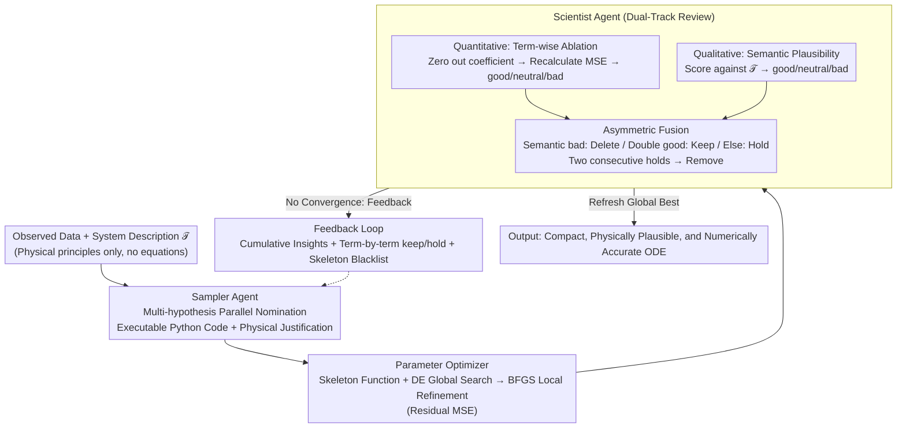

# Discovering Ordinary Differential Equations with LLM-Based Qualitative and Quantitative Evaluation

**Conference**: ICML 2026  
**arXiv**: [2605.07323](https://arxiv.org/abs/2605.07323)  
**Code**: https://github.com/Bon99yun/DoLQ  
**Area**: Science Discovery / Symbolic Regression / LLM Multi-Agent  
**Keywords**: Symbolic Regression, ODE, LLM Agent, Physical Interpretability, Hypothesis Search

## TL;DR
DoLQ inserts a "Scientist Agent" into the search loop of LLM-based symbolic regression. By performing joint qualitative (physical plausibility) and quantitative (ablative MSE contribution) evaluations on candidates, it pushes LLM-SR beyond "low-error but bloated and physically nonsensical" equations toward results that are both numerically accurate and structurally compact.

## Background & Motivation
**Background**: Inferring ordinary differential equations (ODEs) from observed data is a core problem in scientific machine learning. Early methods like SINDy relied on predefined basis function libraries and sparse regression; subsequent symbolic regression (SR) utilized evolutionary algorithms or Transformers (ODEformer) for automatic search. The latest generation leverages LLMs as candidate generators (e.g., LLM-SR, LASR), using scientific priors to significantly compress the search space.

**Limitations of Prior Work**: Existing methods evaluate candidate equations solely based on numerical metrics such as MSE and complexity. However, Figure 1 presents a critical counterexample: two equations with nearly identical MSE can differ entirely in their extrapolation behavior and physical meaning. LLM-SR often outputs "garbage bag" equations with over 10 terms, where the ground-truth terms are diluted by physically meaningless ones, leading to mutual interference during parameter optimization.

**Key Challenge**: Pure numerical evaluation indicates "how well it fits currently" but cannot ascertain "whether a term corresponds to a real physical mechanism." The latter is precisely what determines stable extrapolation in ID-Ext / OOD regions.

**Goal**: (1) Explicitly inject physical plausibility into the search loop; (2) Proactively prune terms that "seem contributory but are actually overfitted"; (3) Stably recover structures in multi-dimensional ODEs (even the 4D Glider).

**Key Insight**: LLMs possess both numerical reasoning capabilities and domain knowledge. Rather than using an LLM only as a "nominator," an independent LLM can act as a "reviewer" to score candidates from orthogonal semantic and numerical dimensions, feeding this feedback into the nominator's next iteration.

**Core Idea**: Qualitative + Quantitative dual-track review → Double Veto: Delete semantically unreasonable terms immediately and delay the removal of terms with no numerical contribution, thereby guiding the search toward compact equations that are both physically plausible and numerically optimal.

## Method

### Overall Architecture
DoLQ is a training-free, three-agent iterative closed loop consisting of "Nomination → Optimization → Review." The **Sampler Agent** receives the system description $\mathcal{T}$ and Scientist feedback to output executable Python code snippets for several candidates (e.g., `params[0] * np.sin(x[1])`) along with natural language physical justifications. The **Parameter Optimizer** instantiates these symbolic terms into differentiable skeleton functions $f_j(t, \boldsymbol{x}; \boldsymbol{\theta})$ and fits parameters. The **Scientist Agent** performs simultaneous quantitative and qualitative reviews on the optimized equations, producing keep/hold/remove decisions and cumulative insights for the Sampler. The outer loop runs for 100 iterations, maintaining a "Global Best." The dual-track review of the Scientist Agent is the core innovation of this work.

### Key Designs

**1. Structured Prompting + Multi-Hypothesis Parallelism for the Sampler Agent: Generating "Executable + Interpretable" Candidates**

The Sampler's prompt consists of: (a) task definition and system description $\mathcal{T}$; (b) Scientist feedback, including cumulative insights, term-by-term reviews, and a blacklist of removed skeletons; (c) output format constraints forcing each term into Python code (e.g., `params[0] * np.cos(x[0])`) plus a physical justification. Executable formats eliminate the need for symbolic parsing, while mandatory justifications externalize the LLM’s implicit physical knowledge for the Scientist's review. Multiple hypotheses are generated per round to enable parallel evaluation without cross-contamination between ablations.

**2. DE + BFGS Hybrid Parameter Optimization: Preventing False Negatives Due to Optimization Failure**

The optimization objective is Residual MSE $\sum_i (\dot{x}_j(t_i) - f_j(t_i, \boldsymbol{x}; \boldsymbol{\theta}))^2$. To ensure that correct structures are not rejected due to poor initialization, the system uses Differential Evolution (DE) for global search followed by BFGS for local refinement. The system runs BFGS-only, DE-only, and Hybrid strategies, selecting the one with the lowest MSE. This prevents the Scientist from mistakenly removing a correct skeleton simply because BFGS failed to find the parameters (Figure 8).

**3. Scientist Agent Dual-Track Review: Judging Each Term via Orthogonal Semantic and Numerical Dimensions**

The quantitative track performs an ablation for each term by setting its coefficient to zero and recalculating the Residual MSE: a significant error increase is labeled `good`, no change is `neutral`, and a decrease is `bad` (indicating overfitting). In Figure 2, removing `np.sin(x1)` increased MSE by 78.2% (`good`), while removing `x1**4` decreased it (`bad`). The qualitative track has the LLM evaluate whether a term corresponds to the mechanisms in $\mathcal{T}$ (e.g., "air resistance" matching $-cx^2$). An **asymmetric fusion rule** is used: semantic `bad` results in immediate `remove`; double `good` results in `keep`; otherwise, the term is `hold`. This prevents "fit-the-noise" terms while retaining necessary but structurally complex terms.

### Loss & Training
Ours is a training-free framework. The "training signals" are the Scientist Agent's keep/hold/remove decisions, which alter the Sampler's sampling distribution via prompt updates. The parameter optimization objective is Residual MSE (Eq. 2), and performance is evaluated using Normalized MSE (NMSE) and success rate. Each search is capped at 100 iterations.

## Key Experimental Results

### Main Results
Using Gemini 2.5 Flash Lite as the backbone, evaluations were conducted on 8 systems from ODEbench. Average Dimension NMSE (Residual / Integral) results:

| System | Metric | ICSR | LASR | LLM-SR | EDL | **Ours** |
|------|------|------|------|--------|-----|----------|
| SIR(2D) ID | Residual | 2.8e-8 | 1.8e-8 | 1.7e-8 | 18.6 | **1.7e-8** |
| CDIMA(2D) ID | Integral | 3.8e-4 | 2.9e-1 | 3.1e-3 | 1.3e5 | **2.4e-8** |
| Glider(4D) ID | Residual | 2.6e-2 | 2.5e-2 | 9.95e-7 | 1.5e4 | **1.2e-6** |
| CDIMA(2D) ID-Ext | Integral | 2.6e-4 | 4.9e1 | 9.4e-3 | NaN | **1.2e-7** |

CDIMA is a nonlinear saturation system where all baselines failed during extrapolation (ID-Ext), while DoLQ remained stable at the 1e-7 magnitude—a 5 to 6 order of magnitude improvement. This demonstrates that identifying the correct structure is essential for stable extrapolation.

### Ablation Study

| Configuration | Glider(2D) Convergence Iteration | Description |
|------|---------------------|------|
| Full DoLQ | Iteration 27 | Complete Scientist Agent feedback |
| w/o Scientist | Iteration 62 | Feeding MSE directly to Sampler without qualitative review |
| BFGS only | Failure | Correct skeleton fails to find parameters |
| DE only | Unstable | Global search without sufficient refinement |
| **DE + BFGS** | Stable Convergence | Hybrid strategy from Figure 8 |

### Key Findings
- **Qualitative Review = Accelerator**: Removing the Scientist doubles the convergence time because the Sampler lacks guidance on "which physical direction to explore."
- **Token Efficiency**: Figure 5 shows that LLM-SR consumes significantly more tokens on Glider(4D) as its redundant terms bloat the prompt; DoLQ remains efficient due to compactness.
- **CDIMA as a Watershed**: Only DoLQ successfully recovered the non-polynomial saturation terms $\frac{4 x_0 x_1}{x_0^2 + 1}$, as the Scientist recognized "saturation" semantic cues.
- **Hybrid Optimizer Avoids False Negatives**: BFGS alone often traps correct skeletons in local minima, leading to their erroneous removal.

## Highlights & Insights
- **"Reviewer Agent" as a Template**: Decoupling the LLM into a generator and a reviewer with independent contexts mitigates LLM overconfidence. This is transferable to protein design or chemical reaction path discovery.
- **Asymmetric Fusion Policy**: Immediately discarding semantically wrong terms while using a "two-strike" rule for numerical contribution balances exploration and exploitation.
- **Probabilistic Forgetfulness**: Reintroducing previously removed skeletons helps overcome early search biases in the LLM.
- **Executable Symbolic Expressions**: Moving from LaTeX to executable Python code eliminates parsing errors and is a highly practical engineering choice.

## Limitations & Future Work
- **Noise Sensitivity**: Residual MSE is sensitive to derivative estimation noise; integral-based estimation may be needed for noisy observations.
- **Reasoning Fixation**: Scientists occasionally anchor to a physical explanation too early, leading to sub-optimal structural convergence.
- **Dependency on LLM Priors**: In systems where descriptions are vague or rare, the qualitative review may degrade to simple MSE-based search.
- **PDE Generalization**: The lack of general PDE solvers is a barrier compared to the mature solver ecosystem for ODEs.

## Related Work & Insights
- **vs LLM-SR (Shojaee 2025)**: Both use LLMs as Samplers, but LLM-SR tends to stack terms due to an MSE-only focus. DoLQ produces stable extrapolation results (5 orders of magnitude better on CDIMA).
- **vs LASR (Grayeli 2024)**: Evolutionary algorithms struggle with non-polynomial forms like the saturation terms in CDIMA.
- **vs ODEformer (d'Ascoli 2024)**: End-to-end Transformers do not utilize semantic descriptions and provide no control over physical interpretability.

## Rating
- Novelty: ⭐⭐⭐⭐ Adding dual-track "Qualitative + Quantitative" review to the LLM-SR framework is a critical and clear innovation.
- Experimental Thoroughness: ⭐⭐⭐⭐ Covers 8 ODE systems and 4 SOTA baselines with extrapolation and ablation tests.
- Writing Quality: ⭐⭐⭐⭐ Excellent coordination between figures and pipeline descriptions.
- Value: ⭐⭐⭐⭐ Provides a reusable "Reviewer Agent" template for LLM-driven scientific discovery.

<!-- RELATED:START -->

## Related Papers

- [\[ICML 2026\] Resolution Diagnostics for Paired LLM Evaluation](resolution_diagnostics_for_paired_llm_evaluation.md)
- [\[AAAI 2026\] LLM-as-a-Judge for Scalable Test Coverage Evaluation](../../AAAI2026/llm_evaluation/llm-as-a-judge_for_scalable_test_coverage_evaluation_accuracy_operational_reliab.md)
- [\[ICLR 2026\] BiasScope: Towards Automated Detection of Bias in LLM-as-a-Judge Evaluation](../../ICLR2026/llm_evaluation/biasscope_towards_automated_detection_of_bias_in_llm-as-a-judge_evaluation.md)
- [\[ACL 2026\] Statistically Reliable LLM-Based Ranking Evaluation via Prediction-Powered Inference](../../ACL2026/llm_evaluation/statistically_reliable_llm-based_ranking_evaluation_via_prediction-powered_infer.md)
- [\[ACL 2026\] IF-Critic: Towards a Fine-Grained LLM Critic for Instruction-Following Evaluation](../../ACL2026/llm_evaluation/if-critic_towards_a_fine-grained_llm_critic_for_instruction-following_evaluation.md)

<!-- RELATED:END -->
