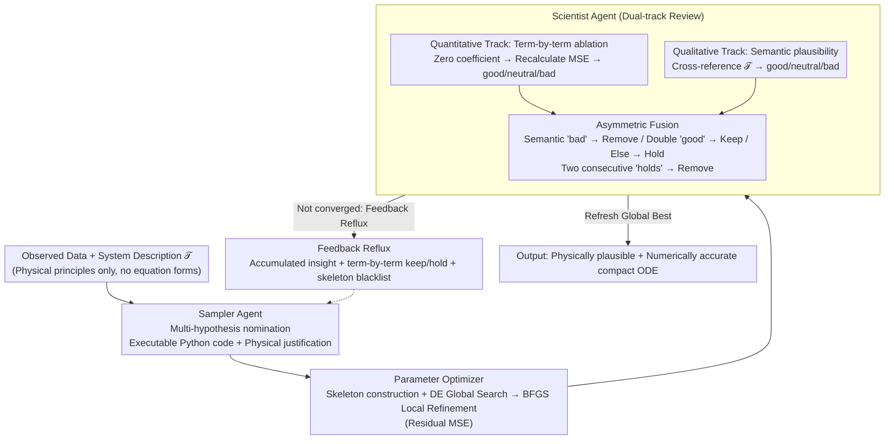

# Discovering Ordinary Differential Equations with LLM-Based Qualitative and Quantitative Evaluation

**Conference**: ICML 2026  
**arXiv**: [2605.07323](https://arxiv.org/abs/2605.07323)  
**Code**: https://github.com/Bon99yun/DoLQ  
**Area**: Scientific Discovery / Symbolic Regression / LLM Multi-Agent  
**Keywords**: Symbolic Regression, Ordinary Differential Equations, LLM Agent, Physical Interpretability, Hypothesis Search

## TL;DR
DoLQ inserts a "Scientist Agent" into the search loop of LLM-based symbolic regression. This agent performs simultaneous qualitative (physical plausibility) and quantitative (ablation-based MSE contribution) evaluations, pushing LLM-SR from "low-error but bloated and physically absurd" candidates toward equations that are both numerically accurate and structurally compact.

## Background & Motivation
**Background**: Identifying ordinary differential equations (ODEs) from observed data is a core problem in scientific machine learning. Early methods like SINDy relied on predefined basis function libraries and sparse regression. Subsequent Symbolic Regression (SR) utilized evolutionary algorithms or Transformers (e.g., ODEformer) for automated search. The latest generation, such as LLM-SR and LASR, employs LLMs as candidate generators, leveraging scientific priors to significantly compress the search space.

**Limitations of Prior Work**: Existing methods primarily evaluate candidate equations using numerical metrics—MSE and complexity. However, Figure 1 presents a critical counterexample: two equations with nearly identical MSE can differ entirely in extrapolation performance and physical meaning. LLM-SR often outputs "garbage bag" equations with over 10 terms, where the true terms are diluted by physically meaningless ones, leading to mutual interference during parameter optimization.

**Key Challenge**: Pure numerical evaluation only reflects "how well it fits now" but cannot determine "whether a term corresponds to a real physical mechanism." The latter is precisely what dictates stable extrapolation in ID-Ext / OOD intervals.

**Goal**: (1) Explicitly inject physical plausibility into the search loop; (2) Proactively prune terms that "seem to contribute but are actually overfitting"; (3) Stably recover structures in high-dimensional ODEs (even 4D Glider).

**Key Insight**: LLMs possess both numerical reasoning capabilities and domain knowledge. Instead of using them solely as "nominators," one can employ an independent LLM as a "reviewer." By scoring from both semantic and numerical orthogonal dimensions, the reviewer's feedback can be fed back into the nominator's next prompt iteration.

**Core Idea**: Qualitative + quantitative dual-track review $\rightarrow$ dual veto: Remove semantically unreasonable terms immediately, and remove terms with no numerical contribution with a delay, thereby guiding the search toward compact equations that are both physically plausible and numerically optimal.

## Method

### Overall Architecture
DoLQ is a training-free, three-agent iterative closed loop consisting of "Nomination $\rightarrow$ Optimization $\rightarrow$ Review": The **Sampler Agent** takes the system description $\mathcal{T}$ and Scientist feedback to output executable Python code snippets for several candidates (e.g., `params[0] * np.sin(x[1])`) along with natural language physical justifications. The **Parameter Optimizer** instantiates these symbolic terms into differentiable skeleton functions $f_j(t, \boldsymbol{x}; \boldsymbol{\theta})$ and fits parameters. The **Scientist Agent** performs simultaneous quantitative and qualitative reviews of the optimized equations, producing keep/hold/remove decisions and a summary of insights for the Sampler. The outer loop runs for 100 iterations, with the Sampler proposing multiple hypotheses in parallel and the "Global Best" continuously updated.

### Key Designs

**1. Structured Prompting + Multi-Hypothesis Parallelism for the Sampler Agent**

In the "Nomination" phase, the Sampler's prompt consists of: (a) Task definition + system description $\mathcal{T}$; (b) Scientist feedback, including accumulated insights, term-by-term review results, and a blacklist of removed skeletons; (c) Output format constraints, forcing each term into Python code (e.g., `params[0] * np.cos(x[0])`) plus its physical justification. Executable formats eliminate the need for symbolic parsing in the Optimizer, while mandatory justifications externalize the LLM's implicit physical knowledge for review.

**2. DE + BFGS Hybrid Parameter Optimization**

In the "Optimization" phase, the objective is the residual MSE $\sum_i (\dot{x}_j(t_i) - f_j(t_i, \boldsymbol{x}; \boldsymbol{\theta}))^2$ rather than integral MSE. The process uses Differential Evolution (DE) for global search to lock onto a feasible region, followed by BFGS for local refinement. This hybrid approach prevents "correct skeletons" from being rejected due to poor initial parameter values, which would otherwise mislead the Scientist into a "false negative" removal (Figure 8).

**3. Dual-track Review by the Scientist Agent**

The "Review" phase is the core innovation. The **Quantitative Track** performs an ablation on each term: if setting a coefficient to zero causes the MSE to rise significantly, it is "good"; if it remains unchanged, "neutral"; if it decreases, "bad" (indicating overfitting). The **Qualitative Track** utilizes the LLM to score terms based on whether they correspond to the physical mechanisms mentioned in $\mathcal{T}$ (e.g., air resistance $\rightarrow$ $-cx^2$).

An **asymmetric fusion rule** is applied: Semantic "bad" results in immediate removal. Only terms that are "good" on both tracks are kept. Others are held; those held for two consecutive rounds are removed. Removed skeletons are blacklisted with a probabilistic forgetting mechanism to prevent permanent misidentification.

### Loss & Training
This is a training-free framework. The "training signals" are the keep/hold/remove decisions of the Scientist Agent, which modify the prompt to shift the Sampler's distribution. The parameter optimization objective is the residual MSE (Eq. 2). Performance is measured by Normalized MSE (NMSE) and success rates.

## Key Experimental Results

### Main Results
Evaluated on 8 systems from ODEbench using Gemini 2.5 Flash Lite. Dimensional average NMSE (Residual / Integral) comparison:

| System | Metric | ICSR | LASR | LLM-SR | EDL | **Ours (DoLQ)** |
|------|------|------|------|--------|-----|----------|
| SIR(2D) ID | Residual | 2.8e-8 | 1.8e-8 | 1.7e-8 | 18.6 | **1.7e-8** |
| CDIMA(2D) ID | Integral | 3.8e-4 | 2.9e-1 | 3.1e-3 | 1.3e5 | **2.4e-8** |
| Glider(4D) ID | Residual | 2.6e-2 | 2.5e-2 | 9.95e-7 | 1.5e4 | **1.2e-6** |
| CDIMA(2D) ID-Ext | Integral | 2.6e-4 | 4.9e1 | 9.4e-3 | NaN | **1.2e-7** |

CDIMA is a nonlinear saturation system where baselines collapsed on ID-Ext (LASR rose to 48.5); DoLQ maintained stability at $10^{-7}$, a gain of 5-6 orders of magnitude.

### Ablation Study

| Configuration | Convergence (Glider 2D) | Description |
|------|---------------------|------|
| Full DoLQ | Iteration 27 | Full Scientist Agent feedback |
| w/o Scientist | Iteration 62 | Feeding MSE directly to Sampler, no qualitative check |
| BFGS only | Failed | Correct structure but fails to find parameters |
| DE only | Unstable | Global search but insufficient refinement |
| **DE + BFGS** | Stable Convergence | Hybrid strategy in Figure 8 |

### Key Findings
- **Qualitative Review = Accelerator**: Removing the Scientist doubles convergence time because the Sampler lacks physical guidance and repeatedly attempts unreasonable terms.
- **Token Efficiency**: Figure 5 shows LLM-SR consumes significantly more tokens on Glider(4D) due to redundant terms lengthening the prompt; DoLQ remains concise.
- **CDIMA as a Watershed**: For systems with non-polynomial saturation terms like $\frac{4 x_0 x_1}{x_0^2 + 1}$, only DoLQ stably recovers the form because the Scientist identifies semantic clues like "saturation."
- **Hybrid Optimizer Avoids False Negatives**: BFGS alone often misses the global optimum even with the correct structure, leading to catastrophic mis-removal of good terms.

## Highlights & Insights
- **"Reviewer Agent" Pattern**: Separating generation and review with independent prompts and contexts reduces LLM overconfidence and is transferable to other scientific searches (e.g., protein design).
- **Asymmetric Fusion Utility**: Immediately removing semantically incorrect terms while giving numerically silent terms a "second chance" (hold) is effective for filtering noise while preserving potential mechanisms.
- **Probabilistic Forgetting**: Periodically clearing the blacklist of removed skeletons helps counter the "early bias" of LLMs.
- **Executable Expressions**: Directly outputting Python code like `params[0] * np.sin(x[0])` bypasses symbolic parser errors and is a practical engineering trick.

## Limitations & Future Work
- **Noise Sensitivity**: Using finite differences to estimate $\dot{x}$ makes the method sensitive to noise; an integral-based estimator is a proposed future refinement.
- **Reasoning Fixation**: The Scientist may prematurely anchor to a specific physical explanation, leading to local optima in structural search.
- **Dependence on LLM Priors**: In systems with vague descriptions or rare physics (e.g., new materials), qualitative reliability may degrade to a pure MSE-based approach.
- **PDE Generalization**: The lack of general-purpose numerical solvers for PDEs, unlike ODEs, remains a primary obstacle for extension.

## Related Work & Insights
- **vs LLM-SR**: Both use LLM Samplers, but LLM-SR tends to bloat equations by focusing only on MSE. DoLQ maintains compactness and stability on extrapolation (e.g., CDIMA).
- **vs LASR**: Evolutionary algorithms with concept libraries work for polynomials but struggle with forms like $\sin/\cos$ or rational functions.
- **vs ODEformer**: Pure end-to-end Transformers do not utilize semantic descriptions and lack control over physical interpretability.

## Rating
- **Novelty**: ⭐⭐⭐⭐ Adding a dual-track review loop to LLM-SR is a clear and critical incremental innovation.
- **Experimental Thoroughness**: ⭐⭐⭐⭐ 8 ODE systems, 4 SOTA baselines, and dual-interval evaluation are robust, though OOD and high-noise experiments are limited.
- **Writing Quality**: ⭐⭐⭐⭐ Clear pipeline illustrations and well-structured methodology.
- **Value**: ⭐⭐⭐⭐ Provides a reusable template for LLM-driven scientific discovery, showing significant practical gains on complex systems like CDIMA.

<!-- RELATED:START -->

## Related Papers

- [\[ICML 2026\] Resolution Diagnostics for Paired LLM Evaluation](resolution_diagnostics_for_paired_llm_evaluation.md)
- [\[ICML 2026\] Nonparametric LLM Evaluation from Preference Data](nonparametric_llm_evaluation_from_preference_data.md)
- [\[AAAI 2026\] LLM-as-a-Judge for Scalable Test Coverage Evaluation](../../AAAI2026/llm_evaluation/llm-as-a-judge_for_scalable_test_coverage_evaluation_accuracy_operational_reliab.md)
- [\[ICLR 2026\] BiasScope: Towards Automated Detection of Bias in LLM-as-a-Judge Evaluation](../../ICLR2026/llm_evaluation/biasscope_towards_automated_detection_of_bias_in_llm-as-a-judge_evaluation.md)
- [\[ACL 2026\] Statistically Reliable LLM-Based Ranking Evaluation via Prediction-Powered Inference](../../ACL2026/llm_evaluation/statistically_reliable_llm-based_ranking_evaluation_via_prediction-powered_infer.md)

<!-- RELATED:END -->
