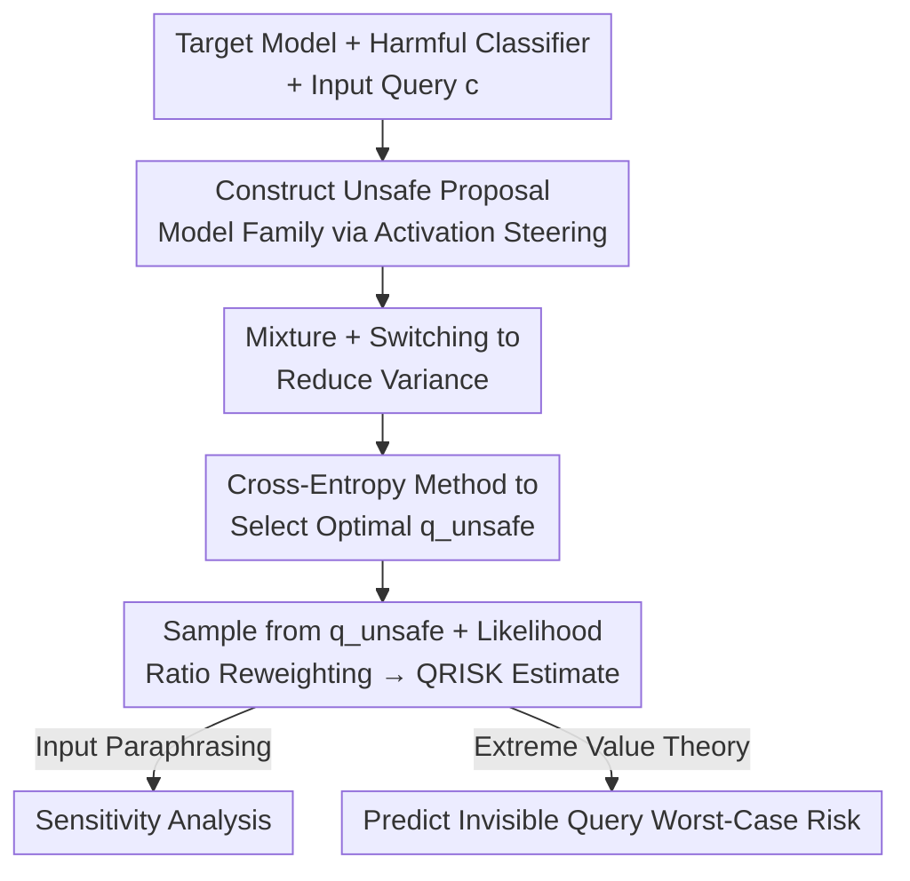

# Estimating Tail Risks in Language Model Output Distributions

**Conference**: ICML2026  
**arXiv**: [2604.22167](https://arxiv.org/abs/2604.22167)  
**Code**: Open-sourced (annotated as "Code available here" in the paper)  
**Area**: LLM Safety Evaluation / Rare Event Estimation  
**Keywords**: Tail Risk, Importance Sampling, Activation Steering, Deployment Risk, Extreme Value Theory

## TL;DR
Constructs an "unsafe proxy model" via activation steering combined with importance sampling to accurately estimate rare events like "the probability of a safe model outputting harmful content" (at the $10^{-4}$ level). This achieves accurate estimation with 10–20$\times$ fewer samples than brute-force sampling and enables worst-case deployment risk prediction.

## Background & Motivation

**Background**: Current LLM safety evaluations primarily focus on "input distribution"—constructing diverse prompts or searching for adversarial inputs to induce harmful outputs (red-teaming, jailbreak). For each query, typically only 1 (or a few) samples are collected to determine model safety.

**Limitations of Prior Work**: Models are probabilistic generators; safety estimates from single or low-sample counts are highly noisy, creating a "false sense of security" that a query is handled safely. Empirical tests show that for 313 STRONGREJECT harmful queries, Llama-3.1-8B greedy decoding yields harmful answers for only 1.6% of queries, but this ratio surges to 74.0% after 10,000 samples. In other words, "safe models" exhibit a **low but non-zero** probability of harmfulness for many queries, constituting tail events.

**Key Challenge**: At a scale of billions of daily calls, even a harmful probability of $10^{-6}$ per query results in an average of one harmful output per million queries ($1-(1-\varepsilon)^n \approx n\varepsilon$). However, accurately estimating a $10^{-4}$ probability using brute-force Monte Carlo (MC) sampling requires an enormous number of samples, making it computationally infeasible.

**Goal**: Given any target model, a harmfulness classifier, and an input query, **efficiently** estimate the "probability of the target model producing a harmful output for that query" and generalize these query-level estimates to predict deployment risk for unseen queries.

**Key Insight**: Although harmful outputs are rare under the target model, this is a classic **rare event estimation** problem. Importance sampling (IS) is designed for this: sampling from a "proposal model" that is more likely to produce the target behavior, then reweighting using likelihood ratios.

**Core Idea**: Use activation steering to transform the target model into an "unsafe proxy model" that is more prone to harmful outputs but shares the same support set as the target. Sampling from this proxy and reweighting by $p_\text{target}/q$ allows for low-variance estimation of rare harmful probabilities.

## Method

### Overall Architecture
The input includes a target model $p_\text{target}$, a binary harmfulness classifier $h(x;c)\in\{0,1\}$, and an input query $c$. The quantity to be estimated is the query-level risk:

$$\mathrm{QRISK}(c) := \mathbb{P}_{x\sim p_\text{target}(\cdot\mid c)}\big[h(x;c)=1\big].$$

Brute-force sampling from $p_\text{target}$ is infeasible when $\mathrm{QRISK}$ is very small. The pipeline consists of four steps: (1) constructing a family of unsafe proposal models via activation steering; (2) using mixture and switching techniques to pull the proposal model back toward the target model to reduce variance; (3) selecting the optimal proposal model $q_\text{unsafe}$ using the cross-entropy method over a hyperparameter grid; (4) sampling from $q_\text{unsafe}$ and reweighting by likelihood ratios to obtain $\widehat{\mathrm{QRISK}}(c)$. Finally, query-level estimates are used for downstream tasks: analyzing input perturbation sensitivity and predicting worst-case risks for unseen queries via Extreme Value Theory (EVT).

### Key Designs

**1. QRISK Framework + Importance Sampling Estimator: Estimating Harmful Probabilities as Rare Events**

To address the failure of brute-force sampling at low harmful probabilities, the paper formulates the target quantity as an expectation $\mathrm{QRISK}(c)=\mathbb{E}_{x\sim p_\text{target}}[h(x;c)]$. Applying importance sampling change-of-variables with a proposal model $q_\phi$:

$$\mathrm{QRISK}(c)=\mathbb{E}_{x\sim q_\phi(\cdot\mid c)}\!\left[\frac{p_\text{target}(x\mid c)}{q_\phi(x\mid c)}\,h(x;c)\right].$$

Practically, $k$ samples from $q_\phi$ are used: $\widehat{\mathrm{QRISK}}(c)=\frac{1}{k}\sum_{i=1}^{k}\frac{p_\text{target}(x_i\mid c)}{q_\phi(x_i\mid c)}h(x_i;c)$. This estimator is **unbiased** and converges to the true value as $k\to\infty$. The validity requires shared support, i.e., $\mathrm{KL}(p_\text{target}\Vert q_\phi)<\infty$. Variance depends entirely on the choice of the proposal model—the theoretical optimal is $q_\text{opt}\propto p_\text{target}(x\mid c)\,h(x;c)$, which is not directly sampleable. Subsequent designs aim to approximate this optimal proposal.

**2. Activation Steering for Unsafe Proposals: Training-free Amplification of Harmful Behavior**

The optimal proposal must be more likely to produce harmful content. The paper uses activation steering: collecting pairs of safe/unsafe samples, computing the **mean difference** of hidden activations at a specific transformer layer to obtain a "harmful direction" vector (the inverse of the refusal direction). During inference, this vector is scaled by intensity $\lambda_\text{steer}\ge 0$ and added to the residual stream, allowing continuous tuning of harmfulness. This step is training-free and simple, with $\lambda_\text{steer}$ acting as a knob: larger values induce harmful samples more easily but increase distribution mismatch—addressed by the next design.

**3. Mixture + Switching: Ensuring Finite KL and Lowering Variance**

Aggressive steering can push $q_\phi$ too far from $p_\text{target}$, leading to exploding likelihood ratios and uncontrolled variance. Two techniques pull the proposal back:

- **Model Mixture**: Interpolating at each step with coefficient $\alpha_\text{mix}\in[0,1]$, $q_\text{mix}(x_t\mid x_{1:t-1},c)=(1-\alpha_\text{mix})\,q_\phi+\alpha_\text{mix}\,p_\text{target}$. Any $\alpha_\text{mix}>0$ ensures $\mathrm{KL}(p_\text{target}\Vert q_\text{mix})<\infty$.
- **Model Switching**: During generation of length $T$, the first $t_\text{switch}$ tokens are sampled from the unsafe model (to trigger a harmful start), and remaining tokens switch back to the target model (to ensure trailing distribution stays close).

Both techniques simultaneously reduce estimation variance and guarantee finite KL, reconciling the conflict between "amplifying harm" and "staying close to the target."

**4. Cross-Entropy Method for Proposal Selection: Grid Search for Optimal Proposals**

The proposal is characterized by hyperparameters $\phi=(\lambda_\text{steer}, t_\text{switch}, \alpha_\text{mix})$. To find the set closest to $q_\text{opt}$, ideally $q_\text{unsafe}=\arg\min_\phi \mathrm{KL}(q_\text{opt}\Vert q_\phi)$. Since $q_\text{opt}$ cannot be sampled, the **cross-entropy method** is used: first, generate data using a random ensemble model $q_\text{rand}$, then for any candidate $\phi$, compute the weighted cross-entropy objective:

$$\widehat{\mathcal{L}}_\text{CE}(\phi)=-\frac{1}{k}\sum_{i=1}^{k} w(x_i,c)\,h(x_i;c)\,\log q_\phi(x_i\mid c),\quad w(x,c)=\frac{p_\text{target}(x\mid c)}{q_\text{rand}(x\mid c)}.$$

Estimating this on 10% of the dataset and selecting $\phi^\star$ yields a single $q_\text{unsafe}$ for all subsequent estimations.

## Key Experimental Results

### Main Results
Five safety-tuned models, 313 STRONGREJECT harmful queries (no jailbreaks). Harmful defined as score $\ge 0.75$.

| Configuration | Key Findings | Mechanism |
|------|---------|------|
| Repeat Sampling vs Greedy | Llama-3.1-8B harmful ratio 1.6% → 74.0% | 10K samples reveal massive tail harmfulness |
| Importance Sampling (IS) | 1,000 samples align with 10,000 brute-force MC | 10$\times$ sample savings; most queries on $y=x$ line |
| Sample Efficiency | $10^{-4}$ probabilities estimated with 500 samples | Overall 10–20$\times$ fewer samples than brute-force MC |
| Proposal Selection (k=500) | Optimized proposal achieves lowest MSE | Minimal variance across all target models |

Increase in harmful outputs via repeated sampling (Greedy → 10K samples):

| Model | Greedy Harmful % | After 10K Samples | Gain |
|------|------|------|------|
| Llama-3.2-1B | 16.6% | 99.5% | +82.9 |
| Llama-3.1-8B | 1.6% | 74.0% | +72.4 |
| Qwen2.5-7B | 1.6% | 63.9% | +62.3 |
| Phi-4 | 1.0% | 27.1% | +26.1 |
| Olmo-3-7B | 0.3% | 17.9% | +17.6 |

### Ablation Study

| Configuration | Key Metrics | Mechanism |
|------|---------|------|
| Misalignment Estimation | Sycophancy / Hallucination rates | IS has lower error than MC; gains increase with rarity |
| Input Paraphrase Sensitivity | Harmful prob. drifts multiple magnitudes | 25 non-adversarial paraphrases cause order-of-magnitude jumps |
| EVT Prediction | Accurate worst-case risk prediction | Predict $\max\mathrm{QRISK}>\tau$ on 70% deployment set via 30% eval set |

### Key Findings
- **"Safety" is a function of sample count**: Greedy or low-shot evaluation severely underestimates harmful probability. Repeated sampling reveals latent tail risks and can flip safety rankings between models (e.g., Llama vs. Qwen after 1,000 samples).
- **Sycophancy is rarer than hallucination**, making the advantage of IS over brute-force MC more pronounced for sycophancy. Rareness scales the benefits of IS.
- **Single-query estimates are poor deployment proxies**: Non-adversarial paraphrasing can shift harmful probabilities by orders of magnitude. However, EVT combined with a set of evaluation queries can reliably predict average and worst-case risks.

## Highlights & Insights
- **Adapts rare event estimation to LLM safety**: Importance sampling and cross-entropy methods are mature, but using activation steering to build proposal models is a clever bridge—training-free, continuous, and support-guaranteed.
- **Mixture + Switching "Dual Safety"**: One ensures token-level finite KL, while the other uses a "steer then switch" strategy to stay on-manifold. This is transferable to any rare-behavior sampling problem.
- **The "Ask again, is your model safe?" framing is a wake-up call**: It expands safety evaluation from the input dimension to the output distribution dimension, offering direct value for deployment-level risk auditing.

## Limitations & Future Work
- **Requires white-box access**: Constructing steering vectors needs model weights, which is inapplicable to closed-source APIs. Future work aims for black-box proposals using prefilling or output logits.
- **Dependence on LLM-as-a-Judge**: Classifiers can fail, and strong misaligned systems might generate detectable-but-evasive harmful content.
- **Dataset constraints**: To use 10K MC as ground truth, the study is limited to small datasets (313/20/20) with known non-zero harmful probabilities. Real-world "in-the-wild" distributions remain an extension.

## Related Work & Insights
- **vs. Jones et al. (2025)**: They used EVT for worst-case risk but used fixed-sequence likelihood as a proxy due to cost. This work provides efficient, true harmful probability estimates to fill that gap.
- **vs. Wu & Hilton (2024)**: They estimated the probability of sampling a query from an input distribution that induces a target output. This work focuses on the probability of harmfulness for *any given* query; the two are orthogonal and combinable.
- **vs. Red-teaming/Jailbreak (Zou et al. 2023, etc.)**: These focus on expensive input space searches with single samples. This work shows that repeated sampling on fewer contexts may be more efficient at inducing harm, and QRISK estimates could guide adversarial search strategies.

## Rating
- Novelty: ⭐⭐⭐⭐⭐ Introduces rare event estimation + activation steering to safety evaluation, providing a tail-risk perspective on output distributions.
- Experimental Thoroughness: ⭐⭐⭐⭐ Five models + three behavior types + sensitivity + EVT, though datasets are relatively small and white-box constrained.
- Writing Quality: ⭐⭐⭐⭐⭐ Clear motivation, complete description of formulas and pipelines, honest about limitations.
- Value: ⭐⭐⭐⭐⭐ Provides a practical, efficient tool for deployment-level safety auditing.

<!-- RELATED:START -->

## Related Papers

- [\[ICML 2026\] Prescriptive Scaling Reveals the Evolution of Language Model Capabilities](prescriptive_scaling_reveals_the_evolution_of_language_model_capabilities.md)
- [\[ACL 2026\] PolitNuggets: Benchmarking Agentic Discovery of Long-Tail Political Facts](../../ACL2026/llm_evaluation/politnuggets_benchmarking_agentic_discovery_of_long-tail_political_facts.md)
- [\[ICLR 2026\] How Reliable is Language Model Micro-Benchmarking?](../../ICLR2026/llm_evaluation/how_reliable_is_language_model_micro-benchmarking.md)
- [\[ACL 2026\] Large Language Models Are Bad Dice Players: LLMs Struggle to Generate Random Numbers from Statistical Distributions](../../ACL2026/llm_evaluation/large_language_models_are_bad_dice_players_llms_struggle_to_generate_random_numb.md)
- [\[ICML 2026\] BESPOKE: Benchmark for Search-Augmented Large Language Model Personalization via Diagnostic Feedback](bespoke_benchmark_for_search-augmented_large_language_model_personalization_via_.md)

<!-- RELATED:END -->
