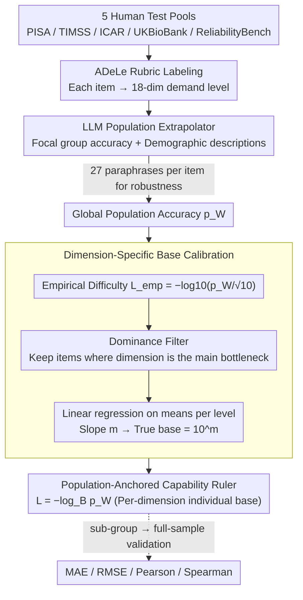

# From Human-Level AI Tales to AI Leveling Human Scales

**Conference**: ICML 2026  
**arXiv**: [2602.18911](https://arxiv.org/abs/2602.18911)  
**Code**: None  
**Area**: AI evaluation / psychometrics  
**Keywords**: AI evaluation, psychometrics, ADeLe, world population calibration, LLM as annotator

## TL;DR
This paper employs LLMs as population extrapolators to calibrate 18 capability dimensions on a logarithmic scale $L=-\log_B p_W$ according to "world population accuracy." It reveals that the Volume and Attention dimensions have a true base $B \gg 10$, while the Comprehension dimension has $B \approx 1$, uncovering a severe misalignment in current comparisons between AI and humans.

## Background & Motivation

**Background**: The mainstream of AI evaluation is benchmarking—using the average score of a single benchmark to represent "human level." This practice collapses different task difficulties, sample populations, and capability dimensions into a single number, leading to contradictory conclusions: LLMs achieve 90% on MMLU but only 50-70% on real software engineering tasks; on GPQA Diamond, PhDs score 70% while models reach 88%.

**Limitations of Prior Work**: (1) Benchmarks are incomparable, and "human level" depends entirely on the sampled reference group (often WEIRD: Western, Educated, Industrialized, Rich, and Democratic); (2) existing criterion-referenced frameworks like ADeLe provide dimension-level rubrics, but the base $B=10$ is a convention rather than a calibrated value, leaving cross-dimension comparisons invalid; (3) large-scale human measurement is extremely expensive and cannot be performed for every new benchmark.

**Key Challenge**: To use "humans as a reference," human samples are necessary, yet accessible human samples are always biased sub-populations. Without calibration, conclusions about "surpassing humans" or "falling short of humans" are entirely sample-dependent.

**Goal**: (1) Map benchmark items to ADeLe's 18-dimensional demand levels; (2) extrapolate human performance from small samples to the Whole World Population (WWP); (3) back-calculate the true logarithmic base for each dimension based on WWP accuracy; (4) verify the reliability of the extrapolation.

**Key Insight**: Psychometrics has long used equating and post-stratification to handle extrapolation from small to large samples. Since modern LLMs compress massive demographic and population knowledge in their training data, they can serve as low-cost, repeatable population extrapolators.

**Core Idea**: Use LLMs to translate "focal-group success rate + focal-group demographic description + target group demographic description" into "target group success rate." Subsequently, perform linear regression for each capability dimension to derive the true base $B = 10^m$, establishing a demographically anchored capability ruler.

## Method

### Overall Architecture
This framework aims to answer a question often obscured by benchmarks: when we state "AI has reached human level," which group of humans and which dimension of capability are we referring to? It re-anchors the score of a problem along two axes: first, using the ADeLe rubric to decompose each item into demand levels across 18 capability dimensions; second, using an LLM to extrapolate the measured accuracy of the item from a small sample group to the "world population" accuracy. Finally, it translates accuracy into comparable difficulty values based on the calibrated logarithmic scale of each dimension. The pipeline draws items from five human test pools (PISA 2009 / TIMSS 2003+2011 G4&G8 / ICAR / UKBioBank / ReliabilityBench), labels demand levels $d_{i,c}\in\{0,1,2,3,4,5+\}$, extrapolates the global accuracy $p_i^W$, converts it to log-difficulty $L_i=-\log_B p_i^W$, and validates using sub-group $\rightarrow$ full-sample predictions.

### Key Designs

**1. LLM as Population Extrapolator: Translating Small Samples to Global Benchmarks**
In classical psychometrics, establishing "human-wide" difficulty anchors requires massive human testing, which new benchmarks cannot afford. Furthermore, accessible samples are biased sub-populations (mostly WEIRD). This paper bets that LLMs’ training data contains vast demographic statistics, allowing them to serve as cheap, repeatable, and auditable population extrapolators. Specifically, the LLM is provided with a prompt containing six blocks of information: dataset and domain intro, focal group demographics (e.g., "15-year-old OECD students in PISA 2009"), the item with options and answer, the focal group accuracy $p_i^g$, and reference group (world population) demographics. The LLM outputs the predicted accuracy $\hat p_i^W$ with a rationale. Seven types of adjustment factors are explicitly named: global age distribution, education accessibility/quality, post-graduation forgetting, fluid/crystallized ability life cycles, specialization/exposure, health/cognitive decline, and language factors. To prevent phrasing bias, 27 paraphrased versions are run for each item.

**2. Dimension-Specific Base Calibration: Individual Difficulty Gradients**
Criterion-referenced frameworks like ADeLe provide rubrics, but the logarithmic base is set to $B=10$ by convention. This assumes that the increase in difficulty from level 1 to level 2 is identical across all dimensions. Consequently, statements like "AI exceeds humans in knowledge" and "AI lags behind in reasoning" are not on the same scale. Ours lets the data speak: first calculate empirical difficulty $L_{\text{emp},i}=-\log_{10}(p_i^W/\sqrt{10})$, then compute the mean $\bar y_l$ for each level $l\in\{1,\dots,5\}$, and perform linear regression on $(l,\bar y_l)$. The slope $m$ yields the true base $B=10^m$. Calibrated bases fall into three categories: High base (Volume $B\approx 32$, Attention $B\approx 17$; difficulty rises much steeper than expected), Standard (Metacognition $B\approx 6.7$, Knowledge $B\approx 5.1$; close to $B=10$), and Invariant (Comprehension/Spatial $B\approx 1$; increase in level barely changes difficulty). Only by calibrating each dimension to its true gradient can different rulers be converted to the same unit.

**3. Dominance Filter & Means-based Regression: Isolating Pure Signals**
An item often stresses multiple dimensions simultaneously; regressing directly on one dimension might be contaminated by other bottlenecks. Moreover, data is saturated with level 1 items while high-level items are scarce; raw point regression would see the slope flattened by the massive low-level sample size. Ours addresses this with two steps: the dominance filter retains only items where $d_{i,c}\ge\max_k d_{i,k}$, ensuring dimension $c$ is the primary bottleneck. Then, it performs regression only after averaging these items by level, fitting a line through 5 mean points to derive $\log_{10}B$, preventing the numerical dominance of low-level items from hijacking the slope.

### Validation Setup
No training involved. The extrapolator uses five commercial models (GPT-5 Chat, GPT-4.1, Llama-4, DeepSeek-v3.1, GROK-3) at low temperatures with 27 paraphrases per item. Reliability is verified via sub-group $\rightarrow$ full-sample designs using ICAR, TIMSS, and UKBioBank: the LLM extrapolates from a sub-group's score to the full sample, and the extrapolated value is compared against the actual full-sample score using MAE, RMSE, Pearson, and Spearman.

## Key Experimental Results

### Main Results (Validating LLM Extrapolation Quality)

| Model | ICAR MAE ↓ | ICAR RMSE ↓ | ICAR Pearson ↑ | ICAR Spearman ↑ |
|------|------------|--------------|----------------|------------------|
| gpt-5-chat | **0.030** | **0.044** | **0.976** | **0.968** |
| llama-4 | 0.033 | 0.052 | 0.971 | 0.963 |
| gpt-4.1 | 0.040 | 0.058 | 0.958 | 0.944 |
| deepseek-v3.1 | 0.043 | 0.085 | 0.922 | 0.914 |
| grok-3 | 0.043 | 0.068 | 0.939 | 0.920 |

On TIMSS, MAE rose to $0.12$-$0.16$ and Pearson dropped to $0.5$-$0.7$, reflecting greater difficulty in extrapolation when cross-national heterogeneity is high.

### Ablation Study (Dimension-specific Base Calibration)

| Dimension Group | Calibrated $B$ | Interpretation |
|--------|------------|------|
| Volume | $\approx 32$ | Much steeper than $B=10$; high levels should be pushed up |
| Attention | $\approx 17$ | Similar to above |
| Metacognition | $\approx 6.7$ | Close to $B=10$; well-calibrated |
| Knowledge | $\approx 5.1$ | Similar to above |
| Comprehension & Expression | $\approx 1$ | Difficulty barely increases; levels should be pushed down |
| Spatial Reasoning & Navigation | $\approx 1$ | Similar to above |

### Key Findings
- A single $B=10$ does not hold across dimensions—the difference between Volume and Comprehension bases is nearly $30\times$. Without calibration, "AI leads humans in Knowledge" cannot be compared with "AI falls short in Volume."
- LLM extrapolation achieved an MAE of only $0.030$ on structurally homogeneous ICAR data, proving that LLMs compress significant demographic priors. However, errors spiked on heterogeneous TIMSS data (60 countries), indicating a persistent Western bias.
- When applying calibrated bases, current LLM capability profiles show a distinct "Knowledge-strong, Volume/Attention-weak" shape, providing more interpretable comparisons for policymakers.

## Highlights & Insights
- Redefines the misused comparison of "AI vs. Humans" from "benchmark score comparison" to "location on a population-based logarithmic scale," offering a philosophical shift in evaluation.
- Using LLMs as population extrapolators is a clever "using AI to calibrate AI-human comparison" loop; the sub-group $\rightarrow$ full-sample validation proves it has indeed learned demographic adjustment capabilities.
- The calibrated base results (Volume $\approx 32$, Comprehension $\approx 1$) shake the foundation of scalar claims like "AI has reached X% of human level" made over the past few years.

## Limitations & Future Work
- Only 5 data sources were used, all text-only; multimodal and agentic tasks are not covered.
- LLM extrapolators show larger MAEs on TIMSS and a clear Western/Anglosphere bias; population estimates for non-Western cultures may be systematically biased.
- Assumes the dominance filter is sufficient to "purify" dimensional signals, but real items may have co-existing bottlenecks. 
- Calibrated bases use only 5 mean points for linear regression, which has weak statistical significance; some dimensions (e.g., Mind Modeling) even yielded negative slopes.

## Related Work & Insights
- **vs ADeLe (Zhou 2025)**: ADeLe provides demand rubrics but uses $B=10$ by convention; Ours performs empirical calibration.
- **vs METR time-horizon (Kwa 2025)**: Uses single-dimension human-hour anchors; Ours provides multi-dimensional population distribution anchors.
- **vs IRT psychometrics**: Classical IRT requires dense real response data; Ours bypasses this step using LLMs.
- **vs MMLU / GPQA**: These provide scalar accuracy for a single reference group; Ours provides decomposable and comparable profiles.

## Rating
- Novelty: ⭐⭐⭐⭐⭐ "LLM as population extrapolator + Dimension-specific base calibration" is a rare methodological innovation.
- Experimental Thoroughness: ⭐⭐⭐ Only 5 data sources (text-only), large errors on TIMSS, and insufficient cross-cultural validation.
- Writing Quality: ⭐⭐⭐⭐ Motivation is impactful, and technical descriptions are clear.
- Value: ⭐⭐⭐⭐⭐ A paradigm-shifting reflection for the AI evaluation community; essential reading for both policymakers and researchers.

<!-- RELATED:START -->

## Related Papers

- [\[ACL 2025\] ChatBench: From Static Benchmarks to Human-AI Evaluation](../../ACL2025/llm_evaluation/chatbench_from_static_benchmarks_to_human-ai_evaluation.md)
- [\[ACL 2025\] CulturalBench: A Robust, Diverse, and Challenging Cultural Benchmark by Human-AI CulturalTeaming](../../ACL2025/llm_evaluation/culturalbench_a_robust_diverse_and_challenging_cultural_benchmark_by_human-ai_cu.md)
- [\[ICML 2026\] When AI Benchmarks Plateau: A Systematic Study of Benchmark Saturation](when_ai_benchmarks_plateau_a_systematic_study_of_benchmark_saturation.md)
- [\[ICLR 2026\] AirQA: A Comprehensive QA Dataset for AI Research with Instance-Level Evaluation](../../ICLR2026/llm_evaluation/airqa_a_comprehensive_qa_dataset_for_ai_research_with_instance-level_evaluation.md)
- [\[ACL 2026\] HoWToBench: Holistic Evaluation for LLM's Capability in Human-level Writing using Tree of Writing](../../ACL2026/llm_evaluation/howtobench_holistic_evaluation_for_llms_capability_in_human-level_writing_using_.md)

<!-- RELATED:END -->
