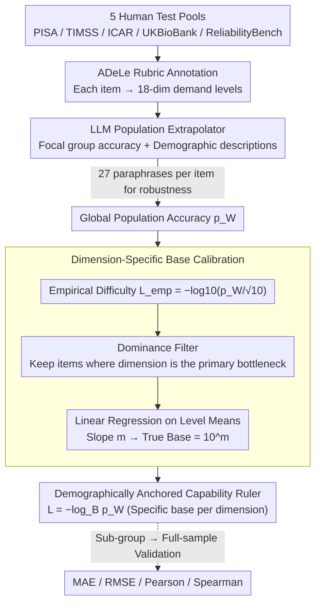

# From Human-Level AI Tales to AI Leveling Human Scales

**Conference**: ICML 2026  
**arXiv**: [2602.18911](https://arxiv.org/abs/2602.18911)  
**Code**: None  
**Area**: AI evaluation / Psychometrics  
**Keywords**: AI evaluation, psychometrics, ADeLe, world population calibration, LLM as annotator

## TL;DR
This paper utilizes LLMs as population extrapolators to calibrate 18 capability dimensions according to the logarithmic scale of "world population accuracy" $L=-\log_B p_W$. It reveals that the Volume / Attention dimensions have a true base $B \gg 10$, while the Comprehension dimension has $B \approx 1$, exposing the severe misalignment in current AI-human comparisons.

## Background & Motivation

**Background**: Mainstream AI evaluation relies on benchmarking—using average scores from a single benchmark to compare with "human levels." This approach compresses different task difficulties, sample populations, and dimensional capabilities into a single number, leading to contradictory conclusions: LLMs score 90% on MMLU but only 50-70% on real software engineering tasks; on GPQA Diamond, PhDs score 70% while models reach 88%.

**Limitations of Prior Work**: (1) Benchmarks are incomparable; "human level" depends entirely on the sampled reference population (mostly WEIRD: Western / Educated / Industrialized / Rich / Democratic). (2) Existing criterion-referenced frameworks like ADeLe provide dimension-level rubrics, but using a base $B=10$ is a convention rather than a calibration, leaving cross-dimensional comparisons invalid. (3) Large-scale human measurement is prohibitively expensive and impossible to conduct for newly emerging benchmarks.

**Key Challenge**: To use "humanity as a reference," human samples are necessary, but available samples are always biased subsets. Without calibration, conclusions about "surpassing humans" or "falling short of humans" are entirely sample-dependent.

**Goal**: (1) Map benchmark items to ADeLe 18-dimensional demand levels; (2) Extrapolate small-sample human performance to the global population (WWP); (3) Back-calculate the true logarithmic base for each dimension based on WWP accuracy; (4) Validate the reliability of the extrapolation.

**Key Insight**: Psychometrics has long used equating and post-stratification to handle extrapolation from small to large samples. Modern LLMs have compressed vast demographic and population knowledge during training, allowing them to serve as low-cost, repeatable population extrapolators.

**Core Idea**: Use LLMs to translate "focal-group success rate + demographic description of that group + demographic description of the target group" into "target group success rate." Subsequently, perform linear regression for each capability dimension to obtain the true base $B = 10^m$, establishing a demographically anchored capability ruler.

## Method

### Overall Architecture
This framework aims to answer a question often masked by benchmarking: when claiming "AI has reached human level," which specific group of humans and which specific dimension are being referenced? It re-anchors an item's performance along two axes: first, using the ADeLe rubric to decompose each item into demand levels for 18 capability dimensions; second, using an LLM to extrapolate the measured accuracy from a small sample to the "world population" accuracy $p_i^W$; and finally, translating accuracy into comparable difficulty values based on the calibrated logarithmic scale for each dimension. The pipeline draws items from five human test pools (PISA 2009 / TIMSS 2003+2011 G4&G8 / ICAR / UKBioBank / ReliabilityBench), labels the demand level $d_{i,c}\in\{0,1,2,3,4,5+\}$, extrapolates to obtain the global population accuracy $p_i^W$, converts this to logarithmic difficulty $L_i=-\log_B p_i^W$, and validates the process using sub-group to full-sample predictions.

### Key Designs

**1. LLM as Population Extrapolator: Translating small-sample accuracy to global population benchmarks**

Classic psychometrics requires large-scale human testing to obtain "all-human" difficulty anchors, which newly emerging benchmarks cannot wait for, and available samples are often biased subsets (WEIRD). This paper bets that LLMs have compressed massive demographic statistics during training, serving as an inexpensive, repeatable, and auditable population extrapolator. Specifically, the LLM is fed a prompt containing 6 types of information: dataset and domain intro, focal group demographics (e.g., "15-year-old OECD students in 2009 PISA"), item stem/options/correct answer, reported focal group accuracy $p_i^g$, and reference group (world population) demographics. The LLM then outputs the predicted reference accuracy $\hat p_i^W$ with a rationale. The prompt explicitly lists 7 adjustment factors: global age distribution, education accessibility, post-graduation forgetting, fluid/crystallized intelligence curves, specialization/exposure, health/cognitive decline, and language factors. To prevent phrasing bias, 27 paraphrase versions are used for each item to ensure robustness.

**2. Dimension-Specific Base Calibration: Unique difficulty gradients for each capability**

Criterion-referenced frameworks like ADeLe provide dimension-level rubrics, but the base of the logarithmic scale is conventionally fixed at $B=10$, which is an assumption rather than a calibration. This assumes that the difficulty multiplier from level 1 to level 2 is identical across all dimensions. Consequently, statements like "AI exceeds humans in Knowledge" and "AI trails humans in Reasoning" are not measured with the same ruler. This paper lets the data speak: it first calculates the empirical difficulty $L_{\text{emp},i}=-\log_{10}(p_i^W/\sqrt{10})$, computes the mean $\bar y_l$ for each level $l\in\{1,\dots,5\}$, and performs linear regression on $(l,\bar y_l)$. The slope $m$ yields the true base $B=10^m$. Calibrated bases fall into three categories: high (Volume $B\approx 32$, Attention $B\approx 17$, where difficulty rises much faster than expected), standard (Metacognition $B\approx 6.7$, Knowledge $B\approx 5.1$, close to $B=10$), and invariant (Comprehension/Spatial $B\approx 1$, where increasing levels hardly change difficulty). Calibration allows different rulers to be converted into a unified unit.

**3. Dominance Filter and Means-Based Regression: Isolating pure dimension signals**

An item often taxes multiple dimensions simultaneously; regressing directly on one dimension may be contaminated by other bottlenecks. Furthermore, data is often saturated with level 1 items while high-level items are scarce; raw point regression would be flattened by the mass of low-level samples. The paper uses a two-step approach: a dominance filter retains only items where $d_{i,c}\ge\max_k d_{i,k}$—meaning dimension $c$ is the primary bottleneck—to regress that specific dimension. Regression is then performed on the means of these items per level, fitting a line through 5 mean points. The slope $\log_{10}B$ avoids being hijacked by the numerical dominance of low-level items, representing a fair-weight compromise between "sparse high-level samples" and "unbiased slopes."

### Experimental Setup
No training is involved. The extrapolator uses 5 commercial models: GPT-5 Chat, GPT-4.1, Llama-4, DeepSeek-v3.1, and GROK-3, with low temperature and no tools, running 27 paraphrases per item. Reliability is validated using sub-group to full-sample designs on ICAR, TIMSS, and UKBioBank: LLMs extrapolate from a specific sub-group score to the full sample, which is then compared against actual full-sample performance using MAE, RMSE, Pearson, and Spearman correlations.

## Key Experimental Results

### Main Results (Validating LLM Extrapolation)

| Model | ICAR MAE ↓ | ICAR RMSE ↓ | ICAR Pearson ↑ | ICAR Spearman ↑ |
|------|------------|--------------|----------------|------------------|
| gpt-5-chat | **0.030** | **0.044** | **0.976** | **0.968** |
| llama-4 | 0.033 | 0.052 | 0.971 | 0.963 |
| gpt-4.1 | 0.040 | 0.058 | 0.958 | 0.944 |
| deepseek-v3.1 | 0.043 | 0.085 | 0.922 | 0.914 |
| grok-3 | 0.043 | 0.068 | 0.939 | 0.920 |

On TIMSS, MAE increased to the $0.12$-$0.16$ range and Pearson dropped to $0.5$-$0.7$, reflecting greater difficulty in extrapolation when cross-national heterogeneity is high.

### Ablation Study (Dimension-Specific Base Calibration)

| Dimension Group | Calibrated $B$ | Interpretation |
|--------|------------|------|
| Volume | $\approx 32$ | Much steeper than $B=10$; high levels should be adjusted upward. |
| Attention | $\approx 17$ | Similar to above. |
| Metacognition | $\approx 6.7$ | Close to $B=10$; well-calibrated. |
| Knowledge | $\approx 5.1$ | Similar to above. |
| Comprehension & Expression | $\approx 1$ | Difficulty almost constant; levels should be adjusted downward. |
| Spatial Reasoning & Navigation | $\approx 1$ | Similar to above. |

### Key Findings
- A single $B=10$ does not hold across dimensions. The disparity between the true bases of Volume and Comprehension (approx. $30\times$) means that "AI leads humans in Knowledge" cannot be directly compared to "AI remains far behind humans in Volume" without calibration.
- LLM extrapolation achieved an MAE of only $0.030$ (Pearson 0.976) on the structurally homogeneous ICAR, proving LLMs compress significant demographic priors. However, error rates rose on heterogeneous data like TIMSS (60 countries), indicating persistent Western bias in LLMs.
- After applying calibrated bases, the LLM capability profile shows a distinct "Strong Knowledge, Weak Volume/Attention" shape, providing more interpretable comparisons for policymakers.

## Highlights & Insights
- The study redefines "AI vs. Human" comparison from simple "benchmark score comparisons" to "positioning on a logarithmic population distribution scale," a philosophical shift in evaluation.
- Using LLMs as population extrapolators is a clever cycle of "using AI to calibrate AI for human comparison." Sub-group to full-sample validation proves the models have learned demographic adjustment capabilities.
- The calibrated base results (Volume $\approx 32$, Comprehension $\approx 1$) directly challenge all scalar "AI reaches X% human level" conclusions from the past few years, serving as a powerful negative finding.

## Limitations & Future Work
- Only 5 data sources were used, and all were text-only; multimodal and agentic tasks were not covered.
- LLM extrapolation error (MAE) is high on TIMSS, with visible Western/Anglosphere bias; population estimates for non-Western cultures may be systematically skewed.
- The dominance filter assumes it can "purify" dimensional signals, but actual items may involve multiple inseparable bottlenecks; filtered samples might still contain valuable information.
- Calibration relies on linear regression of only 5 mean points, leading to weak statistical significance; some dimensions (e.g., Mind Modeling) even showed negative slopes.

## Related Work & Insights
- **vs ADeLe (Zhou 2025)**: ADeLe provides demand rubrics but uses $B=10$ as a convention; this work provides empirical calibration.
- **vs METR time-horizon (Kwa 2025)**: METR uses human-hour anchors; this work provides multi-dimensional population distribution anchors.
- **vs IRT psychometrics**: Classic IRT requires dense human response data; this work bypasses this requirement using LLMs.
- **vs MMLU / GPQA**: Traditional benchmarks provide scalar accuracy and single reference populations; this work offers decomposable and comparable profiles.

## Rating
- Novelty: ⭐⭐⭐⭐⭐ "LLM as population extrapolator + dimension-specific base calibration" is a rare methodological innovation.
- Experimental Thoroughness: ⭐⭐⭐ Only 5 text-only data sources; high error on TIMSS; cross-cultural validation is insufficient.
- Writing Quality: ⭐⭐⭐⭐ The motivation is compelling, and the technical narrative is clear.
- Value: ⭐⭐⭐⭐⭐ Represents a paradigm-level reflection for the AI evaluation community; essential reading for researchers and policymakers.

<!-- RELATED:START -->

## Related Papers

- [\[ACL 2025\] ChatBench: From Static Benchmarks to Human-AI Evaluation](../../ACL2025/llm_evaluation/chatbench_from_static_benchmarks_to_human-ai_evaluation.md)
- [\[ACL 2025\] CulturalBench: A Robust, Diverse, and Challenging Cultural Benchmark by Human-AI CulturalTeaming](../../ACL2025/llm_evaluation/culturalbench_a_robust_diverse_and_challenging_cultural_benchmark_by_human-ai_cu.md)
- [\[ICML 2026\] When AI Benchmarks Plateau: A Systematic Study of Benchmark Saturation](when_ai_benchmarks_plateau_a_systematic_study_of_benchmark_saturation.md)
- [\[ACL 2026\] HoWToBench: Holistic Evaluation for LLM's Capability in Human-level Writing using Tree of Writing](../../ACL2026/llm_evaluation/howtobench_holistic_evaluation_for_llms_capability_in_human-level_writing_using_.md)
- [\[ICLR 2026\] AstaBench: Rigorous Benchmarking of AI Agents with a Scientific Research Suite](../../ICLR2026/llm_evaluation/astabench_benchmarking_ai_agents.md)

<!-- RELATED:END -->
