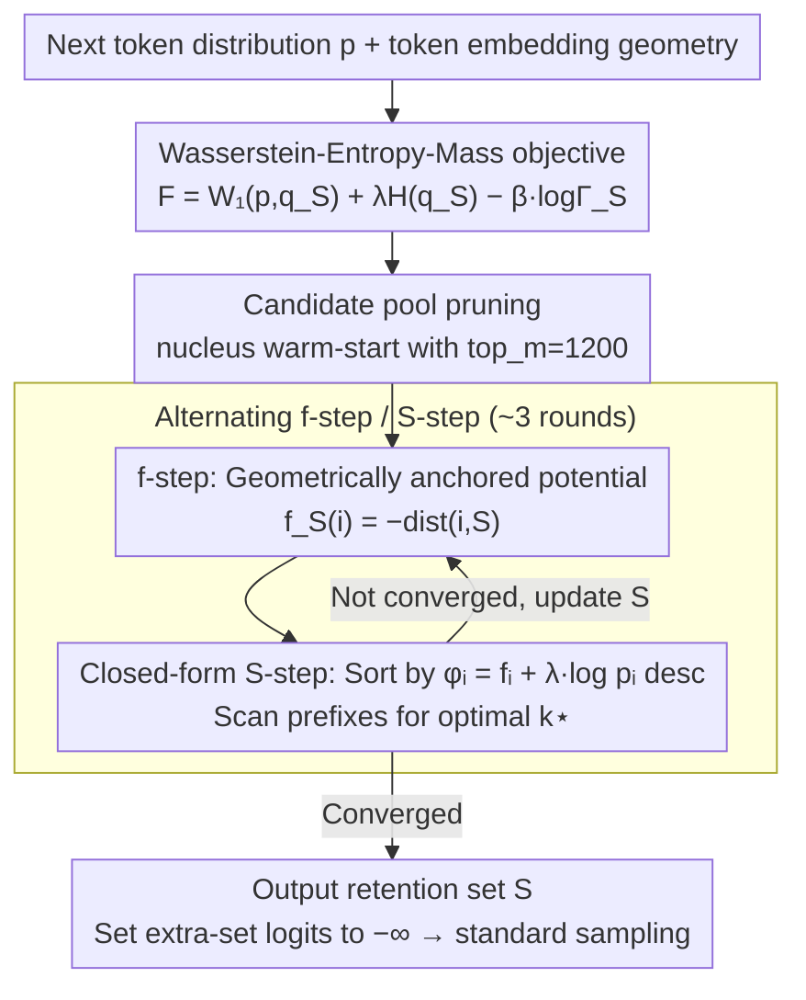

# Top-W: Geometry-Aware Decoding with Wasserstein-Regularized Truncation and Mass Penalties for LLMs

**Conference**: ICML 2026  
**arXiv**: [2602.10346](https://arxiv.org/abs/2602.10346)  
**Code**: https://github.com/arashgholami/top-w-decoding (Available)  
**Area**: LLM Decoding / Evaluation / Inference-time Control  
**Keywords**: Truncated decoding, Wasserstein distance, token embedding geometry, entropy constraints, high-temperature robustness

## TL;DR
Top-W formulates next-token truncation as a minimization problem of three terms: "Wasserstein, Entropy, and Mass," incorporating token embedding geometry. Theoretically, it is proven that the optimal solution is either a single token or a prefix sorted by $f(i)+\lambda\log p_i$. The implementation requires only an $O(n\log n)$ scan. It outperforms baselines in the majority of 15 (T, model) combinations across GSM8K, GPQA, AlpacaEval, and MT-Bench, improving GSM8K performance by up to 33.7% over Top-H at high temperatures.

## Background & Motivation

**Background**: Truncated sampling has long been a fundamental infrastructure for LLM decoding—Top-$k$, Top-$p$ (nucleus), Min-$p$, and locally typical sampling all prune low-probability tails from a "probability ranking" perspective. Recently, Top-$H$ explicitly introduced "constraining the entropy of the resulting sub-distribution below a threshold" as a constraint, becoming one of the first works to approach the problem from a "distribution shaping" perspective.

**Limitations of Prior Work**: All these rules treat tokens as structureless categories—looking only at probabilities while ignoring the semantic distances between tokens in the embedding space. Consequently: (i) at high temperatures ($T\geq 1.5$), Top-$p$ / Min-$p$ frequently expand to almost the entire vocabulary, leading to collapsed outputs; (ii) even with entropy control (Top-$H$), probability may still concentrate on synonymous or nearly identical neighboring tokens, achieving "pseudo-diversity" while losing true creativity.

**Key Challenge**: Decoders must balance (i) faithfulness (not straying too far from the original distribution), (ii) creativity (sufficient diversity), and (iii) coherence (not pruning too much mass). The first two essentially require measurement within the token geometric space, yet all existing samplers skip geometric information.

**Goal**: To "explicitly" integrate token embedding geometry into the truncation objective, providing a geometry-aware sampler that possesses a theoretical closed-form solution, can be deployed via a logits-processor interface, and remains robust to temperature variations.

**Key Insight**: The authors view truncation through the lens of Optimal Transport (OT)—treating "truncation + renormalization" as transporting the original distribution $p$ to a distribution $q_S$ supported on $S$. This naturally introduces the Wasserstein-$1$ distance $W_1(p,q_S)$ as a faithfulness term, with the Mahalanobis distance on token embeddings serving as the ground cost.

**Core Idea**: Define the optimal truncation set by optimizing the sum of "$W_1$ (geometry) + $\lambda H(q_S)$ (creativity) − $\beta\log\Gamma_S$ (quality)" and prove that this problem has a structural solution of "prefix or single token."

## Method

### Overall Architecture
Top-W is an inference-time truncated sampler. For each token generation, instead of pruning tails based solely on probability (like Top-$k$/Top-$p$), it formulates "which candidate tokens to keep" as an optimization problem incorporating token embedding geometry. After solving for the optimal set $S$, it sets the logits of tokens outside the set to $-\infty$ for standard sampling. The process involves: obtaining the next-token distribution $p\in\Delta^{|V|}$ and token embedding geometry, defining the objective $F_{\lambda,\beta}(S)=W_1(p,q_S)+\lambda H(q_S)-\beta\log\Gamma_S$ (geometric faithfulness + creativity + quality) for the candidate set $S$. Since direct optimization of $W_1$ is intractable at vocabulary scale, the authors use the Kantorovich-Rubinstein dual to transform it into distance queries, then alternatingly update the potential function $f$ and the retention set $S$, reaching convergence in 3-4 iterations.

### Key Designs

**1. Wasserstein-Entropy-Mass Objective: Integrating Semantic Geometry into Truncation**

Traditional truncation (Top-$k$/$p$/Min-$p$) treats tokens as structureless categories, relying only on probability rankings. Consequently, "synonymous clusters" and "semantic outlier islands" are treated identically—at high temperatures, probability is either heaped onto synonymous neighbors (pseudo-diversity) or expanded to the entire vocabulary (collapse). Top-W explicitly adds a geometric term to the truncation objective: $F_{\lambda,\beta}(S)=W_1(p,q_S)+\lambda H(q_S)-\beta\log\Gamma_S$, where $W_1(p,q_S)$ is the Wasserstein-$1$ distance required to transport the original distribution $p$ to the truncated renormalized distribution $q_S$ (using Mahalanobis distance on embeddings as ground cost), $H(q_S)$ controls creativity, and $\Gamma_S=\sum_{i\in S}p_i$ represents preserved quality. Crucially, the paper proves an exact decomposition $W_1(p,q_S)=(1-\Gamma_S)\,W_1(p(\cdot|S^c),p(\cdot|S))$, separating "how much mass was removed" from "how far the removed part is from the retained set." Thus, a high-probability token semantically distant from the retained set is heavily penalized, while a low-probability token close to the set may be included in $S$. This geometric faithfulness, rather than pure probabilistic faithfulness, is the source of high-temperature robustness.

**2. Geometrically Anchored Potential + Closed-form S-step: Replacing Intractable OT with Sorting and Scanning**

Solving linear programming for $W_1$ on a vocabulary of size $|V|\sim 10^5$ is unrealistic. The authors utilize the KR dual $W_1=\sup_{f\in\mathcal{F}}(\mathbb{E}_p[f]-\mathbb{E}_{q_S}[f])$ and fix the potential as an anchored potential $f_S(i)=-\mathrm{dist}(i,S)$. This is the "most attractive" among all anchored 1-Lipschitz functions, equivalent to assigning more negative scores to tokens further from the current set, thereby maximizing the objective while maintaining feasibility. With $f$ fixed, the truncation sub-problem gains a closed-form solution: $\arg\min_S F$ is equivalent to $\arg\max_S G_f(S)=\frac{1}{\Gamma_S}\sum_{i\in S}p_i\phi_i(f)+(\beta-\lambda)\log\Gamma_S$, where the hybrid score $\phi_i(f)=f_i+\lambda\log p_i=-\mathrm{dist}(i,S)+\lambda\log p_i$ linearly combines geometric distance and log-probability. The paper further proves (Theorem 3.4) that the optimal solution for $G_f$ has only two structures: if $\beta\geq\lambda$, the optimal $S$ must be a **prefix** after sorting by $\phi_i$ descending; if $\beta\leq\lambda$, $S$ degenerates to a **singleton**. This reduces the combinatorial search from $2^{|V|}$ to a 1D prefix scan, making the extra cost of the sampler a single sort and scan.

**3. Alternating f-step / S-step + Candidate Pool Pruning: Approximating Joint Optima without Explicit OT**

Since the potential $f$ depends on $S$ and $S$ depends on $f$, the authors use alternating iterations to approach the joint optimum. Each cycle performs three steps: (i) calculate the potential $f^{(t)}_i=-\mathrm{dist}(i,S^{(t)})$ using the current $S^{(t)}$; (ii) sort by $\phi_i^{(t)}$ descending and scan the prefix target $J_k=\Phi_k/\Gamma_k+(\beta-\lambda)\log\Gamma_k$ to find the maximizing $k^\star$ for $S^{(t+1)}$; (iii) stop upon convergence (3 rounds are sufficient in practice). To avoid calculating Mahalanobis distances over the entire vocabulary, a nucleus warm-start prunes the candidates to a pool of top_m$=1200$. The appendix provides sufficient conditions for maintaining exactness after pruning. This ensures millisecond-level overhead per token, with Top-W being only 5.4% slower than Top-$H$/Top-$p$/Min-$p$ on average, ensuring geometry-awareness does not kill throughput.

### Loss & Training
This work is an inference-time method with no training. The default hyperparameters $(\lambda,\beta)$ are $(2.2,2.8)$. When $\beta>\lambda$, the sampler operates in the prefix zone, where $\beta$ can be adjusted to slide continuously between sharpness (higher accuracy) and creativity (more diversity).

## Key Experimental Results

### Main Results
Testing 3 LLMs (Qwen2.5-3B, LLaMA-3.1-8B-Inst, Phi-3-Mini) across 5 temperatures $T\in\{0.5,0.7,1.0,1.5,2.0\}$ (15 combinations total):

| Benchmark | Top-W Wins | Max Relative Gain vs Top-H | Remarks |
|-----------|-----------:|----------------------:|------|
| GSM8K     | 13/15 | **+33.7%** ($T=2.0$) | Baselines almost collapse at high T |
| GPQA      | 12/15 | ~1-3 points | Wins for all 3 models at $T\in\{1.5,2.0\}$ |
| AlpacaEval| 12/15 | Consistent judge wins | Length-controlled win-rate |
| MT-Bench  | 8/15  | Better multi-turn consistency | Avoids drift at high T |

On GSM8K at $T=2.0$: Top-W scores 75.13% / 73.09% / 84.63%, while Top-$p$ drops to 9.10% / 2.65% / 7.73%.

### Ablation Study

| Configuration | GSM8K@T=2.0 (LLaMA) | Description |
|------|--------------------:|------|
| $\beta>\lambda$ (Prefix Zone) | 73.09 | Default setting |
| $\beta\leq\lambda$ (Singleton) | Significant Drop | Degenerates to single token |
| $\beta$ too large | Creativity ↑ but GSM8K ↓ | Retains too much mass |
| Top-W (Creative rubric $\beta=2.8$) | Wins 12/27 tasks | Higher than Top-$p$/Top-$H$/Min-$p$ on average |

### Key Findings
- **Geometry + Entropy + Mass are all necessary**: Quality term only → Top-$k$; Entropy term only → Top-$H$; adding Geometry yields a qualitative leap in high-temperature robustness.
- **$\beta$ acts as a "Creativity ↔ Accuracy" regulator**: Rubric evaluation (Diversity/Originality/Narrative/Emotion/Imagery) shows that increasing $\beta$ raises creativity but lowers exact answer scores; it can be tuned for different tasks.
- **Unified Perspective**: The paper proves that under a 0-1 uniform metric, Top-W degenerates into Top-$k$ (with $\lambda=\beta=0$) or Top-$H$ (Lagrangian relaxation with $\beta=0$), placing existing samplers into a single framework.
- **Controllable Overhead**: 3 rounds of alternating steps with top_m=1200 takes ~ms per token, roughly 5.4% slower than Top-$p$.

## Highlights & Insights
- **Discovery of Structural Optima**: Theorem 3.4 reduces combinatorial search of $2^{|V|}$ to a 1D scan, a general technique reusable for any truncation objective involving weighted averages and concave/convex mass terms.
- **OT Perspective Unifies Sampling**: By viewing Top-$k$/$p$/$H$ as special cases of $W_1$+Entropy+Mass, it provides a unified coordinate system for future decoding research.
- **Anchored Potential "Whitelist" Approach**: Using a 1-Lipschitz envelope as a proxy to avoid LP solving is a clever engineering move for grounding OT. This strategy of "distance-to-set as potential" has value for other OT-on-discrete problems.
- **Temperature Robustness as a New Dimension**: Previous papers rarely reported results at $T=2.0$. This work systematically demonstrates the high-temperature anti-collapse capability of geometry-aware truncation, advancing the evaluation paradigm.

## Limitations & Future Work
- $W_1$ uses Mahalanobis distance on token embeddings as ground cost, but LLM embeddings may not strictly reflect "semantic distance"—polysemy or rare tokens might mislead the geometry.
- A candidate pool of top_m=1200 is empirical; for very large vocabularies (>200k) or code tokens, reasonable but distant tokens might be missed.
- $(\lambda,\beta)$ need task-specific tuning; although sensitivity is analyzed, no automated scheme is provided.
- Experiments focus on instruction-tuned models + QA/chat; effects on code generation or long-context summarization are not yet verified.

## Related Work & Insights
- **vs Top-$k$ / Nucleus / Min-$p$**: These only consider probability ranking. Top-W adds a geometric refinement, theoretically containing them as special cases and showing significant stability at high temperatures.
- **vs Top-$H$ (Bounded Entropy)**: Also a "distribution shaping" approach, but it lacks geometric awareness. Top-W uses $W_1$ to see synonymous neighbors as redundant, avoiding "pseudo-diversity."
- **vs Contrastive Decoding / DoLa**: These adjust distributions by contrasting different models or layers. Top-W requires no reference model, only the embeddings of the single model, resulting in lower overhead.
- **Transferable Insight**: Viewing "truncation" as "distribution-to-distribution transport" is a cross-disciplinary idea applicable to constrained generation (COMET-based MT, RAG re-ranking) and safety filtering. The proof of closed-form prefix solutions also encourages future combinatorial sampling problems to attempt "sort by hybrid score and scan" structures.

## Rating
- Novelty: ⭐⭐⭐⭐⭐ First to bring token embedding geometry + OT perspective into truncated samplers and prove structural optima.
- Experimental Thoroughness: ⭐⭐⭐⭐ 60 combinations (4 benchmarks × 3 models × 5 temperatures) + rubric creativity evaluation + overhead analysis; though missing code generation scenarios.
- Writing Quality: ⭐⭐⭐⭐ Clear proofs and complete pseudocode; some symbols ($\phi,c,\beta-\lambda$) could be slightly confusing.
- Value: ⭐⭐⭐⭐⭐ Training-free, plug-and-play at inference time with high-temperature robustness; it is a deployment-level improvement.

<!-- RELATED:START -->

## Related Papers

- [\[ICML 2026\] Spherical Steering: Geometry-Aware Activation Rotation for Language Models](spherical_steering_geometry-aware_activation_rotation_for_language_models.md)
- [\[ACL 2026\] Pressure-Testing Deception Probes in LLMs: Scaling, Robustness, and the Geometry of Deceptive Representations](../../ACL2026/llm_evaluation/pressure-testing_deception_probes_in_llms_scaling_robustness_and_the_geometry_of.md)
- [\[ICLR 2026\] Unpacking Human Preference for LLMs: Demographically Aware Evaluation with the HUMAINE Framework](../../ICLR2026/llm_evaluation/unpacking_human_preference_for_llms_demographically_aware_evaluation_of_long-fo.md)
- [\[ACL 2026\] Contrastive Decoding Mitigates Score Range Bias in LLM-as-a-Judge](../../ACL2026/llm_evaluation/contrastive_decoding_mitigates_score_range_bias_in_llm-as-a-judge.md)
- [\[ECCV 2024\] Gradient-Regularized Out-of-Distribution Detection](../../ECCV2024/llm_evaluation/gradient-regularized_out-of-distribution_detection.md)

<!-- RELATED:END -->
