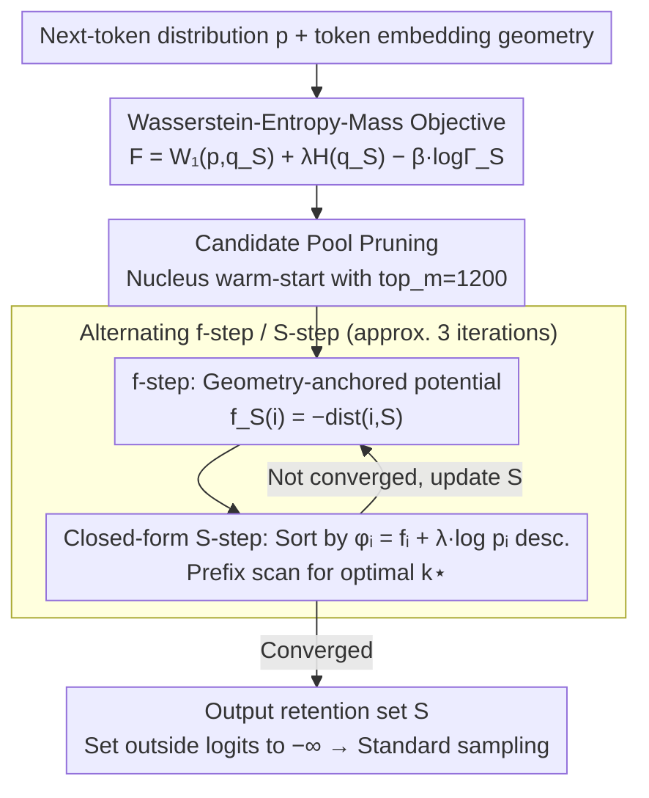

# Top-W: Geometry-Aware Decoding with Wasserstein-Regularized Truncation and Mass Penalties for LLMs

**Conference**: ICML 2026  
**arXiv**: [2602.10346](https://arxiv.org/abs/2602.10346)  
**Code**: https://github.com/arashgholami/top-w-decoding (Available)  
**Area**: LLM Decoding / Evaluation / Runtime Control  
**Keywords**: Truncated Decoding, Wasserstein Distance, Token Embedding Geometry, Entropy Constraint, High-Temperature Robustness

## TL;DR
Top-W formulates next-token truncation as a minimization problem of "Wasserstein-Entropy-Mass" that incorporates token embedding geometry. It theoretically proves that the optimal solution is either a single token or a prefix sorted by $f(i)+\lambda\log p_i$. The engineering implementation entails an $O(n\log n)$ scan. It outperforms baselines in the majority of 15 (T, model) combinations across GSM8K, GPQA, AlpacaEval, and MT-Bench; notably, it yields a Gain of up to 33.7% over Top-H on GSM8K under high temperatures.

## Background & Motivation

**Background**: Truncated sampling for LLM decoding has long been a core infrastructure component—Top-$k$, Top-$p$ (nucleus), Min-$p$, and locally typical sampling all prune low-probability tails from a "probability ranking" perspective. Recently, Top-$H$ explicitly introduced "constraining the entropy of the truncated sub-distribution below a threshold," representing the first wave of work from a "distribution shaping" perspective.

**Limitations of Prior Work**: All existing rules treat tokens as structureless categories—they only consider probabilities and ignore the semantic distances between tokens in the embedding space. This leads to two issues: (i) at high temperatures ($T\geq 1.5$), Top-$p$ / Min-$p$ frequently expand to almost the entire vocabulary, leading to output collapse; (ii) even with entropy control (Top-$H$), probability may concentrate on synonymous/nearby tokens, resulting in "pseudo-diversity" while losing genuine creativity.

**Key Challenge**: Decoders must balance (i) faithfulness (not straying too far from the original distribution), (ii) creativity (sufficient diversity), and (iii) coherence (retaining enough mass). The first two essentially require measurement within the token geometric space, yet all existing samplers skip geometric information.

**Goal**: To "explicitly" integrate token embedding geometry into the truncation objective, providing a geometry-aware sampler that has a theoretical closed-form solution, can be deployed via the logits-processor interface, and is robust to temperature.

**Key Insight**: The authors view truncation through the lens of Optimal Transport (OT)—viewing "truncation + renormalization" as transporting the original distribution $p$ to a distribution $q_S$ supported on $S$. This naturally introduces the Wasserstein-$1$ distance $W_1(p,q_S)$ as a faithfulness term, where $W_1$ uses the Mahalanobis distance on token embeddings as the ground cost.

**Core Idea**: Define the optimal truncation set by optimizing the objective "$W_1$ (Geometry) + $\lambda H(q_S)$ (Creativity) − $\beta\log\Gamma_S$ (Quality)," and prove that this problem has structural solutions of "prefix / single token."

## Method

### Overall Architecture
Top-W is an inference-time truncated sampler: for each token generated, instead of pruning the tail based solely on probability (like Top-$k$/Top-$p$), it formulates "which candidate tokens to keep" as an optimization problem involving token embedding geometry. After solving for the optimal retention set $S$, it sets the logits outside the set to $-\infty$ and proceeds with standard sampling. The workflow is: given the next-token distribution $p\in\Delta^{|V|}$ and token embedding geometry, define the objective $F_{\lambda,\beta}(S)=W_1(p,q_S)+\lambda H(q_S)-\beta\log\Gamma_S$ (Geometric Faithfulness + Creativity + Quality) for a candidate set $S$. Since $W_1$ is intractable to optimize directly over the vocabulary size, the authors replace it using the Kantorovich-Rubinstein dual to distance queries and alternate between updating the potential function $f$ and the retention set $S$, reaching convergence in 3-4 rounds to obtain $S$.

### Key Designs

**1. Wasserstein-Entropy-Mass Objective: Integrating Semantic Geometry into Truncation**

Traditional truncation (Top-$k$/$p$/Min-$p$) treats tokens as structureless categories, looking only at probability rankings. Consequently, "synonym clusters" and "semantic outlier islands" are treated identically—under high temperatures, probability is either piled onto synonymous neighbors (pseudo-diversity) or expanded to the entire vocabulary (collapse). Top-W explicitly adds a geometric term to the truncation objective: $F_{\lambda,\beta}(S)=W_1(p,q_S)+\lambda H(q_S)-\beta\log\Gamma_S$. Here $W_1(p,q_S)$ is the Wasserstein-$1$ distance required to transport $p$ to the truncated renormalized distribution $q_S$ (with Mahalanobis distance on embeddings as ground cost), $H(q_S)$ controls creativity, and $\Gamma_S=\sum_{i\in S}p_i$ is the retained mass. Crucially, the paper proves an exact decomposition $W_1(p,q_S)=(1-\Gamma_S)\,W_1(p(\cdot|S^c),p(\cdot|S))$, decoupling "how much mass was removed" from "how far the removed portion is from the retained set." Thus, a high-probability token far from the retained set is heavily penalized (avoiding the removal of synonymous neighbors in favor of noise), while a low-probability token close to the set may be included in $S$. This geometric faithfulness, rather than pure probabilistic faithfulness, is the source of high-temperature robustness.

**2. Geometry-Anchored Potential + Closed-form S-step: Replacing Intractable OT with Sorting and Scanning**

Solving linear programming for $W_1$ on a vocabulary of size $|V|\sim 10^5$ is unrealistic. The authors use the KR dual $W_1=\sup_{f\in\mathcal{F}}(\mathbb{E}_p[f]-\mathbb{E}_{q_S}[f])$ and fix the potential as the anchored potential $f_S(i)=-\mathrm{dist}(i,S)$. This is the "most attractive" among all anchored 1-Lipschitz functions, effectively assigning more negative scores to tokens further from the current retention set, maximizing aggressiveness while maintaining feasibility. With $f$ fixed, the truncation sub-problem has a closed-form solution: $\arg\min_S F$ is equivalent to $\arg\max_S G_f(S)=\frac{1}{\Gamma_S}\sum_{i\in S}p_i\phi_i(f)+(\beta-\lambda)\log\Gamma_S$, where the hybrid score $\phi_i(f)=f_i+\lambda\log p_i=-\mathrm{dist}(i,S)+\lambda\log p_i$ linearly combines "geometric distance" and "log probability." Theorem 3.4 proves that the optimal $S$ for $G_f$ follows two structures: if $\beta\geq\lambda$, the optimal $S$ must be a **prefix** of tokens sorted by $\phi_i$ in descending order; if $\beta\leq\lambda$, the optimal $S$ reduces to a **single token**. This reduces the $2^{|V|}$ combinatorial search to a 1D prefix scan, making the additional cost of the sampler just one sort and one scan.

**3. Alternating f-step / S-step + Candidate Pool Pruning: Approximating Joint Optimality without Explicitly Solving OT**

The potential $f$ depends on $S$, and $S$ depends on $f$, necessitating alternating iterations. Each loop consists of three steps: (i) compute the potential $f^{(t)}_i=-\mathrm{dist}(i,S^{(t)})$ using the current $S^{(t)}$; (ii) sort by $\phi_i^{(t)}$ and perform a prefix scan on the objective $J_k=\Phi_k/\Gamma_k+(\beta-\lambda)\log\Gamma_k$ to find $k^\star$ for $S^{(t+1)}$; (iii) stop upon convergence (3 rounds are sufficient in practice). To avoid computing Mahalanobis distances over the entire vocabulary, a nucleus warm-start restricts candidates to a pool of top_m$=1200$. The appendix provides sufficient conditions for pruning to remain exact. This results in millisecond-level overhead per token, being only 5.4% slower than Top-$H$/Top-$p$/Min-$p$ on average, ensuring geometric awareness does not kill throughput.

### Loss & Training
Ours is an inference-time method with no training. The only hyperparameters $(\lambda,\beta)$ default to $(2.2,2.8)$. When $\beta>\lambda$, the system enters the prefix interval, where $\beta$ can be adjusted to slide between sharpness (accuracy) ↔ creativity (diversity).

## Key Experimental Results

### Main Results
Testing on 3 LLMs (Qwen2.5-3B, LLaMA-3.1-8B-Inst, Phi-3-Mini) across 5 temperatures $T\in\{0.5,0.7,1.0,1.5,2.0\}$ (15 combinations):

| Benchmark | Top-W Wins | Max Relative Gain vs Top-H | Remarks |
|-----------|-----------:|----------------------:|------|
| GSM8K     | 13/15 | **+33.7%** ($T=2.0$) | Baselines mostly collapse at high T |
| GPQA      | 12/15 | ~1-3 points | Wins on all 3 models at $T\in\{1.5,2.0\}$ |
| AlpacaEval| 12/15 | Stable Judge win rate | Length-controlled win-rate |
| MT-Bench  | 8/15  | Better multi-turn consistency | Prevents drift at high T |

On GSM8K at $T=2.0$: Top-W scores 75.13% / 73.09% / 84.63%, while Top-$p$ drops to 9.10% / 2.65% / 7.73%.

### Ablation Study

| Configuration | GSM8K@T=2.0 (LLaMA) | Description |
|------|--------------------:|------|
| $\beta>\lambda$ (Prefix) | 73.09 | Default setting |
| $\beta\leq\lambda$ (Singleton) | Significant drop | Reduces to single token |
| $\beta$ too large | Creativity ↑ but GSM8K ↓ | Retains too much mass |
| Top-W (Creative rubric $\beta=2.8$) | Wins 27 setups | Higher average than Top-$p$/Top-$H$/Min-$p$ |

### Key Findings
- **Trinity of Geometry, Entropy, and Mass is essential**: Mass alone leads to Top-$k$; Entropy alone leads to Top-$H$; adding Geometry brings a qualitative leap in high-temperature robustness.
- **$\beta$ acts as a "Creativity ↔ Accuracy" regulator**: Rubric evaluations (across Diversity/Originality/Narrative/Emotion/Imagery) show that increasing $\beta$ raises creativity but lowers exact answer scores; it can be tuned per task.
- **Unified Perspective**: The paper proves that under a 0-1 uniform metric, Top-W reduces to Top-$k$ (plus $\lambda=\beta=0$) or Top-$H$ (Lagrangian relaxation with $\beta=0$), incorporating existing samplers into a single framework.
- **Controllable Overhead**: 3 rounds of alternating steps with top_m=1200 costs ~ms per token, only 5.4% slower than Top-$p$.

## Highlights & Insights
- **Discovery of Structural Optimal Solutions**: Theorem 3.4 reduces $2^{|V|}$ combinatorial search to a 1D scan, a general technique reusable for any truncation objective involving "weighted average + concave/convex mass terms."
- **Unifying Truncated Samplers via OT**: Viewing Top-$k$/$p$/$H$ as special cases of the $W_1$+Entropy+Mass framework provides a unified coordinate system for future decoding research.
- **"Whitelist" approach with Anchored Potential**: Using the 1-Lipschitz envelope as a proxy avoids LP solvers and is the key move in engineering OT for deployment. This tactic of using "distance-to-set as potential" is applicable to other OT-on-discrete problems.
- **High-Temperature Robustness as a New Metric**: Prior sampler papers rarely reported results at $T=2.0$; this work systematically demonstrates the anti-collapse capability of geometry-aware truncation, advancing the evaluation paradigm.

## Limitations & Future Work
- $W_1$ uses token embedding Mahalanobis distance as the ground cost, but LLM embeddings may not strictly reflect "semantic distance"—polysemous words or rare tokens could mislead the geometry.
- The candidate pool size top_m=1200 is empirical and might miss distant but reasonable tokens in very large vocabularies (>200k) or code tokens.
- $(\lambda,\beta)$ need to be pre-tuned per task; the paper shows sensitivity but lacks an automated scheme for industrial deployment.
- Experiments focused on instruction-tuned models in QA/Chat; effectiveness on code generation or long-context summarization is yet to be verified.

## Related Work & Insights
- **vs Top-$k$ / nucleus / Min-$p$**: These only consider probability ranking; Top-W adds geometric correction, theoretically including the others as special cases and showing significantly better stability at high temperatures.
- **vs Top-$H$ (bounded-entropy)**: Also from a "distribution shaping" perspective, but Top-$H$ ignores geometry; Top-W uses $W_1$ to treat synonymous neighbors as redundant, avoiding "pseudo-diversity."
- **vs Contrastive decoding / DoLa**: The latter adjust distributions by contrasting different models/layers; Top-W requires no reference model, only the model itself and embedding geometry, ensuring lower overhead.
- **Transferable Insight**: Treating "truncation" as "distribution-to-distribution transport" is a cross-disciplinary idea applicable to constrained generation (COMET-based MT, RAG re-ranking) and safety filtering.

## Rating
- Novelty: ⭐⭐⭐⭐⭐ First to bring token embedding geometry + OT perspective into truncated samplers and prove structural optimality.
- Experimental Thoroughness: ⭐⭐⭐⭐ 60 combinations across 4 benchmarks, 3 models, and 5 temperatures + creative rubric evaluation + overhead analysis; lacks code generation scenarios.
- Writing Quality: ⭐⭐⭐⭐ Clear proofs and complete pseudocode; some symbols ($\phi,c,\beta-\lambda$) are a bit dense.
- Value: ⭐⭐⭐⭐⭐ Training-free, plug-and-play at the decoding side with high-temperature robustness; a deployment-ready improvement.

<!-- RELATED:START -->

## Related Papers

- [\[ICML 2026\] Spherical Steering: Geometry-Aware Activation Rotation for Language Models](spherical_steering_geometry-aware_activation_rotation_for_language_models.md)
- [\[ACL 2026\] Pressure-Testing Deception Probes in LLMs: Scaling, Robustness, and the Geometry of Deceptive Representations](../../ACL2026/llm_evaluation/pressure-testing_deception_probes_in_llms_scaling_robustness_and_the_geometry_of.md)
- [\[ACL 2026\] Contrastive Decoding Mitigates Score Range Bias in LLM-as-a-Judge](../../ACL2026/llm_evaluation/contrastive_decoding_mitigates_score_range_bias_in_llm-as-a-judge.md)
- [\[ICLR 2026\] Unpacking Human Preference for LLMs: Demographically Aware Evaluation with the HUMAINE Framework](../../ICLR2026/llm_evaluation/unpacking_human_preference_for_llms_demographically_aware_evaluation_of_long-fo.md)
- [\[ECCV 2024\] Gradient-Regularized Out-of-Distribution Detection](../../ECCV2024/llm_evaluation/gradient-regularized_out-of-distribution_detection.md)

<!-- RELATED:END -->
