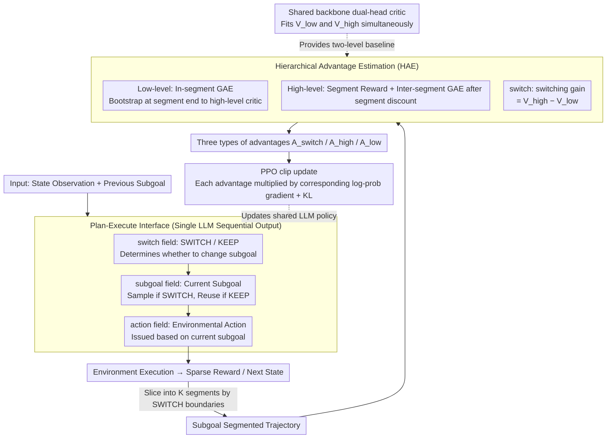

# HiPER: Hierarchical Reinforcement Learning with Explicit Credit Assignment for Large Language Model Agents

**Conference**: ICML 2026  
**arXiv**: [2602.16165](https://arxiv.org/abs/2602.16165)  
**Code**: The paper provides Project Page and Code links (see the original text for specific repository addresses).  
**Area**: Reinforcement Learning / LLM Agent / Hierarchical RL  
**Keywords**: Hierarchical Reinforcement Learning, Plan-Execute, Credit Assignment, Long-horizon Agent, GAE

## TL;DR
HiPER transforms the flat RL used for LLM agents into a two-level Plan-Execute structure consisting of "high-level planning of subgoals + low-level execution of atomic actions." It introduces Hierarchical Advantage Estimation (HAE), which slices GAE along subgoal segments to perform coupled advantage estimation with bounded differences. On ALFWorld and WebShop, HiPER achieves success rates of 97.4% and 83.3% respectively (using Qwen2.5-7B), representing gains of +6.6% and +8.3% over the strongest baseline, GiGPO.

## Background & Motivation
**Background**: Training LLMs as interactive agents currently relies predominantly on on-policy RL (such as PPO, GRPO, RLOO, and GiGPO). These approaches model the policy as a *flat policy*—a single time scale where each turn observes and outputs a sequence of action tokens.

**Limitations of Prior Work**: Flat policies struggle with long-horizon, sparse-reward tasks. A single trajectory may span dozens of turns and tens of thousands of tokens before receiving a sparse success reward. Flat RL must rely on this terminal signal to backpropagate credit to every turn, leading to significant noise in credit assignment, unstable training, and performance far below the ceiling. In ALFWorld tasks that require completing multiple sub-tasks in sequence (e.g., Pick2, Look), PPO, GRPO, and GiGPO show noticeable performance degradation compared to single sub-task scenarios (Pick).

**Key Challenge**: The authors observe that successful trajectories inherently possess a hierarchical structure—actions naturally form segments, with each segment corresponding to a subgoal (e.g., first find the cup, then wash it, then put it in the cabinet). However, flat RL **neither explicitly represents nor explicitly optimizes** this structure. Consequently, subgoal organization remains as an implicit texture within trajectories, causing agents to exhibit brittle behaviors such as "stopping halfway through washing to open a cabinet."

**Goal**: (1) Explicitly manifest this implicit hierarchical structure, allowing the agent to distinguish between "planning" and "execution" decisions at the prompt level; (2) Design a credit assignment mechanism suited for this hierarchical structure to enable effective propagation of sparse rewards across the two levels.

**Key Insight**: The classic options framework in HRL (Sutton 1999) is naturally a two-level semi-MDP consisting of "high-level option selection + low-level execution." However, the Option-Critic lineage was designed for fixed, discrete option sets and cannot be directly applied to the open-vocabulary subgoal scenarios of LLMs. Furthermore, classic HRL typically trains the two levels as **parallel** targets without handling the coupling between them.

**Core Idea**: Use a shared LLM to simultaneously handle three types of decisions: switch, subgoal, and action (automatically conditioned via auto-regression). Then, use a GAE variant (HAE) that **slices along subgoal segments and bootstraps at boundaries** to couple and train the two-level advantages.

## Method

### Overall Architecture
HiPER utilizes a shared LLM as both the "high-level planner" and "low-level executor." At each turn, it first decides whether to switch the subgoal and what the current subgoal should be, and then issues environmental actions based on this. During training, the trajectory is sliced into segments based on "subgoal switch" moments. Advantages are calculated for low-level actions, high-level subgoals, and binary switch decisions, and these three types of advantages are updated together using their respective log-prob gradients. The system is built on two components: a Plan-Execute interface that embeds "hierarchy" into the prompt, and HAE advantage estimation that correctly propagates sparse rewards across levels. The former ensures the structure exists explicitly, while the latter ensures it is effectively optimized.

The formalized policy gradient (Theorem 4.1) combines these three elements:

$$\nabla_\theta J = \mathbb{E}\Big[\sum_t \nabla\log\pi(q_t|s_t,o_{t-1})\,A^{\mathrm{switch}}_t + q_t\,\nabla\log\pi(o_t|s_t)\,A^{\mathrm{high}}_t + \nabla\log\pi(a_t|s_t,o_t)\,A^{\mathrm{low}}_t\Big]$$

Notably, the subgoal term is multiplied by $q_t$ (1 during SWITCH, 0 during KEEP), ensuring that high-level gradients are only backpropagated during turns where a decision to change the subgoal is actually made—this is critical for the Plan-Execute factorization.

### Key Designs

**1. Plan-Execute Interface: Transforming "Hierarchy" from Implicit Texture to Learnable Token Patterns**

The pain point of flat RL is that the segmented structure within successful trajectories (e.g., "find cup, wash cup, store cup") only exists as implicit texture; the agent neither expresses nor optimizes it, leading to frequent failures. HiPER's approach is direct and cost-effective: it reuses the ReAct template and adds two fields, forcing each turn's LLM output into three XML blocks: `<switch>SWITCH/KEEP</switch>`, `<subgoal>...</subgoal>`, and `<action>...</action>`. This allows the agent to decide when to change subgoals, what the subgoal is, and what action to take. Leveraging the LLM's auto-regressive nature, the distributions for switch, subgoal, and action are naturally factorized as $\pi_\theta(q_t|s_t,o_{t-1})\,\pi_\theta(o_t|s_t)\,\pi_\theta(a_t|s_t,o_t)$. During a SWITCH, a new $o_t \sim \pi_\theta(\cdot|s_t)$ is sampled; during KEEP, $o_t = o_{t-1}$. Subgoals and actions are **dynamically determined** throughout, avoiding rigid pre-planned sequences. This allows "open-vocabulary subgoals" to be expressed and optimized by a single LLM, bypassing the limitations of predefined discrete option sets in the options framework, while simultaneously tagging segment boundaries for hierarchical credit assignment **without requiring two separate networks**.

**2. Hierarchical Advantage Estimation: Dual-level GAE + Boundary Bootstrapping for Sliced Reward Propagation**

Explicit structure alone is insufficient—ablations show that applying a Plan-Execute prompt to GRPO yields almost no gain, indicating that hierarchy must be paired with hierarchical credit assignment to realize its benefits. HAE is designed for this purpose. It slices the trajectory into $K$ segments at SWITCH boundaries $0=b_0<b_1<\dots<b_K=T$ and calculates three advantages simultaneously. At the low level, it performs GAE within each segment $[b_k,b_{k+1}-1]$, with TD error $\delta^{\mathrm{low}}_t = r_t + \gamma V^{\mathrm{next}}_t - V^{\mathrm{low}}(s_t,o_k)$. The key trick occurs at the segment end: the bootstrap target for the final turn does not link to its own next step, but switches to the high-level critic $V^{\mathrm{next}}_{b_{k+1}-1}=V^{\mathrm{high}}(s_{b_{k+1}})$. This "boundary-aware bootstrapping" serves as the glue that binds the two levels of value into a single signal chain. At the high level, each segment is compressed into a macro-step—segment reward $\tilde r_k=\sum_{t=b_k}^{b_{k+1}-1}\gamma^{t-b_k}r_t$ and segment discount $\tilde\gamma_k=\gamma^{b_{k+1}-b_k}$—and GAE is performed between segments. The switch decision uses a state-level switching gain $\delta^{\mathrm{switch}}_t = V^{\mathrm{high}}(s_t)-V^{\mathrm{low}}(s_t,o_{t-1})$ to measure "how much better switching subgoals is than continuing with $o_{t-1}$," paired with a centralized estimate $\hat A^{\mathrm{switch}}_t = (q_t-\beta_t)\,\delta^{\mathrm{switch}}_t$ to backpropagate an interpretable gradient direction for this rare binary decision. This sliced design achieves three benefits: in-segment GAE prevents fine-grained credit pollution across sub-tasks, boundary bootstrapping (low→high) solves the coupling deficiency in classic option-critic models, and the switching gain prevents degradation of binary policies. The authors also prove that HAE is **unbiased** when $\lambda=1$ and the critic is accurate, and it has **strictly lower variance** than flat GAE when subgoals/boundaries carry extra information beyond the state.

**3. Shared Backbone Dual-head Critic + PPO Clip Update: Two Baselines in Theory, One Extra Head in Practice**

Although HAE theoretically requires two value baselines, $V^{\mathrm{low}}(s,o)$ and $V^{\mathrm{high}}(s)$, HiPER does not use two independent critics. Instead, it uses a shared backbone with two output heads to fit both levels of value simultaneously. The high-level head regresses towards $y^{\mathrm{high}}_k = \tilde r_k + \tilde\gamma_k\,\mathrm{sg}(V^{\mathrm{high}}_\phi(s_{b_{k+1}}))$, and the low-level head towards $y^{\mathrm{low}}_t = r_t + \gamma\,\mathrm{sg}(\hat V^{\mathrm{next}}_t)$, where $\hat V^{\mathrm{next}}$ also switches to $V^{\mathrm{high}}$ at segment ends. This means the low-level critic's training target bootstraps to the high-level critic at boundaries, strictly aligning with the coupling method used in advantage estimation. The actor uses a standard PPO clipped objective, with the three types of advantages multiplied by their respective log-prob gradients, plus KL regularization to control policy drift. Compared to standard PPO, this approach only adds one head, making memory overhead nearly negligible.

### Loss & Training
- Policy: PPO-style clipped surrogate where three types of decisions (switch / subgoal / action) share the same ratio but are multiplied by their respective advantages $A^{\mathrm{switch}}, A^{\mathrm{high}}, A^{\mathrm{low}}$; includes KL regularization.
- Critic: Single backbone dual-head, performing bootstrap MSE for both low and high heads (losses in Eq. 12 and 15).
- Training loop: rollout → HAE calculation → actor/critic loss calculation → PPO update (see Algorithm 1).
- Evaluation: Qwen2.5-1.5B / 7B Instruct, 150 total epochs, aligned with GiGPO.

## Key Experimental Results

### Main Results (Average of 3 seeds on ALFWorld 6 Task Categories + WebShop)

| Model / Method | ALFWorld All ↑ | WebShop Score ↑ | WebShop Succ. ↑ |
|---|---|---|---|
| Qwen2.5-1.5B Base | 8.3 | 25.1 | 5.5 |
| 1.5B +PPO | 68.2 | 73.8 | 51.5 |
| 1.5B +GRPO | 71.1 | 75.8 | 56.8 |
| 1.5B +GiGPO (Prev. SOTA) | 86.7 | 83.5 | 67.4 |
| **1.5B +HiPER** | **95.3** (+8.6) | **85.7** (+2.2) | **71.4** (+4.0) |
| Qwen2.5-7B Base | 14.1 | 46.2 | 19.5 |
| 7B +PPO | 82.8 | 81.4 | 68.7 |
| 7B +GRPO | 85.4 | 79.3 | 66.1 |
| 7B +GiGPO (Prev. SOTA) | 90.8 | 86.2 | 75.2 |
| **7B +HiPER** | **97.4** (+6.6) | **92.2** (+6.0) | **83.3** (+8.1) |

Breakdown of ALFWorld sub-categories is particularly telling: on the most difficult tasks requiring sequential sub-tasks, 7B HiPER reaches 95.5 for Pick2 (GiGPO 79.2), 84.8 for Look (GiGPO 82.7), and 100.0 for Cool (GiGPO 89.3)—HiPER sees the largest gains where flat baselines fail most significantly.

### Ablation Study: Contribution of Plan-Execute Prompt vs. HAE? (ALFWorld, Qwen2.5-1.5B)

| Configuration | ALFWorld All | Explanation |
|---|---|---|
| Base Model (ReAct) | 8.3 | Flat prompt starting point |
| PPO (ReAct) | 68.2 | Flat baseline |
| GRPO (ReAct) | 71.1 | Flat baseline |
| GiGPO (ReAct) | 86.7 | Strongest flat baseline |
| Base Model (Plan-Execute prompt) | 2.9 | Applying PE template zero-shot actually performs worse |
| PPO + Plan-Execute prompt | 81.3 (+13.1) | PE prompt alone gives PPO a significant boost |
| GRPO + Plan-Execute prompt | 69.8 (−1.3) | PE prompt provides almost no gain for GRPO |
| GiGPO + Plan-Execute prompt | ~92 (partial classes) | Still falls short of full HiPER |
| **HiPER (PE + HAE)** | **95.3** | Full method |

### Key Findings
- **PE prompt is useful alone, but insufficient**: Switching PPO to a PE prompt yields a 13-point gain, indicating that explicit subgoal fields help LLMs organize behavior. However, it had almost no effect on GRPO, proving that hierarchical structures must be paired with hierarchical credit assignment to fully unlock their benefits—this justifies HAE.
- **2.5–2.8× acceleration in sample efficiency**: On the 7B model, PPO/GRPO require 140 steps to reach 80% success, while HiPER reaches it in 50 steps. Training variance is also significantly lower than the critic-free GRPO, showing that HAE's variance reduction is not just theoretical.
- **Larger gains on longer tasks**: HiPER's improvements are concentrated in categories like Pick2 and Look which require multiple sub-tasks, validating the design motivation that explicit hierarchy serves long-horizon tasks.
- **Interpretable subgoal behavior**: Training follows a two-stage curve—starting with high-frequency exploratory switches and moving toward stable commitment. The agent spontaneously learns reasonable segmentation without any subgoal supervision, avoiding the pitfalls of "switching every step" or "never switching."

## Highlights & Insights
- **Elegant single-LLM hierarchical policy trick**: Using the prompt sequence `<switch>→<subgoal>→<action>` allows the auto-regressive process to naturally implement $q_t \to o_t \to a_t$ factorization. This eliminates the need for the dual independent controllers required by the Option-Critic lineage, transforming an LLM into an HRL agent at almost zero engineering cost. This approach is transferable to any system requiring "meta-decision + specific action" (e.g., router/executor in tool-use, planner/coder in code agents).
- **Boundary-aware bootstrap is the essence of HAE**: Having the low-level critic bootstrap to the **high-level** $V^{\mathrm{high}}(s_{b_{k+1}})$ at segment ends is a powerful one-line code change that forces two levels of value into a single signal chain. This solves the "independent training" pain point of classic HRL and provides a general paradigm for hierarchical TD learning.
- **Geometric Switching Gain**: $\delta^{\mathrm{switch}} = V^{\mathrm{high}}(s) - V^{\mathrm{low}}(s,o_{t-1})$ converts the "to switch or not to switch" problem into a difference between two values. Combined with $(q_t-\beta_t)$ centralization, the binary decision receives a proper policy gradient, avoiding the typical degradation of binary policies driven directly by advantages.

## Limitations & Future Work
- Subgoals are entirely free-text; their length, granularity, and validity rely on the LLM's learning without explicit constraints. Additional structural constraints or subgoal vocabularies might be needed for tasks with huge or vague subgoal spaces.
- Experiments are limited to ALFWorld and WebShop, which are relatively structured text environments. Validation on truly complex browser/IDE/OS agents (e.g., OSWorld, SWE-bench) is still needed, where horizons are longer and rewards sparser.
- While the shared backbone dual-head critic saves memory, it might lead to inconsistent scales or convergence speeds between heads; loss weighting strategies were not discussed and may require tuning.
- Comparison with "explicit planner + executor dual-model" setups (e.g., multi-agent or distilled small models) remains an open question for HRL.

## Related Work & Insights
- **vs Option-Critic / PPOC / DAC / h-DQN**: Classic HRL assumes a fixed discrete option set; HiPER uses open-vocabulary subgoals and explicitly couples credit across segments via HAE, whereas classic HRL often trains levels independently. HiPER "prompts" the hierarchy rather than using separate controllers.
- **vs GiGPO (Strongest Flat Baseline)**: GiGPO calculates step-level relative advantages through state-wise grouping but remains fundamentally flat. HiPER splits structures at the architectural level, allowing credit to propagate via sliced segments, which is more stable for long-horizon tasks.
- **vs PPO / GRPO / RLOO**: These are single-time-scale flat RL methods. HiPER is their hierarchical upgrade. PPO/GRPO can directly adopt the Plan-Execute prompt, though the marginal cost to upgrade to full HiPER is low.
- **Inspiration**: Any scenario where "high-level decisions are slow while low-level actions are fast" (e.g., tool selection vs. parameter filling, strategy vs. coding, topic switching vs. specific replies) can benefit from this prompt factorization + HAE segment slicing paradigm.

## Rating
- Novelty: ⭐⭐⭐⭐ The core concept (HRL options for LLM agents) is known, but the single-LLM factorization and boundary-aware HAE implementation are elegant and distinctive.
- Experimental Thoroughness: ⭐⭐⭐⭐ Covering two standard agent benchmarks, two model sizes (1.5B/7B), horizontal comparisons with four RL baselines, ablations, and behavior analysis creates a complete chain of evidence.
- Writing Quality: ⭐⭐⭐⭐ Clear logic from motivation to theory and experiments. Theorem 4.1 cleanly decomposes the policy gradient, and HAE formulas are provided stepwise.
- Value: ⭐⭐⭐⭐⭐ Achieves SOTA on long-horizon sparse reward tasks with a significant margin. The method is engineering-friendly (single LLM, single critic) and can be easily integrated into existing RL training stacks.

<!-- RELATED:START -->

## Related Papers

- [\[ICML 2026\] Beyond Trajectory-Level Attribution: Graph-Based Credit Assignment for Agentic Reinforcement Learning](beyond_trajectory-level_attribution_graph-based_credit_assignment_for_agentic_re.md)
- [\[ICML 2026\] Agent World Model: Infinity Synthetic Environments for Agentic Reinforcement Learning](agent_world_model_infinity_synthetic_environments_for_agentic_reinforcement_lear.md)
- [\[ICML 2026\] Multi$^2$: Hierarchical Multi-Agent Decision-Making with LLM-Based Agents in Interactive Environments](multi2_hierarchical_multi-agent_decision-making_with_llm-based_agents_in_interac.md)
- [\[ICML 2026\] BESPOKE: Benchmark for Search-Augmented Large Language Model Personalization via Diagnostic Feedback](bespoke_benchmark_for_search-augmented_large_language_model_personalization_via_.md)
- [\[ICML 2026\] Toward Training Superintelligent Software Agents through Self-Play SWE-RL](toward_training_superintelligent_software_agents_through_self-play_swe-rl.md)

<!-- RELATED:END -->
