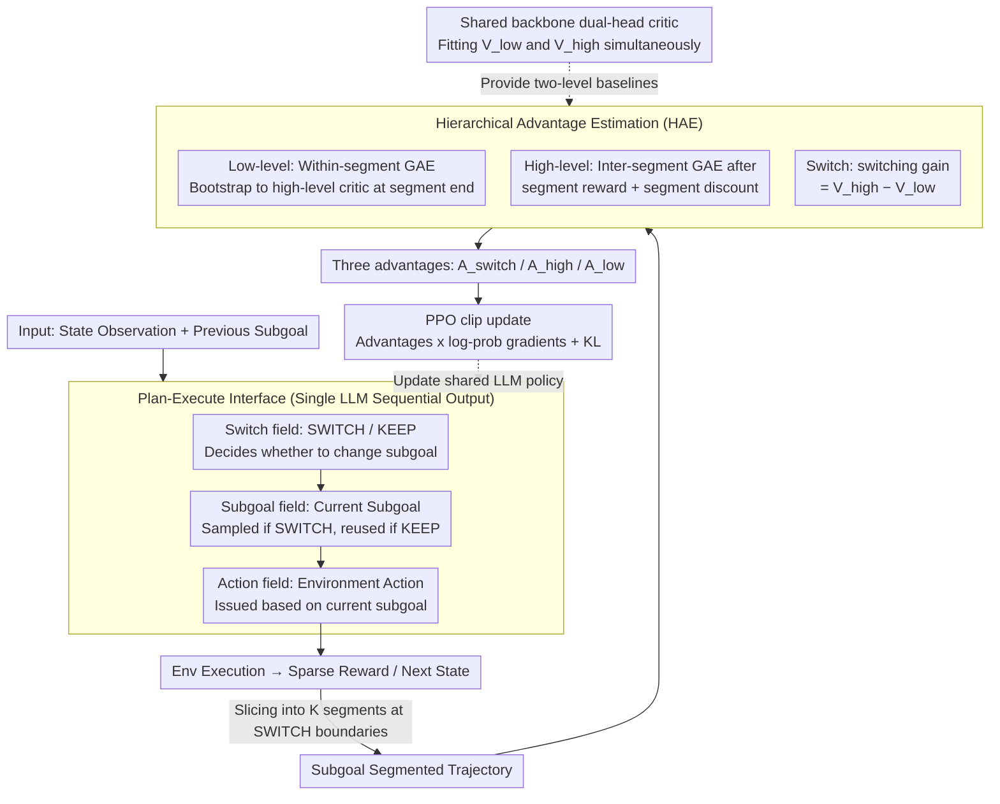

# HiPER: Hierarchical Reinforcement Learning with Explicit Credit Assignment for Large Language Model Agents

**Conference**: ICML 2026  
**arXiv**: [2602.16165](https://arxiv.org/abs/2602.16165)  
**Code**: The paper provides Project Page and Code links (see the original text for specific repository addresses)  
**Area**: Reinforcement Learning / LLM Agent / Hierarchical RL  
**Keywords**: Hierarchical Reinforcement Learning, Plan-Execute, Credit Assignment, Long-horizon Agent, GAE

## TL;DR
HiPER transforms the flat RL of LLM agents into a two-level Plan-Execute structure consisting of "high-level planning subgoals + low-level executing atomic actions." It proposes Hierarchical Advantage Estimation (HAE), which slices GAE along subgoal segments to perform advantage estimation with bounded differential coupling. It achieves 97.4% and 83.3% success rates on ALFWorld and WebShop, respectively (Qwen2.5-7B), representing gains of +6.6% and +8.3% over the strongest baseline, GiGPO.

## Background & Motivation
**Background**: Training LLMs into interactive agents currently relies on mainstream on-policy RL (such as PPO, GRPO, RLOO, and GiGPO). Policies are typically modeled as a *flat policy*—a single time scale where each turn observes the environment and outputs an action token sequence.

**Limitations of Prior Work**: Flat policies are disadvantaged in long-horizon, sparse-reward tasks. A trajectory may span dozens of turns or tens of thousands of tokens before receiving a sparse success reward. Flat RL must rely on this terminal signal to backpropagate and assign credit to each turn, resulting in high credit assignment noise, unstable training, and performance far below the ceiling. On tasks like Pick2 or Look in ALFWorld, which require sequential completion of multiple subtasks, PPO/GRPO/GiGPO show significant performance drops compared to single-subtask tasks (Pick).

**Key Challenge**: The authors observe that successful trajectories actually contain an **implicit** hierarchical structure—actions are naturally segmented, with each segment corresponding to a subgoal (e.g., find a cup, then wash the cup, then put it in the cabinet). However, flat RL **neither explicitly expresses nor explicitly optimizes** this structure. Consequently, subgoal organization remains as an implicit texture of the trajectory, leading to brittle agent behaviors such as "starting to open the cabinet before finishing washing."

**Goal**: (1) Explicitly manifest this implicit hierarchical structure, allowing the agent to differentiate between "planning" and "execution" decisions at the prompt level; (2) Design a credit assignment mechanism compatible with this hierarchical structure to enable effective propagation of sparse rewards across both levels.

**Key Insight**: The classic HRL options framework (Sutton 1999) naturally provides a two-level semi-MDP of "high-level option selection + low-level execution." However, the Option-Critic lineage was designed for fixed discrete option sets and cannot be directly applied to open-vocabulary subgoal scenarios in LLMs. Furthermore, classic HRL typically trains the two levels as **parallel** sets of targets, without handling the coupling between them.

**Core Idea**: Let a single shared LLM simultaneously handle three types of decisions: switch, subgoal, and action (via automatic conditional auto-regression). Then, use a GAE variant (HAE) that **slices along subgoal segments and performs bootstrapping at boundaries** to couple and train the two-level advantages.

## Method
### Overall Architecture
HiPER utilizes a shared LLM as both the "high-level planner" and "low-level executor." At each turn, it first decides whether to switch the subgoal and what the current subgoal is, then issues an environmental action based on this. During training, the trajectory is sliced into several segments based on "subgoal switch" timestamps. Advantages are calculated respectively for low-level actions, high-level subgoals, and binary switch decisions. These three types of advantages are multiplied by their corresponding log-prob gradients for a joint update. This system consists of two components: a Plan-Execute interface that incorporates "hierarchy" into the prompt, and HAE advantage estimation that correctly propagates "sparse rewards across two levels." The former ensures the structure exists explicitly, while the latter ensures it is effectively optimized.

Formalized policy gradients (Theorem 4.1) express these three components in a single line:

$$\nabla_\theta J = \mathbb{E}\Big[\sum_t \nabla\log\pi(q_t|s_t,o_{t-1})\,A^{\mathrm{switch}}_t + q_t\,\nabla\log\pi(o_t|s_t)\,A^{\mathrm{high}}_t + \nabla\log\pi(a_t|s_t,o_t)\,A^{\mathrm{low}}_t\Big]$$

Note that the subgoal term is multiplied by $q_t$ (1 during SWITCH, 0 during KEEP), ensuring that high-level gradients are only backpropagated during turns where a "decision to switch subgoal" is made. This is critical for the Plan-Execute factorization.

### Key Designs

**1. Plan-Execute Interface: Transforming "Hierarchy" from Implicit Texture to a Learnable Token Pattern**

The pain point of flat RL is that the segmented structure (e.g., "find cup, wash cup, put in cabinet") only exists in the implicit texture of successful trajectories; the agent neither expresses nor optimizes it, leading to frequent failures. HiPER's approach is direct and cost-effective: it reuses the ReAct template but adds two fields, forcing the output of a single LLM at each turn into three XML blocks: `<switch>SWITCH/KEEP</switch>` + `<subgoal>...</subgoal>` + `<action>...</action>`. This allows the agent to decide when to switch subgoals, what the current subgoal is, and what action to take. Leveraging the LLM's auto-regressive nature, the switch, subgoal, and action distributions are naturally factorized as $\pi_\theta(q_t|s_t,o_{t-1})\,\pi_\theta(o_t|s_t)\,\pi_\theta(a_t|s_t,o_t)$. During SWITCH, $o_t \sim \pi_\theta(\cdot|s_t)$ is sampled; during KEEP, $o_t = o_{t-1}$ is assigned. Subgoals and actions are **dynamically determined** throughout, avoiding the rigid execution of a pre-planned sequence. Consequently, "open-vocabulary subgoals" can be expressed and optimized by a single LLM, bypassing the limitation of pre-defining discrete option sets in the options framework while simultaneously marking segment boundaries for the subsequent hierarchical credit assignment **without requiring two separate networks**.

**2. Hierarchical Advantage Estimation: Two-level GAE + Boundary Bootstrapping for Sliced Propagation of Sparse Rewards**

Hierarchical structure alone is insufficient—ablations show that applying a Plan-Execute prompt to GRPO provides almost no gain, indicating that hierarchy must be paired with hierarchical credit assignment to release its benefits. This is the purpose of HAE. It slices trajectories at SWITCH boundaries $0=b_0<b_1<\dots<b_K=T$ and calculates three advantages simultaneously. The low level performs GAE within each segment $[b_k,b_{k+1}-1]$, where the TD residual is $\delta^{\mathrm{low}}_t = r_t + \gamma V^{\mathrm{next}}_t - V^{\mathrm{low}}(s_t,o_k)$. The key trick is at the segment end—the bootstrap target for the final turn does not link to its own next step but switches to the high-level critic $V^{\mathrm{next}}_{b_{k+1}-1}=V^{\mathrm{high}}(s_{b_{k+1}})$. This "boundary-aware bootstrapping" acts as the glue that bonds the two-level values into a single signal chain. The high level compresses each segment into a macro-step—with segment reward $\tilde r_k=\sum_{t=b_k}^{b_{k+1}-1}\gamma^{t-b_k}r_t$ and segment discount $\tilde\gamma_k=\gamma^{b_{k+1}-b_k}$—and performs inter-segment GAE. The switch decision uses a state-level switching gain $\delta^{\mathrm{switch}}_t = V^{\mathrm{high}}(s_t)-V^{\mathrm{low}}(s_t,o_{t-1})$ to measure "how much better switching subgoals is compared to continuing with $o_{t-1}$," combined with a centralized estimate $\hat A^{\mathrm{switch}}_t = (q_t-\beta_t)\,\delta^{\mathrm{switch}}_t$ to provide an interpretable gradient direction for this rare binary decision. This slicing design achieves three benefits: within-segment GAE prevents fine-grained credit from contaminating other subtasks; boundary low→high bootstrapping solves the lack of coupling in classic option-critic training; and switching gain directly uses the difference between two critics as the advantage to prevent binary policy degradation. The authors also prove that HAE is **unbiased** when $\lambda=1$ and the critic is accurate, and it has **strictly lower variance** than flat GAE when subgoals/boundaries carry extra information beyond the state.

**3. Shared Backbone Dual-head Critic + PPO Clip Update: Two Baselines in Theory, One Extra Head in Practice**

HAE conceptually requires two value baselines, $V^{\mathrm{low}}(s,o)$ and $V^{\mathrm{high}}(s)$. However, HiPER does not instantiate two independent critics. Instead, it uses a shared backbone with two output heads to fit both levels of value simultaneously. The high-level head regresses towards $y^{\mathrm{high}}_k = \tilde r_k + \tilde\gamma_k\,\mathrm{sg}(V^{\mathrm{high}}_\phi(s_{b_{k+1}}))$ while the low-level head regresses towards $y^{\mathrm{low}}_t = r_t + \gamma\,\mathrm{sg}(\hat V^{\mathrm{next}}_t)$ via MSE. Similar to the advantage estimation, the low-level critic's training target switches to $V^{\mathrm{high}}$ at the segment boundary, ensuring the two-level values are consistent and not contradictory. The actor follows a standard PPO clip objective, where the three advantages are multiplied by their respective log-prob gradients, with KL regularization added to control policy drift. Compared to standard PPO, this approach only adds one extra head, making the memory overhead negligible.

### Loss & Training
- Policy: PPO-style clipped surrogate where three types of decisions (switch / subgoal / action) share the same ratio but are multiplied by their respective advantages $A^{\mathrm{switch}}, A^{\mathrm{high}}, A^{\mathrm{low}}$, including KL regularization.
- Critic: Single backbone with dual heads, using bootstrap MSE for both low and high heads (losses as seen in equations 12 and 15).
- Training Loop: rollout → calculate HAE → calculate actor/critic loss → PPO update (see Algorithm 1).
- Evaluation: Qwen2.5-1.5B / 7B Instruct, 150 total epochs, aligned with GiGPO.

## Key Experimental Results

### Main Results (Average of 3 seeds for 6 ALFWorld categories + WebShop)

| Model / Method | ALFWorld All ↑ | WebShop Score ↑ | WebShop Succ. ↑ |
|---|---|---|---|
| Qwen2.5-1.5B Base | 8.3 | 25.1 | 5.5 |
| 1.5B +PPO | 68.2 | 73.8 | 51.5 |
| 1.5B +GRPO | 71.1 | 75.8 | 56.8 |
| 1.5B +GiGPO (Prev. SOTA) | 86.7 | 83.5 | 67.4 |
| **1.5B +HiPER (Ours)** | **95.3** (+8.6) | **85.7** (+2.2) | **71.4** (+4.0) |
| Qwen2.5-7B Base | 14.1 | 46.2 | 19.5 |
| 7B +PPO | 82.8 | 81.4 | 68.7 |
| 7B +GRPO | 85.4 | 79.3 | 66.1 |
| 7B +GiGPO (Prev. SOTA) | 90.8 | 86.2 | 75.2 |
| **7B +HiPER (Ours)** | **97.4** (+6.6) | **92.2** (+6.0) | **83.3** (+8.1) |

Notably, in ALFWorld sub-category analysis: on the most difficult tasks requiring sequential subtasks like Pick2, 7B HiPER reaches 95.5 (GiGPO 79.2), Look 84.8 (GiGPO 82.7), and Cool 100.0 (GiGPO 89.3)—HiPER offers the largest gains in categories where flat baselines drop the most.

### Ablation Study: Contribution of Plan-Execute Prompt vs. HAE (ALFWorld, Qwen2.5-1.5B)

| Config | ALFWorld All | Description |
|---|---|---|
| Base Model (ReAct) | 8.3 | Flat prompt starting point |
| PPO (ReAct) | 68.2 | Flat baseline |
| GRPO (ReAct) | 71.1 | Flat baseline |
| GiGPO (ReAct) | 86.7 | Strongest flat baseline |
| Base Model (Plan-Execute prompt) | 2.9 | Zero-shot PE template performs worse |
| PPO + Plan-Execute prompt | 81.3 (+13.1) | PE prompt alone gives PPO a large boost |
| GRPO + Plan-Execute prompt | 69.8 (−1.3) | PE prompt provides nearly no benefit to GRPO |
| GiGPO + Plan-Execute prompt | ~92 (select categories) | Still falls short of full HiPER |
| **HiPER (PE + HAE)** | **95.3** | Full method |

### Key Findings
- **PE prompt helps alone, but is not enough**: Adding the PE prompt to PPO results in a 13-point gain, showing that explicit subgoal fields help LLMs organize behavior. However, it is almost useless for GRPO—proving that hierarchical structure must be paired with hierarchical credit assignment to release its full potential, justifying the existence of HAE.
- **2.5–2.8× speedup in sample efficiency**: On the 7B model, PPO/GRPO require 140 steps to reach 80% success, while HiPER exceeds 80% in only 50 steps. Training fluctuations are significantly lower than critic-free GRPO, indicating that the variance reduction of HAE is not just theoretical.
- **Larger gains on longer tasks**: HiPER’s improvements are concentrated in categories like Pick2 / Look that require concatenating multiple subtasks, validating the motivation of using explicit hierarchy for long-horizon tasks.
- **Interpretable subgoal behavior**: The training process reveals a two-stage curve: high-frequency exploratory switching followed by stable commitment. The agent spontaneously learns reasonable segmentation without any subgoal supervision, avoiding degradation into "switching every step" or "never switching."

## Highlights & Insights
- **Shared LLM for two-level policy iteration**: By using the prompt sequence `<switch>→<subgoal>→<action>`, the auto-regressive property naturally implements the conditional factorization of $q_t \to o_t \to a_t$. This eliminates the need for two independent controllers required by the Option-Critic lineage, enabling the transformation of an LLM into an HRL agent at almost zero engineering cost. This approach is transferable to any LLM system requiring "meta-decision + specific action" (such as router/executor in tool-use or planner/coder in code agents).
- **Boundary-aware bootstrap as the essence of HAE**: Having the low-level critic bootstrap to the **high-level** $V^{\mathrm{high}}(s_{b_{k+1}})$ at a segment end is a key one-line code change that forces the two-level values into a single signal chain. This effectively addresses the "independent training of levels" issue in classic HRL. This coupling pattern, where the low level "consumes" the high level's value at boundaries, is an insightful general paradigm for hierarchical TD.
- **Geometric sense of switching gain**: $\delta^{\mathrm{switch}} = V^{\mathrm{high}}(s) - V^{\mathrm{low}}(s,o_{t-1})$ directly converts the "to switch or not to switch" problem into a difference between two values. Combined with $(q_t-\beta_t)$ centralization, the binary decision receives a standard policy gradient, preventing the common degradation when driving binary policies with raw advantages.

## Limitations & Future Work
- Subgoals are entirely free-text; their length, granularity, and validity rely on the LLM's own learning without explicit constraints. Additional structural constraints or subgoal vocabularies might be needed for tasks with vast or vague subgoal spaces (e.g., open-world, long-range dialogue).
- Experiments only covered ALFWorld + WebShop, which are relatively structured text environments. The variance reduction effects of HAE have yet to be verified in truly complex browser/IDE/OS-level agent tasks (like OSWorld or SWE-bench) which have longer horizons and sparser rewards.
- Sharing a critic backbone with dual heads saves memory but risks scale or convergence speed inconsistencies between the two value levels. The paper does not discuss loss weighting strategies for the heads, which might be a hyperparameter for reproduction.
- No comparison was made with "explicit planner + executor dual-model" setups (e.g., multi-agent or distilled small models as executors). Whether a single LLM or dual LLM is superior in an HRL setting remains an open question.

## Related Work & Insights
- **vs. Option-Critic / PPOC / DAC / h-DQN**: Classic HRL assumes fixed discrete option sets; HiPER uses open-vocabulary subgoals and explicitly couples two-level credit across segments via HAE, whereas classic HRL often trains levels independently. HiPER adapts options by replacing "option learning" with "prompt templates + text subgoals."
- **vs. GiGPO (Strongest Flat Baseline)**: GiGPO calculates step-level relative advantages for flat token policies via state-wise grouping, making it essentially a flat RL approach. HiPER decouples into two levels at the structural layer, propagating credit via sliced segments, which is more stable for long-horizon tasks.
- **vs. PPO / GRPO / RLOO**: These are single-timescale flat RL methods. HiPER is their hierarchical upgrade. PPO/GRPO can directly adopt the Plan-Execute prompt (as seen in the 13-point gain for PPO+PE in the ablation), suggesting that the marginal cost of upgrading a flat baseline to HiPER is low.
- **Insight**: This paradigm of prompt factorization + segment-sliced HAE can be applied to any LLM agent scenario where "high-level decisions are slow and low-level actions are fast" (e.g., tool selection vs. parameter filling, strategy vs. coding, topic switching vs. specific replies).

## Rating
- Novelty: ⭐⭐⭐⭐ While HRL options for LLM agents isn't a brand-new concept, the specific implementation of single-LLM factorization + boundary-aware HAE is elegant and constitutes a distinct contribution.
- Experimental Thoroughness: ⭐⭐⭐⭐ Includes two standard agent benchmarks + two model sizes (1.5B/7B) + comparisons against four types of RL baselines + PE-only ablation + training curves + switching behavior analysis.
- Writing Quality: ⭐⭐⭐⭐ Clearly logical from motivation to framework, theory, experiments, and ablations. Theorem 4.1 cleanly decomposes the policy gradient, and HAE formulas are presented step-by-step.
- Value: ⭐⭐⭐⭐⭐ Achieves SOTA with a significant lead on the difficult problem of long-horizon sparse rewards for LLM agents. The method is engineering-friendly (single LLM, single critic) and almost directly applicable to existing RL training stacks.

<!-- RELATED:START -->

## Related Papers

- [\[ICML 2026\] Beyond Trajectory-Level Attribution: Graph-Based Credit Assignment for Agentic Reinforcement Learning](beyond_trajectory-level_attribution_graph-based_credit_assignment_for_agentic_re.md)
- [\[ICML 2026\] Agent World Model: Infinity Synthetic Environments for Agentic Reinforcement Learning](agent_world_model_infinity_synthetic_environments_for_agentic_reinforcement_lear.md)
- [\[ICML 2026\] Multi$^2$: Hierarchical Multi-Agent Decision-Making with LLM-Based Agents in Interactive Environments](multi2_hierarchical_multi-agent_decision-making_with_llm-based_agents_in_interac.md)
- [\[ICML 2026\] BESPOKE: Benchmark for Search-Augmented Large Language Model Personalization via Diagnostic Feedback](bespoke_benchmark_for_search-augmented_large_language_model_personalization_via_.md)
- [\[ICML 2026\] Toward Training Superintelligent Software Agents through Self-Play SWE-RL](toward_training_superintelligent_software_agents_through_self-play_swe-rl.md)

<!-- RELATED:END -->
