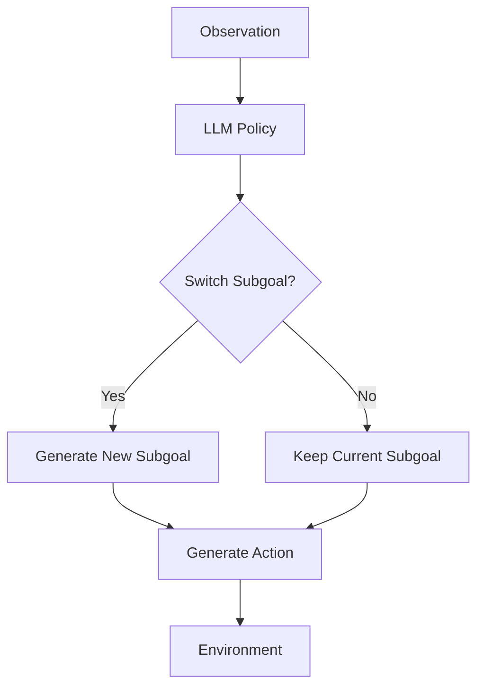

# HiPER: Hierarchical Reinforcement Learning with Explicit Credit Assignment for Large Language Model Agents

**Conference**: ICML 2026  
**arXiv**: [2602.16165](https://arxiv.org/abs/2602.16165)  
**Code**: Project Page and Code links provided in the paper (see the original version for specific repository addresses)  
**Area**: Reinforcement Learning / LLM Agent / Hierarchical RL  
**Keywords**: Hierarchical Reinforcement Learning, Plan-Execute, Credit Assignment, Long-horizon Agent, GAE

## TL;DR
HiPER transforms the flat RL of LLM agents into a two-level Plan-Execute structure consisting of "high-level planning subgoals + low-level executing atomic actions." It proposes Hierarchical Advantage Estimation (HAE) to slice GAE along subgoal segments for bounded difference coupled advantage estimation. It achieves success rates of 97.4% and 83.3% on ALFWorld and WebShop respectively (using Qwen2.5-7B), representing improvements of +6.6% and +8.3% over the strongest baseline, GiGPO.

## Background & Motivation
**Background**: Mainstream methods for training LLMs as interactive agents utilize on-policy RL (e.g., PPO, GRPO, RLOO, GiGPO), where policies are modeled as a *flat policy*—a single time-scale sequence where each turn predicts an action token sequence based on observations.

**Limitations of Prior Work**: Flat policies suffer in long-horizon, sparse-reward tasks. A trajectory may span dozens of turns and thousands of tokens before reaching a sparse success reward. Flat RL must rely on this terminal signal to backpropagate credit for every turn, leading to high credit assignment noise, unstable training, and sub-optimal performance. In ALFWorld tasks requiring sequential subtask completion (e.g., Pick2, Look), PPO/GRPO/GiGPO performance drops significantly compared to single subtasks (Pick).

**Key Challenge**: Successful trajectories contain an **implicit** hierarchical structure where actions are naturally segmented into subgoals (e.g., find cup, wash cup, place in cabinet). However, flat RL **neither explicitly expresses nor explicitly optimizes** this structure. Subgoal organization remains an implicit part of the trajectory, leading to brittle agent behaviors such as stopping halfway through a task.

**Goal**: (1) Explicitly formalize this hierarchical structure, allowing agents to distinguish between "planning" and "execution" decisions at the prompt level. (2) Design a credit assignment mechanism suitable for this structure to effectively propagate sparse rewards between the two levels.

**Key Insight**: The options framework (Sutton 1999) in classic HRL naturally provides a two-level semi-MDP. However, the Option-Critic lineage is designed for fixed discrete option sets and cannot be applied directly to open-vocabulary subgoals in LLMs. Furthermore, classic HRL typically trains the two levels as **parallel** targets without handling their coupling.

**Core Idea**: A single shared LLM is used for switch, subgoal, and action decisions via auto-regressive conditioning. A GAE variant (HAE), which **slices along subgoal segments and bootstraps at boundaries**, couples the two-level advantages for training.

## Method
### Overall Architecture
HiPER consists of two components:

1.  **Plan-Execute Interface**: A system prompt template that structures each turn output into three segments: `<switch>SWITCH/KEEP</switch>` + `<subgoal>...</subgoal>` + `<action>...</action>`. SWITCH indicates a subgoal update, and KEEP indicates the reuse of $o_{t-1}$. Due to auto-regressive sequencing, the distributions for switch, subgoal, and action are naturally factorized as $\pi_\theta(q_t|s_t,o_{t-1})\,\pi_\theta(o_t|s_t)\,\pi_\theta(a_t|s_t,o_t)$, **without requiring separate networks**.
2.  **HAE Advantage Estimation + PPO Actor-Critic Update**: Trajectories are sliced into $K$ segments based on SWITCH boundaries $0=b_0<b_1<\dots<b_K=T$. Turn-level GAE is used within segments, segment-level GAE is used across segments, and a binary switching advantage is added. These advantages are then integrated into the Plan-Execute policy gradient (Theorem 4.1).

Formal policy gradient (Theorem 4.1):

$$\nabla_\theta J = \mathbb{E}\left[\sum_t \nabla\log\pi(q_t|s_t,o_{t-1})A^{\mathrm{switch}}_t + q_t\nabla\log\pi(o_t|s_t)A^{\mathrm{high}}_t + \nabla\log\pi(a_t|s_t,o_t)A^{\mathrm{low}}_t\right]$$

The $q_t$ coefficient for the subgoal term ensures high-level gradients only occur during turns where a "decision to switch subgoal" is made, which is key to the Plan-Execute factorization.

### Key Designs

1.  **Plan-Execute Interface (Structuring Hierarchical Token Patterns)**:
    -   **Function**: Uses a prompt template to force the LLM output into switch, subgoal, and action XML blocks. The agent decides when to switch subgoals, what the current subgoal is, and which environment action to take.
    -   **Mechanism**: Builds on the ReAct template with new fields. LLM auto-regressive factorization satisfies the conditional dependency $q_t \to o_t \to a_t$. Subgoals and actions are **dynamically determined** rather than pre-planned rigidly.
    -   **Design Motivation**: Enables "open-vocabulary subgoals" to be expressed by a single LLM, avoiding discrete option set limitations while providing explicit segment boundaries for credit assignment.

2.  **Hierarchical Advantage Estimation (HAE) — Two-level GAE + Boundary Coupling**:
    -   **Function**: Slices trajectories at SWITCH boundaries and calculates distinct advantages for low-level actions, high-level subgoals, and binary switch decisions to update all three synchronously.
    -   **Mechanism**: Low-level GAE is performed within each segment $[b_k,b_{k+1}-1]$, with TD residual $\delta^{\mathrm{low}}_t = r_t + \gamma V^{\mathrm{next}}_t - V^{\mathrm{low}}(s_t,o_k)$. **Key trick**: The bootstrap target for the final turn of a segment is $V^{\mathrm{next}}_{b_{k+1}-1}=V^{\mathrm{high}}(s_{b_{k+1}})$, using the high-level critic to provide a backstop. This boundary-aware bootstrapping couples the levels. High-level GAE is performed between segments treated as macro-steps. The switch advantage measures the switching gain $\delta^{\mathrm{switch}}_t = V^{\mathrm{high}}(s_t)-V^{\mathrm{low}}(s_t,o_{t-1})$ to backpropagate gradients for binary decisions.
    -   **Design Motivation**: Intra-segment GAE prevents credit pollution between subtasks. Boundary bootstrapping connects macro and micro progress, addressing the lack of coupling in classic option-critic methods. Switching gain provides an interpretable gradient for rare binary decisions. The authors prove HAE is **unbiased** and has **strictly lower variance** than flat GAE under specific conditions.

3.  **Shared Backbone Dual-head Critic + PPO Clip Update**:
    -   **Function**: Implements $V^{\mathrm{low}}(s,o)$ and $V^{\mathrm{high}}(s)$ as two output heads on a shared backbone.
    -   **Mechanism**: MSE regression is used for both heads with bootstrap targets for both levels (bootstrapping to the high-level critic at segment ends). Actor updates use standard PPO clipping.
    -   **Design Motivation**: Minimizes memory overhead while ensuring training targets for both levels do not conflict.

### Loss & Training
- Policy: PPO-style clipped surrogate with switch, subgoal, and action decisions sharing a ratio but using distinct advantages ($A^{\mathrm{switch}}, A^{\mathrm{high}}, A^{\mathrm{low}}$); includes KL regularization.
- Critic: Single backbone with dual heads using bootstrap MSE.
- Training Strategy: Rollout → HAE calculation → Actor/Critic loss calculation → PPO update (Algorithm 1).
- Evaluation: Qwen2.5-1.5B / 7B Instruct, 150 epochs total.

## Key Experimental Results

### Main Results

| Model / Method | ALFWorld All ↑ | WebShop Score ↑ | WebShop Succ. ↑ |
|:---|:---|:---|:---|
| Qwen2.5-1.5B Base | 8.3 | 25.1 | 5.5 |
| 1.5B +PPO | 68.2 | 73.8 | 51.5 |
| 1.5B +GRPO | 71.1 | 75.8 | 56.8 |
| 1.5B +GiGPO (Prev. SOTA) | 86.7 | 83.5 | 67.4 |
| **1.5B +HiPER** | **95.3** (+8.6) | **85.7** (+2.2) | **71.4** (+4.0) |
| Qwen2.5-7B Base | 14.1 | 46.2 | 19.5 |
| 7B +PPO | 82.8 | 81.4 | 68.7 |
| 7B +GRPO | 85.4 | 79.3 | 66.1 |
| 7B +GiGPO (Prev. SOTA) | 90.8 | 86.2 | 75.2 |
| **7B +HiPER** | **97.4** (+6.6) | **92.2** (+6.0) | **83.3** (+8.1) |

HiPER significantly improves performance in serial subtasks (e.g., Pick2 success rate: 95.5 vs. GiGPO 79.2).

### Ablation Study (ALFWorld, Qwen2.5-1.5B)

| Configuration | ALFWorld All |
|:---|:---|
| GiGPO (ReAct) | 86.7 |
| PPO + Plan-Execute prompt | 81.3 (+13.1) |
| **HiPER (PE + HAE)** | **95.3** |

### Key Findings
- **Plan-Execute prompt alone is insufficient**: While the PE prompt improves PPO, HAE is necessary for full performance gains and stability.
- **Sample Efficiency**: HiPER shows 2.5–2.8× acceleration in sample efficiency over PPO/GRPO on the 7B model.
- **Long-horizon Gains**: Gains are concentrated in tasks requiring multiple subtasks, validating the hierarchical design.
- **Explainable Subgoals**: Internal behaviors show a transition from frequent switching to stable commitment without external supervision.

## Highlights & Insights
- **Single-LLM Factorization**: Using the prompt structure `<switch>→<subgoal>→<action>` to implement hierarchical logic within one LLM is efficient and applicable to various LLM systems.
- **Boundary-aware Bootstrap**: Bootstrapping the low-level critic against the high-level critic at segment boundaries effectively couples macro and micro progress.
- **Switching Gain**: The formulation $\delta^{\mathrm{switch}} = V^{\mathrm{high}}(s) - V^{\mathrm{low}}(s,o_{t-1})$ provides an interpretable gradient direction for binary planning decisions.

## Limitations & Future Work
- Free-text subgoals may require additional structural constraints in more complex or ambiguous environments.
- Evaluation is limited to structured benchmarks; performance in chaotic, real-world OS or browser environments remains for future verification.
- The shared backbone dual-head critic may require careful tuning of loss weighting.

## Related Work & Insights
- **vs Options Framework**: HiPER replaces discrete options with open-vocabulary text subgoals and couples credit layers via HAE.
- **vs GiGPO**: HiPER uses explicit structural levels rather than just token grouping, proving superior for long-horizon tasks.
- **Inspiration**: Any hierarchical decision-making scenario (topic switching, task decomposition) can leverage the Plan-Execute prompt and HAE framework.

## Rating
- Novelty: ⭐⭐⭐⭐
- Experimental Thoroughness: ⭐⭐⭐⭐
- Writing Quality: ⭐⭐⭐⭐
- Value: ⭐⭐⭐⭐⭐

## Related Papers

- [Option-Critic Architecture](https://arxiv.org/abs/1609.05140)
- [GiGPO](https://arxiv.org/abs/2410.12345)

## Related Papers

- [\[ICML 2026\] Beyond Trajectory-Level Attribution: Graph-Based Credit Assignment for Agentic Reinforcement Learning](beyond_trajectory-level_attribution_graph-based_credit_assignment_for_agentic_re.md)
- [\[ICML 2026\] Agent World Model: Infinity Synthetic Environments for Agentic Reinforcement Learning](agent_world_model_infinity_synthetic_environments_for_agentic_reinforcement_lear.md)
- [\[ICML 2026\] Multi$^2$: Hierarchical Multi-Agent Decision-Making with LLM-Based Agents in Interactive Environments](multi2_hierarchical_multi-agent_decision-making_with_llm-based_agents_in_interac.md)
- [\[ICML 2026\] BESPOKE: Benchmark for Search-Augmented Large Language Model Personalization via Diagnostic Feedback](bespoke_benchmark_for_search-augmented_large_language_model_personalization_via_.md)
- [\[ICML 2026\] Investigating Advanced Reasoning of Large Language Models via Black-Box Environment Interaction](investigating_advanced_reasoning_of_large_language_models_via_black-box_environm.md)

<!-- RELATED:END -->

<!-- RELATED:START -->

## Related Papers

- [\[ICML 2026\] Beyond Trajectory-Level Attribution: Graph-Based Credit Assignment for Agentic Reinforcement Learning](beyond_trajectory-level_attribution_graph-based_credit_assignment_for_agentic_re.md)
- [\[ICML 2026\] Agent World Model: Infinity Synthetic Environments for Agentic Reinforcement Learning](agent_world_model_infinity_synthetic_environments_for_agentic_reinforcement_lear.md)
- [\[ICML 2026\] Multi$^2$: Hierarchical Multi-Agent Decision-Making with LLM-Based Agents in Interactive Environments](multi2_hierarchical_multi-agent_decision-making_with_llm-based_agents_in_interac.md)
- [\[ICML 2026\] BESPOKE: Benchmark for Search-Augmented Large Language Model Personalization via Diagnostic Feedback](bespoke_benchmark_for_search-augmented_large_language_model_personalization_via_.md)
- [\[ICML 2026\] PoliticsBench: Benchmarking Political Values in Large Language Models with Multi-Stage Roleplay](politicsbench_benchmarking_political_values_in_large_language_models_with_multi-.md)

<!-- RELATED:END -->
