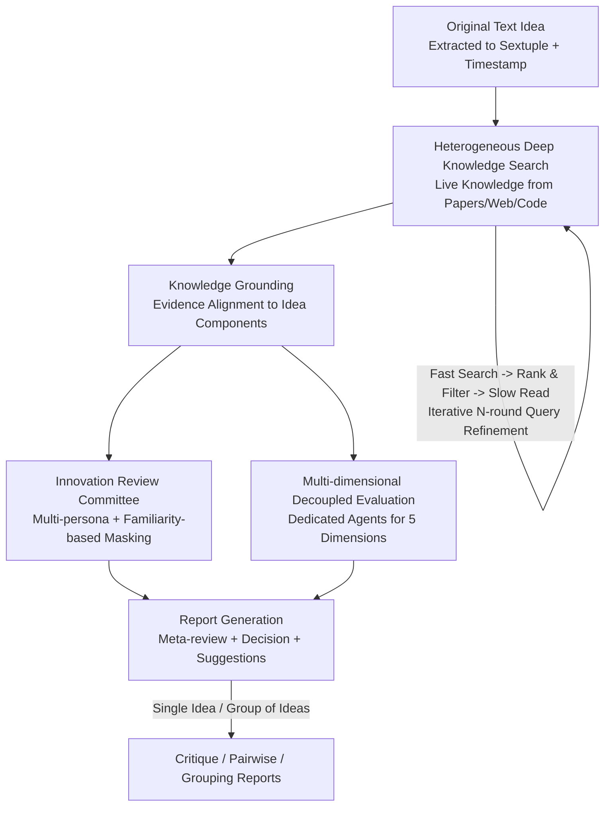

# InnoEval: On Research Idea Evaluation as a Knowledge-Grounded, Multi-Perspective Reasoning Problem

**Conference**: ICML 2026  
**arXiv**: [2602.14367](https://arxiv.org/abs/2602.14367)  
**Code**: https://github.com/zjunlp/InnoEval (Project page: innoeval.zjukg.cn)  
**Area**: LLM Evaluation / Research Agent / Research Idea Evaluation  
**Keywords**: Idea Evaluation, Heterogeneous Knowledge Retrieval, Multi-perspective Review, Personalized Reviewer, Meta-review

## TL;DR
InnoEval redefines "evaluating a research idea" as a **knowledge-grounded + multi-perspective reasoning** problem: it first employs a heterogeneous deep search engine to retrieve live knowledge from papers, webpages, and code, aligning it at a fine-grained level to each component of the idea. Then, an "Innovation Review Committee" composed of diverse academic personae scores the idea across five dimensions, aggregating them into a decision-bearing meta-review. It consistently outperforms existing baselines and achieves high alignment with human experts across critique, pairwise comparison, and grouping tasks.

## Background & Motivation
**Background**: LLMs have accelerated the "production" of research ideas to an unprecedented scale—agents for automated hypothesis generation and methodology design are emerging rapidly. However, following this "production explosion," the **evaluation** link has lagged: judging the quality of an idea still relies heavily on scarce, expensive, and subjective human experts.

**Limitations of Prior Work**: The authors categorize the shortcomings of existing automated evaluation tools into three points. First, **narrow knowledge scope**—most methods only query static academic papers, ignoring the "live knowledge ecology" (online discussions, open-source code, latest developments), making evaluations detached from reality. Second, **ignoring review consensus**—the mainstream approach uses a single LLM-as-a-Judge, which solidifies the model's internal bias as the criterion and fails to simulate deliberation between multiple experts. Third, **flattened evaluation dimensions**—attributes like novelty, feasibility, and impact, which should be independent or even in tension, are compressed into one or two scores, losing information and failing to provide useful feedback.

**Key Challenge**: Scientific evaluation is essentially a **holistic cognitive verification process**. The authors characterize it with three principles: knowledge grounding (ideas are knowledge-intensive entities that must be checked against the theoretical and practical ecosystem), collective deliberation (good evaluations stem from the fusion of diverse perspectives rather than a single authority), and multi-criteria decision-making (the complexity of an idea should be respected through a union of multiple attributes). Existing tools fail on all three points.

**Goal**: To build an automated, systematic framework that approaches human expert levels while supporting three practical scenarios: single idea scoring, pairwise comparison, and group ranking.

**Key Insight**: Instead of treating evaluation as a "static generation," it should be modeled as **knowledge-grounded multi-perspective reasoning**—first gathering and aligning comprehensive evidence, then allowing a group of "reviewers" with varied backgrounds to make independent judgments before converging on a consensus.

**Core Idea**: Use a pipeline consisting of "Heterogeneous Deep Search + Fine-grained Grounding + Personalized Review Committee + Decoupled Dimension Evaluation" to systematically address the gaps in knowledge, consensus, and dimensionality.

## Method

### Overall Architecture
Given an **original idea in text form** (of any maturity, from a single hypothesis to a full paper), InnoEval first extracts it into a structured sextuple $\mathcal{I}=(\text{TLDR}, \text{Motis}, \text{ResQues}, \text{Meths}, \text{ExpSets}, \text{ExpRes})$ with a timestamp $t$ indicating the "evaluation time point." The pipeline then proceeds in four steps: ① Heterogeneous Deep Knowledge Search, iteratively retrieving and filtering high-quality background knowledge from online papers, webpages, and code; ② Knowledge Grounding, aligning retrieved evidence to each component of the idea to identify supporting or refuting snippets; ③ Multi-dimensional Multi-perspective Evaluation, where a personalized review committee and dimension-specific agents score across five dimensions; ④ Report Generation, synthesizing all reviews into a meta-review containing cited evidence, structured analysis, final decisions, and suggestions for improvement. The output can be a single idea report $P_\text{point}$ or a group ranking report $P_\text{group}$.

### Key Designs

**1. Heterogeneous Deep Knowledge Search Engine: An iterative "Fast-Filter-Slow-Refine" loop to bridge the knowledge gap.**

To address "static paper-only" searches, a search agent $\mathcal{M}_s$ accesses three types of **online** heterogeneous sources: academic literature (arXiv, Semantic Scholar, Google Scholar), web content (Google Search), and open-source code (GitHub, Kaggle). A **hybrid fast-slow** iterative strategy is used: for each component $p$ and tool $u$, the agent generates customized queries with synonym expansion. It first performs a **fast search** via APIs to get brief results $\widetilde{\mathcal{K}}_{p,u}=u(\mathcal{Q}_{p,u}, t)$. The timestamp $t$ splits knowledge into pre/post epochs—the former for evaluation, the latter for improvement suggestions.

Filtering uses a **hybrid scoring** function: an embedding model calculates semantic similarity between the idea and each piece of knowledge (keeping top-$3m$ per category), followed by a reranker for $\mathcal{S}^\text{sem}$. Simultaneously, $\mathcal{M}_s$ acts as a judge, providing $\mathcal{S}^\text{llm}$ based on citations, venue, site popularity, or repo stars. The top-$m$ items are selected using a weighted sum with coefficient $\alpha$:

$$\mathcal{S}_j = \alpha\,\mathcal{S}^\text{sem}_j + (1-\alpha)\,\mathcal{S}^\text{llm}_j,\quad \widetilde{\mathcal{K}}^*_j = \text{Top}_m(\widetilde{\mathcal{K}}_j, \mathcal{S}_j)$$

This mitigates the fragility of pure semantic similarity and the bias/hallucination of pure model-as-a-judge. **Slow search** then enriches the content: literature is parsed from PDF to structured text, webpages to summary reports, and code repos to file/function call graphs and README analysis. Finally, **Iterative Refinement** allows $\mathcal{M}_s$ to rewrite queries based on enriched knowledge to rectify low relevance, over-generalization, or over-specification, iterating $N$ times (default $N=3, m=10, \alpha=0.2$).

**2. Knowledge Grounding: Aligning evidence to idea components to denoise and label "support vs. refute."**

Retrieving knowledge is insufficient if its relationship to the idea is vague. The grounding agent $\mathcal{M}_g$ performs fine-grained alignment: for each component $p$ and its retrieved knowledge $\mathcal{K}_p$, it distills evidence $e_p$ that **supports or refutes** $p$, accompanied by a relevance analysis $s_p$: $e_p, s_p = \mathcal{M}_g(p, k_p)$. The final grounding $\mathcal{G}=\{(p, \mathcal{G}_p)\}_{p\in\mathcal{I}}$ is fed to the evaluation modules. Ablations show that removing grounding (-Grounding) leads to performance drops across tasks, proving its necessity in filtering noise and focusing the evaluation.

**3. Innovation Review Committee: Multi-perspective consensus via diverse personae and familiarity-based masking.**

To address the "single judge bias," the authors construct a review committee $\mathcal{P}$. Each persona $\rho$ includes an academic profile, a **familiarity vector** for literature/web/code, and specific reviewing habits. During evaluation, a portion of the knowledge is **randomly masked** based on the persona's familiarity level, simulating the human limitation of not being an expert in every background. This replaces a "single reviewer pretending to have diverse opinions" with a true consensus emerging from different viewpoints. Analysis shows that in grouping tasks, **using only one persona is worse than using none**, as it simply shifts the LLM's inherent bias to that specific persona. Conversely, personalized test-time scaling (TTS) continues to improve with more personae, while standard TTS plateaus.

**4. Multi-dimensional Decoupled Evaluation & Report Generation: Dedicated agents for five dimensions aggregated into a meta-review.**

InnoEval initially defines five decoupled dimensions—Clarity, Novelty, Feasibility, Validity, and Significance. For each persona $\rho$ in a subset $\mathcal{P}'$ and each dimension $\psi$, a dedicated agent $\mathcal{M}_\psi$ uses the grounded evidence $\mathcal{G}$ to score in $[0,10]$ and provide a narrative $\varphi_{\rho,\psi}=\mathcal{M}_\psi(\rho, \mathcal{I}, \mathcal{G})$. A report agent $\mathcal{M}_r$ then synthesizes all $\{\varphi_{\rho,\psi}\}$ into a meta-review $\varphi_\text{meta}$ (including a total score $s_\text{point}$ and a decision $d_\text{point}\in\{$Reject, Poster, Spotlight, Oral$\}$). Actionable suggestions $\mathcal{V}$ are derived from "future knowledge" $\mathcal{G}_\text{future}$ (post-timestamp). In **grouping scenarios**, the agent performs pairwise comparisons along the five dimensions after synthesizing individual reports to produce a final ranking $\varphi^\text{group}_\text{meta}$.

### Loss & Training
InnoEval is a **pure inference pipeline and requires no training**. Retrieval utilizes bge-base-en-v1.5 as the retriever and bge-reranker-base as the reranker. The backbone LLM is DeepSeek-V3.2 (o4-mini used for robustness tests). Hyperparameters are set to $m=10, \alpha=0.2, N=3$. The average cost per sample is approximately \$0.42.

## Key Experimental Results

### Datasets and Tasks
The authors constructed a dataset from authoritative peer-reviewed papers. Ideas were sampled from NeurIPS'25 / ICLR'25 submissions across four decision tiers (Reject / Poster / Spotlight / Oral) using an extraction agent with human correction. This resulted in **217 critique samples** ($\mathcal{D}_\text{point}$). For the **172 grouping samples**, similar papers were retrieved for each idea. From these, **372 pairwise samples** (172 easy + 200 hard) were sampled based on label differences.

### Main Results

| Task | Metric | Prev. SOTA (ScholarEval) | InnoEval | Gain |
|------|------|------|------|------|
| Critique (3-class) | F1₃ | 58.38 | **74.56** | +16.18 |
| Critique (3-class) | Acc₃ | 61.75 | **73.73** | +11.98 |
| Critique (2-class) | Acc₂ | 65.44 | **75.58** | +10.14 |
| Pairwise (Easy) | Acc | 74.42 | **80.81** | +6.39 |
| Pairwise (Hard) | Acc | 60.00 | **63.00** | +3.00 |
| Grouping (Best Selection) | Acc | 49.42 | **65.12** | +15.70 |
| Grouping (Ranking) | Acc | 14.53 | **22.09** | +7.56 |

A notable phenomenon: most baselines exhibit **label collapse** in critique tasks (predictions concentrate on one or two labels, making F1 much lower than Acc). InnoEval uses sufficient evidence and multi-perspective evaluation to disperse predictions, allowing F1 to catch up to or even exceed Acc.

### Quality Comparison (Win rate judged by o4-mini, excerpted Overall Quality)

| InnoEval vs. | Rationality Win% | Depth Win% | Constructiveness Win% | Overall Win% |
|------|------|------|------|------|
| CoT | 88.48 | 93.09 | 89.77 | 90.70 |
| RAG | 87.10 | 92.63 | 87.10 | 90.32 |
| ResearchAgent | 86.18 | 90.32 | 88.94 | 89.86 |
| InternAgent | 83.41 | 91.24 | 82.03 | 85.71 |
| ScholarEval | 67.28 | 70.51 | 84.79 | 71.89 |

InnoEval achieves a win rate >70% in Overall Quality against all baselines, and >90% in Depth against most. ScholarEval is a strong baseline but lacks evidence-based suggestions, leading to poor constructiveness.

### Ablation Study

| Configuration | Effect | Description |
|------|------|------|
| Full InnoEval | Optimal | Complete pipeline |
| -Grounding | Drop across tasks | Noise mixed in; evaluation loses focus |
| -Personalized | Significant drop | Reverts to single judge; bias returns |
| -Web&Code | Notable drop (Pairwise/Group) | Literature only; insufficient background |
| o4-mini Backbone | Slight drop but still lead | Robust across models |

### Key Findings
- **Personalization is key to consensus**: Standard TTS plateaus quickly, while personalized TTS continue to scale. In ranking, "1 persona is worse than 0," as a single persona only shifts the LLM bias without resolving it.
- **Comparison tasks are knowledge-hungry**: The removal of Web&Code hits pairwise and grouping tasks harder than critique, indicating that comparing ideas necessitates richer live knowledge.
- **High Human Alignment**: Comparisons with human experts and real peer reviews across 60 samples show correlation coefficients ≥ 0.5. Clarity is the most aligned, while Significance is the lowest.
- **Reviewing aids generation**: Integrating InnoEval's suggestions into ResearchAgent's idea iteration loop significantly improves generation quality in problem definition, method, and experimental design.

## Highlights & Insights
- **Redefining evaluation as knowledge-grounded multi-perspective reasoning**: The logical chain of three principles → three gaps → three modules is clean and innovative.
- **Familiarity-based knowledge masking** is a clever design: it anchors the "simulation of human cognitive limits" to an executable mechanism, which is the source of personalized TTS scaling.
- **Hybrid search paradigm is transferable**: Fast search for breadth, hybrid filtering for relevance, and slow read for enrichment is a template applicable to any agent task requiring live online evidence.
- **Using future papers for feedback**: Decoupling pre/post knowledge via timestamps ensures the evaluation doesn't "cheat" while providing actionable advice based on things that actually happened later.

## Limitations & Future Work
- **Cost and Latency**: Approximately \$0.42 per sample and reliance on multiple online search APIs. Large persona pools increase inference time significantly.
- **Judging Significance**: This dimension has the lowest human correlation, reflecting the difficulty of judging long-term, subjective "impact."
- **Ground Truth Noise**: Using conference decisions as ground truth inherits the noise and luck inherent in real peer review.
- **Reliance on Online Availability**: Broken links or API changes affect knowledge coverage; non-English knowledge may be underrepresented.

## Related Work & Insights
- **vs. LLM-as-a-Judge (CoT / RAG)**: Single LLM scoring solidifies bias and causes label collapse; InnoEval uses a committee to turn bias into consensus.
- **vs. ScholarEval**: ScholarEval's retrieval is strong but converges too early, sacrificing diversity. InnoEval's heterogeneous search maintains relevance while ensuring coverage.
- **vs. GraphEval**: Designed only for single idea labeling; fails in pairwise/grouping tasks, highlighting the need for flexible evaluation systems.
- **vs. ResearchAgent / InternAgent**: These rely on pre-built libraries or single-dimension evaluations; InnoEval fills these gaps with live online knowledge and multi-dimensional analysis.

## Rating
- Novelty: ⭐⭐⭐⭐⭐ Restructuring idea evaluation as grounded reasoning is a strong, logical contribution.
- Experimental Thoroughness: ⭐⭐⭐⭐⭐ Comprehensive tasks, win rates, human alignment, and scaling analysis.
- Writing Quality: ⭐⭐⭐⭐ Clear formal definitions and motivation; however, notation is dense and heavily dependent on appendices.
- Value: ⭐⭐⭐⭐⭐ Automated evaluation is the bottleneck of research agents; the feedback loop for generation is highly practical.

<!-- RELATED:START -->

## Related Papers

- [\[ACL 2026\] Teaching Language Models to Forecast Research Success Through Comparative Idea Evaluation](../../ACL2026/llm_evaluation/teaching_language_models_to_forecast_research_success_through_comparative_idea_e.md)
- [\[ACL 2025\] MDBench: A Synthetic Multi-Document Reasoning Benchmark Generated with Knowledge Guidance](../../ACL2025/llm_evaluation/mdbench_a_synthetic_multi-document_reasoning_benchmark_generated_with_knowledge_.md)
- [\[ACL 2026\] Aggregate vs. Personalized Judges in Business Idea Evaluation: Evidence from Expert Disagreement](../../ACL2026/llm_evaluation/aggregate_vs_personalized_judges_in_business_idea_evaluation_evidence_from_exper.md)
- [\[ACL 2026\] BizCompass: Benchmarking the Reasoning Capabilities of LLMs in Business Knowledge and Applications](../../ACL2026/llm_evaluation/bizcompass_benchmarking_the_reasoning_capabilities_of_llms_in_business_knowledge.md)
- [\[ICML 2026\] Multi$^2$: Hierarchical Multi-Agent Decision-Making with LLM-Based Agents in Interactive Environments](multi2_hierarchical_multi-agent_decision-making_with_llm-based_agents_in_interac.md)

<!-- RELATED:END -->
