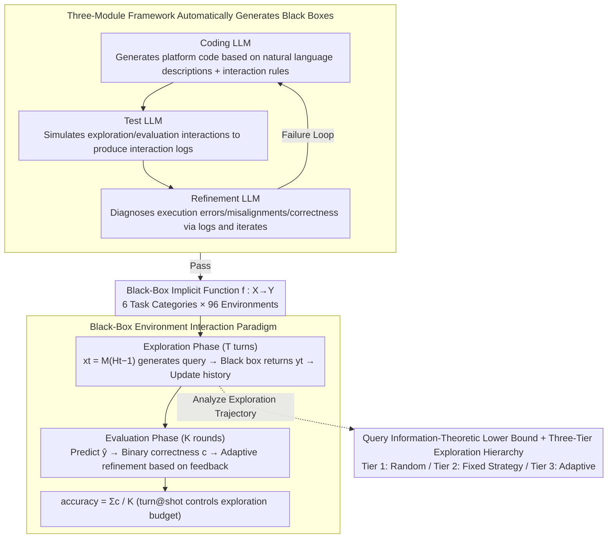

# Investigating Advanced Reasoning of Large Language Models via Black-Box Environment Interaction

**Conference**: ICML 2026  
**arXiv**: [2508.19035](https://arxiv.org/abs/2508.19035)  
**Code**: https://github.com/lemonsis/Oracle_Benchmark (Available)  
**Area**: LLM Evaluation / Reasoning Benchmarks  
**Keywords**: Reasoning Evaluation, Black-Box Interaction, Exploration Strategies, Deduction-Induction-Abduction, ORACLE Benchmark

## TL;DR
This paper proposes "Black-Box Environment Interaction" as a new paradigm for evaluating integrated reasoning (deduction + induction + abduction). By constructing the ORACLE benchmark with 96 environments across 6 task categories and evaluating 19 LLMs, it is discovered that even the strongest model, o3, only achieves ~70% accuracy in simple environments and drops to ~40% in difficult ones. Furthermore, all LLMs lack high-level planning capabilities for "adaptive optimization of exploration strategies based on feedback."

## Background & Motivation

**Background**: LLM scores on reasoning benchmarks like GSM8k and MATH have soared; long CoT and test-time scaling make models appear capable of advanced reasoning.

**Limitations of Prior Work**: (1) Existing datasets mostly isolate deduction, induction, and abduction rather than treating them as a unified process; (2) Using games (e.g., Minecraft, Game of 24) to simulate interactive environments involves confounding variables like spatial understanding and long context, and training data may already be contaminated; (3) Static datasets are easily memorized, leading to benchmark saturation.

**Key Challenge**: The human process of discovering unknown environments is a dynamic closed loop of "abduction (guessing hypotheses from observations) → deduction (deriving new observations) → induction (refining hypotheses based on new observations)" (the Peirce framework). Current LLM evaluations almost exclusively test single-step deduction or single-path static CoT, failing to measure the overall "hypothesis-verification-refinement" reasoning cycle.

**Goal**: (1) Design an interaction paradigm that forces LLMs to execute the full reasoning cycle; (2) Ensure the paradigm is pure—evaluating reasoning without confounding factors; (3) Ensure the paradigm is contamination-resistant and scalable to arbitrary difficulty.

**Key Insight**: Abstract the "unknown environment" as a black box of an implicit function $f:X\to Y$. LLMs must reveal $f$ through $T$ turns of exploration by querying inputs and observing outputs, then predict outputs for new inputs in a test set. This paradigm naturally necessitates hypothesis generation (abduction), query generation (deduction), and refinement based on feedback (induction).

**Core Idea**: Use "Black-Box Environment Interaction" as an evaluation paradigm to force LLMs to execute deduction + induction + abduction as an inseparable, holistic reasoning cycle.

## Method

### Overall Architecture
ORACLE abstracts an "unknown environment" into a black-box implicit function $f:X\to Y$, requiring the LLM to reveal it within a limited number of interactions. Each evaluation instance consists of two phases: an exploration phase of $T$ turns, where the model $M$ at turn $t$ adaptively generates a query $x_t=M(H_{t-1})$ based on history $H_{t-1}=(x_1,y_1,\ldots,x_{t-1},y_{t-1})$ and receives $y_t=f(x_t)$ from the black box; and an evaluation phase of $K$ rounds, where the model predicts $\hat{y}^k$ for a test set $X_{\rm test}$ disjoint from exploration queries. The black box returns binary correctness $c^k=\mathbb{1}(\hat{y}^k=f(x^k_{\rm test}))$, allowing the model to refine subsequent predictions. Performance is measured by accuracy $=\sum c^k / K$, controlled by the turn@shot notation (e.g., 20@2 indicates 20 exploration turns and 2 attempts per test sample). This two-phase closed loop forces the model through the complete reasoning cycle. The black boxes are not manually written but are automatically generated by a three-module LLM pipeline (Coding → Test → Refinement).

### Key Designs

**1. Black-Box Interaction Paradigm + 6 Task Categories: Unifying Heterogeneous Reasoning Tasks into a Contamination-Resistant Black Box**

Existing datasets either isolate logic components or introduce confounding variables via game environments. ORACLE reduces all tasks to an implicit function $f: X \to Y$ and designs 6 tasks: CII (Code Intent Inference), CRI (Circuit Rule Inference), PSI (Physics System Inference), ERI (Encryption Rule Inference), IPI (Interactive Puzzle Inference), and GSI (Game Strategy Inference). Each category includes easy and hard levels, totaling 96 environments. Using synthetic black boxes prevents data contamination—even if the LLM was trained on similar tasks, the specific rules of each box are novel. The functional space also isolates pure reasoning from visual, long-context, or commonsense knowledge.

**2. Three-Module LLM Agentic Framework for Automatic Generation: Scalable Benchmarking Without Human Bias**

To achieve scale, the authors use an LLM pipeline to generate black-box code and interfaces from natural language descriptions. Three modules collaborate: the Coding LLM generates platform code; the Test LLM simulates interactions to produce logs; and the Refinement LLM diagnoses errors as "execution error," "functional misalignment," or "correct." This "execution-feedback-debug" cycle is more robust than static analysis, allowing for stable batch generation of environments. Crucially, using an LLM as a generator does not leak solutions, as the evaluated model only sees the interface, not the code.

**3. Theoretical Query Lower Bound + Adaptive Exploration Hierarchy: An Absolute Scale for Evaluation**

To measure "how hard the black box is," the authors provide an information-theoretic lower bound for exact identification: $T_{\rm info}\geq \lceil\log_2|\mathcal{H}|/\log_2|Y|\rceil$ queries. LLM exploration capability is then classified into three tiers: Tier 1 (random), Tier 2 (fixed strategy regardless of feedback), and Tier 3 (adaptive strategy based on instant feedback). Tier 3 represents human-level efficiency, which no current LLM achieves.

### Loss & Training
This is an evaluation paradigm and benchmark; no training is involved. Models were tested using default API parameters (temperature=0), reasoning effort=medium (GPT series), and thinking budget=20,000 tokens (Claude/Qwen series).

## Key Experimental Results

### Main Results
19 qualified LLMs (including o1, o3, o3-mini, o4-mini, Claude-3.5/3.7, Gemini-2.5-flash/pro, DeepSeek-v3/r1, Qwen3) were evaluated. The following table shows SOTA performance under 10@1:

| Task | 1st Place | 2nd Place | Easy Acc (SOTA) | Hard Acc (SOTA) |
|--------|------|------|------|------|
| CII | o3 | o4-mini | ~85% | ~50% |
| CRI | o3 | gemini-2.5-pro | ~80% | ~40% |
| PSI | o3 | gemini-2.5-pro | ~75% | ~35% |
| ERI | o4-mini | o3-mini | ~80% | ~30% |
| IPI | o3 | o4-mini | ~85% | ~45% |
| GSI | o3 | gemini-2.5-pro | ~70% | ~40% |

### Ablation Study
The core ablation compares Setting (i) "No feedback during exploration, all answers revealed at the last turn" vs. Setting (ii) "Instant feedback at each turn":

| Model | Task | Setting (i) Acc | Setting (ii) Acc | Difference |
|------|------|------|------|------|
| gemini-2.5-pro | CRI | ≈ | ≈ | ~0 |
| o3-mini | CRI | ≈ | ≈ | ~0 |
| o4-mini | CRI | ≈ | ≈ | ~0 |
| gemini-2.5-pro | ERI | ≈ | ≈ | ~0 |
| o3-mini | ERI | ≈ | ≈ | ~0 |
| o4-mini | ERI | ≈ | ≈ | ~0 |

Performance was nearly identical across settings, providing direct evidence that LLMs fail to optimize strategies based on instant feedback.

### Key Findings
- **Reasoning models > Chat models**: Claude-4-sonnet_thinking consistently outperformed the non-thinking version; newer models > older models.
- **Budget effects**: Doubling the exploration budget (10→20 turns) improves accuracy by >10% for CII/CRI/IPI but has almost no effect on PSI (bottlenecked by numerical calculation) or ERI/GSI (bottlenecked by exploration strategy).
- **Setting (i) vs (ii) Equivalence**: SOTA models perform the same with or without instant feedback, meaning they do not dynamically adjust exploration. For example, o4-mini continues brute-forcing one-hot inputs in CRI regardless of feedback.
- **Exploration Hierarchy**: Most strong models only occasionally reach Tier 2; none reach Tier 3.
- **Difficulty Gap**: A significant performance drop (from 70-85% to 30-50%) exists between easy and hard levels, confirming a reasonable difficulty gradient.

## Highlights & Insights
- Explicitly formalizes Peirce's "abduction-deduction-induction" framework as a design philosophy for benchmarks.
- The "LLM-generated black box" structure effectively prevents data contamination while allowing for arbitrary scaling.
- The Setting (i)/(ii) equivalence experiment provides a counter-intuitive but highly diagnostic result—falsifying the assumption that LLMs "learn" from feedback during exploration.
- The Tier 1/2/3 hierarchy can guide RL post-training design: rewarding the dynamic quality of strategy optimization rather than just final correctness.
- The information-theoretic lower bound provides an absolute scale to measure exactly how far o3 is from optimal query efficiency.

## Limitations & Future Work
- The quantity of environments (96) is still small, and some categories (e.g., GSI) have fixed rules that models might eventually learn as meta-patterns.
- Black-box tasks remain somewhat toy-like compared to real scientific discovery.
- High evaluation costs due to reliance on commercial APIs for 19 SOTA models.
- Confounding variables: specifically, poor numerical calculation in PSI tasks creates a bottleneck independent of reasoning quality.
- The benchmark identifies the lack of adaptive exploration but does not yet provide training-time methodology to solve it.

## Related Work & Insights
- **vs WebArena / GameBench / GameArena**: These use real web or game environments which introduce spatial understanding and common sense; ORACLE isolates reasoning via pure functional black boxes.
- **vs InductionBench / DEER**: These focus only on inductive reasoning; ORACLE tests the full cycle.
- **vs LiveBench / LiveCodeBench**: These rely on timestamps for contamination resistance; ORACLE uses synthetic generation for a more fundamental solution.
- **vs PlanBench**: PlanBench measures planning in static environments with known rules; ORACLE emphasizes exploratory planning in unknown environments.

## Rating
- **Novelty**: ⭐⭐⭐⭐⭐ (Mapping Peirce's framework to a black-box interaction paradigm is highly original)
- **Experimental Thoroughness**: ⭐⭐⭐⭐⭐ (Broad evaluation across 19 SOTA LLMs and deep behavioral analysis)
- **Writing Quality**: ⭐⭐⭐⭐ (Case studies are intuitive, though some theoretical analysis is relegated to the appendix)
- **Value**: ⭐⭐⭐⭐⭐ (Contamination-resistant, scalable, and reveals a fundamental bottleneck in LLM reasoning)

<!-- RELATED:START -->

## Related Papers

- [\[ICML 2025\] Hyperband-based Bayesian Optimization for Black-box Prompt Selection](../../ICML2025/llm_evaluation/hyperband-based_bayesian_optimization_for_black-box_prompt_selection.md)
- [\[NeurIPS 2025\] Predicting the Performance of Black-Box LLMs through Follow-Up Queries](../../NeurIPS2025/llm_evaluation/predicting_the_performance_of_black-box_llms_through_follow-up_queries.md)
- [\[ICML 2026\] PoliticsBench: Benchmarking Political Values in Large Language Models with Multi-Stage Roleplay](politicsbench_benchmarking_political_values_in_large_language_models_with_multi-.md)
- [\[ACL 2026\] Challenging the Boundaries of Reasoning: An Olympiad-Level Math Benchmark for Large Language Models](../../ACL2026/llm_evaluation/challenging_the_boundaries_of_reasoning_an_olympiad-level_math_benchmark_for_lar.md)
- [\[ICML 2026\] Spherical Steering: Geometry-Aware Activation Rotation for Language Models](spherical_steering_geometry-aware_activation_rotation_for_language_models.md)

<!-- RELATED:END -->
