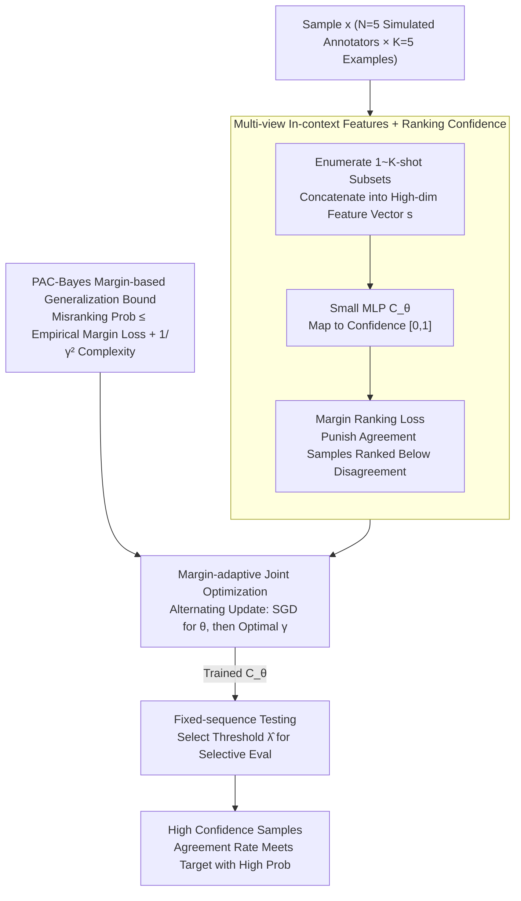

# Margin-Adaptive Confidence Ranking for Reliable LLM Judgement

**Conference**: ICML 2026  
**arXiv**: [2605.15416](https://arxiv.org/abs/2605.15416)  
**Code**: Not yet public  
**Area**: LLM Evaluation / Selective Prediction / PAC-Bayes Generalization  
**Keywords**: LLM-as-a-judge, confidence estimation, margin ranking, PAC-Bayesian bound, selective evaluation

## TL;DR
Addressing the frequently violated monotonicity assumption in LLM-as-a-judge—where high confidence does not necessarily imply reliability—this paper proposes using a small MLP to map multiple in-context prediction probabilities to confidence scores. By deriving a margin-adaptive training strategy via margin-based ranking loss and PAC-Bayes generalization bounds, the learned confidence achieves lower ranking loss, higher AUROC, and significantly improves target consistency in fixed-sequence testing across four datasets and six judge models.

## Background & Motivation

**Background**: LLM-as-a-judge is the dominant approach for evaluating open-ended generation tasks (e.g., AlpacaEval, Chatbot Arena). Its reliability typically relies on a "selective evaluation" pipeline: first estimating the confidence $C_{LM}(x)$ for each sample, then using fixed-sequence testing to find a threshold $\widehat{\lambda}$ such that the human-machine agreement rate for high-confidence samples reaches the target $1-\alpha$ with high probability. Jung et al. (2025) formalized the PAC risk upper bound within this framework.

**Limitations of Prior Work**: All such methods rely on an implicit "monotonicity assumption"—that higher confidence correlates with lower disagreement risk relative to human judgment. Experimental results in Figure 1/3 show that both predictive probability and simulated annotators often exhibit non-monotonic relationships with human agreement (particularly evident in AlpacaEval and Chatbot Arena). Furthermore, existing theories only provide guarantees for risk **conditional on the calibration set**, lacking analysis of the **out-of-sample generalization** of the confidence estimator itself.

**Key Challenge**: Treating heuristic signals (predictive probability, verbalized confidence) as reliable confidence essentially conflates "classification correctness" with "ranking consistency." The former only requires correct discrimination near the threshold, while the latter requires a **global ordinal relationship** monotonically aligned with the human agreement rate—two fundamentally different learning objectives.

**Goal**: To model confidence as a learnable ranking function $C_\theta$ and establish PAC-Bayes generalization bounds for its "misranking probability," thereby theoretically controlling the monotonicity of selective risk.

**Key Insight**: Each sample $x$ is represented as a high-dimensional feature vector $s = (\mathbb{P}_{LM}(r_1\mid x; t_1),\dots,\mathbb{P}_{LM}(r_1\mid x; t_{|\mathcal{T}|}))$, where each $t_i$ represents a different set of in-context annotation examples. In this way, simulated annotators are no longer manually aggregated into a max-mean scalar but are fed into a small MLP as multi-view raw features.

**Core Idea**: Use a margin-based pairwise ranking loss to train $C_\theta$ and leverage PAC-Bayes to derive a trade-off where "larger margin $\rightarrow$ harder to minimize empirical loss, but lower generalization complexity." Consequently, $\theta$ and the margin $\gamma$ are **jointly optimized**.

## Method

### Overall Architecture
The method solves the problem of "how to make confidence truly monotonically aligned with human agreement." Given a judge model $f_{LM}$ and a small calibration set $S_{\mathrm{cal}}$ with human preference labels, the pipeline is as follows: first, concatenate the prediction probabilities of each sample under multiple sets of in-context examples into a high-dimensional feature vector; then, use a small MLP $C_\theta$ to map this vector to a confidence score in $[0,1]$. The training objective uses margin ranking loss to force "human-machine agreement samples to be ranked above disagreement samples." Finally, the trained $C_\theta$ is directly embedded into the fixed-sequence testing from Jung et al. (2025) to select a threshold for selective evaluation with high-probability guarantees. Specifically, for each sample $x$, $N=5$ simulated annotators each with $K=5$ examples are used to enumerate all $1\sim K$-shot subsets $\mathcal{T}$, yielding features $s\in\mathbb{R}^{|\mathcal{T}|}$. From $S_{\mathrm{cal}}$, agreement/disagreement groups are partitioned based on whether $f_{LM}(x)$ equals the human label $y$, and 5000 pairs are randomly sampled to construct ranking training pairs. After MLP training, the threshold is selected as $\widehat{\lambda} = \inf\{\lambda: \widehat{R}^+(\lambda') \le \alpha,\ \forall \lambda' \ge \lambda\}$.

### Key Designs

**1. Multi-view In-context Features + Ranking Confidence: Decoupling "Correctness" from "Monotonicity"**

The limitation of prior confidence measures was their reliance on direct softmax probabilities or manual max-mean aggregation of simulated annotators. This conflates "correct discrimination near the threshold" with "global ordinal alignment with agreement rates." This work avoids aggregation, retaining all $|\mathcal{T}|$-dimensional raw probabilities for the MLP to learn the optimal aggregation. For sample $(x,y)$, the agreement indicator $a(x) = \mathbb{1}\{f_{LM}(x) = y\}$ is defined. Margin ranking loss $\ell_\gamma(\theta; x_i, x_j) = \mathbb{1}(C_\theta(s_i) < C_\theta(s_j) + \gamma)$ is defined only for pairs where $a(x_i) > a(x_j)$. During training, a softplus proxy $\log(1+e^{-(C_\theta(s_i)-C_\theta(s_j)-\gamma)/0.1})$ is used for differentiability. Since monotonicity is essentially an **ordinal** property, the loss directly penalizes "agreement samples ranked lower than disagreement samples" rather than optimizing for accuracy—the root of its superior reliability over heuristic confidence.

**2. PAC-Bayes Margin-based Generalization Bound: Quantifiable Reliability Guarantees**

Existing theories provide guarantees only for risk under calibration conditions, neglecting the out-of-sample generalization of the confidence estimator. This work utilizes the PAC-Bayes framework (McAllester, 1999; Neyshabur et al., 2017) to bridge this gap. First, an upper bound for the expected ranking risk of a randomized estimator $C_{\theta+\mathbf{u}}$ is obtained, then converted back to a deterministic estimator via a sharpness constraint $\mathbb{P}_{\mathbf{u}}(\max_s |C_{\theta+\mathbf{u}}(s) - C_\theta(s)| < \gamma/4) \ge 1/2$, resulting in:

$$\mathcal{RK}(\theta) \le \widehat{\mathcal{RK}}_\gamma(\theta) + \mathcal{O}\!\left(\sqrt{\frac{\Phi(C_\theta) + \ln(3m_p/\delta')}{\gamma^2 (m_p - 1)}}\right),\quad \Phi(C_\theta) = n^2 h \ln(nh) \prod_l \|W_l\|_2^2 \sum_l \frac{\|W_l\|_F^2}{\|W_l\|_2^2}.$$

This explicitly decomposes the "misranking probability" into empirical margin loss and a margin-dependent complexity term. Crucially, the $1/\gamma^2$ dependence identifies the margin $\gamma$ as the control knob for generalization, providing a theoretical basis for the next design: turning the reliability guarantee into an optimizable inequality.

**3. Margin-adaptive Joint Optimization: Automatic Calibration via Data Noise**

The bound implies a tension: larger $\gamma$ reduces complexity but makes empirical margin loss harder to minimize. Clean data can tolerate larger separation, while noisy data requires compromise; thus, **no universal optimal margin exists**. Fixed margins are suboptimal. This work simplifies the complexity term into a differentiable proxy $\mathcal{C}_\gamma(\theta) = \sqrt{\sum_l \|W_l\|_F^2}/\gamma$ (replacing spectral norm with Frobenius norm) and treats $\gamma$ as a learnable parameter, jointly optimizing $\min_{\theta,\gamma}\widehat{\mathcal{RK}^s_\gamma}(\theta) + \beta\,\mathcal{C}_\gamma(\theta)$. Due to the non-smoothness of ranking loss w.r.t. $\gamma$, decoupled alternating updates are used: fix $\gamma$ to update $\theta$ via SGD, then fix $\theta$ to find the $\gamma$ that minimizes the objective. This transforms the PAC-Bayes bound from a post-hoc analysis tool into a training objective.

### Loss & Training
The empirical objective is $\min_{\theta} \min_{\gamma}\, \widehat{\mathcal{RK}^s_\gamma}(\theta) + \beta\,\mathcal{C}_\gamma(\theta)$ with coefficient $\beta = 10^{-4}$. The network is a 3-layer MLP (64→32→16, ReLU, Sigmoid output), trained for 30 epochs with a learning rate of $10^{-3}$ and weight decay of $10^{-4}$. Approximately 3000 training samples per dataset are used, with 5000 pairs randomly sampled for ranking. During inference, the trained $C_\theta$ replaces the original $C_{LM}$ in the fixed-sequence testing framework, using the binomial $(1-\delta)$ upper bound $\widehat{R}^+(\lambda)$ to find the minimum acceptable threshold.

## Key Experimental Results

### Main Results: Ranking Loss & AUROC (Selection of 3 judges × 4 datasets)

| Judge | Dataset | Metric | Predictive Prob. | Simulated Annot. | Learning (Vanilla) | **Ours** |
|-------|--------|------|------------------|------------------|--------------------|----------|
| Mistral-7B | AlpacaEval | $\mathcal{RK}\downarrow$ / AUROC$\uparrow$ | 0.421 / 0.580 | 0.418 / 0.582 | 0.387 / 0.618 | **0.339 / 0.667** |
| Mistral-7B | Chatbot Arena | $\mathcal{RK}\downarrow$ / AUROC$\uparrow$ | 0.332 / 0.665 | 0.323 / 0.677 | 0.282 / 0.703 | **0.274 / 0.713** |
| Llama3-70B | AlpacaEval | $\mathcal{RK}\downarrow$ / AUROC$\uparrow$ | 0.402 / 0.599 | 0.384 / 0.616 | 0.324 / 0.673 | **0.278 / 0.705** |
| Llama3-70B | Chatbot Arena | $\mathcal{RK}\downarrow$ / AUROC$\uparrow$ | 0.255 / 0.746 | 0.265 / 0.735 | 0.249 / 0.752 | **0.217 / 0.787** |
| Qwen2.5-72B | HH-RLHF | $\mathcal{RK}\downarrow$ / AUROC$\uparrow$ | 0.441 / 0.554 | 0.368 / 0.647 | 0.348 / 0.658 | **0.281 / 0.713** |
| Qwen2.5-72B | TL;DR | $\mathcal{RK}\downarrow$ / AUROC$\uparrow$ | 0.372 / 0.627 | 0.361 / 0.631 | 0.338 / 0.658 | **0.279 / 0.702** |

Across all 4 datasets × 6 judge model combinations, the proposed method achieves the lowest ranking loss and highest AUROC.

### Ablation Study: Vanilla (Standard ranking loss) vs. Ours (Margin-adaptive)

| Configuration | AlpacaEval $\mathcal{RK}\downarrow$ | HH-RLHF $\mathcal{RK}\downarrow$ | Chatbot Arena $\mathcal{RK}\downarrow$ | TL;DR $\mathcal{RK}\downarrow$ | Description |
|------|-------------------------------------|----------------------------------|----------------------------------------|--------------------------------|------|
| Predictive Probability | 0.402 | 0.448 | 0.255 | 0.416 | Heuristic baseline |
| Simulated Annotators | 0.384 | 0.357 | 0.265 | 0.392 | Manual aggregation (Jung et al.) |
| Learning Confidence (Vanilla) | 0.324 | 0.360 | 0.249 | 0.358 | MLP + Fixed margin ranking loss |
| **Learning Confidence (Ours)** | **0.278** | **0.309** | **0.217** | **0.314** | + Margin-adaptive optimization |

(Comparison on Llama3-70B judge) The improvement from Vanilla to Ours (approx. 0.03–0.05 ranking loss) is specifically attributable to margin-adaptive training, demonstrating that the PAC-Bayes derived strategy is not merely decorative.

### Key Findings
- **Restoration of Monotonicity**: Figure 3 shows that on Llama3-8B + Chatbot Arena, Simulated Annotators' confidence-agreement curves are significantly non-monotonic, whereas the proposed method restores monotonicity, making fixed-sequence testing viable.
- **Bernoulli Simulation (Figure 2)**: In 10,000 synthetic experiments, ranking loss and monotonicity violation rates rise synchronously, empirically supporting the inference that "minimizing ranking loss reduces monotonicity violations."
- **Downstream Gains**: In cascaded selective evaluation (L→Q→O, M→L→O) with target agreement $1-\alpha = 0.85$, traditional heuristics yield a guarantee success rate of nearly 0%, whereas the learned confidence significantly improves success rates, effectively linking theoretical improvement to real-world deployment.

## Highlights & Insights
- **Transitioning LLM-as-a-judge from "Heuristic Confidence" to "Learnable Ranking Function"**: Unlike prior confidence estimation using raw softmax or manual aggregation, this work is the first to explicitly model it as a **Learning-to-Rank** problem, allowing the MLP to learn judge- and dataset-specific aggregation.
- **PAC-Bayes Inferencing "Feeds Back" into the Training Objective**: The complexity term $\sqrt{\sum_l \|W_l\|_F^2}/\gamma$ appears directly in the loss. The margin is no longer a heuristic hyperparameter but an optimizable quantity derived from the generalization bound, a rare "theory-to-practice" loop in LLM evaluation.
- **Transferable Trick**: Packing "prediction probabilities under multiple in-context sets" as feature vectors for a small model—a "sub-prompt ensemble as features" approach—is directly applicable to downstream tasks requiring reliable signals from LLMs (calibration, selective abstention, reward modeling).

## Limitations & Future Work
- Dependency on a **small calibration set with human preference labels** (approx. 3000 cases per dataset); the method cannot be trained in zero-annotation scenarios.
- The use of the Frobenius norm as a differentiable proxy for the spectral norm in the complexity term may yield a loose upper bound; a "proxy gap" remains between theory and training objective.
- Alternating updates for $\gamma$ are stable in practice but remain sensitive to learning rate and $\beta$; failed joint optimization scenarios are not fully discussed.
- Experiments are restricted to "pairwise preference" formats; more complex judge scenarios like multi-candidate or open-ended scoring are not covered.
- The feature vector dimension $|\mathcal{T}|$ grows exponentially with $K, N$ ($\sum_{k=1}^K \binom{K}{k} \cdot N$), leading to increased inference overhead as in-context examples increase.

## Related Work & Insights
- **vs. Jung et al. (2025) Simulated Annotators**: Jung uses fixed max-mean aggregation and heuristic confidence. This work treats in-context signals as raw features for a learnable MLP trained under a ranking objective. These are compatible, with this work serving as a "confidence module" upgrade for the fixed-sequence testing framework.
- **vs. Mohri & Hashimoto (2024) Conformal Prediction**: Conformal methods provide marginal correctness guarantees assuming reliable confidence. This work ensures **ranking consistency** of the confidence itself, representing an orthogonal and complementary perspective.
- **vs. Neyshabur et al. (2017) PAC-Bayes for Classification**: While Neyshabur's analysis targets discrete classification loss, this work extends it to $[0,1]$ continuous output and ranking error, using sharpness constraints to provide a template for "continuous-output + ranking" combinations.
- **vs. Verbalized Confidence**: Asking LLMs to report confidence is the cheapest option, but Table 1 shows its ranking loss and AUROC are the worst, confirming that "prompted confidence" is largely unreliable.

## Rating
- Novelty: ⭐⭐⭐⭐ First formalization of LLM-judge confidence as a PAC-Bayes margin ranking problem with "derived" margin-adaptive optimization.
- Experimental Thoroughness: ⭐⭐⭐⭐ Covers 4 datasets × 6 judge models + cascaded evaluation; lacks public code and complex scoring scenarios.
- Writing Quality: ⭐⭐⭐⭐ Clear chain of logic from motivation to theory to methodology to experiments; PAC-Bayes derivations are dense but explained.
- Value: ⭐⭐⭐⭐ Provides a reusable "confidence upgrade" for any work relying on LLM-as-a-judge and selective evaluation (e.g., evaluation platforms, RLHF reward model selection).

<!-- RELATED:START -->

## Related Papers

- [\[ICLR 2026\] Multi-LLM Adaptive Conformal Inference for Reliable LLM Responses](../../ICLR2026/llm_evaluation/multi-llm_adaptive_conformal_inference_for_reliable_llm_response.md)
- [\[ACL 2026\] Statistically Reliable LLM-Based Ranking Evaluation via Prediction-Powered Inference](../../ACL2026/llm_evaluation/statistically_reliable_llm-based_ranking_evaluation_via_prediction-powered_infer.md)
- [\[ICML 2026\] Reasoning Is Not Free: Robust Adaptive Cost-Efficient Routing for LLM-as-a-Judge](reasoning_is_not_free_robust_adaptive_cost-efficient_routing_for_llm-as-a-judge.md)
- [\[ICML 2026\] Reliable to Expressive: A Curriculum for Rubric-Following Safety Judges](reliable_to_expressive_a_curriculum_for_rubric-following_safety_judges.md)
- [\[ICML 2026\] On Cost-Effective LLM-as-a-Judge Improvement Techniques](on_cost-effective_llm-as-a-judge_improvement_techniques.md)

<!-- RELATED:END -->
