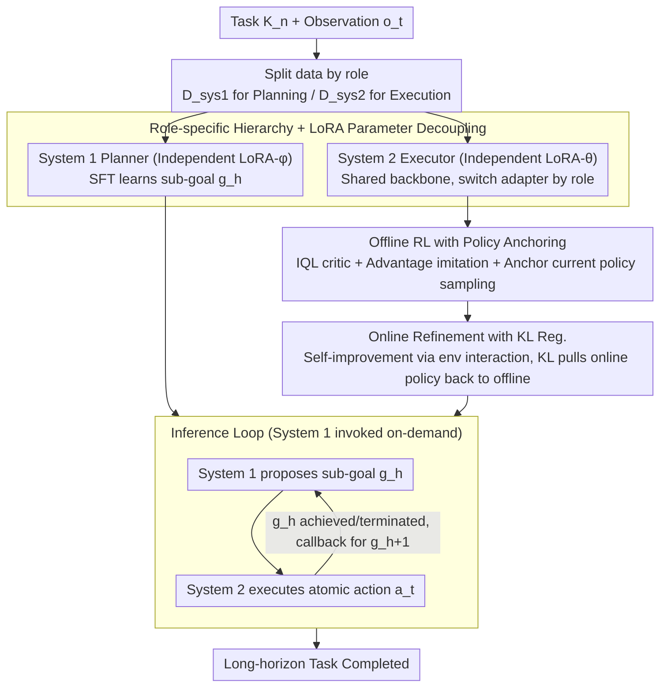

# Multi$^2$: Hierarchical Multi-Agent Decision-Making with LLM-Based Agents in Interactive Environments

**Conference**: ICML 2026  
**arXiv**: [2606.03698](https://arxiv.org/abs/2606.03698)  
**Code**: https://park-sangeun.github.io/Multi-Square/ (Project Page)  
**Area**: LLM Agent / Multi-Agent / Offline-to-Online RL  
**Keywords**: Hierarchical Agents, Objective Drift, Sub-goal Planning, Offline-to-Online RL, Long-horizon Interaction

## TL;DR
This paper proposes the Multi$^2$ framework, which explicitly decouples the "planning" and "execution" of LLM agents into System 1 (an SFT-trained sub-goal planner) and System 2 (an offline-to-online RL-trained atomic action executor). By utilizing role-specific LoRA adapters and training objectives with policy-anchoring/KL-regularization, it significantly mitigates objective drift and improves token efficiency across three long-horizon interactive environments: ScienceWorld, ALFWorld, and TextCraft.

## Background & Motivation

**Background**: Enabling LLM agents to complete long-horizon tasks involving "multi-turn interaction-observation-decision" in dynamic environments (e.g., embodied tasks, text games, tool-use) is a core objective of agentic AI. Mainstream approaches include prompt-based methods (ReAct, Reflexion, ADaPT) and fine-tuning-based methods (Single-agent RL like GRPO, Hierarchical RL like Glider).

**Limitations of Prior Work**: Long-horizon interactions are extremely fragile. The authors observe two specific issues in ScienceWorld: (1) **objective drift**—initial intentions "drift" away as context accumulates and small execution errors compound, causing the agent to deviate further from the goal; (2) **token waste**—agents rely on increasingly long interaction histories to maintain intent, leading to an explosion in inference tokens. ReAct performance drops most sharply over long horizons; even Glider, with its hierarchy, shows continuous performance degradation as the horizon increases.

**Key Challenge**: Existing hierarchical methods only address the "planning side" (decomposing tasks into sub-goals to reduce planning failure), but the **execution side is not explicitly trained to correct composite errors**. Methods like Glider primarily update the high-level planner during online adaptation while leaving the low-level executor nearly static. Furthermore, the planner and executor often share the same LoRA adapter and distinguish roles solely through prompts, leading to blurred role boundaries as context grows. This causes the executor to fall into invalid action loops when facing constrained action spaces.

**Goal**: To build reliable and efficient interactive LLM agents that simultaneously achieve: (1) explicit task decomposition to preserve intent, (2) robust action execution improved through environment interaction, and (3) token-efficient invocation.

**Key Insight**: Planning and execution are fundamentally different optimization problems—planning requires stable semantic supervision signals (suitable for SFT), while execution requires error correction via feedback in dynamic environments (suitable for RL). The two should use **different training paradigms and separate parameters (LoRA adapters)**, rather than sharing weights and switching via prompts.

**Core Idea**: Replace shared-adapter hierarchical prompting with a role-specific hierarchical architecture: "System 1 (SFT Sub-goal Planning) + System 2 (Offline-to-Online RL Atomic Action Execution)." For System 2, design an offline loss with a policy-anchoring term and an online loss with KL regularization to ensure stable initialization from offline data followed by continuous self-improvement without mode collapse.

## Method

### Overall Architecture
Multi$^2$ addresses the issues of agents "drifting off-course" and "burning tokens" in long-horizon interactions by explicitly splitting decision-making into "plan first, then execute" roles, training each with its appropriate paradigm. The process is modeled as a POMDP $\langle\mathcal{S},\mathcal{A},\mathcal{O},\mathcal{T},\Omega,\mathcal{R},\gamma\rangle$: Given a task description $K_n$ and current observation $\mathbf{o}_t$, **System 1** (parameter $\phi$) first generates a sub-goal $g_h \sim \pi_\phi(\cdot \mid \mathbf{o}_t; K_n)$; **System 2** (parameter $\theta$) then selects atomic actions $\mathbf{a}_t \sim \pi_\theta(\cdot \mid \mathbf{o}_t; g_h)$ conditioned on $\mathbf{o}_t$ and $g_h$. Once the current sub-goal is achieved or terminated, System 2 calls back System 1 for the next sub-goal $g_{h+1}$, forming a hierarchical closed loop. Both systems share the same pre-trained backbone (Qwen-2.5 3B / Mistral 7B / Llama-3.1 8B) but use independent LoRA adapters, activating only the relevant adapter during inference.

Training data is split accordingly: $\mathcal{D}_{sys1} = \{(K_n, \{(\mathbf{o}_h, g_h)\}_{h=1}^H)\}$ is a "task-observation-subgoal" sequence for System 1 supervision; $\mathcal{D}_{sys2} = \{(g^{(i)}, (\xi_t^{(i)})_{t=1}^{M^{(i)}})\}$ is a sequence of low-level transitions ($\xi_t = (\mathbf{o}_t, \mathbf{a}_t, r_t, \mathbf{o}_{t+1})$) under sub-goal conditions for System 2 RL. The data pipeline improves upon Glider by adding code-rule-based sub-goal extraction and prompt templating for higher reproducibility.

### Key Designs

**1. Role-specific Hierarchy + LoRA Parameter Decoupling: Preventing "Plan-Execution" Contamination**
A structural root of long-horizon failure is that hierarchical methods often share parameters across roles, relying only on prompts. As context length increases, the boundary of "am I the planner or the executor" is diluted. Multi$^2$ attaches two independent LoRAs to the same backbone: System 1 maps "task+observation" to "sub-goal," and System 2 maps "observation+sub-goal" to "action." During inference, the active adapter is switched per stage. This pins role expertise at the parameter level rather than the prompt level, preventing drift over accumulated history. Furthermore, System 1 is invoked "on-demand" only when a sub-goal is completed, naturally saving tokens. Ablations (Figure 6c) show that shared adapters result in significantly lower medians and IQRs compared to role-specific ones, proving that parameter-level decoupling is superior for mitigating objective drift.

**2. Offline RL Objective with Policy-Anchoring: Stable Initialization without Over-Templating**
System 2 must first learn from static datasets, but pure offline RL like IQL, which performs weighted imitation of existing actions, can trap the policy in the offline distribution, resulting in over-templated behavior. Multi$^2$ uses an IQL-style critic: the Q-function minimizes TD-error $\mathcal{L}_\omega = \mathbb{E}[(r_t + \gamma V_\psi(\mathbf{o}_{t+1}; g_h) - Q_\omega(\mathbf{o}_t, \mathbf{a}_t; g_h))^2]$, and the V-function uses expectile regression $\mathcal{L}_\psi = \mathbb{E}[L^\tau(A(\mathbf{o}_t, \mathbf{a}_t))]$ (where $L^\tau(u) = |\tau - \mathbb{1}\{u<0\}|\,u^2$). The key modification is in the actor loss: in addition to the standard advantage-weighted imitation term $\exp(\beta A(\mathbf{o}_t, \mathbf{a}_t; g_h)) \log \pi_\theta^{off}(\mathbf{a}_t \mid \mathbf{o}_t; g_h)$, a **policy-anchored term** $\lambda A(\mathbf{o}_t, \pi_\theta^{off}(\mathbf{a}_t \mid \mathbf{o}_t; g_h); g_h)$ is added. This allows the critic to score actions sampled by the current policy itself, promoting high-advantage actions even if they weren't in the dataset, thus improving generalization beyond offline trajectories. Figure 7a confirms that removing this anchoring term lowers the median and lengthens the low-score tail.

**3. Online Refinement with KL Regularization: Continuous Improvement without Collapse**
After offline initialization, System 2 interacts with the environment for online self-correction using a mixed replay buffer $\mathcal{B}_{sys2}$ (offline data + new online transitions). The loss is $\mathcal{L}_\theta^{online} = -\mathbb{E}[w_t \log \pi_\theta^{on}(\mathbf{a}_t \mid \mathbf{o}_t; g_h)] + \eta\, \mathbb{E}[D_{KL}(\pi_\theta^{on} \,\|\, \pi_\theta^{off})(\mathbf{o}_t; g_h)]$, where $w_t = \exp(\frac{1}{\alpha} A(\mathbf{o}_t, \mathbf{a}_t; g_h))$ uses advantage to reinforce high-reward actions. A challenge with pure online AWAC for LLM agents is its high variance and tendency to collapse into single behavior patterns; the KL term pulls the online policy toward the offline strategy, acting as a "trust region" to keep exploration within safe bounds. Figure 7b shows that while Vanilla-AWAC occasionally hits high scores, it suffers from frequent low-end failures, whereas KL regularization yields a tighter, more reliable distribution.

### Loss & Training
The overall training consists of three phases (Algorithm 1), all using LoRA: (1) System 1 is trained with SFT loss $\mathcal{L}_\phi = -\mathbb{E}[\log \pi_\phi(g_h \mid \mathbf{o}_t; K_n)]$ for $EP_1$ epochs; (2) System 2 is trained with $\mathcal{L}_\omega, \mathcal{L}_\psi$ and the offline actor loss for $EP_2$ epochs to obtain $\pi_\theta^{off}$; (3) Setting $\pi_\theta^{on} \leftarrow \pi_\theta^{off}$, transitions are collected via environment rollout and stored in the buffer to train $\pi_\theta^{on}$ with $\mathcal{L}_\theta^{online}$ for $EP_3$ epochs. System 1 is frozen during Phase 3 and only provides sub-goals.

## Key Experimental Results

### Main Results
Evaluated on ScienceWorld (curriculum long-horizon), ALFWorld (household tasks, sparse rewards), and TextCraft (symbolic recipe synthesis) across Qwen-2.5 3B, Mistral 7B, and Llama-3.1 8B using strict pass@1:

| Setting (Llama-3.1 8B) | ScienceWorld ID | ScienceWorld OOD | ALFWorld ID | ALFWorld OOD | TextCraft |
|---|---|---|---|---|---|
| ReAct | 23.23 | 10.30 | 6.72 | 7.46 | 9.00 |
| Reflexion (pass@6) | 23.20 | 6.97 | 35.71 | 29.29 | 11.00 |
| ADaPT | 26.20 | 12.27 | 11.54 | 6.41 | 5.00 |
| GRPO | 25.79 | 4.61 | 8.57 | 7.50 | 5.50 |
| Glider | 60.48 | 34.36 | 43.57 | 37.86 | 9.50 |
| **Multi$^2$** | **67.61** | 30.68 | **57.86** | **56.43** | **35.60** |

On Mistral 7B, Multi$^2$ achieved 69.97 on ScienceWorld ID (vs. Glider 58.33) and 44.50 on TextCraft (vs. Glider 28.50). Multi$^2$ is the best performer across most backbone × split combinations.

### Ablation Study
Conducted on ScienceWorld ID with Llama-3.1 8B:

| Configuration | Key Observation |
|------|------|
| Full Multi$^2$ | Highest median + narrowest IQR |
| (1) Swapping RL-SFT roles | Worst performance; clear role mismatch |
| (2) Only RL (both System 1 & 2) | Low median + high variance; RL unstable for high-level planning |
| (3) Only SFT (both System 1 & 2) | Decent median but frequent failures; lacks execution robustness |
| Single model (no hierarchy) | Median significantly lower than hierarchical version |
| Shared adapter (hierarchical but shared LoRA) | Both median and IQR lower than role-specific |
| Vanilla-IQL (remove policy-anchored) | Median drops + longer low-score tail |
| Vanilla-AWAC (remove KL regulation) | High variance; significant low-end failures |

### Key Findings
- **Roles and training paradigms must match**: SFT for System 1 + RL for System 2 is the only stable combination. Swapping or unifying them leads to significant drops, proving that semantic planning and atomic execution are fundamentally different optimization problems.
- **Objective drift is most severe on difficult tasks**: Figure 5 categorizes tasks by difficulty; prompt-based methods drop sharply as difficulty increases. Fine-tuning-based methods also show drops at the Hard level, while Multi$^2$ maintains high performance, showing the synergy of hierarchy + RL executor on long-horizon tasks.
- **Token efficiency stems from structure, not compression**: Multi$^2$'s efficiency comes from hierarchical on-demand invocation (System 1 is only called when sub-goals finish) + compact action formats through RL fine-tuning, eliminating the need for long context examples.
- **Online RL provides greater gains on OOD**: Figure 9 shows that online RL brings more significant improvements on OOD tasks, as distribution shifts cause more frequent mismatches between sub-goals and env dynamics, which online interaction corrects.

## Highlights & Insights
- **Reversing the Kahneman System 1/2 metaphor**: In psychology, System 1 is fast/intuitive while System 2 is slow/deliberate. Here, System 1 is the "slow planner" and System 2 is the "fast executor." The naming is a borrow, but the decomposition logic is clear: it links role definitions directly to training paradigms.
- **Policy-anchored advantage is a reusable trick**: This can be applied to any scenario involving "offline RL imitation + risk of over-templating." Allowing the critic to score current-policy-sampled actions provides a stronger signal than simple noise/dropout.
- **Role-specific LoRA adapters** are more robust than prompt-based separation. This finding has general implications for multi-agent LLM systems: prompt-based role separation fails in long-context scenarios, and parameter-level isolation is a more reliable path.

## Limitations & Future Work
- Authors acknowledge scalability to larger models (>8B) and real physical embodied environments is unverified.
- The hierarchical dataset construction depends on Glider's code-rule pipeline, requiring manual rule design for new environments.
- Self-identified: System 1 is frozen after training, meaning it cannot adapt online to new task distributions, so OOD sub-goal quality is limited by offline data.
- The sensitivity of the KL regularization hyperparameter $\eta$ was not analyzed in depth.

## Related Work & Insights
- **vs. Glider (Hu et al., ICML 2025)**: Glider hierarchicalizes but uses prompt-based role separation, a shared LoRA, and only updates the planner online. Multi$^2$ uses independent adapters, updates only the executor online, and adds anchoring/KL regularization. Multi$^2$ consistently outperforms Glider, especially on TextCraft (9.5 → 35.6 on Llama-3.1 8B).
- **vs. ADaPT (Prasad et al., NeurIPS 2024)**: ADaPT uses prompt-based hierarchical planning without fine-tuning. Multi$^2$ proves that prompt-only hierarchy is significantly surpassed in the fine-tuning era.
- **vs. ReAct / Reflexion**: Pure prompt-based methods suffer from severe objective drift; Multi$^2$ suppresses failure modes (invalid action loops, unproductive loops) via explicit sub-goal anchoring and RL executor correction.
- **vs. Standard offline-to-online RL (DigiRL, Bai et al. 2024)**: These methods focus on general policy improvement. Multi$^2$'s specific losses are tailored for refining the executor role within a hierarchical structure.

## Rating
- Novelty: ⭐⭐⭐⭐ The "Role = Paradigm = LoRA Adapter" trinity is novel, as are the combined anchor/KL losses, though the overall framework (hierarchy + offline-to-online) is a solid evolution of Glider.
- Experimental Thoroughness: ⭐⭐⭐⭐⭐ 3 envs × 3 backbones × ID/OOD splits, plus 5 ablation categories, difficulty analysis, token efficiency, and online adaptation analysis.
- Writing Quality: ⭐⭐⭐⭐ Logically sound; effectively conceptualizes "objective drift." Figure 1's dual-view on horizon robustness and token efficiency is very persuasive.
- Value: ⭐⭐⭐⭐ Highly practical for researchers in long-horizon LLM tasks. The hierarchical dataset pipeline is open-source, and the RL tricks are transferable to other LLM RL scenarios.

<!-- RELATED:START -->

## Related Papers

- [\[ICML 2026\] Agent World Model: Infinity Synthetic Environments for Agentic Reinforcement Learning](agent_world_model_infinity_synthetic_environments_for_agentic_reinforcement_lear.md)
- [\[ICML 2026\] HiPER: Hierarchical Reinforcement Learning with Explicit Credit Assignment for Large Language Model Agents](hiper_hierarchical_reinforcement_learning_with_explicit_credit_assignment_for_la.md)
- [\[NeurIPS 2025\] MEMTRACK: Evaluating Long-Term Memory and State Tracking in Multi-Platform Dynamic Agent Environments](../../NeurIPS2025/llm_evaluation/memtrack_evaluating_long-term_memory_and_state_tracking_in_multi-platform_dynami.md)
- [\[ACL 2026\] Fin-Bias: Comprehensive Evaluation for LLM Decision-Making under human bias in Finance Domain](../../ACL2026/llm_evaluation/fin-bias_comprehensive_evaluation_for_llm_decision-making_under_human_bias_in_fi.md)
- [\[ACL 2026\] DiningBench: A Hierarchical Multi-view Benchmark for Perception and Reasoning in the Dietary Domain](../../ACL2026/llm_evaluation/diningbench_a_hierarchical_multi-view_benchmark_for_perception_and_reasoning_in_.md)

<!-- RELATED:END -->
