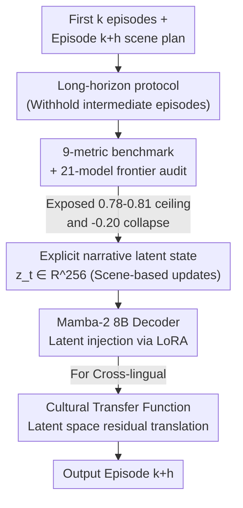

# NarrativeWorldBench: A Frontier-Saturated Benchmark and a Latent World Model for Long-Horizon Co-Creative Audio Drama

**Conference**: ICML 2026  
**arXiv**: [2606.17391](https://arxiv.org/abs/2606.17391)  
**Code**: To be confirmed (Authors state benchmarks / model weights / harness / Cultural Transfer Function will be released)  
**Area**: LLM Evaluation / Long-Horizon Narrative Generation / State-Space Models  
**Keywords**: Long-Horizon Narrativity, Plot Beats, World Models, Mamba-2, Cross-Cultural Localization

## TL;DR
The authors developed NarrativeWorldBench, a nine-metric benchmark for testing structural consistency in "long-form serialized script continuation." They found that 21 frontier LLMs collectively hit a ceiling in Plot-Beat F1 between $[0.78,0.81]$, with performance dropping by $-0.20$ when the horizon extends to 200 episodes. To address this, they proposed N-VSSM, a world model utilizing Mamba-2 to maintain a 256-dimensional explicit narrative latent state. N-VSSM achieves an F1 $\geq 0.84$ with $4\times$ lower compute and is preferred by professional screenwriters with a 71% probability.

## Background & Motivation

**Background**: Long-form serialized audio dramas (audio plays/fictional podcasts) represent a massive creative medium, with over 60,000 active series globally and ~2 billion monthly listeners. A single storyline often spans 200 to 800 episodes. The primary challenge in this medium is not "single-episode quality" but the **horizon**: maintaining storyline coherence over hundreds of episodes while incorporating real-time guidance from screenwriters.

**Limitations of Prior Work**: Existing long-context benchmarks (LongBench, RULER, NoCha, FActScore, L-Eval) focus on retrieval, factual recall, or summarization (information retrieval capabilities). **None evaluate structural narrative consistency during co-creative continuation**, such as whether the model resolves foreshadowing, maintains character personas, or adheres to world-building rules.

**Key Challenge**: Long-horizon serialized narration is essentially a **partially observable process**. Its latent states (character relationships, unresolved foreshadowing, motifs, emotional arcs) cannot be recovered from local contexts alone. Therefore, simply scaling model size or inference budgets fails to break the performance ceiling because information is not carried forward structurally and is forgotten as context decays.

**Goal**: (1) Create a benchmark capable of quantifying long-horizon structural consistency; (2) Audit where current frontier models fail; (3) Provide a methodology to surpass the existing ceiling.

**Key Insight**: If the root cause of the ceiling is that the "latent state is unrecoverable from the local context," the solution should not be a larger passive decoder, but rather an **explicit, updatable, low-dimensional narrative latent state** attached to the model. This allows long-horizon information to be carried with bounded forgetting. Similarly, cross-linguistic cultural alignment can be treated as a **representation translation** within the latent space.

**Core Idea**: A narrative world model, N-VSSM, composed of a Mamba-2 backbone and a 256-dimensional event-conditioned latent variable updated per scene. This explicitly stores and propagates narrative states to resist structural collapse over long horizons.

## Method

This paper consists of two parts: the **NarrativeWorldBench** (including a frontier audit) and the **N-VSSM model**. The former defines the evaluation protocol and exposes performance ceilings/collapses, while the latter provides the solution.

### Overall Architecture

The evaluation protocol for NarrativeWorldBench provides the model with the first $k$ episodes plus a structured scene plan for episode $k+h$. The model is then required to write episode $k+h$, with episodes $k+1\dots k+h-1$ **completely withheld**. This cleanly isolates whether the model can carry narrative states across $h$ episodes rather than just retrieving or copying existing text. Scoring is performed across $h\in\{10,20,50,100,200\}$ using 9 automated metrics, including an expansion to 4 Indian languages for cross-cultural evaluation.

N-VSSM is the only system tested that surpasses the ceiling. It attaches an explicit narrative latent variable $z_t\in\mathbb{R}^{256}$ to a Mamba-2 8B decoder, updating at every scene boundary. The posterior is driven by event triplets, and the latent state is injected back into the generation via low-rank adapters. For cross-lingual tasks, a lightweight Cultural Transfer Function performs latent space translation.

### Key Designs

**1. Nine-Metric Long-Horizon Narrative Benchmark: Operationalizing "Structural Consistency"**

To address the lack of structural narrative measurement, the authors deconstructed "story coherence" into 9 automated, reproducible metrics. The primary metric is **Plot-Beat F1**, calculated using a 14-category Save-the-Cat framework (opening image, catalyst, midpoint, etc.), with beats extracted by a held-out ensemble of judge models. Other metrics target specific failure modes: character voice consistency (cosine distance of persona embeddings), world-building rule violations (checked against a series bible), foreshadowing resolution rate (proportion of setup resolved within $h$ episodes), temporal coherence (event order violations), motif recurrence (KL divergence of motif distributions), emotional arc alignment (DTW of valence/arousal trajectories), dialogue attribution accuracy, and motif survival. The corpus includes 1,204 instances from 38 CC-BY/CC-BY-SA series across six genres, with median lengths of 178 episodes.

**2. Frontier Audit: Revealing the $[0.78,0.81]$ Ceiling and $-0.20$ Horizon Collapse**

The authors audited 21 systems across 5 tiers (GPT-3.5/Llama-2, DOC/Dramatron/Re3, Llama-3.1-405B/DeepSeek-V3, Claude Opus 4.5/GPT-5/Gemini-2.5-Pro, and o3-Pro/DeepSeek-R1). Two findings were critical: first, at $h=50$, **frontier closed-source and reasoning models were clusterd within $[0.78,0.81]$**, with Welch t-tests showing no significant differences ($p>0.13$) across 28 pairs. This indicates that neither scale nor reasoning budget breaks this wall. Second, **every frontier system showed a monotonic drop of $-0.18$ to $-0.21$ in F1 from $h=10$ to $h=200$** ($p<10^{-4}$), confirming that long-horizon consistency is not a scaling-solveable problem.

**3. N-VSSM: Explicit Narrative World Model via Event-Conditioned Latents**

To counter the "irrecoverable latent state" problem in passive decoders, N-VSSM adds an explicit latent variable $z_t\in\mathbb{R}^{256}$ to the Mamba-2 8B decoder, **updated per scene**. At scene boundaries, an event extractor produces triplets $e_t=(\text{actor},\text{action},\text{object},\text{location},\text{outcome})$, and the latent posterior is defined as:

$$q_{\phi}(z_t\mid z_{t-1},e_t,h_t)=\mathcal{N}\bigl(\mu_{\phi},\operatorname{diag}(\sigma^2_{\phi})\bigr),$$

where $h_t$ is the Mamba-2 hidden state. During generation, $z_t$ is injected via cross-attention through low-rank adapters inserted every 4th Mamba-2 block. The model is pre-trained on 480B English fiction tokens and fine-tuned on 1.8 million serialized scenes with a loss function consisting of negative ELBO (with KL annealing) and a foreshadowing resolution auxiliary loss. **The key advantage is carrying long-horizon information in a low-dimensional, updatable, bounded container**, preventing decay over long contexts. N-VSSM 8B uses only 17 H100-seconds per episode, ~ $0.24\times$ that of frontier models like GPT-5.

**4. Cultural Transfer Function: Cultural Alignment as Latent Space Translation**

To avoid expensive decoder re-training for localization, the authors learned a residual transform $T_l:\mathbb{R}^{256}\to\mathbb{R}^{256}$ (a 2-layer MLP) for each target language $l$. It is trained on 24k pairs of English-target language scenes using contrastive loss and divergence penalties. This **shifts the latent state into the representation region of the target culture without modifying the decoder**. This reduces "cultural alignment" to a low-cost transformation, increasing native speaker alignment scores by $+0.20\sim+0.23$ Likert with only 28 H100-hours of training per language.

### Loss & Training
**Pre-training**: Mamba-2 8B backbone pre-trained on 480B tokens of deduplicated English fiction (3,600 H100-days). **Fine-tuning**: Joint training with latent modules on 1.8M serialized scenes; Loss = negative ELBO (KL annealing) + foreshadowing resolution loss (9.4 days on 384 H100s). **Cultural Transfer Function**: 28 H100-hours per language. All training utilized strict series-level splits to prevent data leakage.

## Key Experimental Results

### Main Results

N-VSSM is the only system to surpass the ceiling and shows minimal decay over long horizons. The table below shows Plot-Beat F1 at $h=50$ (mean $\pm$ 95% CI):

| Model | Plot-Beat F1 ($h=50$) | Note |
| :--- | :--- | :--- |
| GPT-5 | $0.81\pm0.02$ | Upper bound of closed-source frontier |
| Claude Opus 4.5 | $0.80\pm0.02$ | Closed-source frontier |
| Gemini-2.5-Pro | $0.79\pm0.02$ | Closed-source frontier |
| o3-Pro | $0.79\pm0.02$ | Reasoning model |
| DeepSeek-R1 | $0.78\pm0.02$ | Reasoning model |
| Llama-3.1-405B | $0.71\pm0.02$ | Open-source frontier |
| DOC (Llama-3-70B) | $0.62\pm0.03$ | Narrative baseline |
| **N-VSSM (Ours, 8B)** | $\mathbf{0.86\pm0.02}$ | **Only system above the ceiling** |

Visualizing collapse across horizons: Frontier systems drop ~0.20 F1 from $h=10$ to $h=200$, whereas N-VSSM remains stable.

| Model | $h=10$ | $h=50$ | $h=100$ | $h=200$ | Net Drop |
| :--- | :--- | :--- | :--- | :--- | :--- |
| GPT-5 | 0.93 | 0.81 | 0.76 | 0.73 | $-0.20$ |
| Claude Opus 4.5 | 0.92 | 0.80 | 0.74 | 0.71 | $-0.21$ |
| o3-Pro | 0.92 | 0.79 | 0.73 | 0.71 | $-0.21$ |
| **N-VSSM** | 0.89 | 0.86 | 0.85 | **0.84** | $-0.05$ |

In terms of compute, N-VSSM 8B requires 17 H100-seconds/ep, compared to ~72 seconds for GPT-5. At $h=200$, its primary advantages are in structural metrics: foreshadowing resolution ($+0.18$), temporal coherence ($+0.14$), and motif survival ($+0.12$).

### Ablation Study

| Configuration | Key Metric Change | Description |
| :--- | :--- | :--- |
| Full N-VSSM | $h=200$ F1 = 0.84 | Baseline |
| Remove Latent Posterior | $-0.11$ ($h=200$) | Explicit latent state is the primary contributor |
| Swapping Mamba-2 for Transformer | $-0.06$ | Linear temporal backbone provides narrative gains |
| Remove Foreshadowing Loss | Foreshadowing Rate $-0.13$ | Loss directly supports resolution metrics |

### Key Findings
- **Ceiling is independent of scale/reasoning budget**: Closed-source frontier and reasoning models are indistinguishable between $[0.78,0.81]$, suggesting long-horizon structure is a paradigm issue (partial observability) rather than a capacity issue.
- **Explicit latent posterior is the most significant contributor**: Its removal caused a $0.11$ drop at $h=200$, the largest single-point loss in the ablation study.
- **Judge Robustness**: Beat extraction used a majority vote from GPT-4o, Claude Sonnet 4.5, and Gemini-2.5-Flash, achieving Cohen's $\kappa=0.78$ with human annotations.
- **Professional Validation**: In a study with 12 professional screenwriters (240 trials), N-VSSM was preferred with a 71% probability (95% CI $[64\%, 77\%]$) for long-arc consistency.

## Highlights & Insights
- **Diagnosis of narrative failure as a partial observability problem**: The authors avoid blaming insufficient model size, instead proving that latent states are unrecoverable from local context—a clean attribution that dictates the solution (explicit latent states).
- **"Intermediate masking" evaluation protocol**: Providing start and end but withholding the middle effectively isolates "state carrying" from "retrieval/copying," a separation missing in most long-context benchmarks.
- **Cultural alignment as latent translation**: This approach is highly transferable. Any scenario where style or domain can be shifted via a lightweight residual transform on a shared latent space can benefit from this compute-efficient strategy.

## Limitations & Future Work
- **Data Bias**: Open-source corpora lean toward independent productions.
- **Cultural Coverage**: Limited to 4 Indian languages.
- **Judge Overlap**: Potential overlap between judges and some evaluated systems.
- **Sample Size**: The screenwriter study ($n=12$) is relatively small.
- **Future Directions**: Expanding Cultural Transfer Function to linguistically distant groups, end-to-end training of the event extractor to reduce error propagation, and larger-scale screenwriter studies.

## Related Work & Insights
- **Comparison with Long-Context Benchmarks**: While prior benchmarks focus on "can information be retrieved," this work evaluates "can structure be maintained." The fact that frontier models excel at the former but fail at the latter confirms this as a distinct, neglected capability.
- **Comparison with Story Generation (Re3, DOC, Dramatron)**: Earlier works primarily added external structures (planning, searching, or external memory). N-VSSM **internalizes structure** as a low-dimensional latent state within the model itself.
- **Comparison with SSMs (Mamba-2)**: The work leverages Mamba-2 as a decoding backbone, utilizing its linear-time context advantages specifically for carrying narrative state.

## Rating
- Novelty: ⭐⭐⭐⭐⭐ Diagnosing long-horizon failure as partial observability and proposing the dual solution of latent world models and cultural translation is highly innovative.
- Experimental Thoroughness: ⭐⭐⭐⭐⭐ Extensive audit (21 models $\times$ 9 metrics $\times$ 5 horizons), human studies, and ablation experiments.
- Writing Quality: ⭐⭐⭐⭐ Clear logic and rigorous statistics, though some model details are concise.
- Value: ⭐⭐⭐⭐⭐ Identifies a scaling-resistant problem and provides open-source benchmarks/weights for the community.

<!-- RELATED:START -->

<!-- Related papers would go here -->

<!-- RELATED:END -->

## Related Papers

- [\[ICML 2026\] Agent World Model: Infinity Synthetic Environments for Agentic Reinforcement Learning](agent_world_model_infinity_synthetic_environments_for_agentic_reinforcement_lear.md)
- [\[ICLR 2026\] Prompt and Parameter Co-Optimization for Large Language Models](../../ICLR2026/llm_evaluation/prompt_and_parameter_co-optimization_for_large_language_models.md)
- [\[ACL 2026\] Same Voice, Different Lab: On the Homogenization of Frontier LLM Personalities](../../ACL2026/llm_evaluation/same_voice_different_lab_on_the_homogenization_of_frontier_llm_personalities.md)
- [\[ICML 2026\] BESPOKE: Benchmark for Search-Augmented Large Language Model Personalization via Diagnostic Feedback](bespoke_benchmark_for_search-augmented_large_language_model_personalization_via_.md)
- [\[ACL 2025\] TripTailor: A Real-World Benchmark for Personalized Travel Planning](../../ACL2025/llm_evaluation/triptailor_a_real-world_benchmark_for_personalized_travel_planning.md)

<!-- RELATED:END -->
