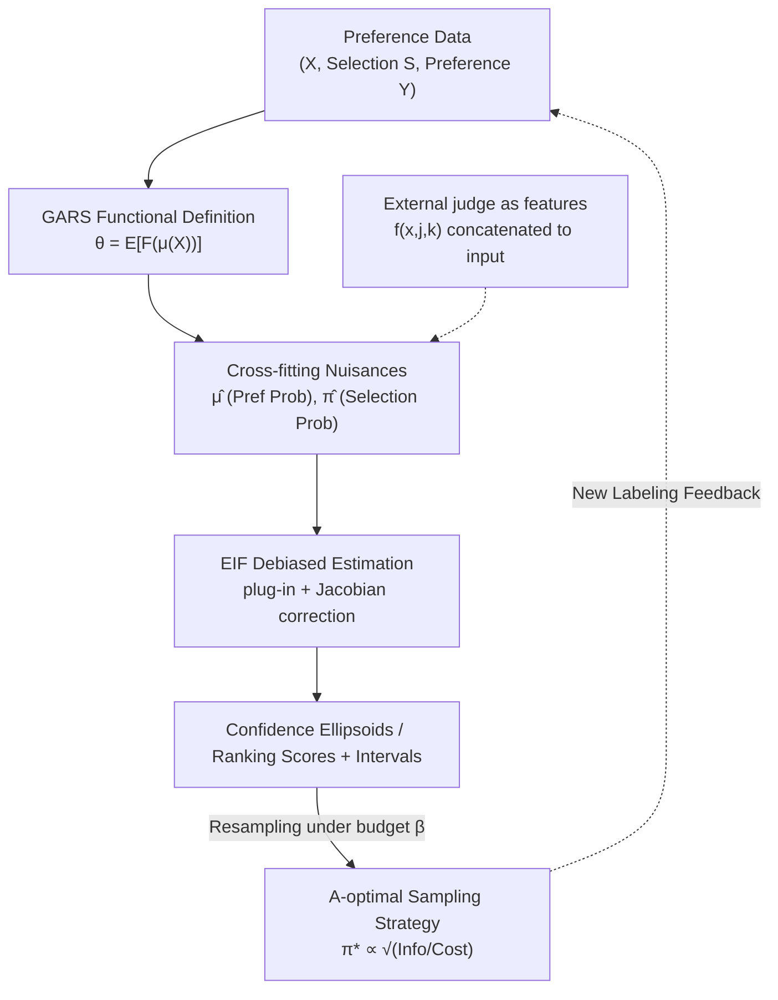

# Nonparametric LLM Evaluation from Preference Data

**Conference**: ICML 2026  
**arXiv**: [2601.21816](https://arxiv.org/abs/2601.21816)  
**Code**: https://github.com/DennisFrauen/NonparametricLLMEval  
**Area**: LLM Evaluation  
**Keywords**: Preference Data Ranking, Debiased Machine Learning, Semiparametric Efficiency, Confidence Intervals, Experimental Design  

## TL;DR
Addressing the issues where current LLM leaderboards rely on parametric Bradley–Terry models and fail to provide valid confidence intervals under model misspecification or when using black-box ML/LLM-as-a-judge, this paper proposes a nonparametric framework **DMLRank**: it abstracts ranking scores as functionals of context-dependent preference probabilities (GARS), applies Debiased Machine Learning to derive asymptotically efficient estimators with valid confidence intervals, and further provides optimal preference collection strategies under budget constraints.

## Background & Motivation
**Background**: The mainstream evaluation paradigm for leaderboards like LM Arena involves generating responses from LLM A and B for the same prompt and having a judge (human crowdsourcing or LLM-as-a-judge) select the better one. In practice, "choosing one of two" is easier and more reliable than "assigning an absolute score." Therefore, the core task of the leaderboard is to infer ranking scores for each model from a set of pairwise comparisons and provide confidence intervals for these scores.

**Limitations of Prior Work**: Preference data only contains **relative information**—one never observes the absolute quality score of a response, only that "A is better than B this time." To transform relative information into ranking scores, most leaderboards (including LM Arena) are built on the parametric **Bradley–Terry (BT) model**: it assumes each model has a latent score $r_j(x)$, and the preference probability is additively separable on the logit scale, $\mu_{jk1}(x)=\sigma\big(r_j(x)-r_k(x)+b(x)\big)$.

**Key Challenge**: Parametric BT models have three unavoidable flaws: (i) **Bias due to model misspecification**: If actual preferences contain cycles (A>B>C>A) or the BT link function does not hold, the estimation is incorrect; (ii) **Incompatibility with flexible ML**: Once black-box models like neural networks are used to fit context-dependent $r_j(x)$, standard asymptotic inference guarantees are broken, and confidence intervals are no longer valid; (iii) **Difficulty in fusing proxy labels**: Modern evaluations often mix a small number of high-quality human labels with a large volume of cheap auto-rater/LLM-as-a-judge proxy labels, but maintaining valid inference while fusing these signals within a parametric model is not straightforward.

**Goal**: Establish a **nonparametric framework with valid confidence intervals** that can incorporate arbitrary black-box ML estimators, integrate external judges, and guide "which comparisons to annotate" given a budget.

**Core Idea**: Instead of defining the ranking score as a parameter of a specific parametric model, it is defined directly as a **known functional of the preference probability $\mu(X)$**, $\theta=\mathbb{E}[F(\mu(X))]$. Estimating $\theta$ then only requires estimating $\mu$ (using any black-box model) and applying Debiased Machine Learning (DML) to correct the plug-in bias, achieving semiparametrically efficient estimation and valid intervals.

## Method

### Overall Architecture
DMLRank aims to estimate ranking scores for $K$ models from pairwise preference data $\mathcal{D}=\{(x_i,s_i,\tilde y_i)\}$ and provide valid confidence intervals. The process consists of three layers: **abstracting the ranking objective as a functional of preference probabilities (GARS)**, **using a debiased estimator (based on the Efficient Influence Function, EIF) for estimation with valid intervals**, and **guiding the optimal budget allocation for new preference collection**.

Two nuisances are estimated: preference class probabilities $\mu_{jkc}(x)=\mathbb{P}(Y_{jkc}=1\mid X=x)$ (the probability of falling into class $c$—e.g., "j wins/k wins/tie"—for pair $(j,k)$ and context $x$), and selection probabilities $\pi_{jk}(x)=\mathbb{P}(S_{jk}=1\mid X=x)$ (whether the pair was labeled). The workflow involves estimating $\hat\mu$ and $\hat\pi$ via cross-fitting, substituting them into the debiasing formula to obtain $\hat\theta_{\mathrm{EIF}}$, and constructing confidence ellipsoids using its covariance.

### Key Designs

**1. GARS: Defining ranking scores as functionals to unify various ranking metrics**

The fundamental problem with parametric BT is tying the ranking objective to a specific model. This work defines the Generalized Average Ranking Score (GARS) as $\theta=\mathbb{E}[F(\mu(X))]$ for a **known** function $F:[0,1]^{K\times K\times C}\to\mathbb{R}^d$. This abstraction allows various ranking criteria by changing $F$:

- **BT Projection**: $F(\mu(x))=H(H^\top L_0 H)^{-1}H^\top B^\top \ell(\mu(x))$, where $L_0$ is the Laplacian and $\ell$ is the log-odds vector. This projects log-odds into the score space, recovering $\mathbb{E}[r(X)]$ if BT holds.
- **Borda / Win Rate Score**: $F_j(\mu(x))=\frac{1}{2(K-1)}\sum_{k\neq j}(\mu_{jk1}(x)+\mu_{kj2}(x))$, the average probability of model $j$ being preferred.
- **Rank Centrality (RC)**: Constructing a transition matrix $T(\mu(x))$ and using its stationary distribution. This naturally tolerates preference cycles.

Since GARS does not assume parametric links, it is naturally robust to BT misspecification. Rankings are decoupled into a classification problem of estimating $\mu$.

**2. EIF Debiased Estimator: Correcting plug-in bias for valid confidence intervals**

A naive plug-in approach $\hat\theta=\frac1n\sum_i F(\hat\mu(x_i))$ propagates estimation errors from $\hat\mu$ to $\hat\theta$, leading to invalid interval coverage. This work derives the **Efficient Influence Function (EIF)** for $\theta$:

$$\phi(O,\eta,\theta)=F(\mu(X))-\theta+\sum_{j\neq k}\frac{S_{jk}}{\pi_{jk}(X)}\,J_{jk}(\mu(X))\big(Y_{jk}-\mu_{jk}(X)\big)$$

where $J_{jk}(\mu)=\nabla_{\mu_{jk}}F(\mu)$ is the Jacobian. The one-step debiased estimator $\hat\theta_{\mathrm{EIF}}$ is constructed, which is asymptotically efficient and normally distributed $\sqrt n(\hat\theta_{\mathrm{EIF}}-\theta)\to\mathcal{N}(0,\Sigma)$. The estimated $\hat\Sigma$ provides valid confidence ellipsoids $\mathcal{E}=\{\vartheta: n(\hat\theta-\vartheta)^\top\hat\Sigma^{-1}(\hat\theta-\vartheta)\le\chi^2_{d,1-\alpha}\}$.

The correction term uses $1/\pi_{jk}$ to weight pairs that are rarely labeled (similar to AIPTW in causal inference) and uses the Jacobian $J_{jk}$ to adjust the correction strength based on the impact of the pair on $\theta$.

**3. Cross-fitting + judge-as-features: Safely integrating external judges**

To maintain asymptotic guarantees, $\hat\mu$ and $\hat\pi$ are estimated via **cross-fitting**: the data $\mathcal{D}$ is split into $V$ folds, and nuisances for each fold are trained on the remaining data to avoid overfitting. For external judges (auto-raters), this work uses **judge-as-features**: judge predictions $f(x,j,k)$ are concatenated into the model input $\tilde x_i=(x_i,f(x_i,j,k))$. This approach is **adaptive**: if the judge is high-quality, $\hat\mu$ learns to utilize it; if low-quality, $\hat\mu$ ignores it, maintaining consistency and valid intervals.

**4. A-optimal Sampling Strategy: Allocating annotation budget effectively**

Given a cost $c_{jk}$ for labeling pair $(j,k)$ and total budget $\beta$, how should one design $\pi$ to minimize the variance of the debiased estimator? The A-optimal strategy (minimizing $\mathrm{tr}(\Sigma(\pi))$) yields a closed-form solution:

$$\pi^*_{jk}(x)=\mathrm{clip}_{[\alpha,1]}\sqrt{\frac{\mathrm{tr}\big(J_{jk}(\mu(x))V_{jk}(\mu(x))J_{jk}(\mu(x))^\top\big)}{\lambda_A\,c_{jk}}}$$

where $V_{jk}(\mu(x))=\mathrm{Var}(Y_{jk}\mid X=x)$. This strategy assigns higher probability to pairs with high intrinsic information (high variance $V_{jk}$, i.e., human disagreement) and high impact on the target $\theta$ (large Jacobian $J_{jk}$), while penalizing expensive pairs.

### Loss & Training
The core is a **two-stage semiparametric estimation process**: stage one uses cross-fitting to train nuisance models (using LightGBM for classification with 3-fold CV); stage two computes the debiased estimator $\hat\theta_{\mathrm{EIF}}$ and the covariance $\hat\Sigma$. Multiple testing corrections are applied for 95% simultaneous confidence intervals.

## Key Experimental Results

### Main Results
On synthetic data, the debiased estimator was compared against the plug-in estimator across three GARS types. The debiased estimator consistently outperformed in terms of error and coverage, with coverage nearing the target 95%, while the plug-in approach failed significantly.

| GARS | Estimator | Error ($n{=}1000$) | Coverage ($n{=}1000$) | Error ($n{=}3000$) | Coverage ($n{=}3000$) |
|------|-----------|--------------------|-----------------------|--------------------|-----------------------|
| Borda | Plug-in | 0.38 | 0.17 ❌ | 0.10 | 0.15 ❌ |
| Borda | Debiased | **0.15** | **0.94** ✅ | **0.05** | **0.97** ✅ |
| BT | Plug-in | 0.62 | 0.09 ❌ | 0.22 | 0.05 ❌ |
| BT | Debiased | **0.25** | **0.90** ✅ | **0.08** | **0.90** ✅ |
| RC | Plug-in | 0.52 | 0.12 ❌ | 0.18 | 0.05 ❌ |
| RC | Debiased | **0.27** | **0.91** ✅ | **0.09** | **0.95** ✅ |

### Ablation Study
A-optimal sampling vs. uniform random sampling (budget $\beta=2000$, ranking MSE, $\times10^2$): A-optimal achieved lower MSE across all GARS. Misspecified BT experiments showed that while a BT-specific debiased estimator is best when BT holds, the **debiased projection estimator** is superior under misspecification.

| Sampling Strategy | Borda | BT | Rank Centrality |
|-------------------|-------|-----|-----------------|
| A-optimal Strategy | **0.130** | **2.861** | **0.017** |
| Random Strategy | 0.141 | 2.974 | 0.020 |

### Key Findings
- **Debiasing is critical for valid coverage**: Plug-in estimators often yield incorrect coverage despite low error; debiasing restores it to ~95%.
- **Judge-as-features is monotonically beneficial**: Higher judge quality yields lower estimation error without risking consistency for low-quality judges.
- **Real-world applicability**: On Chatbot Arena data ($n=32980$, $K=20$), using toxicity probabilities and TF-IDF features, DMLRank provided simultaneous confidence intervals and identified shifts in model rankings compared to standard baselines.

## Highlights & Insights
- **Functional abstraction is the core**: Abstracting BT, Borda, and RC into $\mathbb{E}[F(\mu(X))]$ allows black-box ML to be safely used for leaderboard inference.
- **Jacobian-weighted correction**: The correction strength automatically scales with the impact of each pair, ensuring efficiency and scalability.
- **Robust judge integration**: Treating judges as input features allows the framework to fuse scarce human labels with cheap proxy labels without sacrificing inference validity.
- **Experimental design synergy**: The A-optimal closed-form solution transforms statistical efficiency into an actionable data collection strategy.

## Limitations & Future Work
- **Reliance on nuisance quality**: Validity depends on standard semiparametric assumptions like positivity and MAR (Missing At Random).
- **Context representation bottleneck**: Using simple features like TF-IDF might be crude; stronger context encoders could improve results but complicate nuisance estimation.
- **Scalability**: While demonstrated for $K=20$, computational costs for larger model pools need further validation.

## Related Work & Insights
- **vs. Parametric BT (LM Arena)**: Those use fixed parameter links and are biased under misspecification; Ours is nonparametric and remains valid.
- **vs. PPI / Semi-supervised Eval**: Those focus on specific metrics; Ours provides a unified EIF framework for multiple ranking objectives and optimal collection.
- **vs. Semiparametric BT Inference**: Those are still tied to BT-type score models; DMLRank is more flexible in objective and data acquisition.

## Rating
- Novelty: ⭐⭐⭐⭐⭐ 
- Experimental Thoroughness: ⭐⭐⭐⭐ 
- Writing Quality: ⭐⭐⭐⭐ 
- Value: ⭐⭐⭐⭐⭐ 

<!-- RELATED:START -->

## Related Papers

- [\[ICML 2026\] RouteJudge: An Open Platform for Reproducible and Preference-Aware LLM Routing](routejudge_an_open_platform_for_reproducible_and_preference-aware_llm_routing.md)
- [\[ICLR 2026\] Preference Leakage: A Contamination Problem in LLM-as-a-judge](../../ICLR2026/llm_evaluation/preference_leakage_a_contamination_problem_in_llm-as-a-judge.md)
- [\[ICLR 2026\] Unpacking Human Preference for LLMs: Demographically Aware Evaluation with the HUMAINE Framework](../../ICLR2026/llm_evaluation/unpacking_human_preference_for_llms_demographically_aware_evaluation_of_long-fo.md)
- [\[ICML 2026\] Resolution Diagnostics for Paired LLM Evaluation](resolution_diagnostics_for_paired_llm_evaluation.md)
- [\[ICLR 2026\] Subliminal Signals in Preference Labels](../../ICLR2026/llm_evaluation/subliminal_signals_in_preference_labels.md)

<!-- RELATED:END -->
