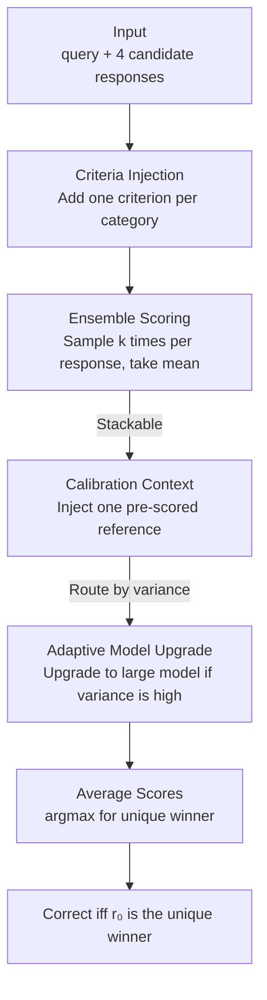

# On Cost-Effective LLM-as-a-Judge Improvement Techniques

**Conference**: ICML 2026  
**arXiv**: [2604.13717](https://arxiv.org/abs/2604.13717)  
**Code**: https://github.com/composo-ai/llm-judge-criteria-ensembling  
**Area**: LLM Evaluation  
**Keywords**: LLM-as-a-judge, ensemble scoring, scoring criteria, calibration, cost-precision trade-off  

## TL;DR
Addressing the issue that LLM-as-a-judge accuracy depends heavily on prompts and aggregation strategies but lacks systematic evidence on "which tricks are truly cost-effective," this paper adopts a unified perspective of "noise control for stochastic judges" on RewardBench 2. It systematically compares four drop-in techniques: **ensemble scoring, task-specific scoring criteria, calibration context, and adaptive model upgrading**. The study finds that combining "criteria injection (nearly zero cost) + ensemble scoring" achieves up to 85.8% accuracy (+13.5pp over baseline), dominating the cost-precision Pareto frontier and outperforming calibration and model upgrading.

## Background & Motivation
**Background**: LLM-as-a-judge has become the mainstream automatic evaluation method in RLHF reward modeling, benchmarks, and online quality monitoring—where a judge model scores or ranks candidate responses to provide rewards or evaluation signals.

**Limitations of Prior Work**: Judge reliability fluctuates significantly across different prompting strategies and aggregation methods. Previous research has identified several systematic failure modes (position bias, verbosity bias, divergence from human judgment), and the community has proposed various improvements (ensembling, criteria, calibration, routing). However, there is a **lack of horizontal evidence on "which trick is worth using and at what cost" under a unified benchmark and cost metric**. Practitioners often do not know which tricks to stack.

**Key Challenge**: There is a trade-off between evaluation accuracy and invocation cost—ensembling multiple samples improves precision but multiplies expenses, adding criteria is nearly free but its efficacy is unknown, and calibration or routing seems reasonable but may not offer incremental gains. The question is: **Given the same cost budget**, which techniques truly push the Pareto frontier?

**Goal**: To systematically compare four drop-in techniques on RewardBench 2 (RB2) under the same evaluation protocol and cost metric, including a "all-stacked" condition to test additivity, and provide actionable cost-precision conclusions.

**Key Insight**: The authors view these four techniques through a unified lens—**noise control for a "stochastic judge."** When temperature $>0$, the judge's score for a response follows a distribution, and a single sample is a noisy observation: Ensemble = Monte Carlo averaging of single-call noise; Criteria Injection = Sharpening the distinction between responses; Variance of scores = Uncertainty signal (for routing).

**Core Idea**: Instead of stacking complex techniques, it is better to systematically quantify the cost-precision of "noise control." The conclusion is that the combination of **criteria injection + ensemble** captures almost all gains, and small models benefit particularly from ensembling, making "high-precision judges" accessible at low costs.

## Method

### Overall Architecture
The evaluation protocol is fixed: each sample in RB2 contains a query and 4 candidate responses $r_0,\dots,r_3$ ($r_0$ is always the correct answer). The judge $f$ assigns an integer score of 1–10 to each response. The predicted winner is the response with the **strictly highest** average score; it is correct only if $r_0$ is the unique winner (any tie is considered an error—this conservative tie-breaking rule avoids rewarding judges that cannot distinguish quality). All four drop-in techniques are modifications to the "judge call" and can be used individually or stacked.

### Key Designs

**1. Ensemble Scoring: Monte Carlo averaging of single-call noise**

A single sample score is a noisy draw from the judge's distribution, with high variance leading to incorrect selections. Ensemble scoring requests $k$ independent completions for each response via the API `n` parameter, taking the mean before selecting the winner:

$$\hat y=\operatorname*{arg\,max}_i\;\bar s_i,\qquad \bar s_i=\frac1k\sum_{j=1}^k s_{ij}$$

The mean is a Monte Carlo estimate of the expected score; variance decreases as $k$ increases, raising accuracy. Experiments use $k=8$. This also drastically lowers the tie rate (as it requires 4 means to be exactly equal), reducing the "full" category tie rate from 20.4% at $k=1$ to 4.5% at $k=8$. The cost is a linear increase in output tokens (input tokens are shared via `n`), roughly 5× baseline cost for full $k=8$.

**2. Task-Specific Scoring Criteria Injection: Sharpening distinctions at near-zero cost**

The baseline RB2 prompt asks the judge to generally consider "helpfulness, relevance, accuracy, depth, creativity, and detail." However, different categories require different priorities—math problems require logical correctness rather than creativity, and safety problems require appropriate refusals. Criteria injection **appends a category-specific criterion** (e.g., Math: "Focus on whether the mathematical reasoning is logically valid, steps are correct, and the final answer is accurate"). One criterion is used for each of the five categories, fixed before data collection to prevent overfitting.

This is nearly free—adding only a few input tokens without changing the scoring protocol—yet it focuses the judge's attention on the "dimensions that truly matter for that category," sharpening distinctions. At $k=1$, adding criteria alone gives +3.0pp (74.7%, paired bootstrap $P(\text{criteria}>\text{baseline})>0.999$), with gains primarily from Math (+12.0pp) and Safety (+3.3pp). Crucially, it is **orthogonal** to ensembling: at $k=8$, criteria still contributes +2.1pp, whereas calibration offers no incremental gain.

**3. Calibration Context: Injecting pre-scored reference examples to anchor scale**

LLM judges are sensitive to anchoring effects—a response might be scored differently based on previously seen examples. Calibration context randomly selects a same-category example for each query, uses the full model at $k=1$ to score its correct answer, and then injects this reference score as context to anchor the scale for the four candidates, reducing inter-query variance. Four variants were tested: high (correct answer), low (incorrect answer), both (both examples to show full range), and cross-category (as a control for category specificity).

The result is "effective but not incremental": at $k=1$, all variants gain +1–2pp over baseline, with "low" slightly better than "high" (73.8% vs 72.4%, suggesting anchoring to a known bad example is more discriminative). Cross-category performed similarly to same-category (indicating gains from general scale anchoring rather than category transfer). However, at $k=8$, all variants fell within ±0.2pp of purely ensembling (81.5%)—ensembling already suppresses enough noise that anchoring becomes redundant.

**4. Adaptive Model Upgrade: Using score variance as an uncertainty signal for routing (Negative Result)**

Mini models are ~3× cheaper but weaker than full models. If one could identify samples where mini might fail and route only those to full, costs could be saved. The authors used the **per-response score variance** $\sigma_i=\mathrm{std}(s_{i,1},\dots,s_{i,k})$ from mini as a routing signal, as variance correlates weakly but systematically with correctness ($r=-0.13$, AUC=0.60 as an error classifier). Three strategies were tested: hard variance routing, sigmoid soft blending, and variance-driven adaptive ensemble.

**None of the three are recommended.** Section 5.1 analysis notes that per-response variance is too weak an uncertainty signal; routing gains do not outweigh simply using "Criteria + Ensemble." On the Pareto frontier, soft blending (80.2%, 6.1× cost) and variance-driven ensemble (74.9%, 1.6× cost) are dominated by "Criteria + Ensemble" at equal or lower costs. This is an honest negative result: variance-based routing sounds reasonable but is not cost-effective in practice.

## Key Experimental Results

### Main Results
RB2 contains 1753 samples across 5 categories. Models include full/mini/nano tiers from GPT-5.4 and Claude. Costs are anchored to "GPT-5.4 full, $k=1$" as 1.0×.

| Condition | Model | Overall Accuracy (95% CI) | Cost | vs Baseline |
| :--- | :--- | :--- | :--- | :--- |
| Baseline ($k=1$) | GPT-5.4 | 71.7% (±2.1) | 1.0× | — |
| Criteria ($k=1$) | GPT-5.4 | 74.7% (±2.1) | 1.1× | +3.0pp |
| Ensemble ($k=8$) | GPT-5.4 | 81.5% (±1.8) | 5.0× | +9.8pp |
| Criteria+Ensemble ($k=8$) | GPT-5.4 | 83.6% (±1.7) | 5.3× | +11.9pp |
| Mini ($k=8$) | Haiku 4.5 | 84.8% (±1.7) | 1.3× | +13.1pp |
| **Criteria (mini $k=8$)** | **Haiku 4.5** | **85.8% (±1.7)** | **1.3×** | **+13.5pp** |
| Nano ($k=8$) | GPT nano | 71.4% (±2.1) | 0.4× | -0.3pp |

### Ablation Study (Dominated Techniques)

| Condition | Model | Overall Accuracy | Cost | Conclusion |
| :--- | :--- | :--- | :--- | :--- |
| Calibration low ($k=8$) | GPT-5.4 | 81.7% | 5.6× | ≈ Ensemble only, no gain |
| Combined (All 4) | GPT-5.4 | 82.6% | 6.8× | Worse than Criteria+Ensemble (83.6%) and pricier |
| Soft blend (Test set) | GPT-5.4 | 80.2% | 6.1× | Dominated |
| Variance-informed | GPT-5.4 | 74.9% | 1.6× | Dominated |

### Key Findings
- **Criteria + Ensemble capture almost all gains**: The two are orthogonal; together they provide +11.9pp (83.6%) for full models. Stacking all four actually dropped to 82.6% while being more expensive, indicating calibration/routing offered no orthogonal value.
- **Small models benefit most from ensembling**: Absolute gains from ensembling increase as base capability decreases (+9.8pp for full, +14.4pp for mini, +19.1pp for nano). Mini+Criteria (81.5%) matches full $k=8$ ensemble at roughly 1/4 the cost, with a peak of 85.8% (Haiku mini) outperforming the best full ensemble in the panel.
- **Diminishing returns for ensembling**: Most gains are achieved by $k=3$; increasing $k$ further yields smaller improvements—it "raises the floor but not the ceiling," as nano $k=8$ remains 7.8pp below mini $k=8$.
- **Precise IF is the hardest category**: Accuracy is lowest across all conditions (baseline only 34.0%), showing format constraints are most difficult for judges.
- **Cross-vendor generalizability**: Conclusions hold for both OpenAI GPT and Anthropic Claude models.

## Highlights & Insights
- **The "Noise Control" perspective is comprehensive**: It unifies ensemble (averaging), criteria (sharpening), and variance (uncertainty) into a single framework, providing mechanistic explanations for why they work or fail.
- **"Nearly zero-cost criteria injection (+2-3pp)" is a high-ROI trick**: Just appending a one-sentence category criterion without protocol changes provides significant orthogonal gains and should be a standard part of any LLM-as-a-judge pipeline.
- **Small Model + Ensemble + Criteria = High-Precision, Low-Cost Judge**: Mini+Criteria achieves parity with full ensembles at 1/4 the cost, offering high value for budget-sensitive online evaluation.
- **Transparent reporting of negative results**: Explicitly stating that adaptive model upgrading and stacking all techniques are not recommended prevents the community from blindly stacking complex methods.

## Limitations & Future Work
- **Verification limited to RB2**: RB2 uses a specific best-of-4, integer 1–10 protocol; whether conclusions transfer to pairwise comparison, continuous scoring, or open-ended generation requires further study.
- **Cost proxied by API pricing**: Since weights are not public for closed-source models, the authors used API pricing as a proxy and reported ratios; absolute costs may shift with vendor pricing.
- **Weak variance as a routing signal**: $r=-0.13$ and AUC=0.60 show the limited discriminative power of per-response variance. Stronger signals (e.g., entropy of answer distributions, cross-sample consistency) might make routing viable.
- **Content filtering impacts**: Some queries were refused by filters, leading to small differences in sample size ($N=1700$–1746). Though rankings remained stable on the intersection ($N=1710$), safety category comparisons are slightly affected.
- **Manually fixed criteria**: While nearly free, the quality of criteria depends on human design. Automatically generating or optimizing category criteria is a natural extension.

## Related Work & Insights
- **vs Self-Consistency (Wang et al. 2023) / Panel-of-Judges (Verga et al. 2024)**: While others use majority voting on reasoning paths or panels of different models, this work focuses on "multiple samples of the same model taking the mean" and systematically maps the cost-precision curves across model tiers.
- **vs G-Eval (Liu et al. 2023) / Generative Judges (Li et al. 2024)**: These methods rely on CoT, form-filling, or generating detailed rationales with high prompt complexity. This paper demonstrates that a minimalist approach—adding a single sentence of criteria—can capture major gains.
- **vs FrugalGPT (Chen et al. 2024)**: FrugalGPT uses a cascade from cheap to expensive models based on confidence. This paper tests variance-driven routing in the judging context and concludes it is currently not worthwhile compared to criteria + ensemble.

## Rating
- Novelty: ⭐⭐⭐ The techniques are mostly known; the novelty lies in the "noise control" perspective and the systematic cost-precision cross-comparison.
- Experimental Thoroughness: ⭐⭐⭐⭐ 1753 samples × multiple model tiers × two vendors × bootstrap CI, including combinations and multiple routing variants.
- Writing Quality: ⭐⭐⭐⭐ Clear structure, honest reporting of negative results, and well-defined cost metrics.
- Value: ⭐⭐⭐⭐ Directly answers which tricks are most cost-effective for judge pipelines, providing strong practical value for engineering.

<!-- RELATED:START -->

## Related Papers

- [\[ICML 2026\] Reasoning Is Not Free: Robust Adaptive Cost-Efficient Routing for LLM-as-a-Judge](reasoning_is_not_free_robust_adaptive_cost-efficient_routing_for_llm-as-a-judge.md)
- [\[ICML 2026\] REAL: Integrating Regression-Aware Rewards into RL, Teaching LLM-as-a-Judge that "Even a One-Point Difference Matters"](real_regression-aware_reinforcement_learning_for_llm-as-a-judge.md)
- [\[ICLR 2026\] Preference Leakage: A Contamination Problem in LLM-as-a-judge](../../ICLR2026/llm_evaluation/preference_leakage_a_contamination_problem_in_llm-as-a-judge.md)
- [\[ICLR 2026\] BiasScope: Towards Automated Detection of Bias in LLM-as-a-Judge Evaluation](../../ICLR2026/llm_evaluation/biasscope_towards_automated_detection_of_bias_in_llm-as-a-judge_evaluation.md)
- [\[ACL 2026\] Contrastive Decoding Mitigates Score Range Bias in LLM-as-a-Judge](../../ACL2026/llm_evaluation/contrastive_decoding_mitigates_score_range_bias_in_llm-as-a-judge.md)

<!-- RELATED:END -->
