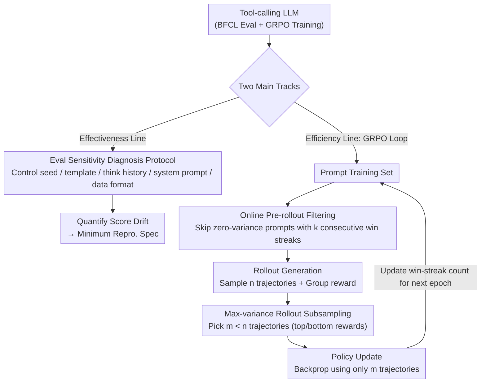

# On Effectiveness and Efficiency of Agentic Tool-calling and RL Training

**Conference**: ICML 2026  
**arXiv**: [2606.00135](https://arxiv.org/abs/2606.00135)  
**Code**: To be confirmed  
**Area**: LLM Agent / Tool-calling / Reinforcement Learning  
**Keywords**: Tool-calling, BFCL, GRPO, Evaluation Reproducibility, RL Efficiency

## TL;DR
The authors systematically examine LLM tool-calling through two dimensions: "evaluation effectiveness" and "training efficiency." Using BFCL as a case study, they demonstrate that "small details" such as random seeds, multi-turn templates, thought history, and system prompts can cause significant drift in leaderboard scores, making cross-paper comparisons unreliable. On the efficiency side, they identify waste in the rollout and policy update stages of RL (GRPO) training and propose a dual-solution: "online pre-rollout filtering + max-variance rollout subsampling." This achieves 1.7× and 2.6× end-to-end speedups in single-turn and multi-turn tool-calling, respectively, without performance degradation.

## Background & Motivation

**Background**: Tool-calling (function calling) has become a core capability of modern LLM agents. The community relies on rankings from benchmarks like BFCL and Tau-bench and generally adopts RL methods such as PPO/GRPO for post-training to improve accuracy and robustness.

**Limitations of Prior Work**: On one hand, evaluation protocols are inconsistent—most tool-calling papers use a single seed, unique multi-turn concatenation methods, and custom system prompts, yet compare absolute scores on leaderboards. On the other hand, RL training is computationally intensive—the context for multi-turn tool-calling is extremely long (containing tool schemas, dialogue history, and tool I/O), leading to wall-clock times for the policy update phase that can be 3–5× higher than the rollout phase.

**Key Challenge**: "Implicit degrees of freedom" in evaluation and "silent waste" in training coexist but are largely ignored. The former causes true methodological gains to be drowned out by evaluation noise; the latter leads to massive computational spending on samples with zero gradients during RL training. This combination makes it difficult for the community to judge which directions are truly worth investing in.

**Goal**: (1) Systematically quantify the sensitivity of tool-calling evaluations like BFCL to implementation details and provide a minimum specification for reproducibility; (2) Locate specific sources of waste in RL tool-calling training and provide low-intrusion acceleration solutions.

**Key Insight**: For evaluation, the authors treat "every undocumented choice in the pipeline" as an independent variable for controlled experiments (seed, template, history, prompt, data format). For training, they decompose GRPO to observe reward variance and wall-clock distribution per step, finding that "zero-variance prompts" account for up to 80% of samples and exhibit significant temporal stability—this empirical observation directly led to the online filtering strategy.

**Core Idea**: Progress in tool-calling must be built on controlled evaluation; RL compute should prioritize prompts that "can still learn something" and rollouts with the "strongest reward contrast."

## Method

### Overall Architecture
Rather than introducing a single new model, the paper performs a "physical checkup" on tool-calling along two trajectories. The effectiveness line executes controlled experiments on five common models (Qwen3-4B/8B, Qwen2.5-7B-Instruct, Llama3.1-8B-Instruct, Llama3.2-3B-Instruct) using BFCL to quantify how much scores drift due to "implicit options." The efficiency line uses the VERL framework to train Qwen2.5-3B-Instruct (single-turn) and Qwen3-4B (multi-turn) with GRPO, identifying waste by decoupling computation and wall-clock time for the rollout and policy update phases.

Both lines utilize the same GRPO formulation: for a prompt $s_{i,k}$, $n$ rollouts $\{y_{i,k+1,j}\}$ are sampled. After receiving rewards, group-relative advantages are computed as $A_{i,k+1,j}=(r_{i,k+1,j}-\bar r_{i,k+1})/\sigma_{i,k+1}$, which enter the clipped objective via the importance ratio $\rho_{i,k+1,j}=\pi_\theta/\pi_{\text{old}}$. When all rollouts for a prompt yield the same reward, $\sigma=0$ and $A\equiv 0$, defining a **zero-variance prompt**—it contributes zero gradient but still consumes a full rollout, making it the primary target for optimization.

### Key Designs

**1. Evaluation Sensitivity Diagnosis Protocol: Quantifying implicit choices in BFCL evaluation.**
The authors perform controlled experiments by varying one variable at a time: (a) Running 10 seeds shows that while single-turn is stable, multi-turn fluctuations are significant, leading the authors to report 3-seed averages. (b) Comparing native templates (turn-by-turn concatenation) with context templates (entire dialogue in a single user turn) reveals that native templates consistently lead by $6\text{–}8\%$ on Qwen3/2.5 models. (c) Retention of `<think>` segments improves multi-turn scores by $3\text{–}5\%$ for Qwen3. (d) Simply adding multi-turn-specific instructions to the system prompt yields gains comparable to entire RL training runs for Qwen3-4B. (e) Fixed budget comparisons (0.7k data) of single-turn vs. multi-turn training counter-intuitively show that pure multi-turn data degrades multi-turn BFCL from 22.7 to 15.9.

**2. Online Pre-rollout Filtering: Skipping prompts that are consistently correct.**
Zero-variance prompts provide zero gain, making their rollout generation wasteful. Since "prompt difficulty" drifts as the policy evolves, static filtering is unfeasible. The authors observe that "all-correct" statuses are temporally stable: the conditional probability $P(\text{still all-correct} \mid \text{all-correct for } k \text{ epochs})$ is $>0.8$ for single-turn and $>0.9$ for multi-turn at $k=1$. They maintain a "win-streak count" $c_{i,k+1}^{(e)}$; if $c \ge k$, the prompt is temporarily removed from the training set $\mathcal{D}^{(e)}=\{s : c_{i,k+1}^{(e)} < k\}$.

**3. Max-variance Rollout Subsampling: Generating $n$ rollouts but using only $m < n$ for updates.**
In tool-calling, the policy update time scales much faster with $n$ than rollout time because sequences are saturated with tool schemas and dialogue history. To balance this, they sample $n$ rollouts to keep a stable group baseline but only use a subset $\mathcal{S}^*$ of $m$ rollouts (the lowest and highest rewards) to maximize reward variance for the update. This reduces policy update computation by approximately $n/m$.

### Loss & Training
- **RL Algorithm**: GRPO, using standard clipping $\epsilon$ from VERL.
- **Framework**: VERL; Qwen2.5-3B-Instruct (single-turn) and Qwen3-4B (multi-turn). 2.3k single-turn and 2.6k multi-turn samples (expanded to 6k for ACEBench).
- **Filtering Hyperparams**: $k=1$ or $2$, rolling updates per epoch.
- **Subsampling Hyperparams**: Typically $n=8, m=4$.
- **Evaluation**: 3-seed average for BFCL; Claude 4 as user simulator with "answer as user" constraints; Overall accuracy for ACEBench.

## Key Experimental Results

### Main Results

Comparison with representable open/closed-source models on BFCL (Qwen3-4B + Stronger Prompt + Our RL, 3-seed avg.):

| Model | Multi-turn | Single-turn | Avg. |
|------|-----------:|------------:|-----:|
| Claude Sonnet 4.5 (FC) | 61.4 | 84.9 | 73.2 |
| Gemini-3-Pro-Preview (FC) | 63.1 | 83.8 | 73.4 |
| GPT-4.1-2025-04-14 (FC) | 38.9 | 76.4 | 57.7 |
| Qwen3-235B-A22B-Instruct-2507 (FC) | 45.4 | 53.2 | 49.3 |
| Qwen3-4B w. BFCL default prompt | 22.7±0.9 | 83.9±0.5 | 53.3±0.5 |
| Qwen3-4B w. stronger prompt | 37.2±1.4 | 84.8±0.7 | 61.0±0.8 |
| **Qwen3-4B-RL (Ours)** | **39.4±0.7** | **84.8±0.9** | **62.1±0.5** |

On ACEBench, Ours RL training improves Qwen3-4B from 65.4 to 77.5 (+12.1), surpassing Nova-1-Lite (73.4).

### Ablation Study

| Configuration | BFCL Multi-turn | Description |
|------|----------------:|------|
| Qwen3-4B base | 22.7 ±0.9 | Default prompt + native template |
| → Context template | ↓ ~6–8% | Same info, different concatenation |
| → Drop `<think>` history | ↓ ~3–5% (Qwen3) | Thinking history affects consistency |
| → Stronger system prompt | 37.2 ±1.4 | Prompt change alone matches RL gains |
| Single-turn only training | 20.2 ±0.6 | Slight single-turn gain, multi-turn flat |
| Multi-turn only training | 15.9 ±0.4 | Multi-turn score drops (supervision noise) |

**Efficiency Ablation**: Under the same wall-clock budget, Ours achieves 1.7× (single-turn) and 2.6× (multi-turn) speedups compared to vanilla GRPO without degrading downstream general tasks (MMLU, TruthfulQA, etc.).

### Key Findings
- **Evaluation fragility matches method gains**: Gains from rewriting system prompts can equal or exceed those from RL training. Leaderboard comparisons without reported prompts/templates/seeds are unreliable.
- **"Multi-turn data is better" is a misconception**: Controlled experiments show that pure multi-turn training can degrade multi-turn BFCL scores, likely due to cumulative errors and ambiguous labels in trajectories.
- **Zero-variance prompts dominate and are stable**: ~80% of prompts yield no gradient signal early on. Success probability after one epoch remains high, allowing safe online filtering.
- **Compute bottleneck is Update, not Rollout**: Tool-calling RL update time dominates even at $n=4$ due to the long context generated by schemas and turn history.

## Highlights & Insights
- **Quantifying Evaluation Degrees of Freedom**: The paper treats engineering details as research objects, proving that "leaderboard numbers $\neq$ model capability" when prompt changes can mimic RL gains.
- **Diagnosis-driven Design**: Acceleration is achieved not by complex algorithms, but by measuring waste (80% zero-variance) and applying simple remedies (counters and sorting).
- **Subsampling as a Universal Trick**: The "max-variance subset" selection is applicable to any group-based RL (GRPO family) where update costs dominate.
- **Disproof of Multi-turn Supervision Superiority**: Suggests a focus on data quality over quantity for agent trajectories.

## Limitations & Future Work
- Evaluation is limited to BFCL and ACEBench; more complex scenarios (Tau-bench, GUI agents) require verification.
- Testing was primarily on Qwen models at 3B/4B scales.
- Online filtering only targets "all-correct" prompts; "all-wrong" prompts might still hold curriculum value.
- Qualitative explanations for multi-turn performance drops (noise/error accumulation) require more rigorous quantification.

## Related Work & Insights
- **vs. ToolRL / Tool-N1**: Orthogonal to data-centric approaches, this work focuses on training waste and evaluation credibility. It suggests previous reported gains might be confounded by prompt/template drift.
- **vs. Hochlehnert et al. 2025**: Extends reproducibility concerns from math reasoning to the tool-calling domain.
- **vs. Xu et al. 2025**: Validates that max-variance subsampling is even more effective for tool-calling due to update bottlenecks.
- **vs. Zheng et al. 2025**: Shows that tool-calling allows for much shorter filtering windows ($k=1/2$) compared to the longer windows needed for math reasoning.

## Rating
- Novelty: ⭐⭐⭐⭐ 
- Experimental Thoroughness: ⭐⭐⭐⭐ 
- Writing Quality: ⭐⭐⭐⭐ 
- Value: ⭐⭐⭐⭐⭐ 

<!-- RELATED:START -->

## Related Papers

- [\[ICML 2026\] Toward Training Superintelligent Software Agents through Self-Play SWE-RL](toward_training_superintelligent_software_agents_through_self-play_swe-rl.md)
- [\[ACL 2026\] Rethinking Meeting Effectiveness: A Benchmark and Framework for Temporal Fine-grained Automatic Meeting Effectiveness Evaluation](../../ACL2026/llm_evaluation/rethinking_meeting_effectiveness_a_benchmark_and_framework_for_temporal_fine-gra.md)
- [\[ICML 2026\] Beyond Trajectory-Level Attribution: Graph-Based Credit Assignment for Agentic Reinforcement Learning](beyond_trajectory-level_attribution_graph-based_credit_assignment_for_agentic_re.md)
- [\[ICML 2026\] REAL: Integrating Regression-Aware Rewards into RL, Teaching LLM-as-a-Judge that "Even a One-Point Difference Matters"](real_regression-aware_reinforcement_learning_for_llm-as-a-judge.md)
- [\[ICLR 2026\] Agentic Reinforced Policy Optimization](../../ICLR2026/llm_evaluation/agentic_reinforced_policy_optimization.md)

<!-- RELATED:END -->
