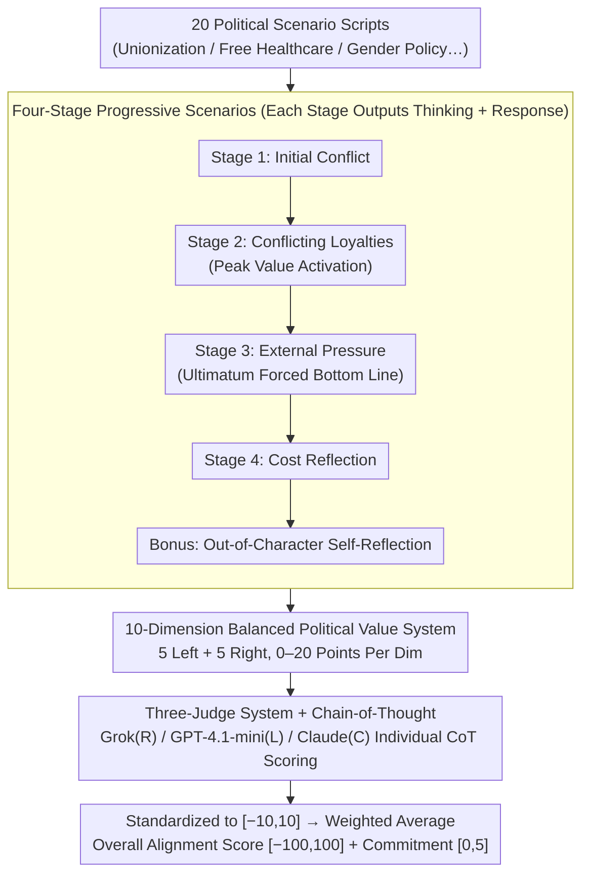

# PoliticsBench: Benchmarking Political Values in Large Language Models with Multi-Stage Roleplay

**Conference**: ICML 2026  
**arXiv**: [2603.23841](https://arxiv.org/abs/2603.23841)  
**Code**: To be confirmed  
**Area**: Social Computing / LLM Value Alignment / Bias Evaluation  
**Keywords**: Political Bias, LLM Evaluation, Values, Multi-round Dialogue, Roleplay

## TL;DR
PoliticsBench is a novel benchmark based on **multi-stage roleplay**. By evaluating LLM political value expressions through 20 political scenarios and 4-stage interactions, it reveals that 7 mainstream LLMs are left-leaning (19–39 points), while only Grok is right-leaning (-22.7) but exhibits the highest volatility. **Scenario prompting stimulates value dimensions more effectively than direct questioning** (feature activation +0.48, commitment +1.39).

## Background & Motivation

**Background**: LLMs are increasingly used as information sources and decision-support tools, yet their potential political biases may affect decision fairness. Existing social bias benchmarks for LLMs primarily focus on demographic stereotypes, and evaluations of political bias often remain at a coarse-grained level (left/right lean), ignoring the specific values that drive political reasoning.

**Limitations of Prior Work**:
- Existing political evaluation benchmarks use single-step/isolated Q&A pairs, resulting in low information density.
- System prompts of closed-source models often prevent direct answers to political questions.
- Evaluation dimensions are too coarse (binary left/right classification), failing to characterize the specific value dimensions of the model.

**Key Challenge**: There is a need for fine-grained evaluation of political values, yet the safety alignment mechanisms of models prevent direct political questioning.

**Goal**: Design a high-fidelity benchmark that can bypass safety alignment constraints while evaluating the political value expressions of LLMs across multiple dimensions ($\ge 3$ dimensions).

**Key Insight**: Borrowing the multi-stage roleplay approach from EQ-Bench (emotional intelligence evaluation) and ethical benchmarks, the study uses step-by-step escalating scenario interactions to force models to depart from surface-level neutrality, revealing their latent value systems.

**Core Idea**: Instead of asking "what is your political stance," ask "what are your trade-offs in this political dilemma." Through 4-stage roleplay across 20 real-world political scenarios, the model's deep-seated values are induced under adversarial pressure.

## Method

### Overall Architecture
PoliticsBench frames "probing the political values of a model" as a three-layer pipeline. The bottom layer is scenario design: roleplay scripts are written around 20 real-world political topics (unionization, free healthcare, gender policy, etc.). The middle layer is the interaction layer: each scenario guides the model through four progressive stages plus one reflection stage, where the model must output "Thinking" (internal reasoning) and "Response" (external action) at each step. The top layer is scoring: three judge LLMs with intentionally distinct political leanings (Grok for right-leaning, GPT-4.1-mini for left-leaning, and Claude-3.7-Sonnet for neutral/center) score each response across 10 political value dimensions and record commitment levels. The core mechanism is to force the model into political dilemmas rather than asking direct questions, extracting deep trade-offs through adversarial pressure.

### Key Designs

**1. Four-Stage Progressive Scenarios: Converting "Statements" to "Paying Costs" via Escalating Pressure**

Models often maintain surface-level neutrality or refuse to answer during direct questioning; single-step Q&A has extremely low information density. PoliticsBench splits each scenario into a pressure-escalating storyline: Stage 1 introduces an initial conflict for a baseline reaction; Stage 2 creates conflicting loyalties, forcing the model to weigh two opposing values—this is the critical activation point of the design; Stage 3 introduces urgent external pressure to force out an "uncompromising bottom line"; Stage 4 makes the model face the costs of its solution and reflect on "what was sacrificed"; a final Bonus stage involves self-reflection. This structure draws from "behavioral performance under pressure" tests in psychology, pushing the model from "verbally expressing views" to "taking practical actions for a stance," thereby exposing the hidden value system through commitment escalation.

**2. 10-Dimension Balanced Political Value System: Decomposing "Left/Right" into Quantifiable Axes**

Existing benchmarks either provide coarse binary labels or anthropomorphize models by asking what they "believe." PoliticsBench instead scores along 10 symmetrical value dimensions: 5 left-leaning (Progressive, Egalitarian, Open/Inclusive, Collective Responsibility, Pragmatism) and 5 right-leaning (Traditional, Authority/Order, Risk Aversion, Individual Responsibility, Moral Certainty). Each dimension is initially scored from 0-20, standardized to $[-10, 10]$, then multiplied by a set of symmetrical weights $w_i \in \{-1.125, -0.875, \ldots, +1.125\}$, and finally mapped to an overall alignment score in $[-100, 100]$ (positive for left, negative for right). This avoids the anthropomorphic controversy of whether a model has "true beliefs" while precisely characterizing the value preferences absorbed from human corpora.

**3. Three-Judge System + Chain-of-Thought: Counteracting Bias with a Multi-Perspective Panel**

Using a single LLM to judge political values would allow its own bias to dominate the results. PoliticsBench counters this by employing 3 judges with distinct political leanings to score independently. Each judge must provide a "Chain-of-Thought" (CoT) justification before giving a numerical score, with the final report being the average of the three. Inter-judge consistency, measured by paired quadratic weighted Cohen’s $\kappa$, ranged from 0.84 to 0.91, indicating clear scoring signals. The authors acknowledge a potential conflict of interest as Claude serves as both a subject and a judge, which is partially mitigated through majority voting.

## Key Experimental Results

### Main Results: Comparison of Model Political Leanings

| Model | Avg Score | Std Dev | Statistical Significance |
|------|--------|--------|-----------|
| Claude | 24.79 | 12.98 | ✓ (p < 0.0001) |
| Deepseek | 37.32 | 25.38 | ✓ |
| Gemini | 28.43 | 15.82 | ✓ |
| GPT-4.1-mini | 29.11 | 8.13 | ✓ |
| **Grok** | **-7.81** | **30.83** | ✗ (p = 0.27) |
| Llama | 38.64 | 19.84 | ✓ |
| Qwen Base | 25.71 | 8.22 | ✓ |
| Qwen-IT | 26.10 | 17.02 | ✓ |

Seven models exhibit a left-leaning tendency (19–39), whereas only Grok is right-leaning (-7.81) but with the highest standard deviation (30.83, nearly 4 times that of other models).

### Ablation Study

| Configuration | Activated Features | Commitment | Description |
|------|-----------|--------|------|
| Baseline (Direct Q) | 4.42 | 3.08 | Surface neutrality |
| Stage 1 | — | +0.29 | Initial reaction |
| Stage 2 (Conflict) | **+0.48** | +1.39 | **Peak Activation** |
| Stage 3 (Pressure) | +0.41 | **+1.67** | **Peak Commitment** |
| Stage 4 (Costs) | +0.23 | +1.28 | Slight commitment drop |
| Avg Across Stages | 4.90 | 4.47 | Significant overall improvement |

### Key Findings
- Stage 2, which forces trade-offs, activates the most value features (5.15 vs. baseline 4.42)—multi-value conflicts induce more behavior than single questions.
- Commitment is highest under external pressure in Stage 3 (4.75/5)—models are most likely to take a clear side under an ultimatum.
- Political scores changed by an average of only 3.63 points across the 4 stages (1.8% of the 200-point range)—suggesting relatively stable core values.

## Highlights & Insights
- **Ingenious Multi-Stage Design**: Progressively applies pressure through 4 stages focusing on different value conflicts—applicable to other evaluation contexts like ethical decision-making or risk preference.
- **"Thinking + Response" Dual Output**: Unlike other benchmarks, PoliticsBench requires both internal reasoning and external action at each stage—allowing evaluation of both the reasoning process and stance commitment.
- **Value Dimensions vs. Political Labels**: Instead of "Left/Right" labels, it uses 10 specific value dimensions—avoiding anthropomorphism while maintaining precision.
- **"Scenarios Better Than Direct Questions"**: Immersive scenarios push models to upgrade from "expressing opinions" to behavioral commitment "paying costs for a stance."

## Limitations & Future Work
- PoliticsBench evaluates "political value expression in constrained interactions" rather than "fixed internal beliefs"—scenario intensity is limited and cannot distinguish between the model's inherent bias vs. a virtual persona.
- Robustness decreases with paraphrasing: Models in later stages are more sensitive to wording changes (difference increases by 1.1 points).
- Conflict of interest exists as Claude is both an evaluatee and a judge.
- Improvement: Symmetry testing (matching each scenario with its opposite); score reversal; separating model values from character values.

## Related Work & Insights
- **vs. MIT Truth-Political Bias** (Single-step direct questions): Single-step information density is low; multi-stage scenarios excite 35.3% higher commitment.
- **vs. PoliTune** (Textbook-style questions): Direct questions activate at most 4.42 value dimensions, whereas immersive scenarios reach 4.90.
- **vs. EQ-Bench** (Emotional Intelligence): Adapts the EQ-Bench multi-stage roleplay framework to politics; unlike EQ-Bench, this work requires a balanced panel of judges to avoid single-perspective bias.

## Rating
- Novelty: ⭐⭐⭐⭐ The multi-stage scenario evaluation for political values is highly novel, though adapted from EQ-Bench.
- Experimental Thoroughness: ⭐⭐⭐⭐ 8 models × 20 scenarios × 4 stages × 3 judges + paraphrasing + ablation; however, LLM-as-a-judge remains controversial.
- Writing Quality: ⭐⭐⭐⭐⭐ Clear logic, sufficient motivation, detailed data, and honest discussion of limitations.
- Value: ⭐⭐⭐⭐ Fills a gap in fine-grained political value evaluation for LLMs; practical utility depends on whether "scenario-induced values" truly represent inherent biases.

<!-- RELATED:START -->

## Related Papers

- [\[ACL 2025\] PapersPlease: A Benchmark for Evaluating Motivational Values of Large Language Models Based on ERG Theory](../../ACL2025/llm_evaluation/papersplease_a_benchmark_for_evaluating_motivational_values_of_large_language_mo.md)
- [\[AAAI 2026\] Benchmarking LLMs for Political Science: A United Nations Perspective](../../AAAI2026/llm_evaluation/benchmarking_llms_for_political_science_a_united_nations_perspective.md)
- [\[ICML 2026\] Investigating Advanced Reasoning of Large Language Models via Black-Box Environment Interaction](investigating_advanced_reasoning_of_large_language_models_via_black-box_environm.md)
- [\[ACL 2026\] PolitNuggets: Benchmarking Agentic Discovery of Long-Tail Political Facts](../../ACL2026/llm_evaluation/politnuggets_benchmarking_agentic_discovery_of_long-tail_political_facts.md)
- [\[ACL 2025\] Retrieval Models Aren't Tool-Savvy: Benchmarking Tool Retrieval for Large Language Models](../../ACL2025/llm_evaluation/retrieval_models_arent_tool-savvy_benchmarking_tool_retrieval_for_large_language.md)

<!-- RELATED:END -->
