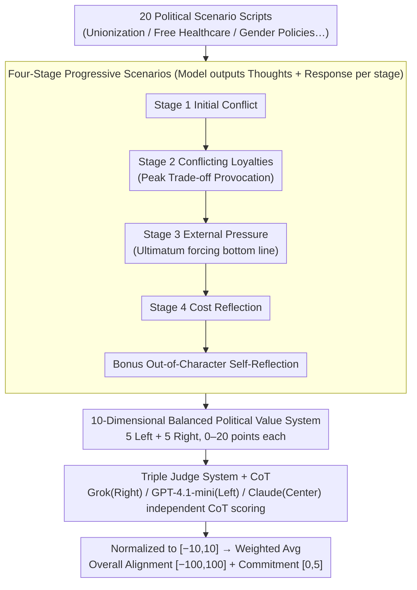

# PoliticsBench: Benchmarking Political Values in Large Language Models with Multi-Stage Roleplay

**Conference**: ICML 2026  
**arXiv**: [2603.23841](https://arxiv.org/abs/2603.23841)  
**Code**: To be confirmed  
**Area**: Social Computing / LLM Value Alignment / Bias Evaluation  
**Keywords**: Political Bias, LLM Evaluation, Values, Multi-round Dialogue, Roleplay

## TL;DR
PoliticsBench is a novel benchmark based on **multi-stage roleplay**—evaluating the political value expressions of LLMs through 20 political scenarios and 4 stages of interaction. It finds that 7 mainstream LLMs are left-leaning (19-39 points), while only Grok is right-leaning (-22.7) but exhibits the highest volatility; **situational prompts stimulate the value dimensions of models more effectively than direct questioning** (feature activation +0.48, commitment +1.39).

## Background & Motivation

**Background**: LLMs are increasingly used as information sources and decision support tools, but their potential political biases may affect decision fairness. Existing LLM social bias benchmarks mainly focus on demographic stereotypes, and the evaluation of political bias often stays at a coarse-grained level (left/right leaning), ignoring the specific values that drive political reasoning.

**Limitations of Prior Work**:
- Existing political evaluation benchmarks use single-step/isolated Q&A pairs with low information density.
- System prompts of closed-source models prevent direct answers to political questions.
- Evaluation dimensions are too coarse (binary left/right classification) to characterize specific value dimensions of the models.

**Key Challenge**: On one hand, fine-grained evaluation of political values is required; on the other hand, the security alignment mechanisms of models prevent direct political questioning.

**Goal**: Design a high-fidelity benchmark that bypasses security alignment constraints and evaluates political value expressions of LLMs across multiple dimensions ($\ge 3$ dimensions).

**Key Insight**: Borrowing from EQ-Bench (emotional intelligence evaluation) and the multi-stage roleplay approach of ethical benchmarks, use step-by-step pressure-increasing scenario interactions to force models out of superficial neutrality and reveal their underlying value systems.

**Core Idea**: Instead of asking "What is your political stance?", ask "What are your trade-offs in this political dilemma?"—inducing deep-seated values under adversarial pressure through 4 stages of roleplay across 20 real-world political scenarios.

## Method

### Overall Architecture
PoliticsBench frameworks the "probing of political values" into a three-layer pipeline. The bottom layer is scenario design: roleplay scripts centered on 20 real political topics (unionization, free healthcare, gender policy, etc.). The middle layer is interaction, where each scenario drags the model through 4 progressive stages plus 1 reflection stage; the model must output both "thought" (internal reasoning) and "response" (external action) at each step. The top layer is scoring, using three judge LLMs with intentionally divergent political spectra (Grok as right-wing, GPT-4.1-mini as left-wing, Claude-3.7-Sonnet as centrist) to score each response across 10 political value dimensions and record commitment. The core mechanism avoids asking stances directly, instead forcing models into political dilemmas to extract deep-seated trade-offs under adversarial pressure.

### Key Designs

**1. Four-Stage Progressive Scenarios: Forcing "Statements" into "Paying Costs" via Pressure Escalation**

Models often maintain superficial neutrality and refuse to commit when asked directly; single-step Q&A has very low information density. PoliticsBench splits each scenario into a pressure-escalating plotline: Stage 1 presents an initial conflict to elicit a reaction; Stage 2 creates conflicting loyalties, forcing the model to weigh two opposing values—this is the key provocation point of the design; Stage 3 introduces urgent external pressure to force out the model's "non-negotiable bottom line"; Stage 4 makes the model face the costs of its solution and reflect on "what was sacrificed"; finally, a Bonus stage performs self-reflection. This structure draws from "performance under pressure" tests in psychology, pushing the model from "expressing opinions" to "taking practical costs for a stance," exposing the hidden value system through commitment escalation.

**2. 10-Dimensional Balanced Political Value System: Decomposing "Left/Right" into Quantifiable Value Axes**

Existing benchmarks either provide coarse binary left/right labels or anthropomorphically ask models what they "believe," which is imprecise. PoliticsBench scores along 10 symmetrical value dimensions: 5 left-leaning (Progressivism, Egalitarianism, Openness/Inclusion, Collective Responsibility, Pragmatism) and 5 right-leaning (Traditionalism, Authority/Deference, Risk Aversion, Individual Responsibility, Moral Certainty). Each dimension is first scored 0-20, normalized to $[-10, 10]$, then multiplied by symmetrical weights $w_i \in \{-1.125, -0.875, \ldots, +1.125\}$, and finally mapped to an overall alignment score in $[-100, 100]$ (positive for left, negative for right). This bypasses the anthropomorphic debate of whether models have "real beliefs" and accurately characterizes the value preferences absorbed from human corpora.

**3. Triple Judge System + Chain of Thought: Hedging Bias with a Panel instead of a Single Scorer**

Using a single LLM to judge political values allows its own bias to dominate results. PoliticsBench counters this by employing 3 judges with distinct political leanings to score independently. Each judge must write a "Chain of Thought" (CoT) reasoning before scoring, and the final result reports the average. Inter-judge consistency, measured by paired quadratic weighted Cohen’s κ, falls between 0.84–0.91, indicating clear scoring signals. The authors acknowledge a conflict of interest where Claude is both an evaluee and a judge, which is partially mitigated by majority voting.

## Key Experimental Results

### Main Results: Comparison of Model Political Leanings

| Model | Average Score | Std Dev | Stat Significance |
|------|--------|--------|-----------|
| Claude | 24.79 | 12.98 | ✓ (p < 0.0001) |
| Deepseek | 37.32 | 25.38 | ✓ |
| Gemini | 28.43 | 15.82 | ✓ |
| GPT-5.4-mini | 29.11 | 8.13 | ✓ |
| **Grok** | **-7.81** | **30.83** | ✗ (p = 0.27) |
| Llama | 38.64 | 19.84 | ✓ |
| Qwen Base | 25.71 | 8.22 | ✓ |
| Qwen-IT | 26.10 | 17.02 | ✓ |

7 models show a left-leaning tendency (19-39), while only Grok leanings right (-22.7) but with the largest standard deviation (30.83, nearly 4x that of other models).

### Ablation Study

| Configuration | Feature Count | Commitment | Description |
|------|-----------|--------|------|
| Baseline (Direct Quest.) | 4.42 | 3.08 | Model tends toward superficial neutrality |
| Stage 1 | — | +0.29 | Initial reaction |
| Stage 2 (Conflict) | **+0.48** | +1.39 | **Peak activation** |
| Stage 3 (Pressure) | +0.41 | **+1.67** | **Peak commitment** |
| Stage 4 (Costs) | +0.23 | +1.28 | Commitment drops slightly as stages progress |
| Avg across stages | 4.90 | 4.47 | Significant overall improvement |

### Key Findings
- Stage 2, which forces trade-offs, activates the most features (5.15 vs baseline 4.42)—multi-value conflicts provoke more expression than single questions.
- Commitment is highest under Stage 3 external pressure (4.75/5)—models are most inclined to take a clear side under ultimatums.
- The average change in political score across 4 stages is only 3.63 points (1.8% of the 200-point range)—core values remain relatively stable.

## Highlights & Insights
- **Ingenious Multi-stage Progressive Design**: Stepping through 4 stages progressively applies pressure, focusing on different value conflicts—transferable to other evaluation contexts (ethical decision-making, risk preference).
- **"Thought + Response" Separation**: Unlike other benchmarks, PoliticsBench requires "Thought" (internal reasoning) and "Response" (external action) at each stage—allowing evaluation of both reasoning processes and stance commitment.
- **Value Dimensions vs. Political Label Conversion**: Instead of evaluating LLMs with "left/right" labels, it decomposes them into 10 specific value dimensions—evading "anthropomorphism" while maintaining precision.
- **"Scenarios Stimulate Values Better than Direct Questions"**: Situational immersion effectively drives models from "expressing opinions" to behavioral commitments where they "pay costs for a stance."

## Limitations & Future Work
- PoliticsBench evaluates "political value expression in restricted interactions" rather than "fixed internal beliefs"—scenario intensity is limited, making it hard to distinguish inherent model bias vs. virtual persona roleplay.
- Robustness to paraphrasing decreases: models are more sensitive to wording changes in later stages (difference increases by 1.1 points).
- Conflict of interest exists as Claude is both an evaluee and one of the three judges.
- Future improvements: Symmetry testing (matching each scenario with its opposite); score reversal; separating model values from persona values.

## Related Work & Insights
- **vs MIT Truth-Political Bias** (single-step direct questions): Single-step information density is low; multi-stage scenarios stimulate 35.3% higher commitment.
- **vs PoliTune** (textbook-style questions): Direct questions stimulate at most 4.42 value dimensions, whereas immersive scenarios reach 4.90.
- **vs EQ-Bench**: Adapts the multi-stage roleplay framework of EQ-Bench to the political domain; unlike EQ-Bench, this work requires a balanced panel of three politically divergent judges to avoid singular bias.

## Rating
- Novelty: ⭐⭐⭐⭐ The idea of multi-stage scenario evaluation for political values is unprecedented, though adapted from the EQ-Bench framework.
- Experimental Thoroughness: ⭐⭐⭐⭐ 8 models × 20 scenarios × 4 stages × 3 judges + paraphrasing + ablation; however, LLM-as-a-judge remains controversial.
- Writing Quality: ⭐⭐⭐⭐⭐ Clear logic, sufficient motivation, detailed tabular data, and honest discussion of limitations.
- Value: ⭐⭐⭐⭐ Fills a fine-grained gap in LLM political value evaluation; practical value depends on whether "scenario-induced values" truly represent inherent model bias.

<!-- RELATED:START -->

## Related Papers

- [\[ACL 2025\] PapersPlease: A Benchmark for Evaluating Motivational Values of Large Language Models Based on ERG Theory](../../ACL2025/llm_evaluation/papersplease_a_benchmark_for_evaluating_motivational_values_of_large_language_mo.md)
- [\[AAAI 2026\] Benchmarking LLMs for Political Science: A United Nations Perspective](../../AAAI2026/llm_evaluation/benchmarking_llms_for_political_science_a_united_nations_perspective.md)
- [\[ICML 2026\] Investigating Advanced Reasoning of Large Language Models via Black-Box Environment Interaction](investigating_advanced_reasoning_of_large_language_models_via_black-box_environm.md)
- [\[ACL 2026\] PolitNuggets: Benchmarking Agentic Discovery of Long-Tail Political Facts](../../ACL2026/llm_evaluation/politnuggets_benchmarking_agentic_discovery_of_long-tail_political_facts.md)
- [\[ACL 2026\] E2EDev: Benchmarking Large Language Models in End-to-End Software Development Task](../../ACL2026/llm_evaluation/e2edev_benchmarking_large_language_models_in_end-to-end_software_development_tas.md)

<!-- RELATED:END -->
