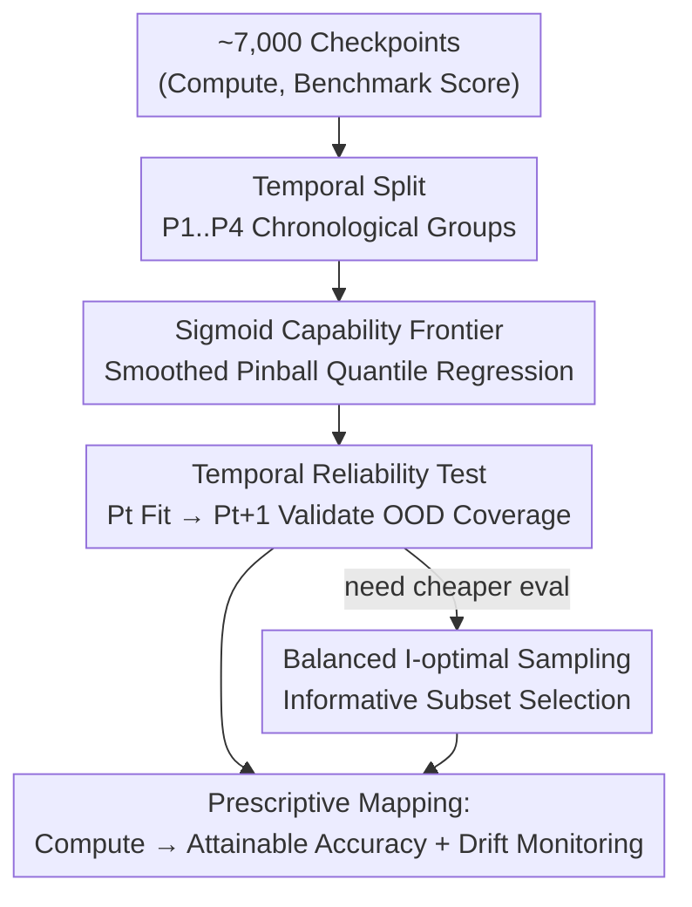

# Prescriptive Scaling Reveals the Evolution of Language Model Capabilities

**Conference**: ICML2026  
**arXiv**: [2602.15327](https://arxiv.org/abs/2602.15327)  
**Code**: Yes (includes Blog / Datasets / Code links; releases Proteus-2k dataset)  
**Area**: LLM Evaluation / Scaling Law  
**Keywords**: Prescriptive scaling, capability frontier, quantile regression, temporal reliability, I-optimal sampling  

## TL;DR
Using ~7,000 model checkpoints spanning 2022–2026 (including 5k historical and 2k self-evaluated), this paper models "attainable downstream accuracy given a pre-training compute budget" as a **monotonic saturating sigmoid capability frontier** via high quantile regression. The study validates the temporal stability of this frontier and demonstrates its efficient reconstruction using only ~20% of the evaluation budget.

## Background & Motivation

**Background**: Pre-training scaling laws (e.g., Kaplan, Chinchilla) have characterized the "compute → loss/perplexity" relationship as smooth and predictable. Scaling has become a core design variable, allowing engineers to pre-allocate compute budgets.

**Limitations of Prior Work**: Deployed models are rarely raw pre-training checkpoints; they undergo **heterogeneous post-training** pipelines such as instruction tuning, RLHF, and domain adaptation. Existing scaling laws fail to answer the critical question for practitioners: "Given a pre-training compute budget $C$, what downstream benchmark score is reliably attainable after post-training?" Models with identical compute exhibit vast differences in reasoning, instruction following, and domain-specific Q&A; the coupling between pre-training loss and downstream accuracy is weak, and benchmarks are often plagued by noise from data contamination and evaluation protocols.

**Key Challenge**: Traditional scaling laws model **mean trends**, whereas deployment decisions require the "upper bound of performance **attainable** under contemporary post-training practices." Smoothing out the variance of heterogeneous post-training recipes as mere noise discards the most useful signal: "how much potential can compute buy?" Conversely, simply taking the maximum observed value is too sensitive to outliers.

**Goal**: (1) Identify a robust function for mapping "log-compute → attainable post-training accuracy"; (2) Treat "time" as a first-class coordinate to test if this frontier remains predictable amid evolving post-training techniques; (3) Efficiently reconstruct this frontier under finite evaluation budgets.

**Key Insight**: Rather than estimating the "true maximum accuracy," the authors estimate a **high conditional quantile** ($\tau=0.98$) $q_\tau(z)\approx Q_\tau(Y\mid Z=z)$, where $z=\log_{10}C$. Quantiles are naturally robust to outliers while representing the "ceiling" reachable with sufficiently good post-training.

**Core Idea**: The authors propose **Prescriptive Scaling**, which translates pre-training compute budgets into reliable downstream performance expectations using **monotonic saturating sigmoid quantile regression**. They monitor drifts in the capability frontier through temporal splits ("fit on early generations, validate on late releases").

## Method

### Overall Architecture
The method is a statistical pipeline that estimates capability frontiers from large-scale heterogeneous checkpoints, verifies their temporal reliability, and compresses evaluation costs. The input consists of observation triples (model, pre-training compute $C_i$, benchmark score $y_i\in[0,1]$) from the Open LLM Leaderboard (v1/v2), frontier model reports, and the authors' own evaluation of 2.4k open-source weights (Proteus-2k). The output provides a capability frontier function for each task and a temporal diagnosis of when to re-fit.

The pipeline follows four steps: 1) Split models into four chronological periods $P_1,\dots,P_4$; 2) Fit the $\tau$-quantile capability frontier using smoothed pinball loss, selecting the sigmoid function over constant, binwise, or I-spline alternatives; 3) Perform rolling OOD validation ($P_t$ fit, $P_{t+1}$ validate) to ensure coverage error is <2%; 4) Use balanced I-optimal design to select the most informative subset of models for evaluation, reconstructing the frontier at a fraction of the cost.

### Key Designs

**1. Sigmoid Capability Frontier + Smoothed Pinball Quantile Regression**

To address the inability of mean trends to predict deployment expectations and the outlier sensitivity of maximum values, the authors estimate the high conditional quantile $\tau=0.98$. The function takes a monotonic saturating sigmoid form: $q_\tau^{\text{sig}}(z;\theta)=y_0+L\,\sigma(a+\beta z)$, where $\sigma(t)=\tfrac{1}{1+e^{-t}}$, with constraints $\beta\ge 0, 0\le y_0\le 1, 0\le L\le 1-y_0$ to ensure it rises monotonically with compute and saturates within $[0,1]$. This aligns with the intuition that accuracy hits a ceiling as compute increases. The objective is a smoothed pinball loss:

$$\mathcal{L}(\theta)=\sum_{i\in P_t}\ell_\tau(y_i-\hat y_i)+\lambda\,\Omega(\theta),\quad \ell_\tau(u)=\tfrac{1}{\kappa}\log(1+e^{\kappa u})+(\tau-1)u$$

Setting $\tau=0.98$ penalizes underestimation more heavily, pushing the curve to the upper fringe of the observation cloud to capture the "attainable frontier."

**2. Time as a First-class Coordinate: Rolling Temporal Splits + Coverage Error Diagnosis**

Scaling laws typically assume constants do not change over time, but post-training techniques evolve rapidly. The authors split models into $P_1(\le 2024\text{-}06)$, $P_2$, $P_3$, and $P_4(2025\text{-}01\sim 03)$. They use three rolling train-test pairs $(P_t, P_{t+1})$ for OOD evaluation. The diagnostic metric is the **signed coverage error** $\hat\tau_b-\tau$: in each log-compute bin, empirical coverage is calculated as $\hat\tau_b=\tfrac{1}{n_b}\sum_{i\in I_b}\mathbb{1}\{y_i\le\hat y_i\}$. A negative value indicates under-coverage (new models exceeding the frontier more often than expected), signaling that new recipes/architectures have pushed the frontier up and a re-fit is required.

**3. Balanced I-optimal Sampling: Reconstructing the Frontier with ~20% Budget**

Evaluating every model on every task is prohibitively expensive. Using experimental design principles, the authors select a subset $S_t$ given a budget $U_t = \tfrac{\alpha}{100}C_t$ based on model parameter count $c_i$. Using the Jacobian of the sigmoid $j(z;\theta)=[1,\sigma,L\sigma(1-\sigma),L\sigma(1-\sigma)z]^\top$ to form the information matrix $M(S)=\sum_{i\in S}j(z_i)j(z_i)^\top$, the I-optimal objective $\Phi_{\text{info}}(S)=-\sum_b w_b v_b(S)$ minimizes average prediction variance. A balancing term $\Phi_{\text{bal}}(S)=\sum_b\log(n_b(S)+\varepsilon)$ is added to prevent budget concentration in specific compute intervals. This approach allows reconstructing the frontier with ~20% (and for some tasks, 5%) of the total parameter-weighted evaluation budget.

### Loss & Training
The fitting objective is the aforementioned smoothed pinball loss ($\tau=0.98, \kappa=50, \lambda=10^{-3}$). Baseline functions include constant, binwise constant, sigmoid, and I-splines (monotonic splines through a sigmoid). Binning uses group-aware equal-mass intervals. Performance is measured by pinball loss (quantile accuracy) and coverage error (local quantile calibration).

## Key Experimental Results

### Main Results
Average results for four function types across six tasks and three rolling splits (lower pinball loss and calibration error are better):

| Estimator | ID Pinball | OOD Pinball | ID Calib. Error | OOD Calib. Error |
| :--- | :--- | :--- | :--- | :--- |
| Constant (No Compute) | $5.35\times10^{-3}$ | $6.23\times10^{-3}$ | $4.12\times10^{-2}$ | $3.60\times10^{-2}$ |
| Binwise | $4.01\times10^{-3}$ | $5.00\times10^{-3}$ | $1.66\times10^{-2}$ | $2.81\times10^{-2}$ |
| I-spline | $4.00\times10^{-3}$ | $4.92\times10^{-3}$ | $1.83\times10^{-2}$ | $2.41\times10^{-2}$ |
| **Sigmoid** | $4.08\times10^{-3}$ | $4.93\times10^{-3}$ | $1.84\times10^{-2}$ | $\mathbf{2.21\times10^{-2}}$ |

Sigmoid matches the flexible I-spline in ID pinball loss and achieves the lowest OOD calibration error (2.2% vs. 3.6% for the compute-agnostic baseline). Attainable accuracy at $10^{24}$ FLOPs:

| Benchmark | IFEval | BBH | MATH Lvl 5 | GPQA | MUSR | MMLU-PRO |
| :--- | :--- | :--- | :--- | :--- | :--- | :--- |
| Acc.@1024 FLOPs | 0.828 | 0.700 | 0.539 | 0.424 | 0.535 | 0.563 |

### Ablation Study
Comparison of function classes and sampling budgets:

| Configuration | Key Metric | Description |
| :--- | :--- | :--- |
| Sigmoid (Default) | OOD Calib. 2.2% | Monotonic saturating, most stable OOD |
| I-spline | OOD Calib. 2.4% | More flexible but slightly worse OOD |
| Constant | OOD Calib. 3.6% | No compute info; significantly worse |
| I-optimal $\alpha=20\%$ | $\approx$ Full Frontier | Uses only 20% of parameter-weighted budget |
| I-optimal $\alpha=5\%$ | $\approx$ Full Frontier | Sufficient for individual tasks like GPQA/MUSR |

### Key Findings
- **Temporal stability is task-dependent**: Coverage errors for BBH, GPQA, MMLU-PRO, and MUSR remain within $\pm 2\%$ across periods, meaning compute-only sigmoid frontiers reliably transfer to future open-source models. Conversely, MATH Lvl 5 (and IFEval) show persistent under-coverage; the mathematical reasoning ceiling is "evolving."
- **Pre-training vs. Post-training gap is task-dependent**: Knowledge-intensive tasks (MMLU-PRO) see raw pre-training models approach the frontier, while reasoning/instruction following (MATH, IFEval) see raw models far below the frontier, indicating massive post-training gains.
- **Compute predicts potential better than raw accuracy**: Capability frontiers are highly monotonic with compute, whereas raw pre-training accuracy often violates monotonicity. PCA shows compute-driven progress is concentrated on a single dominant latent axis (PC1 explains ~95% of variance).
- **Contamination Diagnosis**: No evidence was found of significantly inflated scores due to contamination for frontier models on AIME-2025.

## Highlights & Insights
- **Perspective shift**: Moving from "mean" to "high-quantile frontier" answers the practical question: "How well can I reliably perform with this much compute?" Quantile regression naturally handles outliers.
- **Time as a first-class coordinate**: By treating "frontier failure" as a monitorable coverage error signal, scaling laws transition from one-off fits to sustainable monitoring systems.
- **Efficiency through I-optimal sampling**: Selecting models based on metadata $(z_i, c_i)$ and Jacobians saves 80% of evaluation costs, a strategy applicable to any expensive benchmark.
- **Empirical saturation**: The study provides a clean empirical distinction between capabilities that hit a size-determined ceiling and those (like math) where the ceiling is being actively pushed by post-training.

## Limitations & Future Work
- **Observational bias**: The frontier is an empirical upper bound for the current population; if a new model family achieves higher scores at a fixed compute, the true frontier would be higher. It is positioned as a conservative, decision-oriented mapping.
- **Compute as the sole variable**: By design, only pre-training FLOPs are used, folding data mix and architecture into the "attainable frontier." It describes "what" is possible rather than "why."
- **Compute estimation**: Precise FLOPs for many models are inferred, and errors in $z=\log_{10}C$ can propagate.
- **Non-stationary tasks**: Tasks like math require constant re-fitting; the method monitors drift but implies lower long-term predictability for such tasks.

## Related Work & Insights
- **vs. Classic Scaling Laws (Kaplan / Chinchilla)**: While they model "compute → loss/mean accuracy" in controlled settings, this paper models the "attainable high-quantile frontier" in a heterogeneous ecosystem.
- **vs. Downstream Noise Studies (Gadre, Schaeffer, etc.)**: Instead of trying to fix the mean coupling between loss and benchmarks, this work sidesteps it by estimating the frontier quantile.
- **vs. Contamination Analysis (Dominguez-Olmedo, etc.)**: This work treats time as a rolling validation axis, using coverage error to quantify drift and diagnostic testing for contamination (e.g., AIME-2025).

## Rating
- Novelty: ⭐⭐⭐⭐⭐ (Re-framing scaling as a quantile frontier with temporal monitoring)
- Experimental Thoroughness: ⭐⭐⭐⭐⭐ (~7k checkpoints, rolling splits, Proteus-2k validation)
- Writing Quality: ⭐⭐⭐⭐ (Rigorous modeling, though high formula density)
- Value: ⭐⭐⭐⭐⭐ (Practical "compute → expectation" mapping and new datasets)

<!-- RELATED:START -->

## Related Papers

- [\[ICML 2026\] Estimating Tail Risks in Language Model Output Distributions](estimating_tail_risks_in_language_model_output_distributions.md)
- [\[AAAI 2026\] OptScale: Probabilistic Optimality for Inference-time Scaling](../../AAAI2026/llm_evaluation/optscale_probabilistic_optimality_for_inference-time_scaling.md)
- [\[ICLR 2026\] How Reliable is Language Model Micro-Benchmarking?](../../ICLR2026/llm_evaluation/how_reliable_is_language_model_micro-benchmarking.md)
- [\[ACL 2026\] SciCustom: A Framework for Custom Evaluation of Scientific Capabilities in Large Language Models](../../ACL2026/llm_evaluation/scicustom_a_framework_for_custom_evaluation_of_scientific_capabilities_in_large_.md)
- [\[ICML 2026\] BESPOKE: Benchmark for Search-Augmented Large Language Model Personalization via Diagnostic Feedback](bespoke_benchmark_for_search-augmented_large_language_model_personalization_via_.md)

<!-- RELATED:END -->
