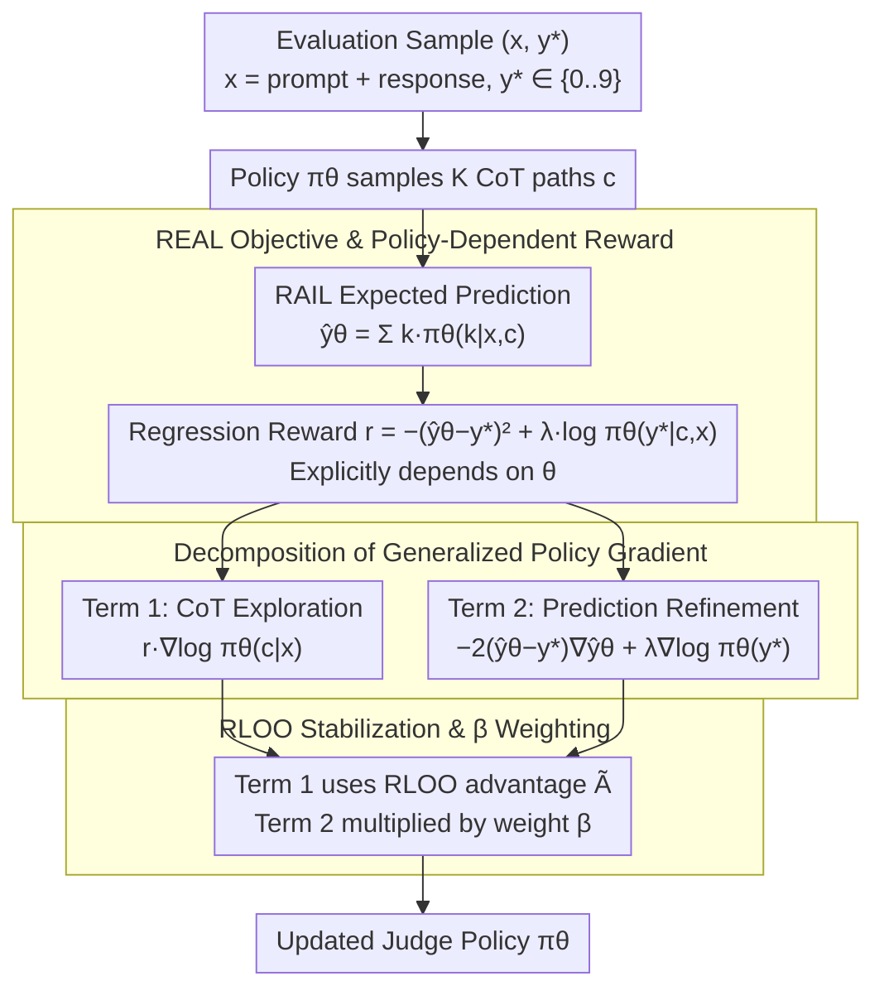

# REAL: Integrating Regression-Aware Rewards into RL, Enabling LLM-as-a-Judge to Recognize "Small Gaps Matter"

**Conference**: ICML 2026  
**arXiv**: [2603.17145](https://arxiv.org/abs/2603.17145)  
**Code**: https://github.com/YasminZhang/REAL (Available)  
**Area**: Reinforcement Learning / LLM Post-training / LLM Evaluation  
**Keywords**: LLM-as-a-Judge, Regression-Aware Reward, Generalized Policy Gradient, Policy-Dependent Reward, Correlation Optimization  

## TL;DR
Addressing the inherent flaw of 0/1 binary rewards in RL for LLM-as-a-Judge, which ignores ordinal structures, the authors integrate the "expected value prediction + squared error" from RAFT into the RL objective. Since the reward explicitly depends on policy parameters, a generalized policy gradient is employed—it cleanly decomposes into a "CoT exploration term" and a "prediction refinement term." It consistently outperforms SFT and standard RL across 8B–32B base models; on Qwen3-32B, the Pearson/Spearman correlations improve by 8.4/7.2 points over SFT.

## Background & Motivation
**Background**: LLM-as-a-Judge is the core vehicle for current evaluation, alignment, and preference modeling—where the model outputs a numeric score representing "quality / correctness / preference strength." Mainstream training schemes include: (1) SFT (e.g., Prometheus), which treats scores as discrete tokens via cross-entropy; (2) Regression-aware SFT (e.g., RAFT / TRACT), which combines "expected value prediction $\hat y_\theta(x, c) = \sum_{k \in \mathcal{K}} k \cdot \pi_\theta(k|x,c)$" with squared error to recover ordinal structure.

**Limitations of Prior Work**: Extending regression-aware logic from RAFT/TRACT to RL post-training is the natural next step—RL allows models to **actively explore** their own CoT trajectories, whereas SFT only mimics fixed ground-truth reasoning chains. However, current RL post-training frameworks (PPO/GRPO/DPO/Guo 2025) rely on rule-based verifiers providing 0/1 rewards $r = \mathbf{1}(y = y^*)$. This is disastrous for regression: if the ground truth is 5, predictions of 4 and 1 are equally "bad" to standard RL, though humans clearly prefer the former. Fig. 2 empirically confirms this: standard RL continued from a TRACT checkpoint causes correlation metrics to collapse.

**Key Challenge**: To retain the advantage of "exploring CoT reasoning space" while acknowledging that "the magnitude of score gaps matters," regression rewards must be used in RL. However, regression rewards $r = -(\hat y_\theta - y^*)^2$ explicitly depend on policy parameters $\theta$. This violates the prerequisite $\nabla_\theta r = 0$ in standard REINFORCE derivations, making standard policy gradient formulas incorrect.

**Goal**: (1) Propose a formal framework for legally integrating regression rewards into RL; (2) Theoretically link this to correlation metrics—as downstream evaluation for LLM-as-a-Judge uses Pearson/Spearman rather than sample-level MSE; (3) Verify improvements in OOD generalization across 8B–32B scales.

**Key Insight**: Utilize the **generalized policy gradient estimator** (Schulman 2015) to explicitly handle the unconventional setting of parameter-dependent rewards.

**Core Idea**: Leverage the mathematical fact that "generalized policy gradient → natural decomposition into CoT exploration + prediction refinement" to elegantly embed regression awareness into RL, and theoretically prove that minimizing squared error is equivalent to optimizing Pearson correlation.

## Method
### Overall Architecture
REAL addresses a specific task: allowing LLM-as-a-Judge to recognize that "small gaps still matter" during RL post-training. Given evaluation pairs $(x, y^*)$, where $x$ is the "prompt + response" and $y^* \in \mathcal{K} = \{0, 1, \dots, 9\}$ is the ground-truth label, the policy $\pi_\theta$ autoregressively generates a CoT $c$ before the score. Crucially, it does not directly sample the score; instead, it uses the RAIL expected value predictor $\hat y_\theta(x, c) = \sum_{k \in \mathcal{K}} k \cdot \pi_\theta(k | x, c)$ to collapse the 0–9 distribution into a continuous expectation for squared error calculation. During training, $K$ CoT paths are sampled per $x$, RLOO estimates the advantage, and the policy is updated using a dual-term gradient—one for CoT exploration and one for prediction refinement.

### Key Designs

**1. REAL Objective and Implicit Policy-Dependent Rewards: Legally Integrating Regression Loss into RL**

RAFT/TRACT proved that "expected value prediction + squared error" recovers ordinal score structures, but their CoT paths are from fixed sampling sources, remaining fundamentally SFT. REAL's first step is to port this regression objective to RL: $\mathcal{L}_{\text{REAL}}(\theta) = \mathbb{E}_{(x, y^*) \sim \mathcal{D},\, c \sim \pi_\theta(\cdot | x)}[(\hat y_\theta(x, c) - y^*)^2 - \lambda \log \pi_\theta(y^* | x, c)]$. The first term is squared error, and the second is an NTP auxiliary loss for the final-answer token. The implicit reward $r_{\text{REAL}}(\theta, x, c) = -(\hat y_\theta(x, c) - y^*)^2 + \lambda \log \pi_\theta(y^* | c, x)$ **explicitly depends on $\theta$**, distinguishing it from standard RL.

The effectiveness stems from two substitutions. First, replacing fixed sampling with the active policy $\pi_\theta$ allows CoT and rewards to evolve synchronously. Second, the RAIL predictor uses the entire 0–9 distribution shape rather than a single token probability, providing significantly higher information density.

**2. Natural Decomposition of Generalized Policy Gradient: Turning Parameter Dependency into Elegant Structure**

Since $\nabla_\theta r \ne 0$, standard policy gradient formulas fail. REAL applies the generalized policy gradient lemma (Schulman 2015) to $\mathcal{L}(\theta) = \mathbb{E}_{x,\, c \sim \pi_\theta}[r(\theta, x, c)]$ via the chain rule:

$$\nabla_\theta \mathcal{L} = \mathbb{E}\Big[\underbrace{r(\theta, x, c)\, \nabla_\theta \log \pi_\theta(c | x)}_{\text{Term 1: CoT Exploration}} + \underbrace{\nabla_\theta r(\theta, x, c)}_{\text{Term 2: Prediction Refinement}}\Big]$$

For REAL, Term 2 expands to $-2(\hat y_\theta - y^*)\nabla_\theta \hat y_\theta + \lambda \nabla_\theta \log \pi_\theta(y^* | x, c)$, where $\nabla_\theta \hat y_\theta = \sum_k k \cdot \nabla_\theta \pi_\theta(k | x, c)$. This decomposition reflects two learning modes: Term 1 treats CoT $c$ as an "action" for exploration (policy-gradient style), while Term 2 treats the score as "ground truth" for refinement (backprop style). Unlike GRPO which treats $c$ and $y$ as homogeneous tokens, REAL acknowledges their structural difference: CoT is a high-dimensional sequence requiring exploration, while the final answer is a low-cardinality variable suitable for direct regression.

**3. RLOO Stabilization and $\beta$ Weighting: Engineering the Theoretical Gradient**

To handle the high variance of theoretical gradients, REAL samples $K$ CoT paths per $x$ and uses a leave-one-out baseline for the advantage $A^{(i)} = r^{(i)} - \frac{1}{K-1}\sum_{j \ne i} r^{(j)}$, normalized and clipped to $[-1, 1]$ as $\tilde A^{(i)}$. The final gradient is $\nabla \mathcal{L} \approx \frac{1}{K} \sum_i [\tilde A^{(i)} \nabla_\theta \log \pi_\theta(c_i | x) + \beta \nabla_\theta r_{\text{REAL}}(\theta, x, c_i)]$. Here $\beta$ controls the relative strength of prediction refinement vs CoT exploration—$\beta = 1.0$ is mathematically accurate and performs well, though it remains an engineering handle for future adjustments.

### Loss & Training
The complete objective is $\mathcal{L}_{\text{REAL}}(\theta) = \mathbb{E}_{(x, y^*),\, c \sim \pi_\theta}[(\hat y_\theta(x, c) - y^*)^2 - \lambda \log \pi_\theta(y^* | x, c)]$, using the RLOO estimator with $\beta = 1.0$. $\lambda$ follows RAFT/TRACT defaults, and the CoT group size $K$ is maintained at mid-range (similar to GRPO).

## Key Experimental Results

### Main Results (Selected from Table 2, Mistral2-7B and Qwen3-32B; Metrics ×100)

| Model | Method | Paradigm | Inference | FB Bench (r/ρ) | FLASK (r/ρ) | Vic. Bench (r/ρ) | MT Bench (r/ρ) | Avg r | Avg ρ |
|------|------|------|------|----------------|--------------|------------------|-----------------|--------|--------|
| Mistral2-7B | Base+warmup | – | Standard | 83.1 / 83.3 | 41.5 / 41.9 | 49.2 / 42.4 | 30.9 / 31.8 | 51.2 | 49.8 |
| Mistral2-7B | RAFT | SFT | RAIL | 87.9 / 88.0 | 41.8 / 41.9 | 52.8 / 51.3 | 39.9 / 41.8 | 55.6 | 55.8 |
| Mistral2-7B | TRACT | SFT | RAIL | 93.9 / 93.7 | 50.7 / 50.0 | 56.2 / 54.8 | 52.1 / 50.1 | 63.2 | 62.2 |
| Mistral2-7B | Standard RL | RL | RAIL | 93.7 / 93.7 | 51.6 / 50.5 | 58.0 / 56.0 | 52.9 / 50.7 | 64.1 | 62.7 |
| Mistral2-7B | **Ours** (REAL) | RL | RAIL | 93.2 / 93.4 | **56.0 / 54.1** | **63.3 / 60.2** | **59.3 / 56.9** | **67.9** | **66.2** |
| Qwen3-32B | Base | – | RAIL | 63.4 / 70.8 | 54.3 / 60.4 | 50.8 / 57.4 | 42.5 / 46.8 | 52.7 | 58.8 |
| Qwen3-32B | RAFT | SFT | RAIL | 85.4 / 86.5 | 52.1 / 52.9 | 51.9 / 52.0 | 61.1 / 59.6 | 62.6 | 62.8 |
| Qwen3-32B | **Ours** (REAL) | RL | RAIL | **91.1 / 91.7** | **58.9 / 58.6** | **65.1 / 60.7** | **68.9 / 69.1** | **71.0** | **70.0** |

Note that on the in-domain FB Bench, REAL is comparable to standard RL. However, on OOD benchmarks (FLASK / Vic. Bench / MT Bench), REAL outperforms by 4–8 points—demonstrating that regression-aware rewards benefit generalization over memorizing training distributions.

### Ablation Study (Selected from Table 4.4 + Tab 14)

| Configuration | Key Change | Observation |
|------|---------|------|
| Full REAL | RL + Regression Reward + Dual Gradient | OOD SOTA |
| Remove Term 1 (≈ TRACT) | Degenerates to SFT static refinement | Loses CoT exploration, OOD drops 3–5 points |
| Remove Term 2 (≈ Std RL with $r = -(\hat y - y^*)^2$ without pred gradient) | CoT exploration remains but loses distribution signal | Correlation collapses during training (Fig. 2) |
| $\lambda = 0$ | Remove NTP auxiliary | Performance close to $\lambda > 0$, regression term is primary |
| $\beta = 1.0$ | Theoretical weight | Optimal; no scanning required |
| vs JEPO (Tab. 14) | Replace with marginal log-likelihood | REAL wins on all regression metrics |

### Key Findings
- **OOD > in-domain**: REAL's primary strength is OOD benchmarks. Binary rewards learn to "remember" training patterns, but fail to capture the universal structure of "score distance."
- **Standard RL collapses correlation**: Continued training with standard RL from a TRACT checkpoint leads to a decrease in Pearson/Spearman (Fig. 2), exposing the anti-optimization effect of binary rewards on regression tasks.
- **Term 2 (Prediction Refinement) does 80% of the work**: Removing Term 2 makes training impossible; removing Term 1 retains decent performance (≈ TRACT) but sacrifices OOD exploration.
- **Lemma 3.1**: Proof that minimizing squared error is equivalent to Pearson optimality bridges the gap between the training objective (MSE) and evaluation metrics (correlation).
- **RAIL Free Lunch**: Simply switching inference to RAIL provides a boost, but REAL adds another 6–8 points on top.

## Highlights & Insights
- **Breaking the parameter-dependent reward barrier**: Using generalized policy gradient to handle rewards that depend on $\theta$ opens a door: any differentiable metric calculated from the model's own distribution (entropy, calibration, confidence) can now be an RL reward.
- **Unified framework**: The decomposition shows how TRACT is a Term 2-only version and Standard RL is a Term 1-only version (with binary $r$). This $X = A + B$ logic is highly persuasive.
- **Refinement vs Exploration**: Treating numeric prediction as backprop-supervised while treating CoT as high-variance sequences is a superior architectural choice for judge tasks.
- **Robustness**: The fact that $\beta = 1.0$ works optimally without tuning suggests the formalization aligns with the underlying mathematical reality.

## Limitations & Future Work
- **Single scalar output**: Currently limited to $y^* \in \{0, ..., 9\}$. Multi-dimensional rubrics (e.g., Prometheus) or free-form text require extensions.
- **Semantic calibration**: REAL does not supervise CoT content quality. Whether CoT becomes a "placeholder" under pure regression pressure remains an open question.
- **Orthogonality to verifiers**: REAL doesn't yet merge with rule-check rewards (math/code). Future work should explore multi-task RL weighting for hybrid judge/verifier models.
- **Computational cost**: Calculating $\nabla_\theta \hat y_\theta$ across $K$ paths involves backpropagating through digit tokens, which increases overhead.

## Related Work & Insights
- **vs TRACT (Chiang et al., 2025)**: TRACT uses SFT; REAL allows CoT to be sampled and ranked by the current policy—TRACT is effectively a special case of REAL's Term 2.
- **vs Standard RL (PPO/GRPO/DPO with $r = \mathbf{1}(y = y^*)$)**: Standard RL collapses "almost right" into 0 reward; REAL preserves ordinal information through continuous expectations.
- **vs JEPO (Tang et al., 2025)**: JEPO uses marginal log-likelihood for non-verifiable $y^*$; REAL specifically targets ordered numeric scoring and outperforms JEPO in this domain.
- **Insight**: The "generalized policy gradient + parameter-dependent reward" paradigm can generalize to optimizing any differentiable evaluation metric, such as ECE for calibration or robustness indices.

## Rating
- Novelty: ⭐⭐⭐⭐⭐ First instance of legally integrating regression rewards into RL for scorers.
- Experimental Thoroughness: ⭐⭐⭐⭐ Broad scale (8B–32B) and OOD coverage; training throughput data could be more transparent.
- Writing Quality: ⭐⭐⭐⭐⭐ Highly structured mathematical/conceptual flow.
- Value: ⭐⭐⭐⭐⭐ Establishes a standard for "scoring-type RL" as LLM-as-a-Judge becomes dominant.

<!-- RELATED:START -->

## Related Papers

- [\[ICML 2026\] Reasoning Is Not Free: Robust Adaptive Cost-Efficient Routing for LLM-as-a-Judge](reasoning_is_not_free_robust_adaptive_cost-efficient_routing_for_llm-as-a-judge.md)
- [\[ICML 2026\] On Effectiveness and Efficiency of Agentic Tool-calling and RL Training](on_effectiveness_and_efficiency_of_agentic_tool-calling_and_rl_training.md)
- [\[ICLR 2026\] Preference Leakage: A Contamination Problem in LLM-as-a-judge](../../ICLR2026/llm_evaluation/preference_leakage_a_contamination_problem_in_llm-as-a-judge.md)
- [\[ICML 2026\] Toward Training Superintelligent Software Agents through Self-Play SWE-RL](toward_training_superintelligent_software_agents_through_self-play_swe-rl.md)
- [\[ICLR 2026\] BiasScope: Towards Automated Detection of Bias in LLM-as-a-Judge Evaluation](../../ICLR2026/llm_evaluation/biasscope_towards_automated_detection_of_bias_in_llm-as-a-judge_evaluation.md)

<!-- RELATED:END -->
