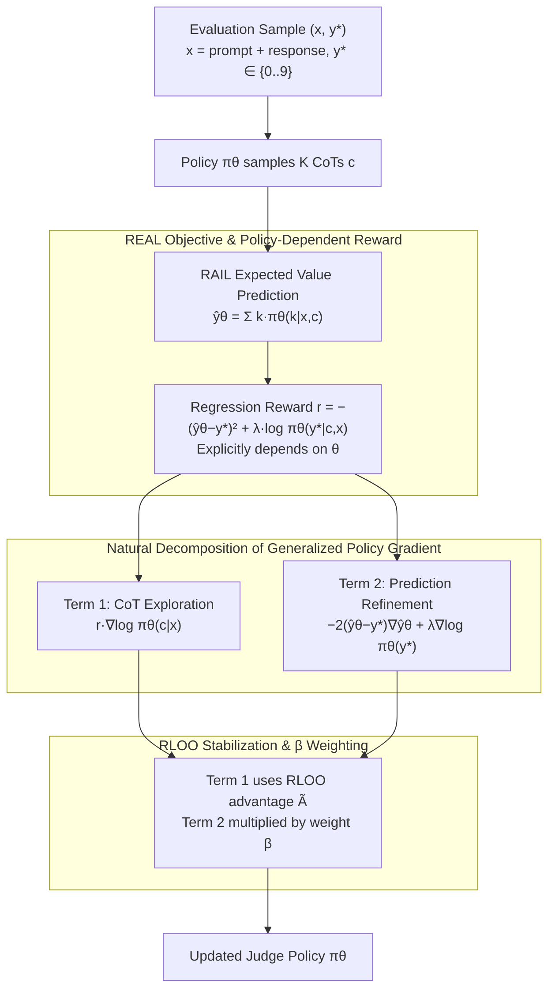

# REAL: Integrating Regression-Aware Rewards into RL, Teaching LLM-as-a-Judge that "Even a One-Point Difference Matters"

**Conference**: ICML 2026  
**arXiv**: [2603.17145](https://arxiv.org/abs/2603.17145)  
**Code**: https://github.com/YasminZhang/REAL (Available)  
**Area**: Reinforcement Learning / LLM Post-training / LLM Evaluation  
**Keywords**: LLM-as-a-Judge, Regression-Aware Reward, Generalized Policy Gradient, Policy-Dependent Reward, Correlation Optimization  

## TL;DR
Addressing the inherent flaw of binary 0/1 rewards in RL for LLM-as-a-Judge which ignores ordinal structures, the authors integrate RAFT's "expected value prediction + squared error" into the RL objective. Since the reward explicitly depends on policy parameters, a Generalized Policy Gradient is employed—decomposing cleanly into a "CoT Exploration term" and a "Prediction Refinement term." Across 8B–32B base models, it consistently outperforms SFT and standard RL, with Qwen3-32B showing an 8.4/7.2 point gain in Pearson/Spearman correlation over SFT.

## Background & Motivation
**Background**: LLM-as-a-Judge is a core component for evaluation, alignment, and preference modeling—requiring models to output a numerical score representing "quality/correctness/preference intensity." Mainstream training schemes include: (1) SFT (e.g., Prometheus), where scores are learned as discrete tokens using cross-entropy; (2) Regression-aware SFT (e.g., RAFT/TRACT), which integrates "expected value prediction $\hat y_\theta(x, c) = \sum_{k \in \mathcal{K}} k \cdot \pi_\theta(k|x,c)$" with squared error to recover ordinal structure.

**Limitations of Prior Work**: Extending the regression-aware logic of RAFT/TRACT to RL post-training is a natural next step—RL allows the model to **actively explore** its own CoT trajectories, whereas SFT only mimics fixed ground-truth reasoning chains. However, current RL post-training frameworks (PPO/GRPO/DPO/Guo 2025) rely on rule-based verifiers providing 0/1 rewards like $r = \mathbf{1}(y = y^*)$. This is catastrophic for regression tasks: if the ground truth is 5, a prediction of 4 is seen as equally "bad" as a prediction of 1 by standard RL, even though humans consider the former much closer. The authors' Fig. 2 empirically confirms this: standard RL continuing from TRACT checkpoints leads to a collapse in correlation metrics.

**Key Challenge**: To retain the advantage of "exploring CoT reasoning space" while acknowledging that "magnitude of score discrepancy matters," regression rewards must be used in RL. However, in the regression reward form $r = -(\hat y_\theta - y^*)^2$, $\hat y_\theta$ explicitly depends on policy parameters $\theta$. This violates the premise $\nabla_\theta r = 0$ in standard REINFORCE derivations, rendering standard policy gradient formulas incorrect.

**Goal**: (1) Propose a formal framework to legally incorporate regression rewards into RL; (2) Theoretically link this to correlation metrics—as downstream evaluation for LLM-as-a-Judge uses Pearson/Spearman rather than sample-level MSE; (3) Verify improvements in OOD generalization across 8B–32B model scales.

**Key Insight**: Utilize the **Generalized Policy Gradient estimator** from Schulman 2015 to explicitly handle the unconventional "parameter-dependent reward" setting.

**Core Idea**: By leveraging the mathematical fact that "Generalized Policy Gradient → natural decomposition into CoT Exploration + Prediction Refinement," regression awareness is elegantly embedded into RL. It is also theoretically proven that minimizing squared error is equivalent to optimizing Pearson correlation.

## Method

### Overall Architecture
REAL targets a specific goal: enabling LLM-as-a-Judge to recognize that "even a one-point difference counts" during RL post-training. The input is an evaluation sample pair $(x, y^*)$, where $x$ is a "prompt + response" combination and $y^* \in \mathcal{K} = \{0, 1, \dots, 9\}$ is a single-character numerical label. The policy $\pi_\theta$ first autoregressively generates a CoT $c$, and then provides a numerical score. The crucial pivot is that it does not sample this number directly; instead, it uses the RAIL expected value predictor $\hat y_\theta(x, c) = \sum_{k \in \mathcal{K}} k \cdot \pi_\theta(k | x, c)$ to collapse the 0–9 distribution into a continuous expectation, applying squared error to it. During training, $K$ CoT samples are taken for each $x$, the advantage is estimated via RLOO, and the policy is updated using a gradient decomposed into two terms—one for CoT exploration and one for prediction refinement.

### Key Designs

**1. REAL Objective and Implicit Policy-Dependent Reward: Legitimizing Regression Loss in RL**

RAFT/TRACT demonstrated that "expected value prediction + squared error" can recover the ordinal structure of scores, but their CoTs are provided by fixed sampling sources, making them essentially SFT. The first step of REAL is to move this regression objective entirely into RL. The objective function is defined as $\mathcal{L}_{\text{REAL}}(\theta) = \mathbb{E}_{(x, y^*) \sim \mathcal{D},\, c \sim \pi_\theta(\cdot | x)}[(\hat y_\theta(x, c) - y^*)^2 - \lambda \log \pi_\theta(y^* | x, c)]$, where the first term is squared error forcing the expected predictor towards ground truth, and the second is an NTP auxiliary loss for the final-answer token (collapsing to pure regression if $\lambda = 0$). The corresponding implicit reward $r_{\text{REAL}}(\theta, x, c) = -(\hat y_\theta(x, c) - y^*)^2 + \lambda \log \pi_\theta(y^* | c, x)$ **explicitly depends on $\theta$**, which is the watershed between it and standard RL.

Its effectiveness stems from two substitutions. First, replacing the fixed $\pi_{\text{temp}}$ sampling source of TRACT with the current policy $\pi_\theta$ allows CoT and rewards to evolve synchronously, combining "regression awareness" and "active exploration" for the first time. Second, the RAIL expected predictor incorporates the shape of the entire 0–9 distribution into the gradient, rather than just individual token probabilities, providing an order of magnitude higher information density—in experiments, simply switching the inference to RAIL yields "free lunch" improvements.

**2. Natural Decomposition of Generalized Policy Gradient: Turning Parameter-Dependent Rewards into Elegant Structure**

Since $\hat y_\theta$ appears in the reward, $\nabla_\theta r \ne 0$, and the premise of standard REINFORCE (gradient of reward with respect to $\theta$ is zero) fails. REAL applies the Generalized Policy Gradient lemma from Schulman 2015 to directly expand the chain rule on $\mathcal{L}(\theta) = \mathbb{E}_{x,\, c \sim \pi_\theta}[r(\theta, x, c)]$:

$$\nabla_\theta \mathcal{L} = \mathbb{E}\Big[\underbrace{r(\theta, x, c)\, \nabla_\theta \log \pi_\theta(c | x)}_{\text{Term 1: CoT Exploration}} + \underbrace{\nabla_\theta r(\theta, x, c)}_{\text{Term 2: Prediction Refinement}}\Big]$$

Substituting the REAL reward, Term 2 expands into $-2(\hat y_\theta - y^*)\nabla_\theta \hat y_\theta + \lambda \nabla_\theta \log \pi_\theta(y^* | x, c)$, where $\nabla_\theta \hat y_\theta = \sum_k k \cdot \nabla_\theta \pi_\theta(k | x, c)$. The beauty of this decomposition is its correspondence to two distinct learning modes: Term 1 treats CoT $c$ as an "action" to be explored via REINFORCE (policy-gradient style), while Term 2 treats the number $y$ as a "known ground truth" to be refined via backpropagation (backprop style). While GRPO updates $c$ and $y$ using the same rule as homogeneous tokens, REAL explicitly acknowledges their structural differences—CoT is a high-dimensional sequence requiring exploration, whereas final answers are low-cardinality discrete variables suitable for direct regression. This also distinguishes it from JEPO (Tang et al., 2025): JEPO solves for "non-verifiable $y^*$," while REAL solves for "ordered numerical $y^*$."

**3. RLOO Stabilization and $\beta$ Weighting: Mapping Theoretical Gradients to Engineering Objectives**

Because the theoretical gradient has high variance, REAL samples $K$ CoTs per $x$, using a leave-one-out baseline to compute the advantage $A^{(i)} = r^{(i)} - \frac{1}{K-1}\sum_{j \ne i} r^{(j)}$. This is normalized by intra-group std and clipped to $[-1, 1]$ to produce $\tilde A^{(i)}$. The final stabilized gradient is $\nabla \mathcal{L} \approx \frac{1}{K} \sum_i [\tilde A^{(i)} \nabla_\theta \log \pi_\theta(c_i | x) + \beta \nabla_\theta r_{\text{REAL}}(\theta, x, c_i)]$. Here, $\beta$ controls the strength of Prediction Refinement relative to CoT Exploration. It is the only hyperparameter introduced but is not strictly necessary—theoretically, $\beta = 1.0$ is the mathematically exact value, and experiments show it works well. It serves mainly as an engineering interface for future "exploration-heavy" or "refinement-heavy" adjustments. Choosing RLOO over GRPO/PPO is consistent with the "dual-term decomposition" philosophy: since the refinement term provides low-variance signals, the exploration term does not require the additional complexity of PPO.

### Loss & Training
The full objective is $\mathcal{L}_{\text{REAL}}(\theta) = \mathbb{E}_{(x, y^*),\, c \sim \pi_\theta}[(\hat y_\theta(x, c) - y^*)^2 - \lambda \log \pi_\theta(y^* | x, c)]$, used with the RLOO estimator and $\beta = 1.0$. $\lambda$ follows the default settings from RAFT/TRACT. The CoT group size $K$ is kept moderate in the style of GRPO (specific values are in the appendix).

## Key Experimental Results

### Main Results (Selected from Table 2, Mistral2-7B and Qwen3-32B; Metrics ×100)

| Model | Method | Paradigm | Inference | FB Bench (r/ρ) | FLASK (r/ρ) | Vic. Bench (r/ρ) | MT Bench (r/ρ) | Avg r | Avg ρ |
|------|------|------|------|----------------|--------------|------------------|-----------------|--------|--------|
| Mistral2-7B | Base+warmup | – | Standard | 83.1 / 83.3 | 41.5 / 41.9 | 49.2 / 42.4 | 30.9 / 31.8 | 51.2 | 49.8 |
| Mistral2-7B | RAFT | SFT | RAIL | 87.9 / 88.0 | 41.8 / 41.9 | 52.8 / 51.3 | 39.9 / 41.8 | 55.6 | 55.8 |
| Mistral2-7B | TRACT | SFT | RAIL | 93.9 / 93.7 | 50.7 / 50.0 | 56.2 / 54.8 | 52.1 / 50.1 | 63.2 | 62.2 |
| Mistral2-7B | Standard RL | RL | RAIL | 93.7 / 93.7 | 51.6 / 50.5 | 58.0 / 56.0 | 52.9 / 50.7 | 64.1 | 62.7 |
| Mistral2-7B | **Ours (REAL)** | RL | RAIL | 93.2 / 93.4 | **56.0 / 54.1** | **63.3 / 60.2** | **59.3 / 56.9** | **67.9** | **66.2** |
| Qwen3-32B | Base | – | RAIL | 63.4 / 70.8 | 54.3 / 60.4 | 50.8 / 57.4 | 42.5 / 46.8 | 52.7 | 58.8 |
| Qwen3-32B | RAFT | SFT | RAIL | 85.4 / 86.5 | 52.1 / 52.9 | 51.9 / 52.0 | 61.1 / 59.6 | 62.6 | 62.8 |
| Qwen3-32B | **Ours (REAL)** | RL | RAIL | **91.1 / 91.7** | **58.9 / 58.6** | **65.1 / 60.7** | **68.9 / 69.1** | **71.0** | **70.0** |

Note that on the in-domain FB Bench, REAL is only on par with or 0.5 points lower than standard RL. However, on OOD benchmarks like FLASK, Vicuna Bench, and MT Bench, REAL leads by 4–8 points. This demonstrates that the advantage of regression-aware rewards lies in generalization rather than overfitting to the training distribution. On Qwen3-32B, REAL improves Pearson/Spearman by 8.4/7.2 over SFT and 18.3/11.2 over the base model.

### Ablation Study (Selected from Table 4.4 + Tab 14)

| Configuration | Key Change | Phenomenon |
|------|---------|------|
| REAL Full | RL + Regression Reward + Dual Term Gradient | Overall OOD SOTA |
| Remove Term 1 (≈ TRACT) | Degenerates to SFT static refinement | Loses CoT exploration, OOD drops 3–5 points |
| Remove Term 2 (≈ Standard RL with $r = -(\hat y - y^*)^2$ without prediction gradient) | CoT exploration kept, distribution signal removed | Correlation collapses during training (Fig. 2) |
| $\lambda = 0$ | Remove NTP auxiliary loss | Performance close to $\lambda > 0$, regression term is the driver |
| $\beta = 1.0$ | Theoretically accurate weighting | Already optimal, no need to sweep |
| vs JEPO (Tab. 14) | Replaced with marginal log-likelihood | REAL wins on all regression metrics |

### Key Findings
- **OOD > in-domain** is the most persuasive argument for REAL: it performs similarly to standard RL in-domain but pulls ahead by 4–8 points on OOD benchmarks. Binary rewards can "remember" correctness patterns in-domain, but fail to learn the universal structure of "score distances."
- Standard RL **actively collapses** correlation: continuing training from TRACT checkpoints with binary rewards causes Pearson/Spearman to drop (Fig. 2), exposing the anti-optimization effect of binary rewards on regression tasks.
- Term 2 (Prediction Refinement) handles 80% of the work: removing Term 2 makes training impossible; removing Term 1 maintains decent performance (≈ TRACT) but loses OOD exploration capabilities.
- **Lemma 3.1** (Minimizing squared error is equivalent to Pearson optimality) builds a mathematical bridge between "sample-level MSE (convenient for engineering)" and "population-level correlation (relevant for evaluation)."
- The RAIL expected value predictor itself is a "free lunch" (base+RAIL > base+Standard), but RAIL without RL is insufficient—REAL adds another 6–8 points on top.

## Highlights & Insights
- **The "illegal" setting where reward depends on policy parameters is elegantly resolved via Generalized Policy Gradient**—this opens a door: any "differentiable metric calculated from the model's own distribution" (e.g., entropy, calibration, confidence) can now be integrated into RL rewards. REAL serves as a paradigm.
- The decomposition theorem clarifies the relationship between RL and SFT: TRACT is a Term 2-only version of REAL; Standard RL is a version of REAL's Term 1 using binary $r$. REAL unifies both. This "$X = A + B$" decomposition is structurally persuasive in academic writing.
- Treating numerical prediction as direct backprop supervision, rather than an RL action to be sampled, respects the structure of the evaluation task: $y^*$ is fully observable, so there is no need to pass it through high-variance policy gradients. This trick can be applied to any task where the final answer is a low-cardinality discrete variable (math answers [0-100], classification labels).
- The fact that $\beta = 1.0$ works directly is a proxy for method quality—it suggests the formalization is mathematically grounded.

## Limitations & Future Work
- Task scope is limited to **single scalar output** evaluation tasks where $y^* \in \{0, \dots, 9\}$; multidimensional scoring (e.g., Prometheus rubrics) or free-text judgment requires extending the RAIL form.
- "Semantic calibration" of regression rewards is not addressed: the model might learn to output values closer to the truth using worse reasoning. REAL does not supervise CoT quality; whether CoT degrades into placeholders under pure regression is an open question.
- Orthogonality to verifier-friendly tasks (math/code): REAL handles regression tasks where 0/1 rule checks are impossible but does not address integration with binary rewards. Future multi-task RL for comprehensive judges/verifiers will need weighting strategies.
- Theoretical assumptions specify conditional independence $c \perp y^* | x$ (Lemma 3.1); in reality, CoT content might leak the label, leaving room for refined conclusions.
- Computational overhead for $K$ CoTs × $\nabla_\theta \hat y_\theta$ (requiring backprop for each digit token) might be significant; throughput numbers were not provided.

## Related Work & Insights
- **vs TRACT (Chiang et al., 2025)**: TRACT treats self-generated CoT as ground truth for SFT, unable to evaluate intermediate quality. REAL allows CoTs to be sampled by the current policy and ranked via regression rewards—mathematically, TRACT is a special case of REAL.
- **vs Standard RL (PPO/GRPO/DPO with $r = \mathbf{1}(y = y^*)$)**: Standard RL collapses all "not entirely correct" answers into zero reward, while REAL preserves ordinal information via $\hat y_\theta$'s continuous expectation.
- **vs JEPO (Tang et al., 2025)**: JEPO uses a Jensen bound for marginal log-likelihood to solve non-verifiable $y^*$ problems, but it remains non-ordinal. REAL specializes in ordered numerical scores.
- **vs RAFT/RAIL**: RAFT is the SFT version of regression-awareness; RAIL is inference-time expected prediction. REAL pulls these tools into the RL phase with legality proofs, marking the natural conclusion of this line of work.
- Insight: The paradigm of Generalized Policy Gradient + "policy-dependent rewards" can be generalized to optimize any differentiable evaluation metrics like calibration (ECE), coverage, or adversarial robustness.

## Rating
- Novelty: ⭐⭐⭐⭐⭐ First instance of incorporating regression-aware rewards into RL; clever use of Generalized Policy Gradient.
- Experimental Thoroughness: ⭐⭐⭐⭐ Coverage of 8B–32B scales across 4 benchmarks with clear OOD/in-domain comparisons; however, throughput/training cost transparency is limited.
- Writing Quality: ⭐⭐⭐⭐⭐ Lemma 3.1, Table 1 comparison, and the dual-term decomposition are seamlessly integrated; a textbook ICML-style paper.
- Value: ⭐⭐⭐⭐⭐ In an era where LLM-as-a-Judge is the primary path for RLHF and evaluation, this establishes the correct paradigm for "scoring-based RL."

<!-- RELATED:START -->

## Related Papers

- [\[ICML 2026\] Reasoning Is Not Free: Robust Adaptive Cost-Efficient Routing for LLM-as-a-Judge](reasoning_is_not_free_robust_adaptive_cost-efficient_routing_for_llm-as-a-judge.md)
- [\[ICML 2026\] On Effectiveness and Efficiency of Agentic Tool-calling and RL Training](on_effectiveness_and_efficiency_of_agentic_tool-calling_and_rl_training.md)
- [\[ICLR 2026\] Preference Leakage: A Contamination Problem in LLM-as-a-judge](../../ICLR2026/llm_evaluation/preference_leakage_a_contamination_problem_in_llm-as-a-judge.md)
- [\[ICML 2026\] Toward Training Superintelligent Software Agents through Self-Play SWE-RL](toward_training_superintelligent_software_agents_through_self-play_swe-rl.md)
- [\[ICLR 2026\] BiasScope: Towards Automated Detection of Bias in LLM-as-a-Judge Evaluation](../../ICLR2026/llm_evaluation/biasscope_towards_automated_detection_of_bias_in_llm-as-a-judge_evaluation.md)

<!-- RELATED:END -->
