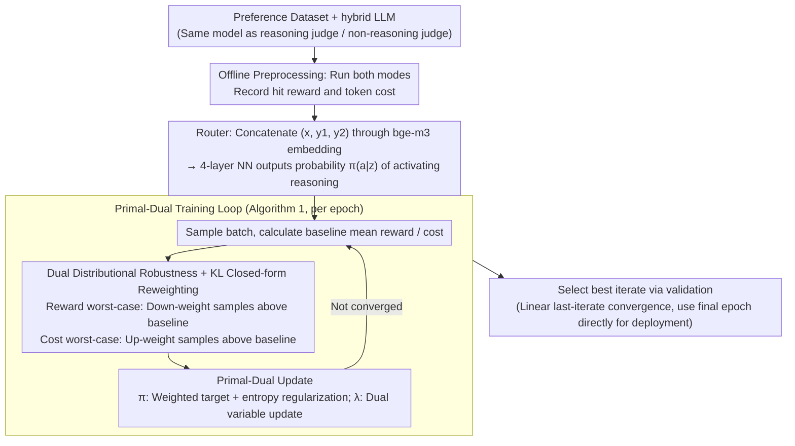

# Reasoning Is Not Free: Robust Adaptive Cost-Efficient Routing for LLM-as-a-Judge

**Conference**: ICML 2026  
**arXiv**: [2605.10805](https://arxiv.org/abs/2605.10805)  
**Code**: None  
**Area**: LLM Evaluation / Model Routing / Distributionally Robust Optimization  
**Keywords**: LLM-as-a-Judge, Reasoning Model Routing, KL Uncertainty Set, primal-dual, OOD Robustness

## TL;DR
RACER models the decision of "whether to invoke reasoning mode for a judge query" as a distributionally robust constrained optimization problem with KL uncertainty sets. Using a primal-dual algorithm, it solves for an optimal routing policy that satisfies cost budgets under OOD conditions and provides the first linear convergence theoretical guarantee for an LLM router policy.

## Background & Motivation

**Background**: LLM-as-a-Judge increasingly utilizes reasoning models (o1, DeepSeek-R1, Qwen3 thinking, etc.) for evaluation. These models learn reasoning via RL on verifiable tasks, but since the judgment task itself is not explicitly optimized, whether "reasoning truly improves judge accuracy" remains an open question. A natural intermediate solution is routing—dynamically selecting reasoning or instruct modes based on query difficulty.

**Limitations of Prior Work**: Existing LLM routing works (FrugalGPT, P2L, RouteLLM, ThinkSwitcher) share three major shortcomings. First, they focus almost entirely on QA tasks and overlook judge scenarios. Second, they only optimize the "cost-accuracy tradeoff under the training distribution"; once the query distribution shifts at deployment (e.g., changes in user base or domain proportions), cost constraints are violated and performance collapses. Third, most are empirical or heuristic without theoretical convergence guarantees. Empirical evidence shows that reasoning judges significantly improve accuracy in math/coding but can even yield negative gains in safety/knowledge while increasing token costs by several times—indiscriminate use of reasoning is both expensive and potentially counterproductive.

**Key Challenge**: Reasoning modes are expensive and not universally beneficial (overthinking can be harmful), yet training data is static, causing both reward estimation and cost budgets to become distorted under OOD deployment.

**Goal**: Learn a routing policy $\pi(a | z)$ ($a \in \{0, 1\}$ representing whether to activate reasoning) under a fixed cost budget $C$, such that it (i) maximizes expected judge reward; (ii) is robust to query distribution shift; and (iii) has theoretical convergence guarantees.

**Key Insight**: Distributionally Robust Optimization (DRO) with KL uncertainty sets combined with Lagrangian primal-dual. Both reward and cost are measured using worst-case metrics, treating "robustness in reward" and "robustness in cost" separately (the former prevents overestimating benefits during OOD, the latter prevents budget overruns during OOD).

**Core Idea**: Reformulate LLM-as-a-Judge routing as $\max_\pi \min_{\tilde{\rho} \in \mathcal{U}(\rho_n, \delta)} \mathbb{E}_{\tilde{\rho}}[r] \text{ s.t. } \max_{\tilde{\rho} \in \mathcal{U}} \mathbb{E}_{\tilde{\rho}}[c] \leq C$, and prove that the worst-case distribution under KL uncertainty sets has a closed-form reweighting, allowing for efficient solving via primal-dual.

## Method

### Overall Architecture

RACER addresses whether a query is worth the cost of reasoning for judging while maintaining cost budgets during deployment distribution shifts. Its input is a preference dataset $\{(x_i, y_{i,1}, y_{i,2}, l_i)\}$ with ground-truth labels and a hybrid LLM—the same model capable of acting as both a reasoning judge $\Phi_1$ and a non-reasoning judge $\Phi_0$. Before training, both modes are run for every instance to record the reward $r_i = \mathbb{I}(\Phi_{a_i}(z_i) = l_i)$ and token cost $c_i$ as offline signals. The learned router is a small 4-layer NN that takes embeddings from bge-m3 (trained on the concatenated prompt and response) and outputs the probability $\pi(a|z)$ of activating reasoning. Training involves formulating "maximizing robust reward under cost constraints" as a constrained min-max problem, alternating updates for the policy $\pi$ and the dual variable $\lambda$ using primal-dual, and selecting the best iterate on the validation set.

### Key Designs

**1. Dual Distributional Robustness: Separate Worst-Case for Reward and Cost**

When deployment query distributions shift, both estimated rewards and costs on the training distribution become distorted. A naive router might exceed the budget or suffer performance drops. RACER formulates router learning as constrained optimization over a KL uncertainty set: $\max_\pi R_{\mathcal{U}(\rho_n, \delta)}(\pi)$ s.t. $C_{\mathcal{U}(\rho_n, \delta)}(\pi) \leq C$, where $\mathcal{U}(\rho_n, \delta)$ is a KL ball centered at the empirical distribution $\rho_n$ with radius $\delta$. $R$ is the worst-case reward and $C$ is the worst-case cost within the ball. Unlike traditional DRO which only robustifies a single objective, a key observation here is that reward and cost distortions under OOD are independent: OOD queries might be cheaper (where cost isn't an issue, allowing more aggressive reward robustification), or more expensive (where cost robustness is critical to prevent budget overruns). By robustifying both sides separately, the algorithm remains safe under both "cheaper" and "more expensive" shifts. Ablations (Figure 3) show this split is essential—RACER-R (reward only) exceeds budgets in expensive scenarios, while RACER-C (cost only) wastes budget in cheaper scenarios.

**2. Closed-Form Worst-Case Reweighting for KL Uncertainty Sets (Theorem 3.1)**

The difficulty lies in the fact that we lack samples for most distributions in the uncertainty set. Theorem 3.1 provides a clean equivalent: under a KL ball, the worst-case distribution is simply a closed-form reweighting of the samples. Let $f_i = \mathbb{E}_{a \sim \pi(\cdot|z_i)}[f(z_i, a)]$ be the policy expectation of some metric (reward or cost) for sample $i$. The worst-case distribution for minimization is $\underline{\rho}(i) \propto \rho_n(i)\exp\!\big(\tfrac{\underline{s} - f_i}{\tau}\big)$, and for maximization is $\bar{\rho}(i) \propto \rho_n(i)\exp\!\big(\tfrac{f_i - \bar{s}}{\tau}\big)$. Intuitively, the reward worst-case down-weights "samples with higher-than-baseline rewards" and up-weights those with lower rewards (pessimistic assumption). The cost worst-case up-weights "high cost samples," forcing optimization to focus on high-risk areas. Temperature $\tau$ controls the intensity of reweighting. This allows calculating the worst-case over an unknown distribution by reweighting known samples with nearly zero additional cost.

**3. Entropy-Regularized Primal-Dual and Linear Last-Iterate Convergence (Theorem 4.1/4.2)**

With closed-form worst-case distributions, the constrained optimization reduces to a regularized min-max Lagrangian: $L_\beta(\pi, \lambda) = R_{\underline{\rho}}(\pi) - \lambda C_{\bar{\rho}}(\pi) + \beta\big(\mathcal{H}(\pi) + \tfrac{1}{2}\lambda^2\big)$. Primal-dual solves this via: $\pi_{t+1} = \arg\max_\pi\{R_{\underline{\rho}}(\pi) - \lambda_t C_{\bar{\rho}}(\pi) + \beta\mathcal{H}(\pi)\}$ and $\lambda_{t+1} = \arg\max_{\lambda \geq 0}\{-\lambda C_{\bar{\rho}}(\pi) + \tfrac{1}{2}\beta\lambda^2\}$. The entropy term $\mathcal{H}(\pi)$ prevents the policy from collapsing into a deterministic one, while $\tfrac{1}{2}\lambda^2$ ensures the dual variable remains bounded. Together, they guarantee a unique saddle point (Theorem 4.1) and a linear last-iterate convergence rate (Theorem 4.2):

$$\text{KL}(\pi_t \| \pi^*) \leq \frac{M^2 K^2}{2\beta^2}\left(\frac{M^2 K^2}{M^2 K^2 + 2\beta^2}\right)^{2t}(\lambda_0 - \lambda^*)^2.$$

This is the first linear last-iterate convergence proof for an LLM router, meaning the final checkpoint can be used directly for deployment without needing ergodic averaging.

### Loss & Training

The full training loop (Algorithm 1) per epoch: (a) Sample a batch; (b) Enumerate $a \in \{0, 1\}$ for each sample to get reward $r$ and cost $c$; (c) Using batch means $\bar{r}, \bar{c}$ as baselines, calculate worst-case weights $\underline{\rho}(i) \propto \exp((\bar{r} - r_i)/\tau)$ and $\bar{\rho}(i) \propto \exp((c_i - \bar{c})/\tau)$; (d) Update $\pi$ and $\lambda$ via primal-dual; (e) Select the best iteration via validation. Hyperparameters $\tau$ and $\beta$ control robustness intensity and entropy regularization respectively.

## Key Experimental Results

### Main Results

Data: Skywork Reward Preference subset + Math-Step-DPO-10K + Code-Preference-Pairs (40K total training); Evaluation on RewardBench / RewardBench-2 / JudgeBench; Judge pairs are Qwen3-1.7B / 4B / 8B in reasoning vs instruct modes. Budget $C$ is the cost ratio (reasoning/instruct token ratio).

| Model Scale | Method | Accuracy | Cost ratio |
|-------------|--------|----------|------------|
| 4B          | All-Instruct | ~81.0 | 1.0 |
| 4B          | All-Reasoning | ~85.5 | 11.2 (High) |
| 4B          | Random | ~83.5 | 3.4 |
| 4B          | **RACER (C=3.4)** | **~85.8** | 3.4 |
| 1.7B        | RouterBench-KNN | 71.3 | 2.6 |
| 1.7B        | RouteLLM-MF | 69.4 | 3.8 |
| 1.7B        | M-IRT | 71.6 | 3.4 |
| 1.7B        | **RACER (C=4)** | **72.2** | 3.6 |
| 8B          | M-IRT | 88.9 | 3.4 |
| 8B          | **RACER (C=4)** | **90.0** | 3.9 |

At approximately half the cost of All-Reasoning, RACER matches or exceeds All-Reasoning accuracy. Compared to SOTA router baselines, it shows gains of 0.64, 1.10, and 1.06 points at 1.7B, 4B, and 8B scales, respectively.

### Ablation Study

| Configuration | OOD Scenario | Conclusion |
|---------------|--------------|------------|
| ACER (Non-robust) | OOD more expensive | Exceeds budget, reward drops |
| RACER-R only | OOD cheaper | Highest reward (uses budget aggressively) |
| RACER-C only | OOD more expensive | Safe cost (within budget), but lower reward |
| Full RACER | Both | Stable on both ends, optimal robustness |

Entropy regularization $\beta$ sensitivity (Qwen3-4B):

| $\beta$ | $C=2$ Acc | $C=3$ Acc | $C=4$ Acc |
|---------|-----------|-----------|-----------|
| 0       | 85.2      | 86.7      | 86.8      |
| 0.005   | 85.5      | 86.7      | 86.7      |
| 0.01    | 85.5      | 86.7      | 86.7      |
| 0.05    | 84.8      | 86.0      | 86.2      |

Under tight budgets, performance drops with $\beta = 0$, remains stable with $\beta \in [0.005, 0.01]$, and decreases with $\beta = 0.05$ due to excessive regularization.

### Key Findings
- Gains from reasoning judges are highly domain-dependent: significant improvements in math/coding (>+10%), but negligible or negative gains in safety/knowledge. Reasoning uses $11.2\times$ tokens on average.
- Random routing approximates a linear interpolation between All-Instruct and All-Reasoning on the cost-accuracy curve; RACER’s curve is distinctly concave toward the upper-left, proving instance-level selection is more effective than random activation.
- Distribution shifts exist between real benchmarks (training on Skywork, testing on RewardBench/JudgeBench). Non-robust ACER violates budgets or loses accuracy in certain settings.
- Cross-model family transfer: Results remain consistent when using Llama-3.1-8B (Appendix) despite training on Qwen3.

## Highlights & Insights
- **"Reasoning is not free" Framing**: Directly addresses a core pain point in the reasoning model era where cost-accuracy tradeoffs are often ignored.
- **Dual Robust Design**: Separating reward and cost robustness is an elegant solution to the independent nature of OOD distortions for these two metrics.
- **KL Closed-form Reweighting**: Implements DRO as weighted sample gradients, making it practically cost-free to adopt in production systems.
- **Linear Last-Iterate Convergence**: The first such proof for an LLM router provides significant theoretical value, ensuring the final checkpoint is valid for deployment.
- **Regularization Combination**: The mix of entropy and dual variable regularization ensures a unique saddle point.

## Limitations & Future Work
- Only performs binary routing (reasoning vs non-reasoning); expansion to $K$ candidate judges requires a multi-classification approach.
- KL balls can be overly conservative under large distribution shifts, potentially causing the router to default to always-instruct. Other uncertainty sets (Wasserstein / $\chi^2$) could be explored.
- Assumes bounded costs (Assumption 2) and bounded density ratios (Assumption 3), which may not hold under extreme OOD.
- Temperature $\tau$ was not tuned adaptively (used grid search).
- Training requires executing both modes for all instances, incurring significant preprocessing token costs.
- Reliance on human-annotated preference labels for ground truth.

## Related Work & Insights
- **vs ThinkSwitcher (Liang 2025)**: Similar mode switching for hybrid reasoning models but lacks DRO handling and theoretical guarantees.
- **vs RouteLLM-MF (Ong 2024) / RouterBench (Hu 2024)**: Traditional multi-LLM routers for strong vs weak models; RACER's framework is transferable to these multi-model settings.
- **vs FrugalGPT (Chen 2023)**: Cascading strategy versus RACER's single-shot mode selection, which offers more controllable latency.
- **vs DRO Literature**: Builds on $f$-divergence balls but introduces the "separate robust reward/cost" and linear convergence aspects for binary policies.

## Rating
- Novelty: ⭐⭐⭐⭐ 
- Experimental Thoroughness: ⭐⭐⭐⭐ 
- Writing Quality: ⭐⭐⭐⭐⭐ 
- Value: ⭐⭐⭐⭐ 

<!-- RELATED:START -->

## Related Papers

- [\[ICML 2026\] REAL：把回归感知奖励塞进 RL，让 LLM-as-a-Judge 学会"差一分也是差"](real_regression-aware_reinforcement_learning_for_llm-as-a-judge.md)
- [\[ICML 2026\] Margin-Adaptive Confidence Ranking for Reliable LLM Judgement](margin-adaptive_confidence_ranking_for_reliable_llm_judgement.md)
- [\[ICLR 2026\] Doubly-Robust LLM-as-a-Judge: Externally Valid Estimation with Imperfect Personas](../../ICLR2026/llm_evaluation/doubly-robust_llm-as-a-judge_externally_valid_estimation_with_imperfect_personas.md)
- [\[ACL 2025\] YESciEval: Robust LLM-as-a-Judge for Scientific Question Answering](../../ACL2025/llm_evaluation/yescieval_llm_judge_science.md)
- [\[ACL 2026\] Reasoning Model Is Superior LLM-Judge, Yet Suffers from Biases](../../ACL2026/llm_evaluation/reasoning_model_is_superior_llm-judge_yet_suffers_from_biases.md)

<!-- RELATED:END -->
