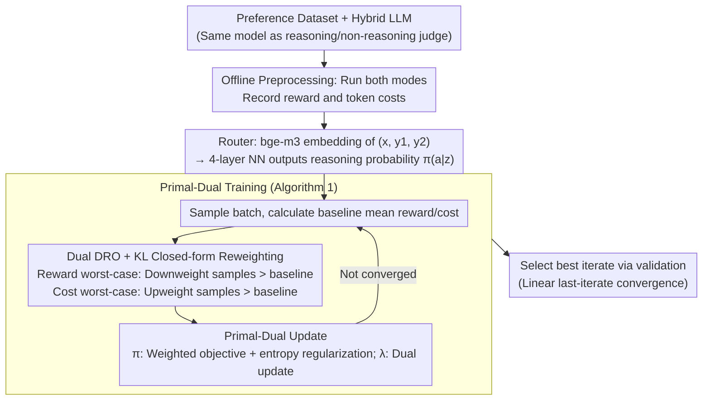

# Reasoning Is Not Free: Robust Adaptive Cost-Efficient Routing for LLM-as-a-Judge

**Conference**: ICML 2026  
**arXiv**: [2605.10805](https://arxiv.org/abs/2605.10805)  
**Code**: None  
**Area**: LLM Evaluation / Model Routing / Distributionally Robust Optimization  
**Keywords**: LLM-as-a-Judge, reasoning model routing, KL uncertainty set, primal-dual, OOD robustness

## TL;DR
RACER models the decision of whether to invoke reasoning mode for each judge query as a distributionally robust constrained optimization problem with a KL uncertainty set. It uses a primal-dual algorithm to derive an optimal routing strategy that satisfies cost budgets under OOD conditions and provides the first theoretical guarantee of linear convergence for LLM router policies.

## Background & Motivation

**Background**: LLM-as-a-Judge increasingly utilizes reasoning models (o1, DeepSeek-R1, Qwen3 thinking, etc.) for evaluation. These models learn reasoning through RL on verifiable tasks, but since judgment tasks are not explicitly optimized, whether "reasoning truly improves judge accuracy" remains an open question. A natural intermediate solution is routing—dynamically selecting reasoning or instruct modes based on query difficulty.

**Limitations of Prior Work**: Existing LLM routing works (FrugalGPT, P2L, RouteLLM, ThinkSwitcher) share three common shortcomings. First, they focus almost exclusively on QA tasks and overlook judge scenarios. Second, they only optimize the "cost-accuracy trade-off under training distribution"; once the query distribution shifts during deployment (changes in user groups or domain proportions), cost constraints are violated and performance collapses. Third, they are largely empirical and heuristic without theoretical convergence guarantees. This paper empirically demonstrates that reasoning judges significantly improve accuracy in math/coding but can have a negative impact on safety/knowledge while increasing token costs several times over—indiscriminately using reasoning is both expensive and potentially detrimental.

**Key Challenge**: Reasoning modes are expensive and not universally beneficial (overthinking can be harmful), yet training data is static, causing both reward estimation and cost budgets to become distorted under OOD deployment.

**Goal**: Learn a routing policy $\pi(a | z)$ ($a \in \{0, 1\}$ indicating whether to activate reasoning) under a fixed cost budget $C$ such that: (i) expected judge reward is maximized; (ii) it is robust to query distribution shifts; (iii) it has theoretical convergence guarantees.

**Key Insight**: Utilize the KL uncertainty set of Distributionally Robust Optimization (DRO) combined with Lagrangian primal-dual methods. Both reward and cost are measured using worst-case metrics, treating "robustness in reward" and "robustness in cost" separately (the former prevents overestimating benefits OOD, the latter prevents budget overruns OOD).

**Core Idea**: Reformulate LLM-as-a-Judge routing as $\max_\pi \min_{\tilde{\rho} \in \mathcal{U}(\rho_n, \delta)} \mathbb{E}_{\tilde{\rho}}[r] \text{ s.t. } \max_{\tilde{\rho} \in \mathcal{U}} \mathbb{E}_{\tilde{\rho}}[c] \leq C$, and prove that the worst-case distribution under the KL uncertainty set has a closed-form reweighting, allowing for efficient solving via primal-dual methods.

## Method

### Overall Architecture

RACER aims to answer "is this query worth the cost of reasoning for judgment" and maintains cost budgets even under distribution shifts. Its input is a preference dataset $\{(x_i, y_{i,1}, y_{i,2}, l_i)\}$ with ground-truth labels, plus a hybrid LLM where the same model can serve as both a reasoning judge $\Phi_1$ and a non-reasoning judge $\Phi_0$. During preprocessing, both modes are run for every instance to record rewards $r_i = \mathbb{I}(\Phi_{a_i}(z_i) = l_i)$ and token costs $c_i$ as offline signals. The router is a small 4-layer NN that takes embeddings of the concatenated prompt and response (via bge-m3) and outputs the probability of "activating reasoning" $\pi(a|z)$. Training involves formulating "robust reward maximization under cost budget" as a constrained min-max problem, solved by alternating updates of the policy $\pi$ and the dual variable $\lambda$, with the best iterate selected via validation.

### Key Designs

**1. Dual Distributional Robustness: Separate worst-case for Reward and Cost**

When distributions shift during deployment, rewards and costs estimated on the training distribution become distorted. RACER formulates router learning as a constrained optimization on a KL uncertainty set: $\max_\pi R_{\mathcal{U}(\rho_n, \delta)}(\pi)$ s.t. $C_{\mathcal{U}(\rho_n, \delta)}(\pi) \leq C$, where $\mathcal{U}(\rho_n, \delta)$ is a KL ball of radius $\delta$ centered at empirical distribution $\rho_n$. Unlike traditional DRO, the key observation is that reward and cost distortions OOD are independent. OOD queries might be cheaper (where cost robustness is less critical and reward should be robustified to use budget aggressively) or more expensive (where cost robustness is vital to prevent budget overruns). By robustifying both sides independently, the algorithm remains safe under both "more expensive" and "cheaper" shifts. Ablations (Figure 3) show this split is essential—RACER-R (reward robust only) exceeds budget in expensive scenarios, while RACER-C (cost robust only) wastes budget in cheaper scenarios.

**2. Closed-form worst-case Reweighting for KL Uncertainty Set (Theorem 3.1)**

Directly running alternating gradient descent on parameterized distributions is difficult as we lack samples for most distributions in the uncertainty set. Theorem 3.1 provides an equivalent closed-form reweighting: under a KL ball, the worst-case distribution for samples is a simple reweighting. If $f_i = \mathbb{E}_{a \sim \pi(\cdot|z_i)}[f(z_i, a)]$ is the expected value (reward or cost) for sample $i$, the worst-case distribution for minimization is $\underline{\rho}(i) \propto \rho_n(i)\exp\!\big(\tfrac{\underline{s} - f_i}{\tau}\big)$, and for maximization is $\bar{\rho}(i) \propto \rho_n(i)\exp\!\big(\tfrac{f_i - \bar{s}}{\tau}\big)$. Intuitively, the reward worst-case downweights samples with higher rewards and upweights those with lower rewards; the cost worst-case upweights high-cost samples to focus optimization on high-risk areas. The temperature $\tau$ controls the intensity of reweighting. This transforms the worst-case search into a simple sample weighting with near-zero extra computational cost.

**3. Entropy-Regularized Primal-Dual with Linear Last-Iterate Convergence (Theorem 4.1/4.2)**

With the closed-form worst-case distribution, the constrained optimization reduces to a regularized min-max Lagrangian $L_\beta(\pi, \lambda) = R_{\underline{\rho}}(\pi) - \lambda C_{\bar{\rho}}(\pi) + \beta\big(\mathcal{H}(\pi) + \tfrac{1}{2}\lambda^2\big)$. Primal-dual steps alternate: $\pi_{t+1} = \arg\max_\pi\{R_{\underline{\rho}}(\pi) - \lambda_t C_{\bar{\rho}}(\pi) + \beta\mathcal{H}(\pi)\}$ and $\lambda_{t+1} = \arg\max_{\lambda \geq 0}\{-\lambda C_{\bar{\rho}}(\pi) + \tfrac{1}{2}\beta\lambda^2\}$. The $\pi$ update can be rewritten as a weighted objective on the original distribution $\rho$: $\mathbb{E}_{\rho, \pi}\big[\tfrac{p_{\underline{\rho}}}{p_\rho} r - \lambda_t \tfrac{p_{\bar{\rho}}}{p_\rho} c\big] + \beta\mathcal{H}$. The regularizers $\mathcal{H}(\pi)$ (entropy) and $\tfrac{1}{2}\lambda^2$ (dual regularization) ensure a unique saddle point and provide linear last-iterate convergence:

$$\text{KL}(\pi_t \| \pi^*) \leq \frac{M^2 K^2}{2\beta^2}\left(\frac{M^2 K^2}{M^2 K^2 + 2\beta^2}\right)^{2t}(\lambda_0 - \lambda^*)^2.$$

This is the first linear convergence proof for LLM routers, meaning the final checkpoint can be used directly without needing ergodic averaging.

### Loss & Training

The full training loop (Algorithm 1) per round: (a) sample a batch; (b) enumerate $a \in \{0, 1\}$ for each sample to get $r$ and $c$; (c) calculate worst-case weights using batch means $\bar{r}, \bar{c}$; (d) update $\pi$ and $\lambda$ via primal-dual; (e) select the best iterate via validation.

## Key Experimental Results

### Main Results

Data: Skywork Reward Preference subset + Math-Step-DPO-10K + Code-Preference-Pairs (40K training); Evaluation on RewardBench / RewardBench-2 / JudgeBench; Judge pairs use Qwen3-1.7B / 4B / 8B in reasoning vs. instruct modes. Budget $C$ is cost ratio.

| Model Scale | Method | Accuracy | Cost ratio |
|-------------|--------|----------|------------|
| 4B | All-Instruct | ~81.0 | 1.0 |
| 4B | All-Reasoning | ~85.5 | 11.2 |
| 4B | Random | ~83.5 | 3.4 |
| 4B | **RACER (C=3.4)** | **~85.8** | 3.4 |
| 1.7B | RouterBench-KNN | 71.3 | 2.6 |
| 1.7B | **RACER (C=4)** | **72.2** | 3.6 |
| 8B | M-IRT | 88.9 | 3.4 |
| 8B | **RACER (C=4)** | **90.0** | 3.9 |

Ours matches or exceeds All-Reasoning accuracy at roughly half the cost and outperforms SOTA router baselines by ~1.0 point across scales.

### Ablation Study

| Config | OOD Scenario | Conclusion |
|--------|--------------|------------|
| ACER (Non-robust) | OOD Expensive | Violates budget; reward drops |
| RACER-R only | OOD Cheap | Highest reward (aggressive budget use) |
| RACER-C only | OOD Expensive | Safe budget; lower reward |
| Full RACER | Both | Best overall robustness |

### Key Findings
- Reasoning judge gains are highly domain-dependent: significant in math/coding (+10%+), but negligible or negative in safety/knowledge. Reasoning costs $11.2\times$ tokens on average.
- Random routing is a linear interpolation between modes; RACER's curve is concave towards the top-left, proving instance-level routing is superior.
- Distribution shift is real across benchmarks; non-robust routers fail constraints.

## Highlights & Insights
- **The "reasoning is not free" framing** addresses a core pain point—while scaling reasoning is popular, the cost-accuracy trade-off is often ignored.
- **Dual robust design** is elegant; reward and cost OOD distortions are independent, so robustifying them separately is necessary.
- **Closed-form KL reweighting** makes DRO implementation nearly zero-cost.
- **First linear last-iterate convergence proof** for LLM routers provides strong theoretical grounding for deployment.

## Limitations & Future Work
- Limited to binary routing; extending to $K$ judge models requires scaling to multi-class policies.
- KL balls can be overly conservative under large shifts, potentially causing the router to default to "always-instruct."
- Assumptions of bounded costs and density ratios may not hold under extreme OOD.
- Training requires executing both modes for all instances, incurring high preprocessing token costs.

## Related Work & Insights
- **vs ThinkSwitcher (Liang 2025)**: ThinkSwitcher is heuristic; RACER is a principled DRO with theoretical guarantees.
- **vs RouteLLM-MF (Ong 2024)**: Traditional routers focus on strong vs. weak models; RACER's framework is applicable to both but focuses on model modes.
- **vs FrugalGPT (Chen 2023)**: Uses cascading; RACER uses single-shot selection, offering better latency control.

## Rating
- Novelty: ⭐⭐⭐⭐
- Experimental Thoroughness: ⭐⭐⭐⭐
- Writing Quality: ⭐⭐⭐⭐⭐
- Value: ⭐⭐⭐⭐

<!-- RELATED:START -->

- **ThinkSwitcher**: Heuristic mode switching for reasoning models.
- **Think-on-Graph**: Reasoning-based judge application.
- **Distributionally Robust RL**: Foundations for the KL ball reweighting technique.

<!-- RELATED:END -->

## Related Papers

- [\[ICML 2026\] On Cost-Effective LLM-as-a-Judge Improvement Techniques](on_cost-effective_llm-as-a-judge_improvement_techniques.md)
- [\[ICML 2026\] REAL：把回归感知奖励塞进 RL，让 LLM-as-a-Judge 学会"差一分也是差"](real_regression-aware_reinforcement_learning_for_llm-as-a-judge.md)
- [\[ICML 2026\] Margin-Adaptive Confidence Ranking for Reliable LLM Judgement](margin-adaptive_confidence_ranking_for_reliable_llm_judgement.md)
- [\[ICLR 2026\] Doubly-Robust LLM-as-a-Judge: Externally Valid Estimation with Imperfect Personas](../../ICLR2026/llm_evaluation/doubly-robust_llm-as-a-judge_externally_valid_estimation_with_imperfect_personas.md)
- [\[ACL 2025\] YESciEval: Robust LLM-as-a-Judge for Scientific Question Answering](../../ACL2025/llm_evaluation/yescieval_llm_judge_science.md)

<!-- RELATED:END -->
