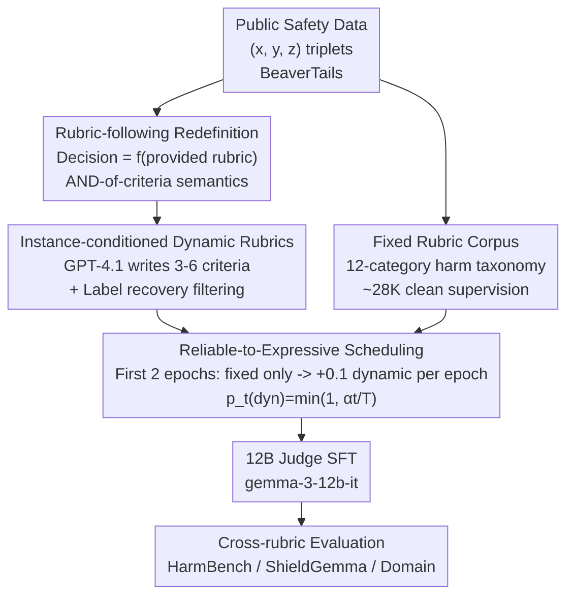

# Reliable to Expressive: A Curriculum for Rubric-Following Safety Judges

**Conference**: ICML 2026  
**arXiv**: [2606.09165](https://arxiv.org/abs/2606.09165)  
**Code**: To be confirmed  
**Area**: LLM Evaluation / Safety Judging / Curriculum Learning  
**Keywords**: Safety Judge, rubric-following, dynamic grading criteria, curriculum learning, cross-rubric robustness

## TL;DR
This work redefines "safety judging" as a "rubric-following" problem. By utilizing "instance-conditioned dynamic rubrics" and a "reliable-to-expressive" curriculum, the authors train a 12B judge. The model maintains 94%+ accuracy across three vastly different rubric styles with a cross-rubric fluctuation of only 0.76, significantly outperforming larger 20B/30B judges in stability.

## Background & Motivation
**Background**: Using LLMs as "safety judges" to automatically determine whether a model response is violative has become mainstream. Methods range from direct prompting of general LLMs to specialized safety classifiers like Llama-Guard or ShieldGemma.

**Limitations of Prior Work**: Recent meta-evaluation studies have found these judges to be extremely fragile. Simple stylistic perturbations to a response can cause the false-negative rate to swing by as much as 0.24. Certain adversarial outputs can even trick a judge into labeling 100% of harmful responses as "safe." A judge that can be overturned by simple rephrasing is dangerous for production deployment.

**Key Challenge**: The root cause lies in the mismatch between the "training objective" and "actual requirements." Standard SFT involves fine-tuning on a **single fixed rubric**, leading the model to learn surface signals—polite phrasing, explicit refusal language, or apology templates—rather than truly reasoning whether a response violates the given criteria. Performance collapses once the rubric is rephrased, policy wording changes, or adversarial outputs bypass surface patterns.

**Contextual Sensitivity in Safety**: Safety determination is inherently **multi-criteria and an AND-of-criteria** problem—a response is considered safe only if it satisfies **every** criterion in the rubric; violating **any single** criterion makes it unsafe. This conjunctive semantics is reflected in the 14 categories of BeaverTails, the multi-type OR in Llama-Guard, and the 45 classes in SORRY-Bench. Under this semantics, missing a single criterion due to paraphrasing or surface shortcuts silently leads to the release of dangerous content.

**Goal + Core Idea**: The authors reframe safety judging as a **rubric-following problem**—the judge's task is to "interpret and apply the provided criteria" rather than "memorize a specific template." A robust judge's decision should be a **function of the provided rubric**, not a function of a template memorized in the weights. Based on this redefinition, the paper employs "dynamic rubrics to expose diversity + curriculum learning to stabilize then expand" to ensure the judge learns the rules themselves rather than templates.

## Method

### Overall Architecture
The pipeline consists of two stages: **offline dynamic rubric generation** and **online curriculum SFT**. In the generation phase, $(prompt x, response y, label z)$ triplets are extracted from public human-annotated safety data. A frozen GPT-4.1 writes instance-specific rubrics explaining why $y$ was judged as $z$. A "label recovery filter" then removes unreliable rubrics, resulting in ~27K instance-conditioned rubrics. In the training phase, a single SFT is performed on `gemma-3-12b-it`, where the mixture ratio of fixed and dynamic rubrics is controlled by a curriculum curve. Early stages use clean, fixed rubrics as a foundation, while later stages gradually increase the proportion of noisier, more diverse dynamic rubrics. The final 12B judge takes $(rubric, x, y)$ as input and outputs a single `<is_safe>safe/unsafe</is_safe>` tag.

### Key Designs

**1. Redefining Safety Judging as Rubric-Following with a Quantifiable Protocol**

The primary conceptual innovation is the **problem formulation**. Formally, a judge $J$ outputs a label $\hat{z}=J(x,y;r)$ for prompt $x$ and response $y$ conditioned on rubric $r$. Here, $r$ is treated as a set of criteria $\{c_1,\dots,c_K\}$ under conjunctive semantics. Standard SFT couples judge behavior to a fixed rubric $r_0$, making it fragile. To measure rubric-following ability, the authors design a protocol: **keep data fixed, change only the rubric**. Given a metric $m$ and three different rubric prompts $r_1,r_2,r_3$, the cross-rubric range is defined as:

$$\text{Range}(m)=\max_i m(r_i)-\min_i m(r_i).$$

A smaller range indicates that decisions are driven by the rubric content rather than prompt formatting. This Range serves as the core robustness metric.

**2. Instance-Conditioned Dynamic Rubrics: Converting Human Labels to Follow-the-Rules Supervision**

To enable rubric-following, the model must see **varying rubrics for the same judgment target**. The dynamic rubric $r_{\text{dynamic}}(x,y,z)$ is conditioned on the prompt, response, and **ground-truth label** $z$. The generation pipeline involves three steps: **(1) Triplet Sourcing** from datasets like BeaverTails; **(2) LLM Rubric Writing**, where GPT-4.1 generates a structured list of yes/no questions **must be conditioned on $z$** to prevent hallucinations; **(3) Quality Filtering**, using a **label recovery filter** where an independent judge prompt applies the generated rubric back to its source $(x,y)$. If the recovered label contradicts the original $z$, the rubric is discarded. This ensures the model learns variability while maintaining label consistency.

**3. Reliable-to-Expressive Curriculum Scheduling: Rooting in Clean Data Before Expanding**

Simple mixing of dynamic and fixed rubrics in SFT increases cross-rubric variance (from 1.44 to 3.60) because noisy supervision destabilizes the decision boundary early on. The solution is a schedule based on "supervision reliability": the dynamic proportion $p_t(\text{dynamic})=\min(1,\alpha\cdot t/T)$ grows with training step $t$. With $T=10$ epochs and $\alpha=1$, the first 2 epochs use only fixed rubrics as a warm-up. From the 3rd epoch, the dynamic proportion increases by 0.1 per epoch, reaching $\{0.2/0.8\}$ (fixed/dynamic) by the 10th epoch. This "reliable-to-expressive" approach allows the model to become flexible only after establishing a stable decision boundary.

### Loss & Training
Starting from `gemma-3-12b-it`, standard token-level cross-entropy SFT is applied to $(\text{rubric}, x, y, \text{label})$ tuples. The training utilizes ~28K fixed-rubric samples aligned with a 12-class risk taxonomy and ~27K filtered dynamic rubrics. During inference, **CoT is intentionally disabled** to reduce costs and prevent inference length differences from contaminating the cross-rubric measurements.

## Key Experimental Results

### Main Results
The evaluation set consists of 520 human-annotated samples (208 safe / 312 unsafe) in a regulated financial domain, covering 26 fine-grained risk categories.

| Group | Model | HarmBench | ShieldGemma | Domain-Specific | Range ↓ |
|------|------|-----------|-------------|----------|---------|
| BASE | gemma-3-12b-it | 91.35 | 85.19 | 85.96 | 6.16 |
| BASE | Qwen2.5-14B-it | 93.08 | 85.19 | 92.88 | 7.89 |
| GUARD | Llama-Guard-3-8B | 75.00 | 59.62 | 84.23 | 24.61 |
| REASONING | gpt-oss-safeguard-20B | 92.69 | 92.23 | 94.62 | 2.39 |
| REASONING | Qwen3-30B-A3B-Thinking | 85.00 | 92.50 | 89.81 | 7.50 |
| **Ours (Curriculum)** | **12B** | **94.23** | **94.12** | **94.88** | **0.76** |

The curriculum judge achieved the highest accuracy (94.12–94.88) across all rubrics with a Range of only 0.76, significantly more stable than the 20B gpt-oss-safeguard (2.39) and the 30B Qwen3 (7.50).

### Ablation Study

| Configuration | Accuracy Range ↓ | Unsafe-Recall Range ↓ | Description |
|------|------|-----------|------|
| Ours (Fixed) | 1.44 | 3.10 | Fixed rubric SFT only; a strong baseline. |
| Ours (Dynamic) | 3.60 | 6.09 | Naive mix of fixed/dynamic; performance gets worse. |
| Ours (Curriculum) | **0.76** | **2.86** | Phased curriculum; ~2x variance reduction. |

### Key Findings
- **Curriculum is the decisive variable**: Naive mixing increases Accuracy Range significantly; the reliable-to-expressive schedule is essential for incorporating noise.
- **Stability is independent of parameters**: The 12B curriculum judge outperforms 20B/30B reasoning models in stability, suggesting rubric-following is a trainable capability rather than just an emergent one.
- **Recall vs. Precision**: Llama-Guard achieves high recall at the cost of precision (over-labeling unsafe), whereas the curriculum judge maintains high recall and precision simultaneously.

## Highlights & Insights
- **Problem Redefinition Value**: Reframing safety as "rubric-following" and quantifying it with cross-rubric Range is a high-impact contribution independent of architecture.
- **Label Recovery Filtering**: Using an independent judge to verify synthesized rubrics ensures self-consistency and filters noise without additional human labor.
- **Reliable-to-Expressive Ordering**: Unlike traditional "easy-to-hard" curriculum, "clean-to-flexible" prevents noise from corrupting the decision boundary during the early stages of learning.

## Limitations & Future Work
- **Narrow Evaluation Set**: The core conclusions are based on a single domain (finance) with 520 samples. Robustness across other domains (medical, legal) needs further validation.
- **Generator Dependency**: The dynamic rubrics rely on GPT-4.1. The quality of oversight is capped by the strength of the external model used for synthesis.
- **No CoT Trade-off**: Disabling CoT might limit performance on complex "borderline" cases requiring multi-step reasoning.
- **Manual Curriculum Tuning**: Hyperparameters like $T=10$ and $\alpha=1$ were determined experimentally without an exhaustive sensitivity analysis.

## Related Work & Insights
- **vs. Prometheus**: While Prometheus evaluates quality given a rubric, this work evaluates the stability of the judgment when the rubric itself is varied.
- **vs. Llama-Guard / ShieldGemma**: These models are usually bound to fixed policy schemas and require retraining for new policies. The proposed judge adapts to new policies via text rubrics alone.
- **vs. Traditional Curriculum Learning**: This work shifts the axis of curriculum from "difficulty" to "supervision reliability," providing a template for safely using synthetic data.

## Rating
- Novelty: ⭐⭐⭐⭐ 
- Experimental Thoroughness: ⭐⭐⭐⭐ 
- Writing Quality: ⭐⭐⭐⭐ 
- Value: ⭐⭐⭐⭐ 

<!-- RELATED:START -->

## Related Papers

- [\[ICML 2026\] Margin-Adaptive Confidence Ranking for Reliable LLM Judgement](margin-adaptive_confidence_ranking_for_reliable_llm_judgement.md)
- [\[ACL 2026\] WildIFEval: Instruction Following in the Wild](../../ACL2026/llm_evaluation/wildifeval_instruction_following_in_the_wild.md)
- [\[ACL 2026\] Inverting the Shield: Systematically Generating Safety Tests from Policy Specifications](../../ACL2026/llm_evaluation/inverting_the_shield_systematically_generating_safety_tests_from_policy_specific.md)
- [\[ICLR 2026\] How Reliable is Language Model Micro-Benchmarking?](../../ICLR2026/llm_evaluation/how_reliable_is_language_model_micro-benchmarking.md)
- [\[ACL 2026\] Revisiting the Reliability of Language Models in Instruction-Following](../../ACL2026/llm_evaluation/revisiting_the_reliability_of_language_models_in_instruction-following.md)

<!-- RELATED:END -->
