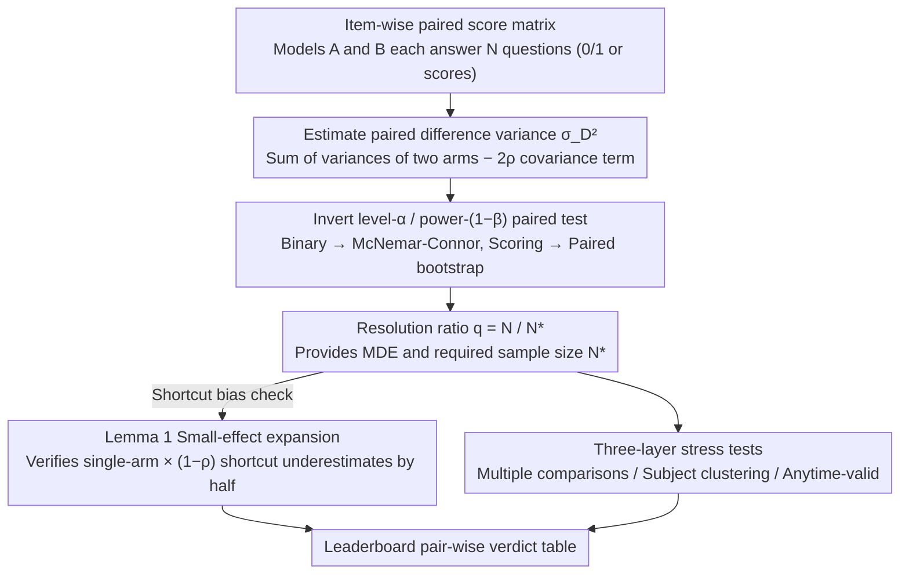

# Resolution Diagnostics for Paired LLM Evaluation

**Conference**: ICML 2026  
**arXiv**: [2605.30315](https://arxiv.org/abs/2605.30315)  
**Code**: https://github.com/akotawala10/llm-power  
**Area**: LLM Evaluation / Hypothesis Testing / Leaderboard Statistics  
**Keywords**: Paired Testing, McNemar, Resolution Ratio, Minimum Detectable Effect, Leaderboard Multiple Comparisons

## TL;DR
This paper frames the "model A outperforms B by 0.X pp" ranking on LLM leaderboards as a paired hypothesis testing problem. By inverting level-$\alpha$ / power-$(1-\beta)$ tests, it defines the "resolution ratio" $q=N/N^\star$. It proves that common shortcuts in calculators, which multiply the single-arm Cohen-$h$ formula by $(1-\rho)$, systematically underestimate the required sample size by half for small effects. Empirical results show that 11/40 pairs on Open LLM Leaderboard v1 and 4/9 adjacent pairs in the MMLU-Pro top-10 are "unresolvable" at $(\alpha, 1-\beta) = (0.05, 0.8)$. This number increases to 6/9 after accounting for multiple comparisons, subject clustering, and anytime-validity.

## Background & Motivation

**Background**: Modern LLM leaderboards turn tiny differences, such as "Model A scores 78.3% on a benchmark while Model B scores 77.5%" (a 0.8 pp gap), directly into headlines and product decisions. The corresponding statistical tools in academia are classic: McNemar paired tests + Connor 1987 sample size formulas for binary accuracy, and paired $t$-tests or paired bootstrap for continuous scores.

**Limitations of Prior Work**: The closed-form required-$N$ formula provided by Miller (2024) is written for unpaired Gaussian cases; NLP/LLM works generally apply this directly, or use unpaired sample sizes from Cohen 1988, G*Power, or R's `pwr` package and multiply by $(1-\rho)$ as a paired correction. Consequently, many adjacent rankings claimed to be "significant" on leaderboards fail to reach the target resolution of 0.8 power under a true paired design.

**Key Challenge**: The true variance of a paired design is $\sigma_D^2 = p_A q_A + p_B q_B - 2\rho\sqrt{p_A q_A p_B q_B}$. This is the variance of the difference $X^A-X^B$, which involves the sum of variances of two arms. The "universal paired adjustment" of $(1-\rho)$ merely scales the single-arm variance $p(1-p)$. Multiplying the single-arm result by $(1-\rho)$ misses a factor of 2 coming from $\text{Var}(X^A)+\text{Var}(X^B)$.

**Goal**: (1) Provide a standardized "resolution report" protocol for leaderboard evaluations; (2) Rigorously characterize the bias of the aforementioned shortcut; (3) Execute this on real public leaderboards to see how many rankings are actually untenable.

**Key Insight**: Treat "benchmark size + displayed gap" as hypothesis testing design parameters. Invert the classic Wald/McNemar-Connor formulas to derive three quantities: MDE (Minimum Detectable Effect at current $N$), $N^\star$ (Required paired sample size for a target effect), and the resolution ratio $q=N/N^\star$. Only $q \ge 1$ signifies that "this leaderboard truly supports this conclusion."

**Core Idea**: Use $q=N/N^\star$ as a one-sentence diagnostic for every pair in a leaderboard, accompanied by a sharp small-effect expansion lemma and a pip package `llm-power`. This transforms the determination of "paired test sample sizes" from empirical jargon into a verifiable standard report.

## Method

### Overall Architecture
The framework receives an item-wise score matrix $\{(X_i^A, X_i^B)\}_{i=1}^N$ for two models on any paired benchmark and outputs three things: (i) the minimum effect $\delta_{\mathrm{MDE}}$ distinguishable at current $N$; (ii) the minimum paired sample size $N^\star$ required for a target effect $\delta$; (iii) the resolution ratio $q=N/N^\star(\hat\delta)$ calculated for the observed gap $\hat\delta$. All quantities are obtained by inverting two-sided level-$\alpha$, power-$(1-\beta)$ paired Wald tests. The binary case corresponds to the McNemar-Connor formula, and the continuous/scoring case corresponds to paired bootstrap. Calculating $N^\star$ correctly is the linchpin of the diagnostic—Ours uses Lemma 1 to rigorously characterize how the popular shortcut of "multiplying single-arm Cohen-$h$ by $(1-\rho)$" systematically underestimates the required size by half under small effects, preventing the diagnostic itself from being miscalculated. Finally, the pipeline can be subjected to three types of stress tests: Bonferroni/Holm/BH multiple comparisons, design effect clustering correction, and anytime-valid e-processes, combined into an end-to-end verdict table for a leaderboard family.

### Key Designs

1.  **Resolution ratio $q=N/N^\star$ as a unified diagnostic**:
    *   **Function**: Compresses the reliability of a ranking into a dimensionless number. $q \ge 1$ indicates the benchmark is large enough to support the comparison at $(\alpha, 1-\beta)$ resolution; $q < 1$ indicates it is unresolvable.
    *   **Mechanism**: Invert the Wald formula to get $N^\star(\delta;\alpha,\beta) = ((z_{1-\alpha/2}+z_{1-\beta})\sigma_D/|\delta|)^2$, substitute the observation $\hat\delta$ to compute $N^\star(\hat\delta)$, and take the ratio with actual $N$. In the single-pair case, $q$ maps one-to-one with the square of the Wald statistic ($q \ge 1 \Leftrightarrow |T_N| \ge z_{1-\alpha/2}+z_{1-\beta} \approx 2.80$), so $q$ adds no information for a single pair; the real value-add lies at the aggregate layer—combining multiple comparisons, clustering, and anytime-validity is far more natural on the $q$ scale than the $p$-value scale.
    *   **Design Motivation**: $q$ explicitly states "I am not saying A=B, I am saying this benchmark lacks the statistical power to resolve such a gap," avoiding the misuse trap of "calculating power on observed effects" criticized by Hoenig & Heisey (2001). It also provides leaderboard maintainers a one-liner to display next to each row.

2.  **Small-effect expansion lemma (Lemma 1) — Quantifying shortcut bias**:
    *   **Function**: Provides an explicit second-order constant $C(p, \rho)$ for $n_h/N^\star - 1/2$ near $p$ (where $\rho$ is within the Hoeffding admissible interval), indicating when the shortcut is too inaccurate to use.
    *   **Mechanism**: Perform Taylor expansion for both $h^2$ (arcsine difference of Cohen's $h$) and $\sigma_D^2$ at the midpoint $p_A=p+\delta/2, p_B=p-\delta/2$. Linear terms cancel due to the symmetry of $\arcsin\sqrt{\cdot}$. Combining $O(\delta^2)$ corrections yields $n_h/N^\star = 1/2 - (\delta^2/2)[(1+\rho)(1-2p)^2/(16(1-\rho)u^2) - 1/(6u)] + O(\delta^4)$, where $u=p(1-p)$. The constant is $C(p,\rho) = (1/2)|(1+\rho)(1-2p)^2/(16(1-\rho)p^2(1-p)^2) - 1/(6p(1-p))|$; at $p=1/2$, the $(1-2p)^2$ term vanishes, making $C(1/2, \rho)=1/3$ independent of $\rho$. Corollary 1 provides a usable $\delta^\star(p,\rho,\epsilon)=\sqrt{\epsilon/C(p,\rho)}$, telling users at what scale the shortcut remains acceptable.
    *   **Design Motivation**: Industrial statistical software (Cohen 1988 formulas, G*Power 3.1, R's `pwr::pwr.2p.test`) defaults to returning single-arm $K/h^2$ sample sizes, which users then multiply by $(1-\rho)$ for paired results. This lemma formalizes the long-vague "roughly double" as an $O(\delta^2)$ calculable bias. It provides theoretical support and a pre-screen tool—in the close-comparison regime of adjacent pairs where $|\hat\delta| \le 5$ pp, the shortcut consistently underestimates $N^\star$ by half, potentially flipping a verdict from "unresolvable" to "significant." Empirical tests showed 3 out of 5 common calculators (Cohen / G*Power / R pwr) suffer from this, while only `statsmodels.NormalIndPower` (using $2K/h^2$ convention) and the author's `llm_power` (calculating $\text{Var}(\Delta)/\delta^2$ directly) avoid the pitfall.

3.  **Three-layer stress test stacking**:
    *   **Function**: Reports the "unresolvable pair count" under four paradigms—fixed-$n$, Bonferroni/Holm, real subject clustering, and anytime-valid—on the same leaderboard family to see at which levels verdicts tighten.
    *   **Mechanism**: Multiple comparisons replace $\alpha$ with $\alpha/m$ (Bonferroni) or BH-adjusted $\alpha'$, scaling $N^\star$ by $((z_{1-\alpha'/2}+z_{1-\beta})/(z_{1-\alpha/2}+z_{1-\beta}))^2$. Clustering scales IID $N^\star$ by the design effect $\mathrm{DE}=1+(\bar m-1)\mathrm{ICC}(D)$, with $\mathrm{ICC}(D)$ estimated via ANOVA across 14 subject categories in MMLU-Pro. Anytime-validity uses a paired Bernoulli mixture e-process, replacing fixed $z_{1-\alpha/2}$ with a time-uniform boundary $u(n)$ (Howard et al. 2021). All three steps tighten the verdict unidirectionally; they never turn an unresolvable pair into a resolved one.
    *   **Design Motivation**: A fixed-$n$ verdict is a necessary but insufficient condition. Real leaderboards face (a) dozens of pairs displayed at once $\rightarrow$ family-wise error rate explosion, (b) benchmark items clustered by subject $\rightarrow$ inflation of design effects, and (c) continuous updates / posterior stopping decisions $\rightarrow$ necessity of anytime-validity. Together, these three layers reflect the true statistical situation of LLM leaderboards. Table 5 in the paper presents these four columns of verdicts side-by-side, clearly showing that even if one only cares about one layer, the numbers are already quite poor.

## Key Experimental Results

### Main Results

Results for 40 paired comparisons on OLL v1, binned by $|\delta|$:

| $\|\delta\|$ Bin | Pairs | Unresolvable | Median $r=N^\star/N$ | Worst |
|---|---|---|---|---|
| $\le 1\%$ | 3 | 3 (100%) | 94 | 1,892 |
| 1–2% | 4 | 4 (100%) | 4.2 | 6.8 |
| 2–5% | 10 | 4 (40%) | 0.75 | 2.8 |
| 5–15% | 17 | 0 (0%) | 0.15 | 0.65 |
| >15% | 6 | 0 (0%) | 0.03 | 0.07 |
| **all** | **40** | **11 (28%)** | **0.16** | **1,892** |

The resolution boundary falls around $|\delta| \approx 5\%$—all pairs with $|\delta| \le 2\%$ were unresolvable, while all with $|\delta| > 5\%$ were resolved. The efficiency gain of paired McNemar relative to Miller (2024)'s unpaired formula was median 2.15× (IQR [1.60, 2.75]), consistent with the textbook prediction of $1/(1-\rho)$ (mean residual -0.009). Prospective validation: three pairs with $|\delta| \in [6.3, 10.1]$ pp were tested; empirical power at $N^\star$ was 0.796–0.827, hitting the 0.80 target within $\pm 2.7$ pp.

### Ablation Study / Stress Test

Number of unresolvable pairs among MMLU-Pro top-10 adjacent pairs under 4 paradigms:

| Paradigm | OLL v1 (40 pairs) | MMLU-Pro (9 pairs) | Description |
|---|---|---|---|
| Fixed-$n$ | 11/40 | 4/9 | Baseline verdict, IID assumption |
| Bonferroni / Holm | 14/40 | 4/9 | Family-wise error, $N^\star$ inflated ~2.11× |
| Anytime-valid | 14/40 | 5/9 | Time-uniform e-process, threshold inflated ~2.15× |
| Real Subject Clustering | n/a | 6/9 | DE calculated for 14 MMLU-Pro subjects, $\bar m \approx 859$ |

In the clustering column, the rank 4 vs 5 comparison jumped from an IID $N^\star=432$ (previously stable) to a cluster $N^\star=13{,}621$ (>$N$), because model differences were concentrated in specific subjects ($\mathrm{ICC}(D)=0.036, \mathrm{DE}=31.5$). Category bootstrap ($B=1000$) showed the unresolvable count stayed in 5–6/9 in 99.9% of resamples, only returning to the IID 4/9 once in 1000 trials.

### Key Findings
- **Lemma 1 holds tightly on data**: On OLL v1, the median $n_h/N^\star$ was 0.5002 (IQR [0.4999, 0.5035], range [0.487, 0.562]); the close-comparison subset ($|\hat\delta| \le 2\%$) hit 1/2 stable to four decimal places. On MMLU-Pro, even as $\rho$ spanned [0.45, 0.99], it remained in [0.496, 0.500]. The shortcut consistently underestimates by half.
- **HellaSwag boundary pairs are illustrative**: gemma-7B vs Llama-3-8B on $N=10{,}042$ shows $\hat\delta=+0.46$ pp. An asymptotic $\chi^2_1$ gives $p=0.049$ (significant), but exact conditional binomial $p=0.054$ is not significant, and the paired bootstrap 95% CI crosses 0. With $q \approx 0.5$, it only reaches half the resolution target. "Significant" and "Resolvable" are not the same thing.
- **Clustering verdict is robust to category count $K=14$**: Leave-One-Subject-Out (LOSO) maintained 6/9 unresolvable pairs in 11/14 cases, dropping to 5/9 for the remaining 3. Alternative clusterings (difficulty quartiles, 28-category split) yielded unresolvable counts between [5, 9]/9, with the headline 6/9 in the center; random clustering (null check) returned to 4/9.

## Highlights & Insights
- **Formalizing the shortcut bias as a lemma**: This is something everyone in the statistical software circle "knows" but hasn't "written down clearly." The paper provides an explicit expression for $C(p,\rho)$ and the $\delta^\star = \sqrt{\epsilon/C(p,\rho)}$ pre-screen threshold, turning tribal knowledge into a hard condition for docstrings. The $\rho$-independent $C=1/3$ at $p=1/2$ is a beautiful byproduct, especially since many benchmark accuracies hover near 0.5.
- **Engineering value of $q=N/N^\star$**: While $q$ maps to $p$-values for a single pair, it composes more naturally at the aggregate layers (family-wise, design effect, anytime-valid). All three inflations manifest as "$N^\star$ multiplied by some coefficient," whereas $p$-value combinations require joint adjustments based on distributions. This is an excellent abstraction for packaging "statistical correctness" as "engineering effort," easily transferable to any paired evaluation scenario (RecSys A/B, paired medical imaging, code benchmarks).
- **Synergy of the three-layer stress test**: The presentation in Table 5, showing "no matter which single layer you believe, the numbers are already poor," is highly persuasive. It is far more impactful than a single-point verdict and serves as a reporting protocol template for reproducibility/benchmarking.

## Limitations & Future Work
- Authors' acknowledged limitations: Empirical coverage is limited to binary accuracy (the primary metric for headline benchmarks). Continuous scoring and pairwise preferences (Chatbot Arena style) are handled via the paired bootstrap in Definition 2 but only verified to 4–6% on Beta(4,2) synthetic data.
- MMLU-Pro clustering has only $K=14$ subjects. Although LOSO and category bootstrap support the 4/9 $\rightarrow$ 6/9 headline, finer-grained natural clustering (item templates, knowledge points) could further tighten design effect estimates.
- Personal observations: The paper explicitly separates "resolution" from "construct validity" (what the benchmark actually measures). This is honest but means $q \ge 1$ is a necessary rather than sufficient condition—a benchmark can have sufficient resolution but measure nothing relevant.
- Future directions: (i) Generalize Lemma 1 to unequal margins and multi-arm power; (ii) Develop PRDS-aware $N^\star$ for leaderboard families with overlapping models; (iii) Incorporate item-level cluster bootstrap to replace design effect; (iv) Apply Bradley–Terry e-processes to move diagnostics to pairwise preference leaderboards like Arena.

## Related Work & Insights
- **vs Miller (2024)**: Miller provides unpaired Gaussian required-$N$, suitable for independent samples. Ours quantifies the efficiency ratio of paired vs. unpaired on the same OLL v1 data as median 2.15×, empirically verifying the $1/(1-\rho)$ textbook formula. The advantage here is turning "paired efficiency gain" from a verbal consensus into a number displayed for every comparison.
- **vs Card et al. (2020) / Dror et al. (2018)**: Card et al. pointed out that NLP comparisons are generally underpowered; Dror et al. provided a survey on NLP test selection including McNemar. However, neither work compared paired/unpaired required-$N$ side-by-side on the same data nor provided a per-pair reporting protocol for leaderboards. This paper closes the loop for these lines of work.
- **vs Madaan et al. (2024) / Jo & Wilson (2025)**: Madaan et al. measure benchmark variance across 13 tasks; Jo & Wilson provide clustered bootstrap for ability estimation. These are tools for estimating variance, which is distinct from test power. This paper explicitly shows that design effect correction is a complementary measure to their work.
- **vs Howard et al. (2021) / Ramdas et al. (2023)**: Anytime-valid tools exist; the contribution here is the first application of mixture e-processes to public LLM leaderboards, demonstrating concrete numbers of "additional verdict flips."

## Rating
- Novelty: ⭐⭐⭐⭐ Lemma 1 provides a new explicit constant; the $q$ framework is a systematic integration of known tools. Strongest in "closing the loop."
- Experimental Thoroughness: ⭐⭐⭐⭐⭐ Two public leaderboards + cross-check of 5 calculators + 5-cell calibration + LOSO + cluster bootstrap + prospective power validation. Very high saturation.
- Writing Quality: ⭐⭐⭐⭐ Clearly explains "dark knowledge" in statistical software; Table 5's paradigm side-by-side is impactful, though subsections are slightly fragmented.
- Value: ⭐⭐⭐⭐⭐ Provides a usable pip package + reporting protocol for benchmark designers and leaderboard maintainers. In an era of "0.X pp improvements," tools that "first prove you can measure it" are extremely scarce.

<!-- RELATED:START -->

## Related Papers

- [\[ACL 2026\] Beyond Reproduction: A Paired-Task Framework for Assessing LLM Comprehension and Creativity in Literary Translation](../../ACL2026/llm_evaluation/beyond_reproduction_a_paired-task_framework_for_assessing_llm_comprehension_and_.md)
- [\[ICML 2026\] Discovering Ordinary Differential Equations with LLM-Based Qualitative and Quantitative Evaluation](discovering_ordinary_differential_equations_with_llm-based_qualitative_and_quant.md)
- [\[AAAI 2026\] ConInstruct: Evaluating Large Language Models on Conflict Detection and Resolution in Instructions](../../AAAI2026/llm_evaluation/coninstruct_evaluating_large_language_models_on_conflict_detection_and_resolutio.md)
- [\[AAAI 2026\] LLM-as-a-Judge for Scalable Test Coverage Evaluation](../../AAAI2026/llm_evaluation/llm-as-a-judge_for_scalable_test_coverage_evaluation_accuracy_operational_reliab.md)
- [\[ICLR 2026\] BiasScope: Towards Automated Detection of Bias in LLM-as-a-Judge Evaluation](../../ICLR2026/llm_evaluation/biasscope_towards_automated_detection_of_bias_in_llm-as-a-judge_evaluation.md)

<!-- RELATED:END -->
