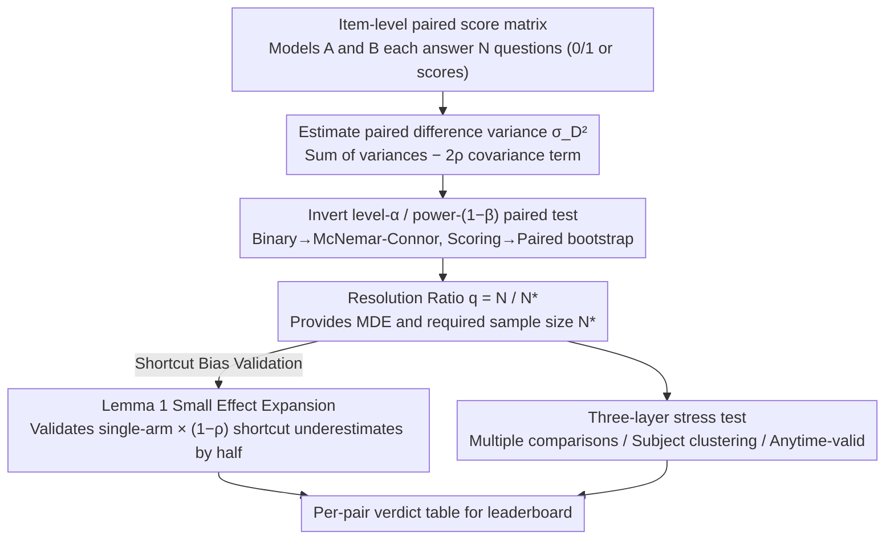

# Resolution Diagnostics for Paired LLM Evaluation

**Conference**: ICML 2026  
**arXiv**: [2605.30315](https://arxiv.org/abs/2605.30315)  
**Code**: https://github.com/akotawala10/llm-power  
**Area**: LLM Evaluation / Hypothesis Testing / Leaderboard Statistics  
**Keywords**: Paired Testing, McNemar, Resolution Ratio, Minimum Detectable Effect, Leaderboard Multiple Comparisons

## TL;DR
This paper treats the "Model A is 0.X pp higher than B" rankings on LLM leaderboards as a paired hypothesis testing problem. By inverting the level-$\alpha$ / power-$(1-\beta)$ test, it defines the "Resolution Ratio" $q=N/N^\star$. The authors prove that the common shortcut of multiplying the single-arm Cohen-$h$ formula by $(1-\rho)$ systematically underestimates the required sample size by half under small effects. Empirical results show that 11/40 pairs on the Open LLM Leaderboard v1 and 4/9 adjacent pairs in the MMLU-Pro top-10 are fundamentally "unresolvable" at $(\alpha, 1-\beta) = (0.05, 0.8)$. This number increases to 6/9 after accounting for multiple comparisons, real-world subject clustering, and anytime-validity.

## Background & Motivation

**Background**: Modern LLM leaderboards directly translate tiny gaps of 0.8 pp (e.g., "Model A scores 78.3%, Model B scores 77.5%") into headlines and product decisions. The corresponding statistical tools in academia are classic: McNemar paired tests + the Connor 1987 sample size formula for binary accuracy, and paired $t$-tests or paired bootstrap for continuous scores.

**Limitations of Prior Work**: The closed-form required-$N$ formula provided by Miller (2024) is derived for unpaired Gaussians. NLP/LLM research commonly applies this directly or uses unpaired sample sizes from Cohen 1988, G*Power, or R's `pwr` package, then multiplies by $(1-\rho)$ as a "paired correction." Consequently, many adjacent rankings claimed to be "significant" on leaderboards fail to reach the target resolution of 0.8 power under a true paired design.

**Key Challenge**: The true variance of a paired design is $\sigma_D^2 = p_A q_A + p_B q_B - 2\rho\sqrt{p_A q_A p_B q_B}$, which represents the variance of the difference $X^A - X^B$ (summing variances of two arms). The "universal paired adjustment" of $(1-\rho)$ merely scales the single-arm variance $p(1-p)$. Multiplying the single-arm result by $(1-\rho)$ misses a factor of 2 coming from $\text{Var}(X^A) + \text{Var}(X^B)$.

**Goal**: (1) Propose a standardized "Resolution Report" protocol for leaderboard evaluation; (2) Rigorously characterize the bias of the aforementioned shortcut; (3) Audit real public leaderboards to identify how many rankings are statistically unsustainable.

**Key Insight**: Treat "benchmark size + observed gap" as hypothesis testing design parameters. Invert the classic Wald/McNemar-Connor formulas to derive three metrics: MDE (Minimum Detectable Effect at current $N$), $N^\star$ (required paired sample size for a target effect), and the Resolution Ratio $q = N/N^\star$. A conclusion is considered supported by the leaderboard only if $q \ge 1$.

**Core Idea**: Use $q=N/N^\star$ as a one-sentence diagnostic metric for every pair on a leaderboard. Accompany this with a sharp small-effect expansion lemma and a pip package `llm-power` to transform the determination of paired sample sizes from empirical folklore into a verifiable standard report.

## Method

### Overall Architecture
The framework takes an item-level paired score matrix $\{(X_i^A, X_i^B)\}_{i=1}^N$ of two models on any benchmark and outputs three items: (i) the minimum effect $\delta_{\mathrm{MDE}}$ distinguishable at current $N$; (ii) the minimum paired sample size $N^\star$ required for a target effect $\delta$; and (iii) the ratio $q=N/N^\star(\hat\delta)$ for the observed gap $\hat\delta$. All quantities are derived by inverting a two-sided level-$\alpha$, power-$(1-\beta)$ paired Wald test. Specifically, the binary case uses the McNemar-Connor formula, and the continuous case uses paired bootstrap. Calculating $N^\star$ correctly is the lynchpin—Ours use Lemma 1 to rigorously prove that the popular shortcut of "single-arm Cohen-$h \times (1-\rho)$" systematically underestimates the required sample size by half under small effects, preventing the diagnostic itself from being miscalculated. Finally, the pipeline incorporates three stress tests: Bonferroni/Holm/BH multiple comparisons, design effect clustering correction, and anytime-valid e-processes to form an end-to-end verdict table for a leaderboard family.

### Key Designs

1.  **Resolution Ratio $q=N/N^\star$ as a Unified Diagnostic**:
    *   **Function**: Compresses "is this ranking reliable" into a dimensionless number. $q \ge 1$ indicates the benchmark is large enough to support the comparison at $(\alpha, 1-\beta)$ resolution; $q < 1$ indicates it is not.
    *   **Mechanism**: Invert the Wald formula to get $N^\star(\delta; \alpha, \beta) = ((z_{1-\alpha/2} + z_{1-\beta})\sigma_D / |\delta|)^2$. Substitute the observation $\hat\delta$ to calculate $N^\star(\hat\delta)$, then compute the ratio with the actual $N$. While $q$ maps one-to-one with the Wald statistic squared in single-pair cases ($q \ge 1 \Leftrightarrow |T_N| \ge z_{1-\alpha/2} + z_{1-\beta} \approx 2.80$), the true value-add lies in the aggregation layer—combining multiple comparisons, clustering, and anytime-validity is far more natural on the $q$ scale than on the $p$-value scale.
    *   **Design Motivation**: $q$ explicitly states "I am not saying A=B, I am saying this benchmark lacks the statistical power to resolve this gap," avoiding the "power on observed effects" trap criticized by Hoenig & Heisey (2001). It also provides leaderboard maintainers with a one-liner diagnostic for each row.

2.  **Lemma 1 (Small Effect Expansion) — Quantifying the Bias of the "Single-arm Shortcut"**:
    *   **Function**: Provides an explicit second-order constant $C(p, \rho)$ for $n_h/N^\star - 1/2$ near $p$ (with $\rho$ in the Hoeffding interval), indicating when the shortcut becomes unusable.
    *   **Mechanism**: Perform a Taylor expansion for $h^2$ (arcsine difference of Cohen's $h$) and $\sigma_D^2$ at the midpoint $p_A = p + \delta/2, p_B = p - \delta/2$. Use the symmetry of $\arcsin\sqrt{\cdot}$ to eliminate linear terms and combine $O(\delta^2)$ corrections to obtain $n_h/N^\star = 1/2 - (\delta^2/2)[(1+\rho)(1-2p)^2/(16(1-\rho)u^2) - 1/(6u)] + O(\delta^4)$, where $u=p(1-p)$. The constant $C(p, \rho) = (1/2)|(1+\rho)(1-2p)^2/(16(1-\rho)p^2(1-p)^2) - 1/(6p(1-p))|$. At $p=1/2$, the $(1-2p)^2$ term vanishes, making $C(1/2, \rho) = 1/3$, independent of $\rho$. Corollary 1 provides a usable $\delta^\star(p, \rho, \epsilon) = \sqrt{\epsilon/C(p, \rho)}$ to tell users how small the effect must be for the shortcut to remain valid.
    *   **Design Motivation**: Industrial statistical software (Cohen 1988, G*Power 3.1, R `pwr::pwr.2p.test`) defaults to single-arm $K/h^2$ sample sizes. Users often multiply this by $(1-\rho)$ themselves. This lemma rigorously defines the vague "nearly double" as an $O(\delta^2)$ computable bias, providing theoretical support and a pre-screening tool. In the close-comparison regime ($|\hat\delta| \le 5$ pp), the shortcut consistently underestimates $N^\star$ by half, flipping "unresolvable" verdicts to "significant." Tests on 5 popular calculators found 3 (Cohen / G*Power / R pwr) susceptible; only `statsmodels.NormalIndPower` (using $2K/h^2$) and the authors' `llm_power` (using $\text{Var}(\Delta)/\delta^2$) were accurate.

3.  **Triple Stress Test Stacking (Multiple Comparisons / Clustering / Anytime-Valid)**:
    *   **Function**: Reports the number of "unresolved pairs" across four paradigms (fixed-$n$, Bonferroni/Holm, real-world subject clustering, and anytime-valid) on the same leaderboard family.
    *   **Mechanism**: Multiple comparisons replace $\alpha$ with $\alpha/m$ (Bonferroni) or BH-adjusted $\alpha'$, scaling $N^\star$ by $((z_{1-\alpha'/2} + z_{1-\beta})/(z_{1-\alpha/2} + z_{1-\beta}))^2$. Clustering scales IID $N^\star$ by the design effect $\mathrm{DE} = 1 + (\bar m - 1)\mathrm{ICC}(D)$, estimating $\mathrm{ICC}(D)$ via ANOVA on 14 MMLU-Pro subjects. Anytime-valid testing uses a paired Bernoulli mixed e-process to replace the fixed $z_{1-\alpha/2}$ with a time-homogeneous boundary $u(n)$ (Howard et al. 2021). All three tighten the verdict unidirectionally.
    *   **Design Motivation**: Fixed-$n$ verdicts are necessary but insufficient. Real leaderboards face (a) dozens of pairs leading to family-wise error rate explosion, (b) subject clustering causing design effect inflation, and (c) continuous updates requiring anytime-validity. This combined approach reflects the true statistical situation of LLM leaderboards.

## Key Experimental Results

### Main Results

Number of unresolved pairs in OLL v1 (40 pairs) bucketed by $|\delta|$:

| $\|\delta\|$ Bucket | Count | Unresolved | Median $r=N^\star/N$ | Worst |
|---|---|---|---|---|
| $\le 1\%$ | 3 | 3 (100%) | 94 | 1,892 |
| 1–2% | 4 | 4 (100%) | 4.2 | 6.8 |
| 2–5% | 10 | 4 (40%) | 0.75 | 2.8 |
| 5–15% | 17 | 0 (0%) | 0.15 | 0.65 |
| >15% | 6 | 0 (0%) | 0.03 | 0.07 |
| **all** | **40** | **11 (28%)** | **0.16** | **1,892** |

The resolution boundary falls near $|\delta| \approx 5\%$: all pairs with $|\delta| \le 2\%$ are unresolved, while all pairs with $|\delta| > 5\%$ are resolved. The efficiency gain of paired McNemar relative to Miller (2024)'s unpaired formula is 2.15× (median), consistent with the $1/(1-\rho)$ prediction. Prospective validation on 3 pairs with $|\delta| \in [6.3, 10.1]$ pp showed observed power of 0.796–0.827 at calculated $N^\star$, hitting the 0.80 target within $\pm 2.7$ pp.

### Ablation Study / Stress Test

Number of unresolved adjacent pairs (out of 9) on MMLU-Pro top-10 across 4 paradigms:

| Paradigm | OLL v1 (40 pairs) | MMLU-Pro (9 pairs) | Description |
|---|---|---|---|
| Fixed-$n$ | 11/40 | 4/9 | Baseline verdict, IID assumption |
| Bonferroni / Holm | 14/40 | 4/9 | Family-wise error control, $N^\star$ inflates ~2.11× |
| Anytime-valid | 14/40 | 5/9 | Time-homogeneous e-process, threshold inflates ~2.15× |
| Subject Clustering | n/a | 6/9 | DE based on 14 MMLU-Pro subjects, $\bar m \approx 859$ |

In the clustering row, the Rank 4 vs 5 comparison jumped from an IID $N^\star=432$ (stable) to a clustered $N^\star=13{,}621$ ($>N$), because model performance gaps were concentrated in specific subjects ($\mathrm{ICC}(D)=0.036, \mathrm{DE}=31.5$). Category bootstrap ($B=1000$) showed unresolved pairs falling between 5-6/9 in 99.9% of resamples.

### Key Findings
- **Lemma 1 holds strictly on real data**: On OLL v1, $n_h/N^\star$ had a median of 0.5002 (IQR [0.4999, 0.5035]). For the close-comparison subset ($|\hat\delta| \le 2\%$), it hit exactly 1/2 to four decimal places. The shortcut consistently underestimates by half.
- **HellaSwag marginal cases are telling**: Gemma-7B vs Llama-3-8B at $N=10{,}042$ shows $\hat\delta=+0.46$ pp. Asymptotic $\chi^2_1$ gives $p=0.049$ (significant), but exact conditional binomial gives $p=0.054$ (insignificant), and paired bootstrap 95% CI crosses zero; $q \approx 1/2$. "Significant" and "resolvable" are not the same thing.
- **Clustering verdict is robust to category count $K=14$**: Leave-one-subject-out (LOSO) maintained the 6/9 unresolved count in 11/14 trials. Alternative clusterings (difficulty quartiles, subject bisections) yielded unresolved counts in the range [5, 9]/9, with 6/9 as the central headline.

## Highlights & Insights
- **Formalizing the shortcut bias as a lemma**: This is "common knowledge" that was never clearly documented; Ours provides the explicit $C(p, \rho)$ and pre-screening threshold $\delta^\star$, turning it into a hard condition for docstrings. The independence from $\rho$ at $p=1/2$ is a elegant byproduct.
- **Engineering value of $q=N/N^\star$**: While $q$ maps to $p$-values for single pairs, it aggregates more naturally for family-wise, design effect, and anytime-valid adjustments—all of which manifest as simple multipliers on $N^\star$. It is a great abstraction for packaging "statistical correctness" as "required engineering effort."
- **Synergy of the triple stress test**: The side-by-side presentation in Table 5 is powerful, showing that stats look "bad" regardless of which layer one prioritizes. This serves as a reporting protocol template for the reproducibility/benchmark community.

## Limitations & Future Work
- **Ours' Limitations**: Empirical coverage is biased toward binary accuracy. Continuous scoring and pairwise preferences (Chatbot Arena style) are handled via paired bootstrap in Definition 2 but only validated to 4–6% on synthetic Beta(4,2) data.
- The $K=14$ subjects in MMLU-Pro are limited. While LOSO and bootstrap support the 6/9 verdict, finer-grained natural clusters (question templates, knowledge points) could further inflate design effect estimates.
- **Self-identified limitations**: The paper separates "resolution" from "construct validity." $q \ge 1$ is a necessary but insufficient condition—a benchmark can be highly resolvable but measure the wrong thing.
- **Future Directions**: (i) Generalize Lemma 1 to unequal margins and multi-arm power; (ii) Apply PRDS-aware $N^\star$ to leaderboard families with overlapping models; (iii) Bradley–Terry e-processes for diagnostic reporting on pairwise preference leaderboards.

## Related Work & Insights
- **vs Miller (2024)**: Miller provided unpaired Gaussian required-$N$. This paper quantifies the efficiency gain of pairing on OLL v1 as 2.15× (median) and validates the $1/(1-\rho)$ formula empirically.
- **vs Card et al. (2020) / Dror et al. (2018)**: These highlighted that NLP comparisons are underpowered or surveyed test selection. However, they did not compare paired/unpaired required-$N$ side-by-side on the same data nor provide a leaderboard-scale reporting protocol.
- **vs Madaan et al. (2024) / Jo & Wilson (2025)**: These works measured benchmark variance or clustered bootstrap for ability estimation. This paper shows that design effect correction for power is a complementary measure to their variance estimations.

## Rating
- Novelty: ⭐⭐⭐⭐ Lemma 1 provides a new explicit constant; the $q$ framework is a systemic integration of known tools.
- Experimental Thoroughness: ⭐⭐⭐⭐⭐ Covers two public leaderboards, audits 5 calculators, uses LOSO, clustered bootstrap, and prospective power validation.
- Writing Quality: ⭐⭐⭐⭐ Clearly explains the "dark knowledge" of statistical software; Table 5 is highly impactful.
- Value: ⭐⭐⭐⭐⭐ Provides a usable pip package and reporting protocol for benchmark designers. This "prove you can measure it first" tool is scarce in an era of 0.X pp papers.

<!-- RELATED:START -->

## Related Papers

- [\[ICML 2026\] Nonparametric LLM Evaluation from Preference Data](nonparametric_llm_evaluation_from_preference_data.md)
- [\[ACL 2026\] Beyond Reproduction: A Paired-Task Framework for Assessing LLM Comprehension and Creativity in Literary Translation](../../ACL2026/llm_evaluation/beyond_reproduction_a_paired-task_framework_for_assessing_llm_comprehension_and_.md)
- [\[ICML 2026\] Discovering Ordinary Differential Equations with LLM-Based Qualitative and Quantitative Evaluation](discovering_ordinary_differential_equations_with_llm-based_qualitative_and_quant.md)
- [\[AAAI 2026\] ConInstruct: Evaluating Large Language Models on Conflict Detection and Resolution in Instructions](../../AAAI2026/llm_evaluation/coninstruct_evaluating_large_language_models_on_conflict_detection_and_resolutio.md)
- [\[AAAI 2026\] LLM-as-a-Judge for Scalable Test Coverage Evaluation](../../AAAI2026/llm_evaluation/llm-as-a-judge_for_scalable_test_coverage_evaluation_accuracy_operational_reliab.md)

<!-- RELATED:END -->
