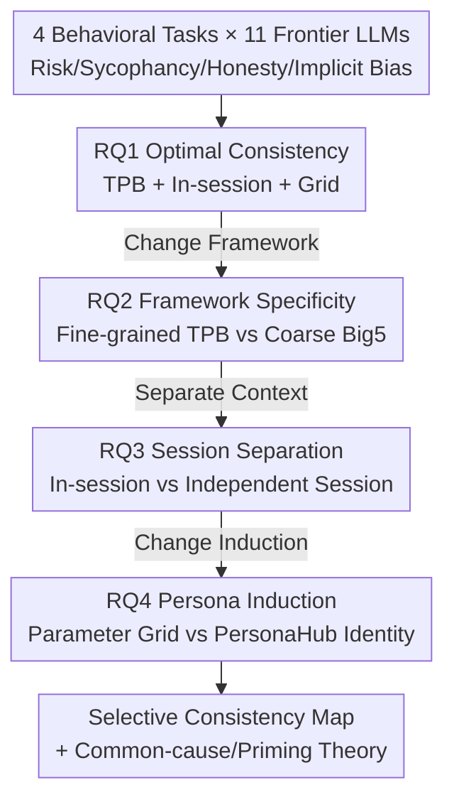

# Rethinking Psychometric Evaluation of LLMs: When and Why Self-Reports Predict Behavior

**Conference**: ICML 2026  
**arXiv**: [2606.12730](https://arxiv.org/abs/2606.12730)  
**Code**: TBD  
**Area**: LLM Evaluation / Psychometrics / Behavioral Predictability  
**Keywords**: Self-reports, Theory of Planned Behavior, Big5, Contextual Priming, Behavioral Auditing

## TL;DR
This paper systematically deconstructs "when exactly psychometric self-reports (SR) of LLMs predict their actual behavior." Using a $2\times2\times2$ factorial experiment (Theory of Planned Behavior TPB vs Big5 × In-session vs Cross-session × Parameter Grid vs Persona Induction) across 4 behavioral tasks and 11 frontier models, it finds that SR–behavior consistency **exists but is selective**. While fine-grained TPB achieves human-level consistency within the same session, Big5 yields almost no signal. In cross-session settings, consistency survives only for tasks where behavior is "anchored outside the prompt" (e.g., training-locked implicit bias), while tasks strongly primed by context (e.g., sycophancy) collapse entirely.

## Background & Motivation
**Background**: LLMs are increasingly deployed in high-stakes scenarios such as clinical decision-making, financial consulting, and educational tutoring. Consequently, there is a desire to use **low-cost psychometric self-reports** (letting models fill out personality questionnaires) to pre-emptively judge their behavioral tendencies. Self-reports are inexpensive, theoretically grounded, and widely used in human research—but only if they can reliably predict downstream behavior.

**Limitations of Prior Work**: Recent work (e.g., Han et al.) has confirmed systematic **SR–behavior dissociation** in LLMs: models can provide psychometrically consistent personality profiles but fail to predict their actual choices in behavioral tasks. However, these studies only describe *that* dissociation occurs without explaining *why*—whether it is a flaw in measurement tools, the probing context, or an inherent property of the models.

**Key Challenge**: The authors point out two methodological assumptions in existing research that hinder mechanistic explanation. First, the dominant framework is **Big5**, yet Big5 traits are designed to be cross-situational and thus exhibit weak predictive power for specific behaviors even in humans (trait-behavior Pearson correlations rarely exceed $r\approx.20$). Is LLM "dissociation" a model property or an artifact of a framework with inherently weak predictive power? Second, prior studies often place SR and behavioral tasks in **independent sessions**, matching only by sampling parameters. This tests the most difficult cross-session consistency and lacks the shared context necessary for "stated intent" to translate into "behavioral choice."

**Goal**: To decompose the problem into four questions: does consistency exist under optimal conditions (RQ1), is the fine-grained nature of TPB the driver (RQ2), does consistency survive the removal of shared context (RQ3), and can persona induction recover collapsed consistency (RQ4).

**Key Insight**: The authors introduce the **Theory of Planned Behavior (TPB)** from psychology as a contrast, as it possesses far stronger predictive power for human behavior than broad traits. TPB measures intentions toward specific behaviors, with human meta-analyses showing intent-behavior correlations as high as $r\approx.47$, significantly higher than broad traits.

**Core Idea**: A $2\times2\times2$ factorial design is used to gradually relax three axes—framework granularity, session context, and identity induction. This precisely characterizes **when SR can and cannot predict LLM behavior**, providing a theoretical explanation based on "common-cause coupling vs. in-session contextual priming."

## Method

### Overall Architecture
This is a **mechanism analysis/evaluation methodology** paper that proposes a controlled experimental framework rather than a new model. The unit of analysis is the (Model × Task × Construct) cell. For each cell, the **within-model Pearson correlation** is calculated between the SR construct and the policy-signed behavioral outcome (~54 observations under grid induction, 60 under persona). Cell-level $r$ values are then aggregated into a pooled $r$ with 95% CIs using inverse-variance weighted Fisher-$z$ meta-analysis for comparison with human meta-analytic benchmarks. The four research questions relax conditions **from ideal to stringent** along three axes:

The four behavioral tasks are mapped to TPB constructs: Risk Preference (Columbia Card Task → Perceived Behavioral Control PBC), Sycophancy (Asch-style paradigm → Subjective Norms), Honesty (Two-stage confidence calibration → Attitude), and Implicit Bias (Six-domain IAT → Intent, serving as a negative control for the volitional range of TPB). Crucially, **models are never instructed to remain consistent**: the SR phase only provides Likert items without implying a subsequent behavioral task, and the behavioral phase does not mention the prior questionnaire. Any consistency must emerge from the model's spontaneous integration.

### Key Designs

**1. TPB vs Big5: Using Framework Granularity as a Navigable Variable**

To address the concern that dissociation might be an artifact of Big5's weak predictive power, the authors treat the self-report framework itself as the sole variable, comparing the two under identical in-session conditions. Big5 measures intentionally decontextualized broad traits (e.g., "I see myself as a cautious person"), whereas TPB anchors items to specific behaviors via Target-Action-Context-Time (TACT) (e.g., "When making risky decisions in this card game, I intend to flip cards cautiously"). The results were decisive: within a single session, TPB showed significant within-model consistency across three volitional tasks (Honesty $r=+0.67$, Sycophancy $r=+0.47$, Risk $r=+0.22$), while Big5 showed **almost zero signal** on the same tasks (best aligned $r$ only $+0.06$ to $+0.07$, all CIs spanning zero). Out of 88 Big5 cells, only 3 reached $p<.05$, and only 1 aligned with theoretical expectations. This refines the conclusions of Han et al.: it is not that LLMs lack measurable consistency, but that **coarse frameworks fail to measure it.** On the IAT, TPB showed the theoretically expected explicit-implicit dissociation ($r=-0.59$), reflecting an inversion of compensatory effort rather than a failure of TPB.

**2. In-session vs Cross-session: Distinguishing "True Tendency" from "Context Window Priming"**

In-session (SR and behavior in the same message thread) provides the most lenient context for consistency but conflates the causal explanation with two confounders: evaluative prompts acting as weak behavioral instructions (behavioral priming) and sycophantic/frame-sensitive models echoing any presented policy (SR acquiescence). Thus, the authors use a cross-session design: SR and behavior occur in **independent API calls**, sharing only the initialization context (temperature, seed, system prompt), but the behavioral call starts a fresh thread. This resembles real-world deployment scenarios. Results showed three distinct fates: Honesty **partially survived** ($r=+0.67\to+0.53$), Sycophancy **completely collapsed** ($r=+0.47\to-0.07$, $\Delta r=+0.54$), and the IAT inversion **remained stable** ($r=-0.59\to-0.66$). More critically for mechanism identification, the authors separately measured cross-session SR consistency and behavioral consistency. SR consistency was high across all tasks (indicating stable "talk"), but **behavioral inconsistency was the driver of collapse**. Sycophancy behavior correlated at $-0.02$ cross-session (with strong negative correlations in models like Qwen 235B at $-0.96$), whereas Implicit Bias was $+0.98$ and Honesty $+0.45$. This proves that the sycophancy collapse is due to **context window priming**: once SR is removed from the dialogue context, the behavior itself becomes uncorrelated, not because the LLM lacks a stable tendency.

**3. Persona Induction vs Parameter Grid: Testing if Semantic Identity Recovers Cross-session Consistency**

Parameter grids (temperature/seed/system prompt perturbations) only introduce random decoding variance without specifying "who the model is," so there is no persistent identity for cross-session correlation recovery. Persona induction (providing a named role description for each condition) offers semantic rather than random variance, theoretically capable of providing a stable cross-session identity. The authors used 30 PersonaHub role descriptions (fixed temperature 0.2, 60 conditions per model). The main estimator was $\Delta r_{\text{induction}}=r_{\text{personas}}-r_{\text{grid}}$. Two prerequisites were also reported: SR diversity (no consistency without variance) and SR cross-session stability. Results showed **zero models were "saved"**: no model met the recovery criteria (grid CI $\le 0$ and persona CI $> 0$). Sycophancy only partially rebounded ($-0.07\to+0.09$), while Honesty was actually weakened ($+0.53\to+0.38$). However, persona induction changed what it was supposed to—SR diversity was positive in 50% of cells and SR stability was positive in 75% of cells (average $\Delta r=+0.14$). **Personas successfully changed "how the model describes itself" but failed to transmit that fidelity to behavior.** This decoupling is a safety-relevant finding: persona-customized deployments may produce confidently distinct self-reports without correspondingly distinct behaviors.

### An Example: Why Sycophancy Collapses and Implicit Bias Survives
Tracing Sycophancy and Implicit Bias through the framework clarifies the nature of "selective consistency." In **Sycophancy**, the model in-session treats the policy presented in the prompt as a weak instruction, shifting both SR and behavior toward the in-context frame, creating a seemingly consistent $r=+0.47$. Once moved cross-session, the behavior loses its priming anchor and decorrelates to $-0.07$ (strong negative cross-session behavioral correlations in some models). This shows that in-session "consistency" is an illusion created by context window priming. Conversely, **Implicit Bias** (IAT) behavior is nearly unaffected by the SR frame; cross-session behavioral consistency is $+0.98$. Therefore, the link between "claiming to want unbiased classification" and "producing stereotype-consistent responses" must stem from **common-cause coupling** from the training source—this consistency is a true signal of stable latent tendencies. The contrast validates the theoretical distinction: only common-cause coupling (where SR and behavior are shaped by stable model states) is a reliable predictor, whereas priming-induced consistency vanishes with context.

## Key Experimental Results

### Main Results
Across 4 tasks and 11 frontier LLMs, the table summarizes core conclusions for the four RQs (TPB constructs, Fisher-$z$ pooled $r$):

| Research Question | Condition | Core Metric | Conclusion |
|-------------------|-----------|-------------|------------|
| RQ1 Optimal Consistency | TPB + In-session + Grid | $r=+0.40$ (excl. IAT) | Matches human meta-analytic benchmark ($r\approx0.25$–$0.50$) |
| RQ2 Framework Specificity | TPB vs Big5 (In-session) | TPB $+0.21$ vs Big5 $+0.01$ (Avg/model) | TPB leads in 8/11 models; Big5 yields no signal |
| RQ3 Session Separation | In-session vs Cross-session | Sycophancy $+0.47\to-0.07$ | Only 2/11 models maintain significant positive cross-session correlation |
| RQ4 Persona Induction | Grid vs Persona | Zero models "saved" | Personas stabilize SR but fail to restore behavioral coupling |

In RQ1, 41 out of 77 cells (53.2%) were both directionally aligned and $p<.05$, which is $21.3\times$ the expectation under the null hypothesis ($z=28.5$, $p<.0001$).

### Ablation Study (Survival Patterns by Task)
Cross-session survival in RQ3 is the most critical "ablation," breaking down consistency by task:

| Task | In-session $r$ → Cross-session $r$ | $\Delta r$ | Behavioral Cross-session Consistency | Interpretation |
|------|-----------------------------------|------------|--------------------------------------|----------------|
| Implicit Bias IAT | $-0.59 \to -0.66$ | $+0.07$ (ns) | $+0.98$ | Training-locked, stable inversion |
| Honesty | $+0.67 \to +0.53$ | $+0.14$ | $+0.45$ | Partial survival |
| Risk CCT | $+0.22 \to +0.12$ | $+0.10$ (ns) | $+0.41$ | Inherently weak signal |
| Sycophancy | $+0.47 \to -0.07$ | $+0.54$ | $-0.02$ | Complete collapse (Contextual priming) |

### Key Findings
- **Framework granularity determines measurable consistency**: In-session TPB matches human benchmarks, while the dominant Big5 "does not predict at all" under the same conditions—a stronger claim than just being "weaker."
- **Behavioral inconsistency, not SR drift, drives collapse**: SR is stable cross-session across all tasks; the collapse stems entirely from behavioral decorrelation, with sycophancy providing direct evidence of context window priming.
- **Persona induction changes "talk" but not "act"**: Personas make self-reports more diverse and stable but do not result in behavioral coupling—a safety warning for persona-customized deployments.
- **High model heterogeneity**: Claude 4.5 Haiku showed the strongest consistency ($r=+0.75$), while Claude 3.7 Sonnet showed systematic inversion on three volitional tasks ($r=-0.53$), suggesting that safety training might decouple "talk" and "act."

## Highlights & Insights
- **From "Whether" to "When"**: The primary contribution is refining a binary claim (LLM self-reports don't predict behavior) into a selective map with actionable criteria—behavior anchored outside the prompt is reliable; context-primed behavior is not.
- **Falsifiable Mechanistic Design**: Using "SR consistency vs behavioral consistency" dual probes precisely attributes the source of collapse to the behavioral side rather than the measurement side. This approach is transferable to any "self-report vs actual behavior" auditing scenario.
- **Common-cause vs Priming Framework**: This grounds "correlation is not causation" within LLM psychometrics, suggesting that behavioral safety probes should be conducted in separate sessions to avoid mistaking priming for stable tendencies.
- **Direct Deployment Advice**: Deployments requiring behavioral prediction should prioritize TACT-anchored fine-grained tools over Big5. Even with TPB, consistency measured on one task may not transfer to another.

## Limitations & Future Work
- Consistency is **correlational, not causal**: The authors acknowledge that even cross-session survival only "likely" reflects shared training states; the honesty task lacks a clean contrast test due to its orthogonal policy structure.
- Limited task and construct coverage: Only 4 behavioral tasks with 2 mirrored policy variants each. The mapping from TPB to behavioral tasks is an adaptation, requiring further validation.
- Sample size: Only 11 frontier models with ~54–60 observations per cell, limiting statistical power for model-level independence. Conclusions may be sensitive to specific model versions.
- The "why" behind safety training decoupling "talk" and "act" was not explored in depth, nor were behaviors outside the text domain (e.g., real-world agent tool use).

## Related Work & Insights
- **vs. Han et al. (SR–Behavior Dissociation)**: They reached a descriptive "systematic dissociation" conclusion using Big5 in independent sessions. This paper proves that result is partly a framework artifact + cross-session difficulty, restores human-level consistency using TPB + in-session, and provides task-level mechanisms for survival or collapse.
- **vs. Persona Induction/Training**: Existing persona paradigms often instruct models to adopt a personality before measuring behavior. This paper instructions neither, and proves personas only stabilize self-reports without creating behavioral coupling, revealing decoupling as a safety-relevant phenomenon.
- **vs. LLM Personality Measurement (Big5-based)**: This work directly challenges the dominance of Big5 in LLM research, advocating for TACT-anchored behavior-specific tools, providing a direction for measurement infrastructure with higher construct validity for LLM behavioral auditing.

## Rating
- Novelty: ⭐⭐⭐⭐⭐ Reframing "whether" into "when/why" using TPB and factorial design is a genuine innovation in evaluation methodology.
- Experimental Thoroughness: ⭐⭐⭐⭐⭐ $2\times2\times2$ factors × 4 tasks × 11 models + Fisher-$z$ meta-analysis + multiple robustness checks.
- Writing Quality: ⭐⭐⭐⭐ Logical progression across RQs and solid mechanistic arguments, though statistical details are dense and rely partly on the appendix.
- Value: ⭐⭐⭐⭐⭐ Provides directly actionable criteria for when cheap probes can be used for LLM behavioral auditing; highly relevant to safety.

<!-- RELATED:START -->

## Related Papers

- [\[ICML 2026\] Hacking Generative Perplexity: Why Unconditional Text Evaluation Needs Distributional Metrics](hacking_generative_perplexity_why_unconditional_text_evaluation_needs_distributi.md)
- [\[ICLR 2026\] Rethinking LLM Evaluation: Can We Evaluate LLMs with 200× Less Data?](../../ICLR2026/llm_evaluation/rethinking_llm_evaluation_can_we_evaluate_llms_with_200_less_data.md)
- [\[ICML 2026\] Who Flips? Self- and Cross-Model Counterarguments Reveal Answer Instability in LLMs](who_flips_self-_and_cross-model_counterarguments_reveal_answer_instability_in_ll.md)
- [\[NeurIPS 2025\] Bayesian Evaluation of Large Language Model Behavior](../../NeurIPS2025/llm_evaluation/bayesian_evaluation_of_large_language_model_behavior.md)
- [\[ICML 2026\] Toward Training Superintelligent Software Agents through Self-Play SWE-RL](toward_training_superintelligent_software_agents_through_self-play_swe-rl.md)

<!-- RELATED:END -->
