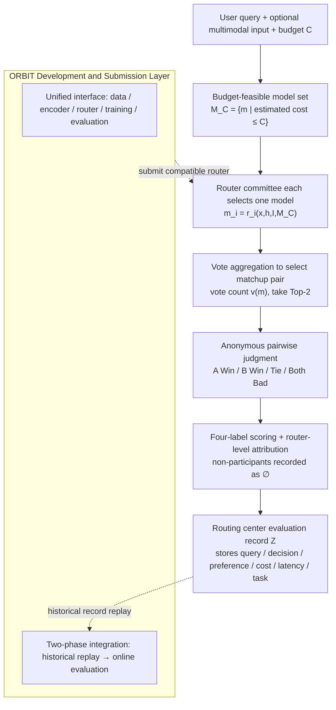

# RouteJudge: An Open Platform for Reproducible and Preference-Aware LLM Routing

**Conference**: ICML2026  
**arXiv**: [2606.18774](https://arxiv.org/abs/2606.18774)  
**Code**: https://github.com/AIGNLAI/LAMDA-ORBIT  
**Area**: LLM Evaluation / LLM Routing / Preference Alignment  
**Keywords**: LLM Routing, Online Preference Evaluation, Pairwise Comparison, Elo, Reproducible Toolbox

## TL;DR
RouteJudge points out that current LLM router evaluations are confined to the "offline, ground-truth-based, and auto-scoring" paradigm, which ignores the diverse preferences of real users. Consequently, it proposes an **online pairwise preference evaluation platform**: for the same query, multiple routers select one model each from the same model pool and budget for an anonymous pairwise duel. User preferences are then attributed back to the router level. This is accompanied by a reproducible modular toolbox, ORBIT, serving as the entry point for routing method development and submission.

## Background & Motivation
**Background**: LLM routing constructs a model pool from heterogeneous models with varying capabilities, costs, and latencies. It automatically selects the most suitable model for each query, essentially functioning as "budget-constrained inference"—assigning simple requests to cheap, fast models and complex, high-risk requests to powerful models to optimize the quality-cost trade-off. Existing routers vary widely, including similarity-based, learning-based cost-quality, cascade/uncertainty, and preference-based/structured routers.

**Limitations of Prior Work**: Despite their differing mechanisms, these routers **share the same evaluation assumption**: routing quality can be measured offline using benchmark labels, task metrics, or automated judges, assuming "a router is good if it selects a model with a high score on a fixed benchmark." This simplifies routing into a "fixed target prediction" problem.

**Key Challenge**: In real-world deployments, many queries **lack a unique optimal answer**. For tasks such as writing, translation, dialogue, tutoring, and analytical reasoning, multiple responses may be valid, but users prefer different answers due to varying expectations, cost sensitivity, latency tolerance, detail preferences, reasoning styles, and tones. Therefore, a router that performs well under "ground truth/auto-scoring" **may not necessarily select the model that the user truly prefers**. The authors define this as the **pluralistic preference alignment** problem in routing.

**Goal**: To shift the routing evaluation objective from "whether the benchmark-optimal model is selected" to "whether the routing decision leads to user-preferred answers," while ensuring this evaluation system is **sustainably scalable and reproducible**.

**Key Insight**: Draw inspiration from LMArena-style online anonymous pairwise comparisons, but shift the evaluation subject from "model response quality" to "**router decision quality**"—preference signals must be attributed back to the router making the selection, rather than stopping at the selected model.

**Core Idea**: Use "online pairwise preference + router-level attribution" to evaluate routing decisions (RouteJudge), and use a standardized toolbox (ORBIT) as a unified development and submission layer, forming an open and sustainably expanding routing evaluation ecosystem.

## Method

### Overall Architecture
RouteJudge treats each router as a **black-box decision-maker**: given the same query, model pool, and budget, it recommends a candidate model. The platform then takes responses from models selected by different routers for anonymous pairwise duels, attributing user preferences back to the underlying routers. This online evaluation process follows a five-stage pipeline, supported by ORBIT for router training, validation, and submission infrastructure.

The core difference of this design is that while traditional routing benchmarks compare whether a router agrees with fixed labels, RouteJudge compares whether a router's decision makes the user more satisfied, incorporating cost, latency, and task types into conditional analyses through complete logging.

### Key Designs

**1. Router-Level Preference Attribution: Shifting from "which model won" to "which router chose correctly"**

Traditional online arenas stop at the model level—they only identify which model response won. However, routing research is concerned with the **quality of the router making the choice**. RouteJudge's approach is to first convert user preferences into comparison scores $(s_A, s_B)$, then assign scores to routers based on whether their selected model entered the evaluated duel:

$$S_i=\begin{cases}s_A,& m_i=m_A,\\ s_B,& m_i=m_B,\\ \varnothing,& m_i\notin\{m_A,m_B\}.\end{cases}$$

Where $m_i=r_i(x,h,I,\mathcal{M}_C)$ is the selection of router $r_i$. This step converts "response quality at the model level" into "decision quality at the router level," distinguishing RouteJudge from common model arenas. For the same duel, the platform can simultaneously answer "which response won" and "which routers selected the winning model."

**2. Five-Stage Online Evaluation Workflow: Vote-driven duel selection to focus on high-disagreement models**

Evaluating multiple routers on a single query via all-pairs model duels would be cost-prohibitive. The authors designed a vote-driven selection: user submits query and budget $C \rightarrow$ platform constructs the budget-feasible set $\mathcal{M}_C=\{m\in\mathcal{M}\mid\hat c(m\mid x,h,I)\le C\}$ $\rightarrow$ all routers select one model each $\rightarrow$ the **two models with the highest votes** $v(m)=|\{i\mid m_i=m\}|$ are chosen for the duel $(m_A, m_B)$ (ties favor models with fewer historical comparisons or are broken randomly) $\rightarrow$ responses are generated and presented anonymously. This ensures duels occur between the two most favored models, focusing the limited human annotation budget on the most discriminative and controversial comparisons.

**3. Four-Label Scoring + Non-participation ∅: Avoiding forced choice without penalizing unselected routers**

User judgments use four labels $y\in\{\text{A Win},\text{B Win},\text{Tie},\text{Both Bad}\}$, corresponding to scores $(1,0)/(0,1)/(0.5,0.5)/(0,0)$. The inclusion of Tie and Both Bad prevents forcing a binary preference when responses are indistinguishable or equally poor. Crucially, the $\varnothing$ in attribution signifies that if a router's model did not enter the duel, it is marked as "non-participating," counting as neither a win nor a loss. This avoids assigning outcomes to routers that were not actually evaluated. The platform reports **participation rates alongside preference indicators**. Every interaction is stored as a centralized routing record $\mathcal{Z}=(x,h,I,C,\mathcal{M}_C,\mathbf d,\mathbf v,m_A,m_B,y,\mathbf s,\mathbf c,\boldsymbol\ell,\tau,\eta)$.

**4. ORBIT Standardized Toolbox + Two-Stage Submission: Sustaining the router pool**

ORBIT (Optimal Routing and Budgeted Inference Toolbox) standardizes the end-to-end process: unified data loading, query representation (supporting lightweight encoders, large embeddings, or multi-modal inputs), and router implementation (inheriting from `BaseRouter`). All routers expose a single interface: "query representation + feasible model set $\rightarrow$ recommended model." This enables composability and reproducibility via configuration files. ORBIT also acts as the **submission layer**: researchers implement ORBIT-compatible routers and, after a PR submission, undergo **Historical Replay Evaluation** (checking if the router would have selected the user-preferred model in past records) before moving to **Online Evaluation**.

## Key Experimental Results

### Offline ORBIT Evaluation
On the RouterEval benchmark, using all-MiniLM-L6-v2 to encode queries with a fixed 2:8 train/test split, the performance-cost trade-off curves were measured. Metric analysis included nAUC, Peak Score, QNC, and RCI. The core value lies in allowing all routers to be compared under identical data processing, representation, model pools, and budgets.

### Online RouteJudge Preference Evaluation
As of 2026-06-08, the platform recorded 261 duels and 109 user votes. The following table shows Elo rankings (based on 109 votes, to be viewed as an early snapshot):

| Router | Win Rate | Elo |
|--------|----------|-----|
| RouterLLM-MF | 66.67% | 1278 |
| NIRT-Router | 80.00% | 1274 |
| kNNRouter | 60.00% | 1240 |
| GraphRouter | 44.44% | 1218 |
| EmbedLLM | 63.64% | 1215 |
| ... | ... | ... |
| HybridLLM | 18.18% | 1134 |
| MIRT-Router | 36.00% | 1117 |

### Key Findings

| Phenomenon | Data | Interpretation |
|------|------|------|
| Offline strength != Online strength | Some routers learning explicit scores had lower online win rates; simple non-parametric/MF methods were competitive | Routing quality cannot be judged solely by offline label alignment |
| Preference not solely determined by cost | A Pareto frontier exists in the cost-win rate plot; some low-cost models remain competitive | Effective routing should adapt based on budget and context rather than always picking the most expensive model |
| Elo must be read with participation rate | High win rates may stem from fewer decisive comparisons | The platform reports Elo, win rate, participation rate, and cost concurrently |

## Highlights & Insights
- **Shifting the evaluation subject from the model to the router** is the core insight—applying the anonymous pairwise arena protocol to routers via "attribution + non-participation $\varnothing$."
- **Two-stage evaluation** addresses a major pain point: proving that offline optimality does not guarantee online preference strength.
- **Vote-driven duel selection** is a clever design for saving human annotation budget by focusing on the Top-2 models with the most disagreement.
- **ORBIT's unified interface and PR submission** allow the evaluation platform to grow sustainably, moving from a static benchmark paper to a living ecosystem.

## Limitations & Future Work
- **Preliminary Results**: With only 109 votes and 261 duels, Elo rankings are volatile and should not be taken as final conclusions.
- **Sparse and Biased Preference Signals**: The online user base and query distribution may not represent real deployments; anonymous judgments are subject to presentation order and user fatigue.
- **Cost Estimation**: The accuracy of $\hat c$ and the feasible set directly affects fairness; the impact of cost estimation error requires further discussion.
- **Statistical Efficiency**: Many routers receive $\varnothing$ in a single duel, meaning a significant amount of data is needed to stabilize rankings, leading to a slow cold start.
- **Future Improvements**: Introducing systematic active duel selection, modeling pluralistic preferences through user clustering, and building multi-objective rather than single-Elo rankings.

## Related Work & Insights
- **vs. Offline Routing Benchmarks (RouterEval)**: These measure "whether the benchmark-optimal model is selected," whereas RouteJudge measures "whether the user prefers the result."
- **vs. Model Arenas (Pairwise Leaderboards)**: Arenas evaluate response quality at the model level; RouteJudge evaluates decision quality at the router level.
- **vs. Learning-based Cost-Quality Routing (RouteLLM, etc.)**: These are "participants" to be evaluated; RouteJudge/ORBIT provides them with a unified channel for offline replication and online preference testing.

## Rating
- Novelty: ⭐⭐⭐⭐ Migrating the arena paradigm to the router level with attribution is a fresh perspective.
- Experimental Thoroughness: ⭐⭐⭐ Comprehensive offline metrics, but online data is limited to an early snapshot.
- Writing Quality: ⭐⭐⭐⭐ Clear motivation, detailed descriptions of protocols and toolboxes.
- Value: ⭐⭐⭐⭐ Provides a sustainable open routing evaluation ecosystem, advancing the evaluation paradigm.

<!-- RELATED:START -->

## Related Papers

- [\[ICLR 2026\] RouterArena: An Open Platform for Comprehensive Comparison of LLM Routers](../../ICLR2026/llm_evaluation/routerarena_an_open_platform_for_comprehensive_comparison_of_llm_routers.md)
- [\[ICML 2026\] Nonparametric LLM Evaluation from Preference Data](nonparametric_llm_evaluation_from_preference_data.md)
- [\[ICML 2026\] Reasoning Is Not Free: Robust Adaptive Cost-Efficient Routing for LLM-as-a-Judge](reasoning_is_not_free_robust_adaptive_cost-efficient_routing_for_llm-as-a-judge.md)
- [\[ICLR 2026\] Unpacking Human Preference for LLMs: Demographically Aware Evaluation with the HUMAINE Framework](../../ICLR2026/llm_evaluation/unpacking_human_preference_for_llms_demographically_aware_evaluation_of_long-fo.md)
- [\[ICLR 2026\] Preference Leakage: A Contamination Problem in LLM-as-a-judge](../../ICLR2026/llm_evaluation/preference_leakage_a_contamination_problem_in_llm-as-a-judge.md)

<!-- RELATED:END -->
