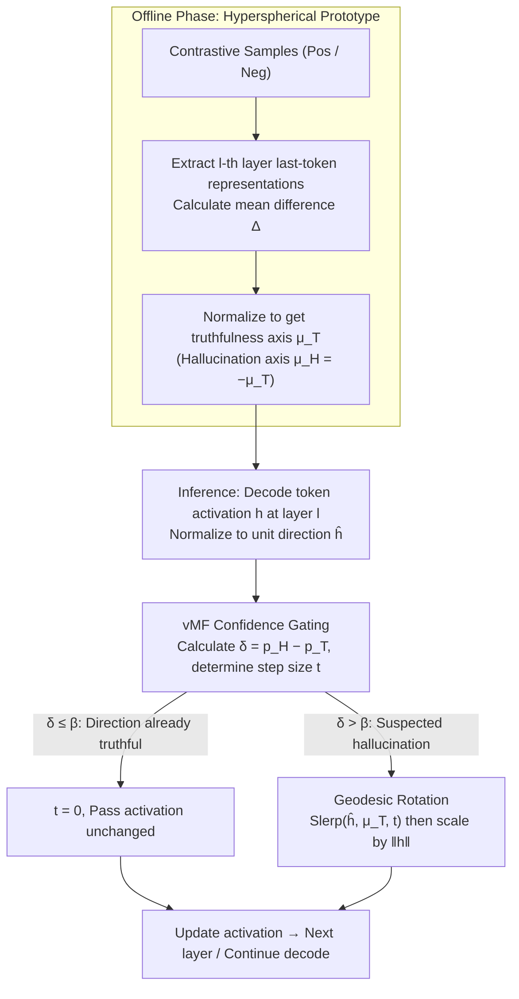

# Spherical Steering: Geometry-Aware Activation Rotation for Language Models

**Conference**: ICML 2026  
**arXiv**: [2602.08169](https://arxiv.org/abs/2602.08169)  
**Code**: https://github.com/chili-lab/Spherical-Steering (Available)  
**Area**: Interpretability / Activation Editing / Inference-time Intervention / LLM Alignment  
**Keywords**: Activation Steering, Hyperspherical Geometry, Slerp Geodesics, vMF Confidence Gating, Norm Preservation

## TL;DR
This paper proposes Spherical Steering: rotating activation vectors along geodesics on the unit hypersphere of LLM hidden states toward a "truthfulness direction" estimated from contrastive samples. Unlike traditional additive activation steering, this approach maintains activation magnitudes (norms) while significantly improving multiple-choice accuracy on benchmarks such as TruthfulQA, COPA, and StoryCloze (+10% range) without degrading open-ended generation quality.

## Background & Motivation

**Background**: To control LLM behavior without retraining, the mainstream approach is *activation steering*—estimating a "steering vector" $\mu$ from a batch of (positive, negative) contrastive samples and adding it directly to token activations at specific layers: $h' = h + \lambda \mu$. Representative methods include CAA and ITI.

**Limitations of Prior Work**: This additive operation suffers from severe *scale sensitivity*. If $\lambda$ is too small, there is no effect; if $\lambda$ is large, the hidden state norm $\|h\|$ is significantly distorted. The equation $\|h'\|^2 = \|h\|^2 + 2\lambda\mu^\top h + \lambda^2$ indicates that norm changes depend on both $\lambda$ and the alignment between $\mu$ and $h$, making it uncontrollable. Consequently, while multiple-choice accuracy increases, open-ended generation quality (TRUE×INFO) often collapses, making models "over-conservative" or causing representation collapse.

**Key Challenge**: Modern LLMs generally use RMSNorm or LayerNorm to standardize activation magnitudes, implying that *direction is the primary degree of freedom for semantic information*. Additive steering perturbs magnitudes freely, conflicting with the geometric priors of the model architecture.

**Goal**: Design a *geometrically consistent* inference-time intervention primitive that remains training-free like addition but strictly preserves $\|h\|$ to avoid disrupting the geometric priors of normalization layers.

**Key Insight**: The authors made a key empirical observation (Figure 3): on TruthfulQA, the $\ell_2$ norm curves of last-token activations for "correct" and "incorrect" answers almost coincide across all 32 layers (difference <1%), but their *directions* differ significantly. This directly demonstrates that truthfulness signals are encoded in the direction, not the magnitude.

**Core Idea**: Project activations onto a unit hypersphere $\mathbb{S}^{d-1}$, rotate them toward a target direction $\mu_T$ along a geodesic (great circle) via Slerp, and finally scale back to the original norm. This norm-preserving rotation replaces "addition in $\mathbb{R}^d$" with "rotation on $\mathbb{S}^{d-1}$".

## Method

### Overall Architecture
This work addresses the issue where traditional additive activation steering uncontrollably distorts hidden state norms while enhancing truthfulness, thereby damaging generation quality. Spherical Steering provides a completely training-free pipeline consisting of two stages: An offline stage uses a set of (positive, negative) contrastive samples to run the model and estimate a unit-length "truthfulness axis" $\mu_T^{(l)}$ for each intervention layer; an inference stage normalizes the activation of each decoded token to a unit hypersphere, calculates the rotation step size using a vMF confidence gate, rotates it toward $\mu_T^{(l)}$ along a geodesic, and scales it back to the original magnitude. The core mechanism replaces "addition $h+\lambda\mu$ in $\mathbb{R}^d$" with "rotation on $\mathbb{S}^{d-1}$" to strictly preserve $\|h\|$.

### Key Designs

**1. Hyperspherical Prototype: Extracting the "Truthfulness Direction" from Contrastive Samples**

Steering vectors in additive methods often carry scale and context noise, which can pollute activations. Here, only the "direction" is used: for each $(x_i, y_i^+, y_i^-)$, the concatenated sequences $x_i \| y_i^\pm$ are fed into the model. The last-token representations $z_i^{(l)\pm}$ at layer $l$ are extracted to calculate the mean difference $\Delta^{(l)} = m_+^{(l)} - m_-^{(l)}$, which is then normalized to $\mu^{(l)} = \Delta^{(l)}/\|\Delta^{(l)}\|$. The mean difference automatically cancels out context shared by positive and negative samples, leaving only the "truth versus hallucination" discriminative component. Normalization is required because all subsequent operations occur on $\mathbb{S}^{d-1}$, requiring pure direction rather than scaled offsets. This process is offline, keeps weights frozen, and is calculated only once per layer—making it lighter than ITI's per-head probes and more geometrically consistent than CAA's direct addition.

**2. Geodesic Rotation: Rotating Activations via Slerp and Restoring Magnitude**

Rotation naturally avoids norm distortion. Specifically, the activation is normalized to $\hat h^{(l)}$, and the angle between it and the target is calculated as $\theta = \arccos(\mu_T^\top \hat h^{(l)})$. Spherical linear interpolation (Slerp, Shoemake 1985) is used to interpolate along the great circle:

$$\hat h^{(l)\prime} = \frac{\sin((1-t)\theta)}{\sin\theta}\hat h^{(l)} + \frac{\sin(t\theta)}{\sin\theta}\mu_T,\qquad h^{(l)\prime} = \|h^{(l)}\|\,\hat h^{(l)\prime}$$

where $t=0$ represents no change and $t=1$ represents full rotation to $\mu_T$. Slerp provides the path with the minimal angular change for a fixed step size $t$, effectively "minimizing directional perturbation for maximal semantic alignment." Scaling back to $\|h^{(l)}\|$ ensures $\|h^{(l)\prime}\| \equiv \|h^{(l)}\|$ strictly holds, fitting the architectural prior where norms are standardized and direction carries information. Unlike Angular Steering which projects to a fixed 2D plane, this method performs geodesics directly on the original $d$-dimensional sphere without PCA approximations.

**3. vMF Confidence Gating: Applying Intensive Rotation Only Near Hallucinations**

Applying a uniform step size $t$ to all tokens is either insufficient or risks corrupting correct answers. Gating makes $t$ token-adaptive. It uses the exponential term of the von Mises–Fisher density $f(u;m,\kappa)\propto\exp(\kappa m^\top u)$ as a prototype score. A two-class softmax over $(\mu_T, \mu_H=-\mu_T)$ yields $p_T, p_H$. The "hallucination bias" confidence is defined as $\delta = p_H - p_T \in [-1,1]$, which is then truncated by threshold $\beta$ and scaled by $\alpha$:

$$t = \mathrm{clip}\!\left(\alpha \cdot \frac{\delta-\beta}{1-\beta},\,0,\,1\right),\qquad \delta \le \beta \Rightarrow t=0$$

Here, $\kappa$ is the vMF concentration parameter controlling the steepness of the confidence curve. Gated intervention provides two empirical benefits over ungated versions (Figure 5): higher peaks in MC accuracy and wider usable intervals; furthermore, generation quality (TRUE×INFO) remains stable even at high intensities ($\alpha=1.0$), whereas ungated performance collapses when $\alpha>0.6$. This essentially "applies water only where there is fire, sparing the good answers."

## Key Experimental Results

### Main Results

On TruthfulQA (LLaMA-3.1-8B-Instruct), Spherical Steering achieves the best performance across three multiple-choice metrics (MC1/MC2/MC3) and open-ended generation (TRUE×INFO) simultaneously—whereas additive baselines like ITI and CAA exhibit a trade-off where MC gains lead to TRUE×INFO drops.

| Model | Method | MC1 | MC2 | MC3 | TRUE×INFO |
|------|------|-----|-----|-----|-----------|
| LLaMA-3.1-8B-Instruct | Baseline | 34.15 | 53.32 | 27.02 | 48.24 |
| LLaMA-3.1-8B-Instruct | ITI | 37.70 | 58.09 | 30.12 | 40.31 ↓ |
| LLaMA-3.1-8B-Instruct | CAA | 35.99 | 56.26 | 29.36 | 49.66 |
| LLaMA-3.1-8B-Instruct | SADI-HEAD | 38.53 | 56.03 | 30.57 | 51.18 |
| LLaMA-3.1-8B-Instruct | **Spherical (Ours)** | **49.95** | **68.51** | **41.05** | **54.63** |
| Qwen-2.5-7B-Instruct | Baseline | 35.87 | 54.95 | 26.62 | 74.40 |
| Qwen-2.5-7B-Instruct | ITI | 40.15 | 58.93 | 30.26 | 67.82 ↓ |
| Qwen-2.5-7B-Instruct | **Spherical (Ours)** | **48.71** | **66.90** | **39.16** | **77.84** |

Zero-shot evaluation across 6 multi-choice benchmarks (LLaMA-3.1-8B-Instruct):

| Method | TruthfulQA | COPA | StoryCloze | MMLU | Wino. | BoolQ | Avg. |
|------|------------|------|------------|------|-------|-------|------|
| Baseline | 34.15 | 83.00 | 74.72 | 60.60 | 50.81 | 80.12 | 63.90 |
| ITI | 37.70 | 83.00 | 75.12 | 60.90 | 51.85 | 81.53 | 65.02 |
| CAA | 35.99 | 84.00 | 79.02 | 60.70 | 51.93 | 82.42 | 65.68 |
| SADI-HEAD | 38.53 | 84.00 | 75.72 | 60.66 | 51.85 | 80.20 | 65.16 |
| **Spherical (Ours)** | **49.95** | **95.00** | **89.08** | **62.05** | **52.72** | **82.94** | **71.96** |

Average absolute gain of +6.28%, with +10% or more on COPA and StoryCloze.

### Ablation Study

| Configuration | MC1 (TruthfulQA, LLaMA) | TRUE×INFO | Description |
|------|--------------------------|-----------|------|
| K=1 layer | 45.41 | 52.16 | Single-layer rotation: MC already near peak |
| K=2 layers | 47.62 | 73.93 | Additional layers mainly improve generation (INFO 62.9→90.3) |
| K=3 layers | 47.13 | **74.43** | Optimal balance point |
| K=4 layers | 41.37 | 70.62 | Excessive intervention hurts MC |
| K=5 layers | 41.37 | 70.09 | As above |
| Ungated rotation (α=1.0) | — | Sharp Drop | Generation quality collapses at high α |
| **vMF gated (α=1.0)** | — | Still Stable | Gating significantly expands usable α range |

### Key Findings
- **Geometric Insight**: Figure 3 shows activation norms for truthful vs. hallucinated samples are nearly identical (<1% difference), proving truthfulness is encoded in direction, empirically validating the norm-preserving design.
- **Collapse-efficiency Advantage**: Figure 4 shows that for the same effective rank reduction (Δrank≈50), rotation gains 8–10% more MC accuracy than addition; addition-based TRUE×INFO collapses after slight rank drops, while rotation maintains gains across a wide range.
- **Asymmetric Multi-layer Effects**: Increasing layers from K=1 to 3 keeps MC stable (+2.2%) but causes INFO to jump from 62.9% to 92.7%. The authors suggest middle layers govern semantic discrimination (MC signal), while later layers govern token-level generation dynamics (INFO signal).
- **Orthogonality with 5-shot ICL**: When combined with ICL, ITI reduces TRUE×INFO from 38.9 to 37.3; Spherical simultaneously increases MC1 to 52.4% and TRUE×INFO to 42.8%, showing geometric intervention operates on a mechanism independent of prompt engineering.
- **High Sample Efficiency**: Only 25 contrastive samples are needed to increase MC1 from 36.3% to 51.5% (±2.2) on LLaMA; variance shrinks rapidly as samples increase.

## Highlights & Insights
- **Reinterpreting "Addition in $\mathbb{R}^d$" as "Rotation on $\mathbb{S}^{d-1}$" is a natural yet overlooked perspective**: Since architectures use RMSNorm to stabilize magnitudes, the remaining degrees of freedom for semantics are directional. This work thoroughly implements this observation as an intervention primitive.
- **First closed-form, training-free Slerp application in LLM steering**: Unlike HPR which learns a Householder reflection, Spherical does not require an angle predictor, achieving both geometric consistency and zero training.
- **vMF gate is a lightweight plugin transferable to any steering method**: It uses directional confidence to dynamically adjust intensity, which could theoretically be applied to CAA, ITI, or SAE-based interventions to decouple norm and direction control.
- **Robust "Pareto improvement" visualization**: Figure 1(a) plots MC accuracy against TRUE×INFO; while baselines are stuck on a trade-off curve, the proposed method moves toward the top-right, effectively breaking the trade-off.
- **Introduction of "Collapse-efficiency"**: Instead of just end-point metrics, this work introduces "performance gain per unit of rank reduction" as a geometric efficiency metric, providing a valuable methodological tool for future intervention studies.

## Limitations & Future Work
- **Reliance on binary contrastive data**: Currently supports only (positive, negative) dichotomies (truthful/hallucinated, safe/unsafe). Extending to fine-grained multi-class concepts would require multi-axis geometry.
- **Antipodal Assumption**: The assumption that "truth" and "hallucination" are exactly antipodal ($\mu_H = -\mu_T$) might fail in tasks where correct and incorrect answers are more complexly distributed.
- **Heuristic Layer Selection**: Choosing layers $\mathcal{L}=\{l_1,\dots,l_K\}$ currently relies on empirical grid search (e.g., layer 24 for LLaMA), lacking a principled selection criterion.
- **Scalability limits**: Evaluation was restricted to 7–8B Instruct models; robustness on base models, larger scales (30B+), or MoE architectures remains unverified.
- **Hyperparameter Tuning**: vMF parameters $\kappa, \alpha, \beta$ define the gate shape; estimating $\kappa$ directly from samples via MLE could automate this.
- **Future Directions**: (i) Expanding $\mu_T$ to low-rank multi-axis geometry for composite concept steering; (ii) Using SAE features as prototype directions; (iii) Replacing Slerp with iterative Riemannian gradient flow for multi-step rotation.

## Related Work & Insights
- **vs CAA (Rimsky et al., 2024)**: CAA uses additive $h + \lambda\mu$. This work replaces it with Slerp rotation to preserve norms; while CAA gets MC1=35.99 / TRUE×INFO=49.66 on LLaMA, this work achieves 49.95 / 54.63, proving geometric consistency pays off.
- **vs ITI (Li et al., 2023)**: ITI uses per-head linear probes to select "truthful heads" for small additions. This work uses full-layer rotation; ITI's TRUE×INFO drops to 40.31, whereas ours rises to 54.63, showing rotation is more self-consistent than selective addition.
- **vs Angular Steering (Vu & Nguyen, 2025)**: Angular Steering projects to a 2D plane first, depending on low-dimensional approximations. This work performs geodesics in the original $d$-dimensional space without PCA.
- **vs HPR (Pham & Nguyen, 2024)**: HPR requires training a network for Householder reflections. This work is closed-form and training-free, utilizing the vMF gate for adaptive flexibility instead.
- **vs ReFT / LoFiT (Wu et al., 2024; Yin et al., 2024)**: These involve representation fine-tuning with lightweight modules. This work pushes the "structural intervention" idea to a training-free extreme using pure geometric priors.
- **Key Insight**: The "Sphere + Geodesic + Confidence Gate" combination can be transferred to any scenario where semantics are direction-encoded—such as VLM image tokens or diffusion noise embeddings—wherever editing is required after Layer/RMSNorm.

## Rating
- Novelty: ⭐⭐⭐⭐ The single idea (swapping addition for rotation) is not revolutionary, but the complete synthesis of hyperspherical geometry, Slerp, and vMF gating with rigorous geometric proof is a "correct" and elegant innovation.
- Experimental Thoroughness: ⭐⭐⭐⭐ Covers 6 MC benchmarks, open-ended generation, collapse-efficiency, and ablations for layers/gating/ICL. Needs broader model scale validation.
- Writing Quality: ⭐⭐⭐⭐ The logical chain from geometric insight to method and validation is very smooth. Figure 1 clearly demonstrates the break in trade-offs.
- Value: ⭐⭐⭐⭐ Provides a plug-and-play, zero-training, norm-preserving steering primitive, and the "collapse-efficiency" metric is methodologically significant for future intervention research.

<!-- RELATED:START -->

## Related Papers

- [\[AAAI 2026\] Test-time Diverse Reasoning by Riemannian Activation Steering](../../AAAI2026/llm_evaluation/test-time_diverse_reasoning_by_riemannian_activation_steering.md)
- [\[ICML 2026\] Top-W: Geometry-Aware Decoding with Wasserstein-Regularized Truncation and Mass Penalties for LLMs](geometry-aware_decoding_with_wasserstein-regularized_truncation_and_mass_penalti.md)
- [\[ICML 2026\] AGZO: Activation-Guided Zeroth-Order Optimization for LLM Fine-Tuning](agzo_activation-guided_zeroth-order_optimization_for_llm_fine-tuning.md)
- [\[ICML 2026\] PoliticsBench: Benchmarking Political Values in Large Language Models with Multi-Stage Roleplay](politicsbench_benchmarking_political_values_in_large_language_models_with_multi-.md)
- [\[ICML 2026\] Investigating Advanced Reasoning of Large Language Models via Black-Box Environment Interaction](investigating_advanced_reasoning_of_large_language_models_via_black-box_environm.md)

<!-- RELATED:END -->
## Related Papers

- [\[ICML 2026\] Top-W: Geometry-Aware Decoding with Wasserstein-Regularized Truncation and Mass Penalties for LLMs](geometry-aware_decoding_with_wasserstein-regularized_truncation_and_mass_penalti.md)
- [\[AAAI 2026\] Test-time Diverse Reasoning by Riemannian Activation Steering](../../AAAI2026/llm_evaluation/test-time_diverse_reasoning_by_riemannian_activation_steering.md)
- [\[ICML 2026\] AGZO: Activation-Guided Zeroth-Order Optimization for LLM Fine-Tuning](agzo_activation-guided_zeroth-order_optimization_for_llm_fine-tuning.md)
- [\[ICML 2026\] Investigating Advanced Reasoning of Large Language Models via Black-Box Environment Interaction](investigating_advanced_reasoning_of_large_language_models_via_black-box_environm.md)
- [\[ICML 2026\] PoliticsBench: Benchmarking Political Values in Large Language Models with Multi-Stage Roleplay](politicsbench_benchmarking_political_values_in_large_language_models_with_multi-.md)

<!-- RELATED:END -->
