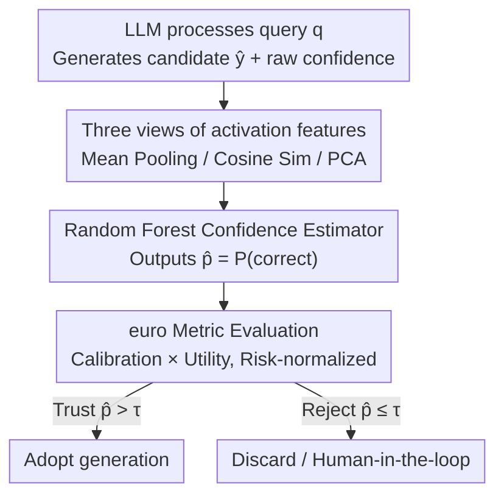

# The ACUTE Protocol: Operationalizing Language Model Activations for Better Calibration, Utility, and Trust

**Conference**: ICML 2026  
**arXiv**: [2606.07822](https://arxiv.org/abs/2606.07822)  
**Code**: TBD  
**Area**: LLM Evaluation / Confidence Calibration  
**Keywords**: Confidence estimation, Calibration, Decision utility, Activation probing, Trustworthiness

## TL;DR
This paper identifies two critical flaws in "Expected Calibration Error (ECE)" as a trust metric: its inability to distinguish between an oracle and an uninformative "base-rate" estimator, and its insensitivity to task risk. To address this, the authors propose a new metric, `euro` (Oracle-normalized Expected Utility), which links calibration with decision utility. They further introduce the `acute` protocol, which uses layer-wise activations during generation as features for a Random Forest classifier to estimate confidence. Across 6 models and 3 task types, `acute` maintains low calibration error while significantly outperforming strong baselines on `euro`.

## Background & Motivation
**Background**: Users increasingly rely on LLMs for information retrieval, writing, and tool calls, directly feeding model outputs into downstream computations. Consequently, determining whether to "trust" a specific output is critical, requiring a confidence estimator to assign a "probability of correctness" to the generation. The most common off-the-shelf confidence measure is the model's raw confidence (the product of token probabilities), which is notoriously poorly calibrated and overconfident.

**Limitations of Prior Work**: The standard metric for calibration, Expected Calibration Error (ECE) (and its hyperparameter-free version smECE), has two major flaws when used as a proxy for "trust." The authors illustrate this with a task having 50% accuracy:

**Key Challenge**: First, **ECE cannot distinguish between an oracle and a useless estimator**. An oracle (assigning $p=1$ to correct and $p=0$ to incorrect) and a base-rate estimator (assigning $p=0.5$ to everything) both yield an ECE of 0, yet the former is perfect while the latter provides zero information for decision-making. Second, **ECE is risk-insensitive**. An estimator that gives $p=0.75$ for correct and $p=0.25$ for incorrect yields the same ECE ($0.25$) in both high-risk tasks (needing $0.9$ confidence to trust) and medium-risk tasks (needing $0.5$). However, it perfectly solves the medium-risk task while failing the high-risk one.

**Goal**: (1) Develop a metric that reflects calibration, decision utility, and task risk; (2) Create an efficient, sample-economical confidence estimator.

**Key Insight**: Decision utility must explicitly model the positive gains of "trusting correct / rejecting incorrect" and the losses of "trusting incorrect / rejecting correct," coupled with a tunable risk threshold. Confidence estimation leverages the observation that LLM activation spaces contain interpretable signals regarding correctness (activations can be steered, and specific layers correspond to different linguistic phenomena).

**Core Idea**: Replace pure calibration metrics with `euro` and use the `acute` protocol (activation features + Random Forest) to produce accurate confidence estimates.

## Method

### Overall Architecture
The paper introduces two complementary components: the `euro` metric and the `acute` estimator. The `acute` pipeline functions as follows: While the LLM $M$ processes query $q$ to generate candidate $\hat{y}$, its layer-wise activations are extracted. These high-dimensional activations are compressed into compact features using one of three methods (layer-wise mean pooling, cosine similarity to the final layer, or layer-wise PCA). A Random Forest classifier is then trained to predict "whether the generation is correct," and the probability of the "correct" class serves as the calibrated confidence $\hat{p}$. Finally, the `euro` metric assesses the estimator based on both its calibration and its decision utility across different risk thresholds.

### Key Designs

**1. Three Views of Activation Features: Compressing Activations into Compact Features**
Activation spaces are high-dimensional (e.g., 4000 hidden dims across 50 layers result in ~200k dimensions). `acute` offers three aggregation views:
- **Layer-wise Mean Pooling**: For layer $j$, activations $H^{(j)} = [\mathbf{h}_1^{(j)} \ldots \mathbf{h}_T^{(j)}]$ are averaged over the sequence to produce a vector $\bar{\mathbf{h}}^{(j)}$. 
- **Cosine Similarity to Final Layer**: Calculates the similarity between each layer's pooled activation and the last layer:
$$\mathbf{x}_{\textsc{cosine}} = \big[\,\mathrm{sim}(\bar{\mathbf{h}}^{(1)}, \bar{\mathbf{h}}^{(\ell)})\;\ldots\;\mathrm{sim}(\bar{\mathbf{h}}^{(\ell-1)}, \bar{\mathbf{h}}^{(\ell)})\,\big].$$
- **Layer-wise PCA**: Extracts the top $m$ principal components per layer (e.g., $m=10, 20$).

**2. Random Forest Confidence Estimator: Mapping Activations to Calibrated Confidence**
The authors use a **Random Forest** classifier because prior work indicates it is a robust correctness predictor for tool calls and QA. While decision trees can produce extreme probabilities, the authors find that well-trained Random Forests do not require further Platt scaling. The model's **raw confidence** is also included as a supplemental feature.

**3. euro Metric: Oracle-normalized Expected Utility for Calibration and Risk**
This metric addresses ECE's flaws. For a query $q$ and estimator $\hat{p}$, the Minimum Bayesian Risk (MBR) threshold $\tau$ categorizes results into true positive ($tp$), false positive ($fp$), false negative ($fn$), and true negative ($tn$), with associated rewards $R$. The authors reparameterize these into normalized net utility for "correct trust" ($u_{ct}$) and "correct avoidance" ($u_{ca}$), where $u_{ct}, u_{ca} \in [0,1]$ and $u_{ct} = 1 - u_{ca}$. The threshold then becomes $\tau = u_{ca}$, representing the **risk level of the task**. Normalization is performed relative to an Oracle ($O$) and an Anti-Oracle ($AO$):
$$\textsc{euro}_C(u_{ca}) = \frac{N_{tp,C} + u_{ca}\cdot(N_{tn,C}-N_{tp,C})}{N_{tp,O} + u_{ca}\cdot(N_{tn,O}-N_{tp,O})} \in [0,1].$$
The area under the `euro` curve (auc-euro) summarizes performance across all risks.

## Key Experimental Results

### Main Results
Evaluated on **6 models** (Gemma-3 series, Qwen3 series, Phi-4, SmolLM3) across **3 task types** (MMLU, APIGen tool calling, SCITLDR summarization).

| Task | Estimator | smECE ↓ | auc-euro (all) ↑ |
|------|-----------|---------|-------------------|
| MMLU | Raw Conf | 0.17 | 0.72 |
| MMLU | NWKR | 0.07 | 0.79 |
| MMLU | acute late act | **0.07** | **0.83** |
| APIGen | Raw Conf | 0.22 | 0.53 |
| APIGen | NWKR | 0.02 | 0.78 |
| APIGen | acute pca20 | 0.06 | **0.88** |
| SCITLDR | Raw Conf | 0.15 | 0.66 |
| SCITLDR | NWKR | 0.08 | 0.77 |
| SCITLDR | acute mid act | 0.08 | **0.78** |

### Ablation Study
Comparing feature views (auc-euro all):

| Estimator Variant | MMLU | APIGen | SCITLDR |
|-------------------|------|--------|---------|
| acute early act | 0.79 | 0.86 | 0.78 |
| acute mid act | 0.82 | 0.87 | 0.78 |
| acute late act | **0.83** | 0.87 | 0.77 |
| acute cosine | 0.81 | 0.83 | 0.77 |
| acute pca20 | 0.81 | **0.88** | 0.78 |

### Key Findings
- **Decoupling of euro and smECE**: `acute` improves decision utility (`euro`) while maintaining low calibration error (`smECE`).
- **Activation Signals**: Compared to Raw Confidence (MMLU 0.72), `acute` variants significantly improve utility (up to 0.83), confirming that internal states reflect correctness.
- **APIGen Gain**: Tool calling tasks showed the largest improvement, suggesting activations are far more informative than token probabilities for structured multi-token outputs.

## Highlights & Insights
- **Paradigm Shift in Metrics**: `euro` exposes that "good calibration $\neq$ trustworthiness." Integrating decision utility and risk into the metric provides a cognitive upgrade for evaluation.
- **Risk Level as a Knob**: By setting $\tau = u_{ca}$, task risk becomes a tunable $[0,1]$ knob within the metric.
- **Deployment Efficiency**: Does not require LLM fine-tuning; a lightweight Random Forest on pre-computed activations is computationally inexpensive.

## Limitations & Future Work
- **Internal Access**: Requires white-box access to activations, which is unavailable for many closed-source APIs.
- **Correctness Binarization**: For summarization (SCITLDR), "correctness" is determined by a Rouge-L threshold, which may be noisy.
- **No Single Optimal View**: Feature selection (PCA vs. Mean pooling) varies by task, requiring some tuning during setup.

## Related Work & Insights
- **Comparison with ECE**: `euro` addresses the Oracle vs. Base-rate and risk-insensitivity issues where ECE fails.
- **Comparison with Post-processing (Platt/NWKR)**: These rely solely on token probabilities; `acute` utilizes richer internal state information.
- **Insight**: For any LLM deployment requiring a "trust gate" (Agentic tools, RAG, auto-critique), using "activation features + light classifier" for confidence and `euro` for threshold selection is a viable path.

## Rating
- Novelty: ⭐⭐⭐⭐ (Fixing fundamental ECE flaws).
- Experimental Thoroughness: ⭐⭐⭐⭐ (Broad model and task coverage).
- Writing Quality: ⭐⭐⭐⭐ (Clear motivation and examples).
- Value: ⭐⭐⭐⭐ (Directly applicable to trustworthy deployment).

<!-- RELATED:START -->

## Related Papers

- [\[ICML 2025\] Communicating Activations Between Language Model Agents](../../ICML2025/llm_evaluation/communicating_activations_between_language_model_agents.md)
- [\[ICML 2026\] Who can we trust? LLM-as-a-jury for Comparative Assessment](who_can_we_trust_llm-as-a-jury_for_comparative_assessment.md)
- [\[ACL 2025\] GRACE: A Granular Benchmark for Evaluating Model Calibration Against Human Calibration](../../ACL2025/llm_evaluation/grace_a_granular_benchmark_for_evaluating_model_calibration_against_human_calibr.md)
- [\[ICML 2026\] Prescriptive Scaling Reveals the Evolution of Language Model Capabilities](prescriptive_scaling_reveals_the_evolution_of_language_model_capabilities.md)
- [\[ICML 2026\] Estimating Tail Risks in Language Model Output Distributions](estimating_tail_risks_in_language_model_output_distributions.md)

<!-- RELATED:END -->
