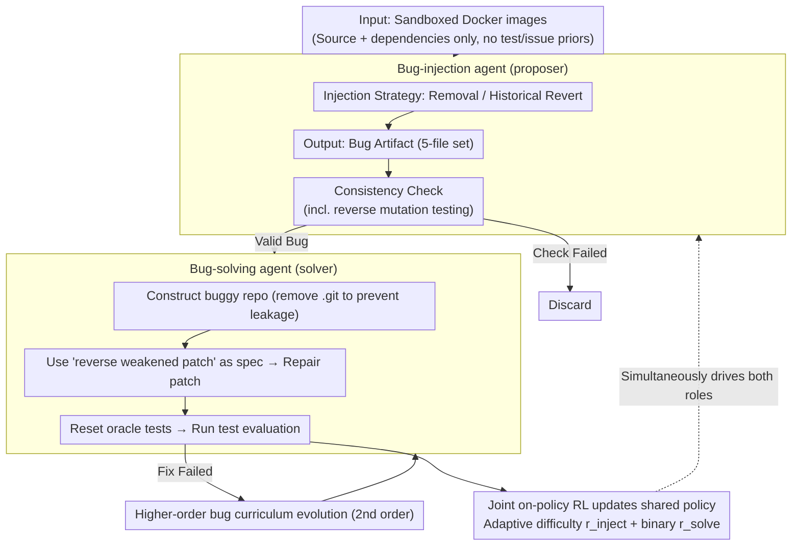

# Toward Training Superintelligent Software Agents through Self-Play SWE-RL

**Conference**: ICML 2026  
**arXiv**: [2512.18552](https://arxiv.org/abs/2512.18552)  
**Code**: None  
**Area**: LLM Agent / Software Engineering Agent / RL  
**Keywords**: Self-play, SWE-RL, Bug Injection, Consistency Check, Curriculum Evolution

## TL;DR
This paper proposes Self-play SWE-RL (SSR), where a single LLM acts as both a "bug-creating proposer" and a "bug-fixing solver" within sandboxed code repositories. Using only Docker images as input and employing consistency checks and solve-rates as rewards for joint RL, SSR achieves self-improvements of +10.4 and +7.8 points on SWE-bench Verified and SWE-Bench Pro, respectively, consistently outperforming "human-data" baselines that rely on human-annotated issues and test suites.

## Background & Motivation

**Background**: Current mainstream software engineering agents (such as SWE-agent, CWM, DeepSWE, Kimi-K2, etc.) are trained using RL with verifiable rewards. The reward signals originate from human-annotated issue descriptions combined with pass-to-pass / fail-to-pass test sets, with SWE-bench Verified being the typical benchmark.

**Limitations of Prior Work**: On one hand, human-annotated issues and tests are expensive and often unreliable (SWE-bench required a "Verified" subset via manual auditing), making scaling difficult. On the other hand, even with RL, agents essentially "replay human development trajectories," making it difficult to discover new problem classes or solutions, effectively locking the performance ceiling to human knowledge.

**Key Challenge**: To train "superhuman" software agents, one must move away from dependence on human-annotated data/environments. However, completely "zero-data" self-play (e.g., Absolute Zero, R-Zero, LSP) often remains confined within the rules of a Python interpreter, failing to learn the real-world engineering knowledge that cannot be purely derived from semantics. In other words, self-play must be "grounded in real codebases" to break through inherent knowledge boundaries.

**Goal**: To build a software agent capable of self-evolution using **only Docker images** (source code + dependencies), achieving three objectives: (1) no reliance on human-written issues/test commands/test parsers; (2) joint training of proposer and solver roles sharing the same set of LLM parameters; (3) curriculum difficulty that evolves continuously with the current policy.

**Key Insight**: Formalize the entire human development workflow—"running tests → injecting bugs → weakening tests → fixing bugs"—into a **bug artifact generated by the agent itself**. A bug and its repair specifications can be fully defined by five files. In this way, the "correctness" of a bug is objectively verifiable via test execution, and reward signals require no natural language.

**Core Idea**: Treat the codebase itself as the "game rules." Allow the same LLM to engage in self-play between the roles of bug-injection and bug-solving. The proposer is rewarded for creating bugs that are "difficult but solvable" (based on solve-rate), while the solver is rewarded for "passing all tests." Combined with a mechanism that "upgrades failed solutions into higher-order bugs," the training distribution evolves naturally with the policy.

## Method

### Overall Architecture

SSR aims to solve the problem of software agents being capped by human-annotated data. It achieves this by letting the agent generate the entire training distribution: the input is a set of sandboxed Docker images (containing only source code and dependencies, **without assuming** existing tests, test commands, parsers, or language/framework priors). The same LLM policy is instantiated into two roles via different prompts while sharing parameters: the **bug-injection agent** explores the repository using Bash + editor tools in the sandbox, learns to run tests, and produces a bug artifact after consistency checks; the **bug-solving agent** then attempts to fix this bug. The proposer's reward comes from "consistency checks + the solver's solve-rate on the bug" (encouraging "difficult but solvable" bugs), while the solver's reward is a binary signal indicating whether all tests passed. Both roles are trained jointly via on-policy RL. Failed solver trajectories are recycled as "second-order bugs" to expand the distribution. The tool scaffolding reuses the implementation of Code World Model (CWM), and the base model uses CWM-sft (32B, the checkpoint before CWM's RL) to ensure a fair comparison with the baseline.

### Key Designs

**1. Bug-injection Strategy: Removal + Historical Revert, with no natural language issues provided to the solver**

The authors found that if the agent is allowed to "inject bugs randomly," it quickly collapses to trivial one-line literal modifications (e.g., `var=0 → var=1`), providing almost zero reward signal. Thus, two simple prompts are used for random sampling to ensure bugs are diverse and non-trivial: (a) **Removal-only** requires the agent to delete an entire file or code block and perform necessary compatibility fixes to ensure the repository still builds, forcing the solver to reconstruct missing functionality from scratch and learn the repository structure; (b) **History-aware** allows the agent to read the git log, select meaningful historical changes, and apply them in reverse, making bug patterns close to real evolution history. The solver's prompt involves **zero synthetic natural language issues**, using only the "inverse of `test_weaken.diff`" as the sole formal specification—equivalent to telling the solver "implement the behavior that makes these weakened tests pass again." This fundamentally avoids the problem of "how to automatically evaluate the quality of natural language issues." Consequently, improvements on SWE-bench Verified (which uses real natural language issues) can only stem from the core ability to "write code that makes tests pass," rather than in-domain leakage. The ablation study shows that a random mix of removal and history-aware strategies yields the best performance.

**2. Bug Artifact Set + Consistency Check: Turning "what is a valid bug" from human judgment into executable verification**

Natural language issues are expensive and cannot be scored automatically. SSR formalizes "what a bug is and how to determine if it is fixed" using five files: `test_script.sh` (executes tests), `test_files.txt` (a whitelist of oracle test files to be reset before evaluation), `test_parser.py` (parses shell output to JSON), `bug_inject.diff` (the patch injecting the bug), and `test_weaken.diff` (weakens or deletes existing tests to hide the bug). Every artifact must pass an automated validation suite to be considered valid: test files must exist and cover the scope of the weakened patch; the parser must reliably output pass/fail JSON; the original code must pass at least `min_passing_tests`; `bug_inject.diff` must touch at least `min_changed_files`; after injection, at least `min_failing_tests` previously passing tests must fail; and the weakened patch must restore failed tests to passing. The most critical step is **reverse mutation testing**: each file in the bug patch is individually rolled back to the fixed version; if at least one failed test passes again, that file is deemed to "contribute to the bug"; otherwise, the entire artifact is rejected. This filter prevents the proposer from stuffing irrelevant diffs to bypass checks. `test_files.txt` ensures that oracle tests are always reset to the original version during evaluation, blocking the solver from "fixing the test instead of the code." Because validity is purely executable, the reward $r_{\text{inject}}$ remains meaningful without human annotation.

**3. Adaptive Difficulty Reward + Higher-order Bug Curriculum: Evolving the distribution with the current policy**

Static synthetic datasets (e.g., SWE-smith, BugPilot) have fixed difficulty; once the agent's capability exceeds them, they fail to provide effective gradients. SSR internalizes "difficulty scheduling" into the reward: let the solver's solve-rate on a specific bug be $s \in [0, 1]$, the proposer's reward is:

$$r_{\text{inject}} = \begin{cases} -1.0 & \text{Consistency check failed} \\ -\alpha & \text{Valid but } s=0 \text{ or } s=1 \\ 1-(1+\alpha)s & 0 < s < 1 \end{cases}$$

where $\alpha=0.8$. This curve maximizes rewards in the "neither too easy nor too difficult" range, while providing small negative values for extreme solve-rates to retain some gradient. The solver uses a simple binary reward $r_{\text{solve}}=+1$ (all tests pass) and $-1$ (otherwise). Curriculum evolution is achieved through **higher-order bugs**: the `bug_inject.diff` and `test_weaken.diff` are applied to the original repository to create a buggy state, and the solver's previously failed `pred_patch.diff` is overlaid to create a new buggy state. The `.git` directory is removed and re-initialized to prevent leakage, and this serves as input for a new round of solving. This process is capped at the second order to avoid excessive overlap. This simulates real development scenarios where fixing "Bug A" might introduce "Bug B," forcing the agent to learn multi-step editing.

### Loss & Training

The two roles share the same set of LLM parameters. Rewards $r_{\text{inject}}$ and $r_{\text{solve}}$ are applied to their respective trajectories, and a joint on-policy RL update is performed. During evaluation, temperature=1.0 and top-p=0.95 are used. Each problem is run only once (no best-of-N, no reranker) to isolate the impact of training from test-time scaling. Both the baseline and SSR use **identical** environment images and hyperparameters; the only difference is that the baseline has access to human issue descriptions and pass-to-pass / fail-to-pass tests, cleanly isolating the contribution of the "self-play" mechanism itself.

## Key Experimental Results

### Main Results

| Benchmark | Metric | Base (CWM-sft) | Baseline RL (human-data) | SSR (Ours) | Gain |
|-----------|--------|----------------|--------------------------|------------|------|
| SWE-bench Verified | resolve rate | Starting Point | Consistently below SSR | **+10.4 pt gain** | +10.4 |
| SWE-Bench Pro (public) | resolve rate | Starting Point | Consistently below SSR | **+7.8 pt gain** | +7.8 |

> Key Observation: SSR consistently **outperforms** the baseline RL (which uses human issues + tests) throughout the entire training process (not just at the final point), demonstrating that self-generated tasks provide richer and more effective learning signals than human engineering data.

### Ablation Study

| Configuration | Resolve Rate Trend | Description |
|---------------|-------------------|-------------|
| Full SSR (Self-play) | Stable Rise, Optimal | Joint training of proposer + solver |
| Injection-only | Decline / No Gain | Only proposer is trained; lacks repair signal |
| Repair-only | Improvement but < SSR | RL only on fixed bug pool from past SSR; lacks curriculum evolution |
| Direct-injection prompt | Worst | Bugs degenerate into one-line literal changes |
| Removal-only prompt | Medium | Forces reconstruction of functionality |
| **Removal + history** | **Optimal** | Historical reverts introduce complex, realistic patterns |
| Binary reward (ignore solver) | Slightly below full reward | Solve-rate signal is noisy; limited gain for proposer |

The average resolve rate is calculated across 1231 tasks (500 from SWE-bench Verified and 731 from SWE-Bench Pro).

### Key Findings

- **Self-play is more important than "Repair-only"**: Repair-only training uses the bug pool produced by SSR but lacks the online aspect of "upgrading the curriculum while fixing," resulting in significantly weaker performance than full SSR—indicating that the true gain comes from the distribution evolving alongside the current policy.
- **Creating bugs is also learning**: The proposer must explore how to run tests, write parsers, and design weakened patches. these activities themselves provide high-quality training signals, which is the key difference between the failure of injection-only and the success of self-play.
- **Solver-feedback reward has marginal utility**: The authors admit that adding the solve-rate term to $r_{\text{inject}}$ yields only a slight improvement over "consistency only," as individual $s$ values are noisy and extreme solve-rates aren't strictly harmful—but even ignoring solver feedback, the proposer still produces an evolving curriculum due to online policy updates.
- **Absence of natural language issues improves generalization**: During training, the solver only sees the "inverse of the test-weaken patch." However, it still shows stable improvements on SWE-bench Verified when facing real natural language issues, proving that SSR learns the fundamental ability to "write code that satisfies tests."

## Highlights & Insights

- **Formalizing "bugs" instead of "issues" is the smartest design choice**: Natural language issues are both difficult to evaluate and scarce. By defining "what a bug is" through five executable files and consistency checks, SSR makes the reward completely mechanized. This logic can be migrated to any domain where "output is hard to evaluate but execution results are easy" (e.g., formal proofs, SQL optimization, protocol implementation).
- **Reverse mutation testing is an excellent anti-hacking mechanism**: Proposers could easily cheat by adding irrelevant diffs. By rolling back each file individually to see if the status changes from fail to pass, the authors ensure every file actually contributes to the bug, effectively filtering out "padding" in the proposer's output at the cost of only a few extra test runs.
- **Higher-order bugs turn failures into assets**: Failed solver patches are recycled as new bugs, preventing data waste and naturally simulating "error stacking" in multi-step editing scenarios. This mechanism can be generalized to all self-play frameworks—"the opponent's weakness" should be the core of the next training round.
- **Grounded self-play is the critical differentiator**: Using the thought experiment of "someone who only knows the Python interpreter vs. someone who can read real GitHub repositories," the authors clearly delineate the ceiling of ungrounded zero-self-play (Absolute Zero / R-Zero). True superhuman capability must be "grounded" in the real-world complexity of external environments.

## Limitations & Future Work

- **Acknowledged Limitations**: Evaluation covers only one attempt with no test-time scaling; there remains a gap between single-benchmark results and top-tier closed-source systems. The study only tested up to second-order bugs; the long-term evolvability beyond that was not verified due to overlap concerns.
- **Methodological Limitations**: All bugs are generated by "breaking existing code → fixing it," which essentially stays within the "semantic manifold of existing code." The agent does not spontaneously propose creative tasks like "this repo needs a new feature X." To achieve true "superhuman" status, the task definition must expand from bug-fixing to feature-adding and refactoring.
- **Reward Limitations**: The solve-rate feedback gain is weak, suggesting the proposer is learning almost entirely from consistency checks. The objective of "creating a bug of optimal difficulty for the current solver" is not yet explicitly optimized.
- **Potential Improvements**: Cross-repository generalization tests could be introduced (training on repo A → testing on repo B). Currently, training and evaluation occur within the same image pool. Additionally, deduplication of higher-order bugs could rely on semantic hashing rather than simple avoidance.

## Related Work & Insights

- **vs SWE-RL (Wei et al., 2025)**: SWE-RL was the first to use RL with rule-based rewards for SWE LLMs, but its training signals came from human evolutionary data (GitHub PRs). SSR pushes this to the limit—**requiring zero human annotation** and generating the entire training distribution from sandbox images.
- **vs SWE-smith / BugPilot (Yang 2026a / Sonwane 2025)**: These works also synthesize bugs, but they (a) rely on stronger human priors like test suites and teacher model distillation; (b) use **static** pipelines. SSR minimizes priors and couples bug generation online with RL training.
- **vs Absolute Zero / R-Zero / LSP (Zhao 2025 / Huang 2025 / Kuba 2025)**: These ungrounded self-play methods are confined to fixed rule spaces (interpreters, logic tasks). SSR breaks this ceiling by grounding in real repositories.
- **vs SPICE (Liu 2025)**: SPICE emphasizes corpus-grounded self-play for general reasoning. SSR can be seen as a specific implementation of this idea for software engineering, grounding the "corpus" into executable Docker images.
- **vs CWM (FAIR CodeGen 2025)**: CWM is an open-source SOTA agent. SSR uses CWM-sft as its foundation, proving that CWM can be advanced further through self-play without additional human data.

## Rating
- Novelty: ⭐⭐⭐⭐⭐ First to successfully implement grounded self-play for SWE agents. The formalization of "5-file bug artifacts + reverse mutation testing + higher-order bugs" is a genuine methodological contribution.
- Experimental Thoroughness: ⭐⭐⭐⭐ Covered dual benchmarks and three sets of critical ablations. While it lacks cross-repo generalization and scale-up curves, it serves as a solid proof of concept within its "first step" positioning.
- Writing Quality: ⭐⭐⭐⭐⭐ Extremely clear motivation (the "Python interpreter" thought experiment is a highlight). Methodological steps are well-illustrated, and reward/check definitions are rigorous.
- Value: ⭐⭐⭐⭐⭐ Provides a complete, executable, and scalable paradigm for how software agents can break through the ceiling of human-annotated data. By using the open-source CWM-sft as a base, it lays the groundwork for the community's future scaling of self-play.

<!-- RELATED:START -->

## Related Papers

- [\[ICML 2026\] On Effectiveness and Efficiency of Agentic Tool-calling and RL Training](on_effectiveness_and_efficiency_of_agentic_tool-calling_and_rl_training.md)
- [\[ACL 2025\] AndroidLab: Training and Systematic Benchmarking of Android Autonomous Agents](../../ACL2025/llm_evaluation/androidlab_autonomous_agent.md)
- [\[NeurIPS 2025\] AdaSTaR: Adaptive Data Sampling for Training Self-Taught Reasoners](../../NeurIPS2025/llm_evaluation/adastar_adaptive_data_sampling_for_training_self-taught_reasoners.md)
- [\[ICML 2026\] REAL: Integrating Regression-Aware Rewards into RL, Teaching LLM-as-a-Judge that "Even a One-Point Difference Matters"](real_regression-aware_reinforcement_learning_for_llm-as-a-judge.md)
- [\[ACL 2026\] Enhancing Linguistic Competence of Language Models through Pre-training with Language Learning Tasks](../../ACL2026/llm_evaluation/enhancing_linguistic_competence_of_language_models_through_pre-training_with_lan.md)

<!-- RELATED:END -->
