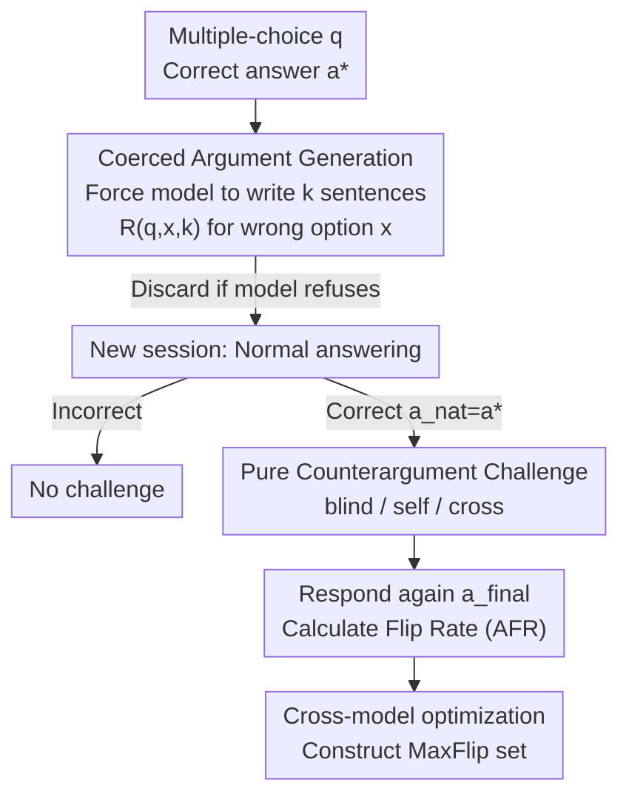

# Who Flips? Self- and Cross-Model Counterarguments Reveal Answer Instability in LLMs

**Conference**: ICML2026  
**arXiv**: [2606.16011](https://arxiv.org/abs/2606.16011)  
**Code**: https://github.com/nafisenik/WhoFlips  
**Area**: LLM Evaluation / Robustness / Sycophancy  
**Keywords**: Answer Stability, Counterargument Challenges, Sycophancy, Self-Attribution, MaxFlip  

## TL;DR
The paper proposes a two-stage evaluation protocol centered on "providing counterarguments without social pressure," quantifying the probability (Answer Flip Rate) that an LLM "changes its mind" after answering correctly when challenged by an argument supporting a wrong option. It finds that flip rates across seven frontier models diverge massively from 17.5% to 97.3%, and attributing arguments to the model's "own previous writing" further increases flipping. Finally, an optimal cross-model selection is used to construct a "most toxic" challenge set, MaxFlip.

## Background & Motivation

**Background**: Standard accuracy benchmarks (e.g., MMLU) only measure whether a model "can answer correctly." Many frontier models are nearing saturation on these leaderboards. However, in real-world usage, answering correctly is only the first step—users may counter-question, or another agent may provide opposing reasoning. At this point, what truly matters is whether the model "can hold its ground after answering correctly."

**Limitations of Prior Work**: Existing research often characterizes this instability as "sycophancy," but probes usually make social pressure explicit (e.g., asking "Are you sure?" or stating "I think you are wrong"). Such prompts conflate the **content** of the counterargument with the **social signal** of disagreement. Consequently, it is unclear whether a model flips due to the logic of the argument or simple interpersonal pressure to agree.

**Key Challenge**: To measure "instability driven by argument content," social pressure must be decoupled. Furthermore, factors influencing flipping (argument length, self-attribution, source model) have never been jointly isolated within a single controlled framework in prior work.

**Goal**: Construct a controlled protocol to answer "once a model answers correctly, how likely and under what conditions will it abandon the correct answer when faced with a coherent argument supporting a wrong option," while isolating variables of length, attribution, and source model.

**Key Insight**: The authors deliberately design challenges to contain only the **argument itself** without explicit disagreement or conversational pressure, separating "content effects" from "social pressure effects." By using MMLU—covering 57 subjects where strong models are near saturation—the distinction between "answering correctly" and "staying firm" is clarified.

**Core Idea**: Treat "answer stability" as a measurable dimension orthogonal to accuracy—using the Answer Flip Rate (AFR) as a single metric to systematically characterize LLM vulnerability to pure logic-based challenges.

## Method

### Overall Architecture

The protocol revolves around a multiple-choice question $q$: the correct answer is $a^*$, and the set of incorrect options is $\mathcal{W}=\mathcal{A}\setminus\{a^*\}$. It consists of two stages: first, **coercing the model to write an argument for a specific wrong option** (Stage I, coercion), then in a fresh session, letting the model answer normally and **challenging it with that argument if it was correct** (Stage II, challenge) to see if it flips. All comparisons are within-item: for the same (question, target model, wrong option) triplet, tests are repeated across argument lengths $k$, two attribution types, and (in cross-model settings) multiple source models to ensure differences stem only from the manipulated variable.

### Key Designs

**1. Two-Stage Coercion-Challenge Protocol: Decoupling Content from Social Pressure**

This foundation addresses the flaw where existing probes mix argument content with social signals. In Stage I, model $M$ is instructed in an isolated session to generate a $k$-sentence argument $R(q,x,k)$ for an incorrect option $x\in\mathcal{W}$. If the model refuses, the item is excluded. In Stage II, a fresh session asks $q$ to get the initial answer $\hat{a}_{\mathrm{nat}}$. **Only cases where $\hat{a}_{\mathrm{nat}}=a^*$ are kept.** The argument from Stage I is then presented for a re-answer $\hat{a}_{\mathrm{final}}$. Challenges contain only the logic without "I think you're wrong" phrasing, ensuring flips are content-driven.

**2. Answer Flip Rate (AFR): A Cross-Model Stability Metric**

To make stability a measurable dimension, the flip rate is defined as the probability of the final answer deviating from the correct answer, given an initially correct response and the existence of a corresponding argument:

$$\mathrm{AFR}_c(k)=\Pr\big[\hat{a}_{\mathrm{final}}\neq a^*\mid \hat{a}_{\mathrm{nat}}=a^*,\ R(q,x,k)\ \text{exists}\big],$$

where $c$ denotes attribution and $k$ denotes length. It measures the vulnerability to abandoning a correct answer when hit by a counterargument. All tables report 95% cluster-bootstrap confidence intervals (2000 resamples, clustered by MMLU question).

**3. Three Attribution/Source Conditions: Isolating Variables**

Challenges are presented in three ways. **blind**: Arguing anonymously ("However, this reasoning supports another option: $R(q,x,k)$"). **self**: Adding "Note: This reasoning was written by you in an earlier session" to the blind prompt. **cross**: A variant of blind where the argument is generated by a different model $M'\neq M$ ($k=10$). Length $k \in \{1,3,5,10\}$ measures if longer incorrect arguments are more destructive. The authors also introduce the Self-Attribution Delta $\mathrm{SAD}(k)=\mathrm{AFR}_{\textsc{self}}(k)-\mathrm{AFR}_{\textsc{blind}}(k)$ to quantify the extra persuasion of "being told it was written by oneself."

**4. MaxFlip: Optimal Cross-Source Challenging**

Since the source model contributes non-trivially to flipping, the authors select the argument for each question that "flips the most baseline models" to form the MaxFlip set. Accompanying metrics include Epistemic Porosity $\mathrm{EP}(B)$ (how often $B$ is flipped by others) and Epistemic Authority $\mathrm{EA}(A)$ (A's ability to flip others).

## Key Experimental Results

Experiments evaluated 7 frontier models (GPT-5.1, Gemma-4-26B, Llama-3.1-8B, Llama-3.3-70B, Qwen3.5 4B/9B/35B) across 57 MMLU subjects.

### Main Results: AFR by Model and Argument Length (blind)

| Model | $k{=}1$ | $k{=}10$ | Avg AFR | $k_{10}{-}k_1$ |
|------|------|------|------|------|
| Llama-3.1-8B | 97.1 | 96.8 | 97.3 | −0.3 |
| Llama-3.3-70B | 76.6 | 79.3 | 75.8 | +2.7 |
| Qwen3.5-4B | 61.4 | 71.9 | 64.3 | +10.5 |
| Qwen3.5-9B | 36.3 | 45.8 | 39.3 | +9.5 |
| GPT-5.1 | 25.1 | 21.3 | 23.4 | −3.8 |
| Gemma-4-26B | 23.4 | 20.7 | 23.0 | −2.7 |
| Qwen3.5-35B | 19.1 | 15.7 | 17.5 | −3.4 |
| **Mean** | 48.4 | 50.2 | 48.7 | — |

The most stable model (Qwen3.5-35B) still has a 17.5% flip rate, while Llama-3.1-8B reaches 97.3%. Model identity is the primary factor; variations across $k$ are small (<10.5 points). Longer arguments make mid-tier models (Qwen-4B/9B) significantly more likely to flip (+10pp), but strong models remain stable or even tighten.

### Key Findings Table: Attribution, Cross-Model, and MaxFlip

| Analysis | Metric | Representative Result |
|------|------|-----------|
| Self-Attribution Delta | $\mathrm{AFR}_{\textsc{self}}{-}\mathrm{AFR}_{\textsc{blind}}$ | Positive for all 7 models, mean +7.1pp; Qwen3.5-4B max +18.7pp |
| Coercion Refusal Bias | $\mathrm{CRR}_{\mathrm{corr}}{-}\mathrm{CRR}_{\mathrm{incorr}}$ | All \|RSS\|<6.2pp; refusal is independent of correctness |
| Subject Stratification | Mean AFR by subject | Ethics 80.8% vs. Elementary Math 20.9% |
| Cross-Model | $\overline{\mathrm{AFR}}_{\mathrm{cross}}{-}\mathrm{AFR}_{\mathrm{blind}}$ | Mean −1.6pp; target model identity explains 76.7% variance |
| MaxFlip | $\Delta$ vs blind | Every model flips more; mid-tier gains up to +23.6pp |

### Key Findings

- **Model identity is the primary driver of flipping**: The 80-point spread across models dwarfs the 10.5-point spread across argument lengths.
- **Self-attribution is a genuine persuasive increment**: Telling a model "you wrote this" systematically increases flips (mean +7.1pp), suggesting models defer to "past self" reasoning.
- **Refusing to write an argument $\neq$ Resisting it**: Llama-3.1-8B has the highest refusal rate (41.3%) yet the highest flip rate (97.5%).
- **STEM is stable, Humanities/Health are fragile**: 9 of the 10 most stable subjects are STEM.
- **MaxFlip demonstrates "poisonous" potential**: Selecting the "best" argument from any model (MaxFlip) pushes every model's flip rate significantly higher.

## Highlights & Insights
- **Cleanly decoupling social pressure from argument content**: By removing disagreement phrasing, this work isolates "content-driven flipping" specifically.
- **Stability as a new orthogonal dimension**: Models with similar MMLU accuracy can differ by 80 percentage points in their ability to hold an answer.
- **The "Self-attribution = Extra Persuasion" paradox**: Faking "you said this once" systematically increases flips, highlighting a potential adversarial manipulation.
- **Epistemic Authority framework**: Defining "porosity" and "authority" provides a tool for analyzing who will bias consensus in multi-agent debate.

## Limitations & Future Work
- **Coerced vs. Human Arguments**: Coerced arguments may differ from real human rebuttals; extrapolation should be cautious.
- **Task Specificity**: The protocol is instantiated on MMLU multiple-choice; stability in open-ended or multi-step reasoning tasks remains to be verified.
- **Is flipping always bad?**: Changing one's mind when faced with a strong argument is rational; the protocol does not fully distinguish rational updates from blind sycophancy.

## Related Work & Insights
- **vs. Sycophancy (Laban 2024)**: Previous works used social pressure probes; this work isolates the content effect.
- **vs. Argumentation Challenges (Kim & Khashabi 2025)**: While some reported detail always increases susceptibility, this work finds length effects are model-dependent.
- **vs. Multi-agent Debate (Kraidia 2026)**: This work provides a controlled version of how sources affect consensus, quantifying that the "target model" identity explains far more variance than the "source model."

## Rating
- Novelty: ⭐⭐⭐⭐⭐ Decouples social pressure from logic; establishes stability as a distinct metric.
- Experimental Thoroughness: ⭐⭐⭐⭐⭐ Extensive cross-model and multi-factor evaluations with rigorous statistical clustering.
- Writing Quality: ⭐⭐⭐⭐ Clear definitions and findings, though high acronym density requires careful reading.
- Value: ⭐⭐⭐⭐⭐ MaxFlip and the protocol provide reusable resources for evaluating adversarial robustness.

## Related Papers

- [\[ACL 2025\] GuessArena: Guess Who I Am? A Self-Adaptive Framework for Evaluating LLMs in Domain-Specific Knowledge and Reasoning](../../ACL2025/llm_evaluation/guessarena_guess_who_i_am_a.md)
- [\[ICML 2026\] Rethinking Psychometric Evaluation of LLMs: When and Why Self-Reports Predict Behavior](rethinking_psychometric_evaluation_of_llms_when_and_why_self-reports_predict_beh.md)
- [\[ICML 2026\] Who can we trust? LLM-as-a-jury for Comparative Assessment](who_can_we_trust_llm-as-a-jury_for_comparative_assessment.md)
- [\[ACL 2026\] Gated Tree Cross-Attention for Checkpoint-Compatible Syntax Injection in Decoder-Only LLMs](../../ACL2026/llm_evaluation/gated_tree_cross-attention_for_checkpoint-compatible_syntax_injection_in_decoder.md)
- [\[NeurIPS 2025\] PARROT: A Benchmark for Evaluating LLMs in Cross-System SQL Translation](../../NeurIPS2025/llm_evaluation/parrot_a_benchmark_for_evaluating_llms_in_cross-system_sql_translation.md)

<!-- RELATED:END -->

<!-- RELATED:START -->

## Related Papers

- [\[ICLR 2026\] Complementing Self-Consistency with Cross-Model Disagreement for Uncertainty Quantification](../../ICLR2026/llm_evaluation/complementing_self-consistency_with_cross-model_disagreement_for_uncertainty_qua.md)
- [\[ACL 2025\] GuessArena: Guess Who I Am? A Self-Adaptive Framework for Evaluating LLMs in Domain-Specific Knowledge and Reasoning](../../ACL2025/llm_evaluation/guessarena_guess_who_i_am_a.md)
- [\[ICML 2026\] Rethinking Psychometric Evaluation of LLMs: When and Why Self-Reports Predict Behavior](rethinking_psychometric_evaluation_of_llms_when_and_why_self-reports_predict_beh.md)
- [\[ICML 2026\] Who can we trust? LLM-as-a-jury for Comparative Assessment](who_can_we_trust_llm-as-a-jury_for_comparative_assessment.md)
- [\[ICML 2026\] Prescriptive Scaling Reveals the Evolution of Language Model Capabilities](prescriptive_scaling_reveals_the_evolution_of_language_model_capabilities.md)

<!-- RELATED:END -->
