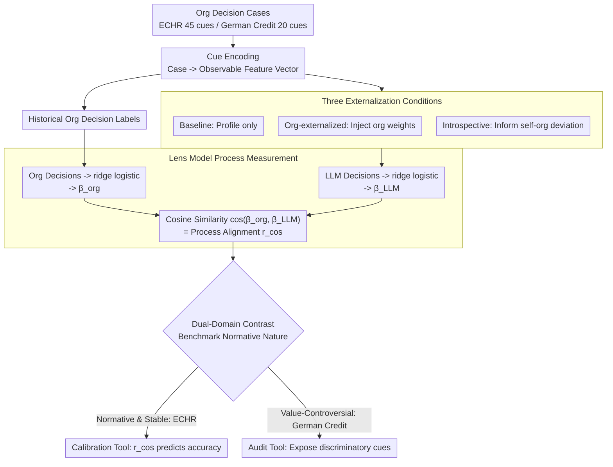

# Whose Alignment? Comparing LLM Process Alignment Across Diverse Organizational Decision Contexts

**Conference**: ICML2026  
**arXiv**: [2605.25256](https://arxiv.org/abs/2605.25256)  
**Code**: No public code available  
**Area**: LLM Evaluation / Alignment Assessment / Organizational Decision-Making  
**Keywords**: pluralistic alignment, process alignment, Brunswik lens model, organizational decision-making, fairness auditing  

## TL;DR
This paper proposes CALM to evaluate whether LLMs align with the actual decision-making processes of organizations rather than just output labels. By comparing ECHR legal adjudication with German Credit lending decisions, it demonstrates that process alignment predicts accuracy in stable normative domains, whereas in value-controversial domains, high process alignment is both difficult to achieve and not necessarily desirable.

## Background & Motivation
**Background**: LLM alignment is typically described as making models conform to "human preferences" or the behaviors of a target organization. However, in reality, organizations are not monolithic value sources. Courts, banks, hospitals, and corporations have established different institutional experiences, historical conventions, and implicit judgment patterns. These inter-organizational value differences constitute a pluralistic alignment problem.

**Limitations of Prior Work**: Common evaluations only examine whether the output is correct, such as whether a judgment matches a court's or if credit approval matches historical labels. The issue is that models might reach the correct answer for the wrong reasons or align with historical data by chance on current distributions while using entirely different cue weighting for unseen cases. Output accuracy fails to indicate whether the model has truly learned the organization's decision policy.

**Key Challenge**: Organizational alignment is not just about "outputting like an organization" but "weighing information like an organization." However, organizational decision policies can be legitimate, stable, and publicly explicable, or they can be historically shaped, discriminatory, or morally contentious. Thus, process alignment itself becomes a normative question: which organization, which period, and which set of value standards should the model align with.

**Goal**: The paper aims to construct a process-level measurement to directly estimate how organizations and LLMs respectively use observable cues and compare whether their cue-weighting policies are consistent. The authors also aim to prove that this metric serves different purposes across contexts: as a calibration tool in legally normative scenarios and as an auditing tool in controversial scenarios.

**Key Insight**: Borrowing from the Brunswik Lens Model, the authors treat decision-making as a linear combination of observable cues. By fitting ridge logistic regressions to historical organizational decisions and LLM outputs separately, they obtain policy coefficient vectors and use cosine similarity to measure process alignment.

**Core Idea**: Infer cue-utilization policies from actual inputs and outputs to compare the similarity in "how decisions are made" between LLMs and organizations, rather than merely comparing final decision labels.

## Method
The proposed CALM (Contextualized Alignment Lens Model) is essentially a behavioral auditing framework. It does not require access to model weights or rely on the honesty of chain-of-thought; it only requires the same batch of cases, the same set of interpretable cues, organizational benchmark decisions, and LLM decisions.

### Overall Architecture
First, each organizational decision case is encoded into a set of cues. For ECHR Article 6 cases, this involves 45 binary features covering cue families like Delay, Counsel, EvidenceAndArms, and TribunalIntegrity. For German Credit, it involves 20 features such as loan duration, amount, age, employment, housing, gender/marital status, and foreign_worker.

Second, a ridge logistic regression is fitted based on historical organizational decisions to obtain the organizational policy vector $\beta_{org}$. Similarly, a ridge logistic regression is fitted for all decisions made by an LLM under a specific prompting condition to obtain $\beta_{LLM}$. Third, $\cos(\theta)=\frac{\beta_{org}\cdot\beta_{LLM}}{\|\beta_{org}\|\|\beta_{LLM}\|}$ is used as the process alignment score.

The paper tests three conditions: Baseline (structured case profile only); Org-externalized (explicitly including organizational cue weighting policy in the prompt); and Introspective-externalized (informing the model of the deviation between its baseline policy and the organizational policy and requesting self-correction). Metrics including cosine alignment, output accuracy, AUC, Cohen's kappa, and propensity correlation are then compared. The pipeline is visualized below:

### Key Designs

**1. Lens Model Process Measurement: Inferring policy from behavior without trusting explanatory text**

The first difficulty CALM addresses is "knowing how the model actually weighs information." Directly asking the model or reading its chain-of-thought (CoT) is unreliable—CoT can be unfaithful, and human-like explanations are often post-hoc rationalizations. The paper adopts a purely behavioral approach: encoding each case into a set of observable cues and fitting the same ridge logistic regression to both historical organizational labels and LLM decisions. This yields two coefficient vectors, $\beta_{org}$ and $\beta_{LLM}$, where each coefficient represents the direction and intensity of cue utilization. Policy alignment is measured by cosine similarity $\cos(\theta)$, which ranges from $[-1,1]$, where 1 denotes full alignment and negative values denote opposition. This estimates the "behavioral ground truth" of the model across a batch of cases, independent of any single reasoning trace or model weights, making it suitable for black-box process auditing.

**2. Three Externalization Conditions: Testing if organizational knowledge can be faithfully steered**

Measuring alignment scores is insufficient; the authors want to know "if the organizational policy is explicitly provided, can the model move toward that decision process"—a core part of steerable pluralism in pluralistic alignment. Three progressive prompting conditions are designed: Baseline provides only the structured profile, exposing implicit policies from pre-training; Org-externalized categorizes organizational regression weights (strong/moderate/weak) and includes them in the prompt to see if explicit knowledge can fill the gap; Introspective-externalized informs the model of its overall deviation from the organization and asks for self-correction. Each condition involves re-fitting $\beta_{LLM}$ and re-calculating $r_{cos}$, using bootstrap permutation (1,000 shuffles) for significance testing. This provides a measurable standard for "faithful steering": steering is not about surface-level output imitation but moving the cue-weighting policy toward the target organization.

**3. Contrasting Two Domains with Different Normative Natures: Process alignment is not a monolithic goal**

Testing only in a "clean" domain might lead to a universal conclusion that "high alignment = good." The paper deliberately selects two domains with opposing normative properties: ECHR Article 6 is relatively stable and publicly explicable, with cue weights reflecting accumulated jurisprudence. In contrast, German Credit comes from historical 1990s German bank decisions, containing protected attributes like age, sex, and foreign_worker status, potentially encoding discriminatory practices now partially overturned by anti-discrimination laws. By examining the relationship between process alignment and accuracy in both domains, CALM reveals its dual role: as a "calibration tool" in normative domains (higher alignment leads to higher accuracy) and as an "auditing tool" in controversial domains (making weightings on sensitive attributes visible/questionable without mandating faithful replication). This contrast is the core pluralistic finding: being measurable and steerable does not equate to a requirement for alignment.

### Loss & Training
CALM is not a training method but an evaluation/auditing framework. The core estimator is ridge-regularized logistic regression; significance is tested via bootstrap permutation (1,000 shuffles). The ECHR study tests 10 models across 3 prompting conditions over 1,000 cases. The German Credit study tests 5 models across conditions using 600 balanced cases, with a normative logistic regression upper bound of 75.1% accuracy / 0.751 AUC.

## Key Experimental Results

### Main Results
The comparison between the two experiments is the most critical result. In ECHR, process alignment and output accuracy are strongly correlated; in German Credit, this relationship nearly disappears.

| Domain | Data & Models | Process Alignment - Accuracy Relationship | Nature of Org Benchmark | Main Conclusion |
| :--- | :--- | :--- | :--- | :--- |
| ECHR Article 6 | 1,000 cases, 10 LLMs, 3 conditions | $r=0.85$, $p<.001$ | Stable, public, jurisprudential standards | Higher process alignment leads to higher accuracy; externalization helps low-alignment models |
| German Credit | 600 cases, 5 LLMs, 2-3 conditions | $r=0.15$, $p=.60$ | Historical bank decisions with potential discrimination | Process alignment is orthogonal to accuracy; high alignment is not necessarily a justified goal |

In the ECHR baseline, $r_{cos}$ varies significantly across models: GPT-5.4-mini at 0.844, Grok 4.1 Fast at 0.842, GPT-5.4 at 0.824; whereas Mistral Large is 0.083, DeepSeek-v3.2 is 0.062, Claude Haiku 4.5 is -0.057, and GPT-5.4-nano is -0.211. Organizational externalization helps low-alignment models the most (e.g., GPT-5.4-nano increases by +0.906).

German Credit baselines show a completely different pattern. All five models achieve only 44-54% accuracy, far below the 75.1% logistic ceiling, yet their cue policies differ greatly.

| Model | Baseline $r_{cos}$ | Acc | AUC | Good% | Observation |
| :--- | :--- | :--- | :--- | :--- | :--- |
| Claude Haiku 4.5 | +0.503 | 53.5 | 0.930 | 9.2 | Mostly predicts "Bad"; high AUC but outlier policy/threshold |
| GPT-5.4-mini | +0.060 | 48.3 | 0.961 | 68.0 | Closest to historical 70% Good base rate |
| GPT-5.4-nano | +0.499 | 44.2 | 0.936 | 50.5 | High alignment but low accuracy |
| Grok 4.1 Fast | -0.229 | 48.8 | 0.882 | 37.5 | Negative alignment but similar accuracy to others |
| DeepSeek-v3.2 | +0.264 | 52.5 | 0.925 | 5.5 | Extremely conservative; almost all "Bad" |

### Ablation Study

| Intervention | ECHR Effect | German Credit Effect | Description |
| :--- | :--- | :--- | :--- |
| Org-externalized | 8/10 models move toward org policy; low-alignment models improve significantly | 2 models improve, 3 decline; unstable on average | Stable norms can be prompted; controversial ones might not |
| Introspective externalized | 6/10 models show point estimate improvement; Grok 4.1 Fast degrades by -0.346 | 3/4 evaluable models decline | Self-correction feedback may disrupt good implicit policies |
| German Credit Grok introspective | N/A | 99.5% cases predicted as "Good" | Model interprets base-rate feedback as a hard rule, causing over-correction |
| Protected attribute analysis | Legal cues consistent with jurisprudence | Conflict between cues like foreign_worker/age/sex and fairness norms | CALM exposes weighting differences on sensitive attributes |

### Key Findings
- In domains like ECHR where norms are clear, process alignment serves as a calibration target: models that use cues more like a court produce more accurate outputs.
- In domains like German Credit where history or fairness is controversial, process alignment is an audit signal: it shows if the model replicates historical bank policies without deciding if it *should*.
- Output accuracy masks policy differences. In German Credit, "Good" rates varied from 5.5% to 68.0% while accuracy remained stuck around 48-54%, showing that similar metric results can stem from completely different valuations.
- Models may actively resist organizational policy signals regarding protected attributes. Claude used foreign_worker heavily in baseline but ignored age/sex; interventions were unstable, reflecting conflicts between safety/fairness training alignment and historical organizational policies.

## Highlights & Insights
- The most valuable contribution is the framing of "whose alignment." Organizations are not naturally correct value targets; historical policies, public norms, and current regulations often clash.
- The black-box behavioral measurement of CALM is practical. It does not rely on CoT or internal representations; as long as the model can be queried in batch with cue encoding, the process policy can be estimated.
- The dual-domain contrast is powerful. ECHR proves the calibration value of process alignment, while German Credit prevents readers from misunderstanding alignment as a universal good.
- High implications for regulation. Acts like the EU AI Act require transparency and human oversight in high-risk AI, yet most audits focus on accuracy/disparity; CALM provides a third dimension of "whether the decision was reached in the correct way."

## Limitations & Future Work
- The Lens Model uses linear cue weighting as a process proxy, which is good for auditing but might miss non-linear interactions, context dependencies, and exception rules in LLM or organizational logic.
- Cue encoding quality is critical. ECHR cues were encoded by GPT-5.4-mini; systematic bias in cue extraction would affect alignment estimation.
- German Credit was tested on fewer models (5); the authors acknowledge a full replication should cover the same breadth as ECHR.
- CALM exposes potential discrimination in historical policies but cannot decide which normative goal should be aligned with. Actual deployment requires legal, ethical, and governance decisions to set the benchmark.

## Related Work & Insights
- **vs RLHF/Preference Alignment**: RLHF often aggregates preferences toward a single consensus; CALM focuses on organizational steerable pluralism—whether a model can follow a specific organizational process when directed.
- **vs Output Accuracy Evaluation**: Accuracy/AUC only looks at results; CALM estimates the process. German Credit results show that similar accuracy can coexist with vastly different policies.
- **vs Fairness Metrics**: Demographic parity measures outcome differences; CALM checks if protected attributes are weighted during the process, providing process-layer evidence for fairness audits.
- **vs CoT Auditing**: CoT may be unfaithful; CALM's behavioral inference of cue policy is a more robust black-box auditing tool.

## Rating
- Novelty: ⭐⭐⭐⭐☆ Introducing the Brunswik Lens Model for process alignment is highly distinctive.
- Experimental Thoroughness: ⭐⭐⭐⭐☆ Comparative domains are clear; German Credit scale could be expanded.
- Writing Quality: ⭐⭐⭐⭐☆ Logical argumentation and socio-technical implications are well-articulated.
- Value: ⭐⭐⭐⭐⭐ Direct implications for deployment in high-risk sectors, organizational alignment, and fairness auditing.

<!-- RELATED:START -->

## Related Papers

- [\[NeurIPS 2025\] On Evaluating LLM Alignment by Evaluating LLMs as Judges](../../NeurIPS2025/llm_evaluation/on_evaluating_llm_alignment_by_evaluating_llms_as_judges.md)
- [\[NeurIPS 2025\] Leveraging Robust Optimization for LLM Alignment under Distribution Shifts](../../NeurIPS2025/llm_evaluation/leveraging_robust_optimization_for_llm_alignment_under_distribution_shifts.md)
- [\[NeurIPS 2025\] ComPO: Preference Alignment via Comparison Oracles](../../NeurIPS2025/llm_evaluation/compo_preference_alignment_via_comparison_oracles.md)
- [\[NeurIPS 2025\] Beyond the Surface: Enhancing LLM-as-a-Judge Alignment with Human via Internal Representations](../../NeurIPS2025/llm_evaluation/beyond_the_surface_enhancing_llm-as-a-judge_alignment_with_human_via_internal_re.md)
- [\[ICML 2026\] Multi$^2$: Hierarchical Multi-Agent Decision-Making with LLM-Based Agents in Interactive Environments](multi2_hierarchical_multi-agent_decision-making_with_llm-based_agents_in_interac.md)

<!-- RELATED:END -->
