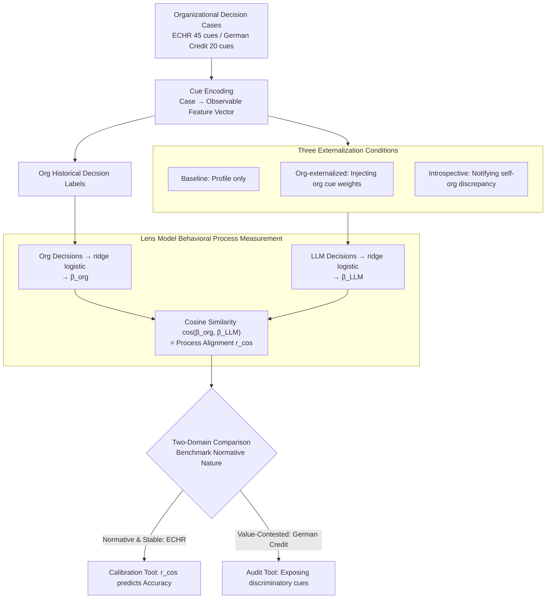

# Whose Alignment? Comparing LLM Process Alignment Across Diverse Organizational Decision Contexts

**Conference**: ICML2026  
**arXiv**: [2605.25256](https://arxiv.org/abs/2605.25256)  
**Code**: Code not available  
**Area**: LLM Evaluation / Alignment Assessment / Organizational Decision-Making  
**Keywords**: pluralistic alignment, process alignment, Brunswik lens model, organizational decision-making, fairness auditing  

## TL;DR
This paper proposes CALM to evaluate whether LLMs align with the actual decision-making processes of organizations rather than just output results. Through a comparison between ECHR legal adjudication and German Credit decision-making, it demonstrates that in normatively stable domains, process alignment predicts accuracy, whereas in value-contested domains, high process alignment is both difficult to achieve and may not be desirable.

## Background & Motivation
**Background**: LLM alignment is typically described as making models conform to "human preferences" or the behavior of a target organization. However, in reality, organizations are not monolithic sources of value. Courts, banks, hospitals, and corporations have established different institutional experiences, historical conventions, and implicit judgment patterns. These inter-organizational value differences constitute a pluralistic alignment problem.

**Limitations of Prior Work**: Common evaluations focus only on whether the output is correct, such as whether a judgment matches a court's or if credit approval aligns with historical labels. The issue is that a model might arrive at the correct answer for the wrong reasons, or it may happen to be accurate on the current distribution while making decisions based on entirely different cue weighting for unseen cases. Output accuracy does not reveal whether the model has actually learned the organization's decision policy.

**Key Challenge**: Organizational alignment is not merely "outputting like an organization" but "weighing information like an organization." Yet, organizational decision policies are sometimes legitimate, stable, and publicly accountable, while at other times, they are historically formed and contain discriminatory or morally contested elements. Thus, process alignment itself becomes a normative question: which organization, which period, and which set of value standards should the model align with?

**Goal**: The paper aims to construct a process-level measurement to directly estimate how organizations and LLMs respectively use observable cues and compare whether their cue-weighting policies are consistent. The authors also intend to prove that this metric serves different purposes across various organizational decision contexts: as a calibration tool in scenarios with clear legal norms and as an auditing tool in contested scenarios.

**Key Insight**: The authors borrow the Brunswik Lens Model, viewing decisions as a linear combination of observable cues. By fitting ridge logistic regression to both historical organizational decisions and LLM outputs, policy coefficient vectors are obtained, and cosine similarity is used to measure process alignment.

**Core Idea**: Infer cue-utilization policies from actual model inputs and outputs to compare the similarity between LLMs and organizations regarding "how decisions are made," rather than solely comparing final decision labels.

## Method
The proposed Contextualized Alignment Lens Model (CALM) is essentially a behavioral auditing framework. It does not require access to model weights or rely on the honesty of chain-of-thought; it only requires the same set of cases, the same interpretable cues, organizational benchmark decisions, and LLM decisions.

### Overall Architecture
First, a set of cues is encoded for each organizational decision case. In ECHR Article 6 cases, this includes 45 binary features covering jurisprudence-related cue families such as Delay, Counsel, EvidenceAndArms, and TribunalIntegrity. In German Credit, it involves 20 credit features such as loan duration, amount, age, employment, housing, gender/marital status, and foreign_worker.

Second, a ridge logistic regression is fitted based on organizational benchmark decisions to obtain the organizational policy vector $\beta_{org}$. Similarly, ridge logistic regression is fitted for all decisions made by an LLM under a specific prompting condition to obtain $\beta_{LLM}$. Third, $\cos(\theta)=\frac{\beta_{org}\cdot\beta_{LLM}}{\|\beta_{org}\|\|\beta_{LLM}\|}$ is used as the process alignment score.

Common evaluations test three conditions: Baseline (providing only the structured case profile); Org-externalized (explicitly writing the organizational cue weighting policy into the prompt); and Introspective-externalized (informing the model of the deviation between its own baseline policy and the organizational policy and requesting self-correction). Subsequently, metrics such as cosine alignment, output accuracy, AUC, Cohen's kappa, and propensity correlation are compared. The overall pipeline is visualized as follows:

### Key Designs

**1. Lens Model Behavioral Process Measurement: Inferring policy from behavior without trusting explanatory text**

The first challenge CALM solves is "how to know how the model actually weighs information." Directly asking the model or reading its chain-of-thought (CoT) is unreliable—CoT can be unfaithful, and human-like explanations are often post-hoc rationalizations. The paper adopts a purely behavioral route: encoding each case into the same set of observable cues and then fitting the same ridge logistic regression to the organization's historical labels and an LLM's total decisions under a certain condition. This yields two coefficient vectors, $\beta_{org}$ and $\beta_{LLM}$, where each coefficient represents the direction and intensity of use for the corresponding cue. Policy alignment is measured by cosine similarity $\cos(\theta)=\frac{\beta_{org}\cdot\beta_{LLM}}{\|\beta_{org}\|\|\beta_{LLM}\|}$, ranging from $[-1,1]$, where 1 denotes perfect alignment, 0 denotes orthogonality, and negative values denote opposition. This estimates the "behavioral ground truth" of the model across a batch of cases, independent of any single reasoning trace or model weights, making it naturally suited for black-box process auditing.

**2. Three Conditions of Externalization: Testing if organizational knowledge can be faithfully steered**

Measuring alignment scores alone is insufficient; the paper seeks to determine "if the organizational policy is explicitly provided, can the model truly move toward that decision process"—a core issue of steerable pluralism in pluralistic alignment. Three progressive prompting conditions were designed: Baseline, which only provides structured case profiles, exposing implicit policies from pre-training; Org-externalized, which categorizes organizational regression weights into strong/moderate/weak and describes their directions in the prompt to test if "externalizing implicit knowledge" can bridge the knowledge gap; and Introspective-externalized, which informs the model of its baseline policy's overall deviation from the organization and requests self-correction. For each condition, $\beta_{LLM}$ is refitted, $r_{cos}$ is recalculated, and significance testing is performed via bootstrap permutation (1,000 shuffles). Crucially, this provides a measurable standard for "faithful steering": steering is not superficial output imitation but rather the cue-weighting policy truly converging toward the target organization.

**3. Comparison of Two Normatively Distinct Domains: Process alignment is not a singular "good" goal**

Testing in only one "clean" domain might mistakenly lead to the conclusion that "high alignment = good." The paper deliberately selects two organizational domains with opposite normative properties for comparison: ECHR Article 6 is a relatively stable and publicly accountable legal domain where cue weights represent cumulative jurisprudence; German Credit comes from historical credit decisions of a German bank in the 1990s, where 20 cues include protected attributes like age, personal_status_sex, and foreign_worker, potentially encoding discriminatory practices partially overturned by anti-discrimination laws. By examining the relationship between process alignment and accuracy, as well as the effectiveness of externalization in both domains, CALM's dual role is exposed—acting as a "calibration tool" in normative domains (where higher alignment leads to better accuracy) and as an "auditing tool" in contested domains (making the model/organization's weightings of sensitive attributes visible and questionable without mandating faithful replication of those policies). This comparison is the paper’s core pluralistic finding: being measurable and steerable does not mean something *should* be aligned.

### Loss & Training
CALM is an evaluation/auditing methodology rather than a training method. The core estimator is ridge-regularized logistic regression; significance is tested via bootstrap permutation (1,000 shuffles). The ECHR study tested 10 models across 3 prompting conditions on 1,000 Article 6 cases; the German Credit study tested 5 models across 2-3 conditions on a balanced subset of 600 cases, using 75.1% accuracy / 0.751 AUC from a normative logistic regression as the historical benchmark upper bound.

## Key Experimental Results

### Main Results
The comparison between the two experiments is the most critical result. In ECHR, process alignment and output accuracy are strongly correlated; in German Credit, this relationship almost disappears.

| Domain | Data & Models | Process Alignment-Accuracy Correlation | Benchmark Nature | Main Conclusion |
|------|------------|---------------------|-------------------|----------|
| ECHR Article 6 | 1,000 cases, 10 LLMs, 3 conditions | $r=0.85$, $p<.001$ | Stable, public, jurisprudential standards | Higher process alignment leads to higher accuracy; externalization helps low-alignment models |
| German Credit | 600 balanced cases, 5 LLMs, 2-3 conditions | $r=0.15$, $p=.60$ | Historical bank decisions with potential bias | Process alignment is orthogonal to accuracy; high alignment is not necessarily a justified goal |

In the ECHR baseline, $r_{cos}$ varied significantly across models: GPT-5.4-mini at 0.844, Grok 4.1 Fast at 0.842, GPT-5.4 at 0.824; whereas Mistral Large was at 0.083, DeepSeek-v3.2 at 0.062, Claude Haiku 4.5 at -0.057, and GPT-5.4-nano at -0.211. Organizational externalization was most helpful for low-alignment models, e.g., GPT-5.4-nano (+0.906), Claude Haiku 4.5 (+0.682), and Minimax M2.7 (+0.176).

The German Credit baseline showed a completely different pattern. The accuracy of all five models ranged between 44-54%, far below the normative logistic ceiling of 75.1%, yet cue policies differed vastly.

| Model | Baseline $r_{cos}$ | Acc | AUC | Good% | Observation |
|------|--------------------|-----|-----|-------|------|
| Claude Haiku 4.5 | +0.503 | 53.5 | 0.930 | 9.2 | Mostly judged as Bad; high AUC but abnormal threshold/policy |
| GPT-5.4-mini | +0.060 | 48.3 | 0.961 | 68.0 | Closest to historical 70% Good base rate |
| GPT-5.4-nano | +0.499 | 44.2 | 0.936 | 50.5 | High alignment but low accuracy |
| Grok 4.1 Fast | -0.229 | 48.8 | 0.882 | 37.5 | Negative alignment but accuracy similar to others |
| DeepSeek-v3.2 | +0.264 | 52.5 | 0.925 | 5.5 | Extremely conservative, mostly judged as Bad |

### Ablation Study
| Intervention | ECHR Effect | German Credit Effect | Explanation |
|------|----------|-------------------|------|
| Org-externalized | 8/10 models moved toward org policy; significant gain for low-alignment models | 2 models improved, 3 declined; unstable on average | Stable norms can be externalized via prompts; contested norms cannot necessarily |
| Introspective externalized | Point estimates improved for 6/10 models, but Grok 4.1 Fast degraded -0.346 | Decreased in 3 out of 4 evaluable models | Self-correction feedback may disrupt otherwise good implicit policies |
| German Credit Grok introspective | N/A | 99.5% cases judged as Good | Model treated base-rate feedback as a hard rule, leading to pathologically over-corrected behavior |
| Protected attribute analysis | Legal cues relatively consistent with jurisprudence | Conflict between cues like foreign_worker, age, sex and fairness norms | CALM exposes weighting differences on sensitive attributes between models and organizations |

### Key Findings
- In normatively clear domains like ECHR, process alignment serves as a calibration target: the more the model uses cues like the court, the more likely it is to produce correct outputs.
- In domains with contested history or fairness issues like German Credit, process alignment functions more as an audit signal: it identifies if a model replicates historical bank policies without dictating whether doing so is optimal.
- Output accuracy masks policy differences. In German Credit, Good% ranged from 5.5% to 68.0%, but accuracy remained near 44-54%, indicating that similar output metrics can hide completely different implementations of organizational values.
- Models may actively resist organizational policy signals regarding protected attributes. Claude heavily weighted foreign_worker in the baseline while ignoring age/sex; it remained unstable after intervention, reflecting conflicts between safety/fairness norms from pre-training and historical organizational policies.

## Highlights & Insights
- The paper’s greatest value lies not in proposing a new alignment score but in explicitly raising the question of "whose alignment." Organizations are not naturally correct value targets; historical policies, public norms, and contemporary regulations may conflict.
- CALM’s black-box behavioral measurement is highly practical. It does not rely on CoT or internal representations; as long as the model can be queried in batch and cues can be encoded, the process policy can be estimated.
- The two-domain comparison design is powerful. ECHR proves the calibration value of process alignment, while German Credit prevents readers from misinterpreting high alignment as a universal good.
- There are significant regulatory implications. Regulations like the EU AI Act require transparency and human oversight in high-risk AI, yet many evaluations still focus on accuracy/fairness parity. CALM provides a third auditing dimension: "whether the decision was reached in the correct manner."

## Limitations & Future Work
- The lens model uses linear cue weighting as a process proxy, which is suitable for explanatory auditing but may miss non-linear interactions, context dependencies, and exception rules in LLM or organizational decision-making.
- Cue encoding quality is critical. ECHR cues were encoded by GPT-5.4-mini according to a codebook; systematic bias in cue extraction would affect subsequent alignment estimates.
- German Credit only tested 5 models, and some conditions were missing; the authors acknowledge that a full replication should cover all models used in ECHR.
- CALM can expose potential discrimination in historical policies but cannot automatically determine which normative goal should be aligned with. Real-world deployment still requires legal, ethical, and organizational governance to decide on the benchmark.
- The authors suggest future work should compare behavioral cue weights with explicit mentions of cues in reasoning. This is important as a model might weigh certain cues behaviorally while citing a different set in its explanations.

## Related Work & Insights
- **vs. RLHF/Preference Alignment**: RLHF often learns aggregated preferences and tends toward a single consensus; CALM focuses on organizational-level steerable pluralism—whether a model actually weighs information according to a specific organizational policy when instructed.
- **vs. Output Accuracy Evaluation**: Accuracy/AUC only look at results; CALM estimates the process. German Credit results show that similar accuracy can mask entirely different implicit policies.
- **vs. Fairness Metrics**: Metrics like demographic parity look at group outcome differences; CALM looks at whether protected attributes are weighted during the decision process, providing process-level evidence for fairness auditing.
- **vs. Chain-of-Thought Auditing**: CoT may be unfaithful; CALM infers cue policy directly from batch behavior, serving as a more robust black-box process auditing tool.

## Rating
- Novelty: ⭐⭐⭐⭐☆ Introducing the Brunswik Lens Model to organizational LLM process alignment is distinctive, and the problem framing is excellent.
- Experimental Thoroughness: ⭐⭐⭐⭐☆ The comparison between two domains is clear, with reasonable model and condition coverage; expansion of the German Credit replication scale is possible.
- Writing Quality: ⭐⭐⭐⭐☆ Logical argumentation is clear, and sociotechnical implications are thoroughly addressed; some model naming and data settings are dense.
- Value: ⭐⭐⭐⭐⭐ Highly instructive for high-risk AI deployment, organizational alignment, and fairness auditing, especially the reminder that "who to align with" is itself a governance problem.

<!-- RELATED:START -->

## Related Papers

- [\[NeurIPS 2025\] On Evaluating LLM Alignment by Evaluating LLMs as Judges](../../NeurIPS2025/llm_evaluation/on_evaluating_llm_alignment_by_evaluating_llms_as_judges.md)
- [\[NeurIPS 2025\] Leveraging Robust Optimization for LLM Alignment under Distribution Shifts](../../NeurIPS2025/llm_evaluation/leveraging_robust_optimization_for_llm_alignment_under_distribution_shifts.md)
- [\[NeurIPS 2025\] ComPO: Preference Alignment via Comparison Oracles](../../NeurIPS2025/llm_evaluation/compo_preference_alignment_via_comparison_oracles.md)
- [\[NeurIPS 2025\] Beyond the Surface: Enhancing LLM-as-a-Judge Alignment with Human via Internal Representations](../../NeurIPS2025/llm_evaluation/beyond_the_surface_enhancing_llm-as-a-judge_alignment_with_human_via_internal_re.md)
- [\[ICML 2026\] Multi$^2$: Hierarchical Multi-Agent Decision-Making with LLM-Based Agents in Interactive Environments](multi2_hierarchical_multi-agent_decision-making_with_llm-based_agents_in_interac.md)

<!-- RELATED:END -->
