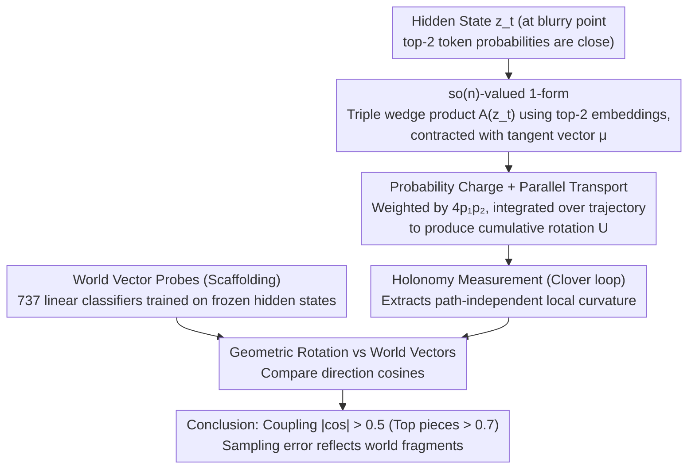

# A Geometric Relation of the Error Introduced by Sampling a Language Model's Output Distribution to its Internal State

**Conference**: ICML 2026  
**arXiv**: [2605.04899](https://arxiv.org/abs/2605.04899)  
**Code**: See supplemental material  
**Area**: LLM Interpretability / NLP  
**Keywords**: Sampling error, differential geometry, parallel transport, world models, chess

## TL;DR
This paper characterizes the information loss introduced by sampling from high-entropy distributions in GPT-style LLMs from a differential geometry perspective. By constructing $\mathfrak{so}(n)$-valued 1-forms and parallel transport operators, it demonstrates through chess probe experiments that these geometric rotations align highly with the model’s learned world vectors.

## Background & Motivation

**Background**: Autoregressive LLMs generate tokens via greedy or stochastic decoding. When the output distribution is concentrated (high confidence), sampling error is negligible; when the distribution is dispersed ("blurry points"), different samples lead to significantly diverging trajectories.

**Limitations of Prior Work**: The sensitivity of LLMs to single-token perturbations is well-known, but the internal structure of this sensitivity remains uncharacterized—is it merely chaotic exponential divergence, or does it reflect the model's internal geometric properties?

**Key Challenge**: The relationship between internal states $z_t \in \mathbb{R}^n$ and the output distribution (discrete probabilities) via projection, softmax, and sampling is highly nonlinear. A unified geometric framework is needed to describe this "Internal → External → Internal Feedback" coupling.

**Goal**: Establish a verifiable relationship between the geometric properties of internal blurry points and the world vectors obtained through probing.

**Key Insight**: Modeling sampling uncertainty as a vector measure on a manifold using differential geometry, "injecting" uncertainty into geometric actions via wedge products and parallel transport.

**Core Idea**: Parameterize blurring intensity as a triple wedge product $A(z_t) = 4 z_t \wedge (p_1 v_1) \wedge (p_2 v_2)$. By contracting with tangent vectors, an $\mathfrak{so}(n)$-valued 1-form is obtained; its parallel transport imposes verifiable rotations in the hidden space that couple with the directions of world vectors.

## Method

### Overall Architecture

The study investigates whether sampling error at "blurry points" (dispersed distributions) is directional or chaotic. By translating sampling uncertainty into differential geometry, the authors use top-2 token embeddings and probabilities to construct an anti-symmetric tensor ($\mathfrak{so}(n)$-valued 1-form) acting on the hidden space. This uncertainty is "integrated" along the generation trajectory via a parallel transport operator to measure cumulative rotation. Finally, chess probe experiments test if these geometric rotations align with the model's learned world vectors.

### Key Designs

**1. $\mathfrak{so}(n)$-valued 1-form: Converting scalar uncertainty into directional geometric action**

Sampling uncertainty is typically a scalar (higher entropy implies more error). To preserve directional information, the authors use a triple wedge product $A(z_t) = 4\, z_t \wedge (p_1 v_1) \wedge (p_2 v_2)$, where $z_t\in\mathbb{R}^n$ is the current hidden state, $v_1,v_2$ are top-2 token embeddings, and $p_1,p_2$ are their probabilities. Its Frobenius norm $\|A\|_F$ measures the degree to which $z_t$ falls within the plane spanned by the top tokens. Contracting this with a tangent vector $\mu$ yields $A_\mu(z_t) = 4 p_1 p_2 \big(-(\mu\cdot v_1)(z_t \wedge v_2) + (\mu \cdot v_2)(z_t \wedge v_1)\big)$, which is an anti-symmetric matrix—an element of the $\mathfrak{so}(n)$ Lie algebra (rotation generator). This encodes "which plane to rotate in and how much."

**2. Probability Charge and Parallel Transport: Integrating local rotations into cumulative rotation**

The coefficient $4 p_1 p_2$ is termed "probability charge," analogous to coupling strength in electromagnetism. It approaches 0 when confidence is high ($p_2 \to 0$) and reaches 1 at maximum uncertainty ($p_1=p_2=0.5$). Guided by the 1-form, parallel transport along a trajectory $\gamma$ is calculated using the path-ordered exponential $U_\gamma = P\exp\big(-\int_0^1 A_{\dot\gamma(s)}(\gamma(s))\,ds\big)$. $U_\gamma$ measures how much the hidden state rotates as it traverses uncertain regions, providing a physical correspondence where geometric curvature carries information loss.

**3. Holonomy Measurement: Extracting local curvature via closed clover loops**

Since LLMs only follow specific generated trajectories, arbitrary translation for parallel transport is impossible. The authors adapt a lattice gauge theory technique: constructing a small "clover" (composed of four small square loops) of size $\epsilon$ around a point. The holonomy operator $H_{z_t}$ obtained from this closed loop is independent of the path's starting point and reflects the local curvature $R = \partial_\mu A_\nu - \partial_\nu A_\mu - [A_\nu, A_\mu]$. This allows the extraction of local geometric information at blurry points despite the "single trajectory" constraint.

### Loss & Training

This work does not train new models; geometric quantities are computed directly from a frozen LLM's hidden states. The only training involves world model probes: linear classifiers are trained on frozen states to predict 737 chess piece positions. The weight directions of these classifiers serve as "world vectors" for comparison with geometric rotations.

## Key Experimental Results

| Setup | Task | Model | Key Metric | Result |
|------|------|------|--------|------|
| Chess World Model | 737 Position Classification | Qwen 32B | Avg Accuracy | 81.2%–100% |
| Chess World Model | 737 Position Classification | Mistral 24B | Avg Accuracy | 76.0%–98.9% |
| Blurring Sensitivity | Move selection difference | Qwen 32B | Position Eval Change | 4.5±1.5 log-cp |
| Geometric-Semantic | Rotation vs World Vector | Qwen 32B | Avg $\|\cos\|$ | Top pieces >0.7, Overall >0.5 |
| Geometric-Semantic | Board partition clustering | Qwen 32B | Cluster Purity | Quadrants >85% |

### Key Findings
- **World Vectors Couple with Geometric Rotation**: At all branch points, the rotation direction and the corresponding world vector show an average $|\cos|>0.5$ (top pieces $>0.7$), significantly higher than the random baseline ($\sim 0.07$).
- **Geometric Mapping of Piece Importance**: High-value pieces (e.g., Queen) correspond to the strongest blurring signals and largest rotation magnitudes, showing a positive correlation between value and geometric intensity.
- **Model Capability vs Geometric Signal**: Mistral, which has lower probe accuracy, also exhibits weakened geometric signals, suggesting these are features of structures actually learned by the LLM.
- **Sampling Error is Not Pure Chaos**: The divergence directions are coupled with world structures, indicating that sampling error is a geometric projection of internal representations rather than directionless noise.

## Highlights & Insights
- **Mathematical Elegance**: Uses Lie algebra and parallel transport from gauge theory to precisely characterize sampling uncertainty.
- **New Dimension for Interpretability**: Links model vulnerability to the geometry of world models, providing deeper explanations than "chaotic divergence."
- **Clever Task Selection**: Chess provides a clear world model with definite legal positions, facilitating objective and quantitative verification.
- **Cross-Model Consistency**: Observed coupling in different model families (Qwen, Mistral) suggests this may be a universal property of LLMs.

## Limitations & Future Work
- Validated only in the chess domain; replicability in natural language or open domains remains unclear.
- Probe training data involves manual balancing; correlation with real-world text distributions is limited.
- Performance is significantly weaker on Mistral, suggesting sensitivity to model choice and requiring broader verification.
- A rigorous proof for why geometric rotation must align with world vectors is currently lacking; it remains an empirical observation.
- Future work: Extending to natural language tasks; designing new decoding strategies using geometric insights; theoretically analyzing the emergence of Lie group structures during training.

## Related Work & Insights
- **vs. Traditional Sensitivity Analysis**: Previous works describe exponential divergence; this work identifies the directions and patterns of divergence as tied to world models.
- **vs. Probing/World Models (OthelloGPT, etc.)**: While prior work verifies the existence of world models, this work explains why those models couple with sampling uncertainty.
- **Insights**: Differential geometry tools (parallel transport, holonomy) can be generalized to issues like attention geometry and gradient flow topology.

## Rating
- Novelty: ⭐⭐⭐⭐⭐ Highly original construction of $\mathfrak{so}(n)$-valued forms and geometric perspectives.
- Experimental Thoroughness: ⭐⭐⭐⭐☆ Extensive quantitative validation in chess, though limited domain generalization.
- Writing Quality: ⭐⭐⭐⭐☆ Mathematically rigorous, though the barrier for readers without a differential geometry background is high.
- Value: ⭐⭐⭐⭐⭐ Opens a significant new direction for understanding LLM internal dynamics via geometry.

<!-- RELATED:START -->

## Related Papers

- [\[ACL 2025\] Geometric Signatures of Compositionality Across a Language Model's Lifetime](../../ACL2025/llm_nlp/geometric_compositionality_lifetime.md)
- [\[ICML 2026\] Scheduling LLM Inference with Uncertainty-Aware Output Length Predictions](scheduling_llm_inference_with_uncertainty-aware_output_length_predictions.md)
- [\[ICML 2026\] The Cylindrical Representation Hypothesis for Language Model Steering](the_cylindrical_representation_hypothesis_for_language_model_steering.md)
- [\[ACL 2025\] NeKo: Cross-Modality Post-Recognition Error Correction with Tasks-Guided Mixture-of-Experts Language Model](../../ACL2025/llm_nlp/neko_cross-modality_post-recognition_error_correction_with_tasks-guided_mixture-.md)
- [\[ACL 2026\] Text-to-Distribution Prediction with Quantile Tokens and Neighbor Context](../../ACL2026/llm_nlp/text-to-distribution_prediction_with_quantile_tokens_and_neighbor_context.md)

<!-- RELATED:END -->
