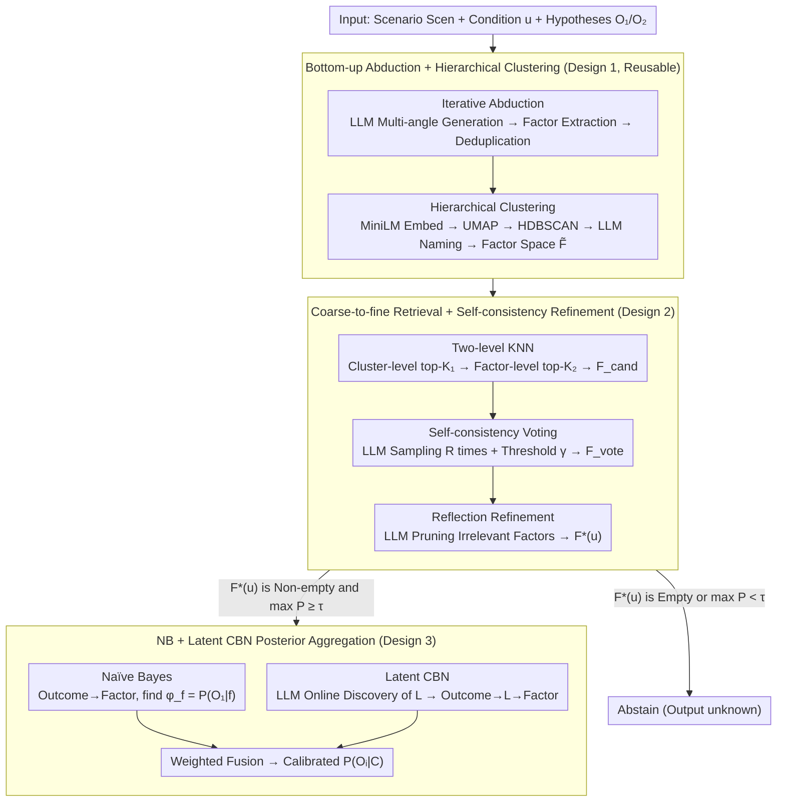

# ANCHOR: Abductive Network Construction with Hierarchical Orchestration for Reliable Probability Inference in Large Language Models

**Conference**: ICML 2026  
**arXiv**: [2605.10328](https://arxiv.org/abs/2605.10328)  
**Code**: Not disclosed  
**Area**: LLM Reasoning / Probabilistic Inference / Causal Bayesian Networks  
**Keywords**: abductive reasoning, Bayesian inference, LLM uncertainty, causal Bayesian network, hierarchical factor space

## TL;DR
ANCHOR constructs a dense factor space using "bottom-up abduction + hierarchical clustering." For downstream conditions, it performs coarse-to-fine retrieval to obtain a sparse set of relevant factors. It then aggregates posteriors by combining Naïve Bayes with a dynamically constructed Causal Bayesian Network (CBN) featuring latent variables. In high-risk LLM decision-making scenarios, it significantly reduces "unknown" predictions and improves probability calibration.

## Background & Motivation

**Background**: In high-risk decision-making such as emergency response and infrastructure planning, obtaining reliable conditional probability $P(O_i|C)$ estimates from LLMs is critical. Mainstream approaches (e.g., BIRD) adopt a two-stage "abduction + Bayesian" framework: the LLM first generates a discrete set of factors $F=\{F_1,\dots,F_N\}$ and their values from a scenario $Scen$, then uses Naïve Bayes to marginalize $P(O_i|C)=\sum_f P(O_i|f)\prod_j P(f_j|C)$.

**Limitations of Prior Work**: A dilemma exists: (a) forward abduction often generates a sparse factor space, leading to downstream conditions $u$ mapping to zero factors and causing the model to output "unknown"; (b) forcibly expanding the factor set introduces noise and pseudo-correlations (e.g., "cold weather" and "wearing heavy coats" are highly correlated), which violates the conditional independence assumption of Naïve Bayes.

**Key Challenge**: There is a trade-off between the coverage of the factor space (to avoid "unknown") and independence (to avoid pseudo-correlation). Furthermore, the numerical confidence levels provided by LLMs are often overconfident and lack interpretability, making them unsuitable for direct use as probabilities.

**Goal**: (1) Construct a factor space that is both dense and structured to balance coverage and noise. (2) Design a reliable "condition $\to$ relevant factor" retrieval mechanism. (3) Explicitly model latent variable dependencies between factors during the probability inference stage to mitigate the distortion of the Naïve Bayes independence assumption.

**Key Insight**: Traditional "top-down abduction" is reversed into **bottom-up abduction**—generating a large volume of supporting/opposing sentences first, extracting factors, and then organizing them into a two-level hierarchy using clustering and LLM-based thematic naming. LLMs are also used for online latent variable structure inference to build a query-level Causal Bayesian Network (CBN) tailored to the specific condition $u$.

**Core Idea**: The process is structured as an end-to-end four-stage pipeline: "Abduction → Factor Extraction → Retrieval → Probability Aggregation." In each stage, the LLM performs tasks it excels at (generation, extraction, naming, causal discovery, flexible priors), while probability calculations are handled by two lightweight models, NB and CBN, which are ultimately fused via weighting.

## Method

### Overall Architecture
ANCHOR receives a scenario description $Scen$, a downstream condition $u$, and two candidate hypotheses $O_1, O_2$, and aims to output a calibrated $P(O_i|C)$. The process is divided into four stages: first, a one-time bottom-up abduction constructs a dense, hierarchical factor space $\tilde{F}$ (reusable across multiple queries). When a condition $u$ arrives, a coarse-to-fine retrieval followed by LLM refinement is performed on $\tilde{F}$ to obtain a sparse relevant factor set $F^*(u)$. The LLM then provides factor-level posteriors and latent variable parameters to construct both a Naïve Bayes network and a latent variable Causal Bayesian Network (CBN). Finally, the posteriors from both networks are weighted and fused. If $F^*(u)$ is empty or $\max_i P(O_i|C) < \tau$, the model abstains and outputs "unknown."

### Key Designs

**1. Bottom-up Abduction + Hierarchical Clustering: Generating Factors before Structuring**

Forward abduction as used in BIRD generates factors directly from scenarios, which is often limited by the prompt's context, resulting in sparse factors and "unknown" outputs. ANCHOR starts from an empty set $F^{(0)}=\emptyset$ and iterates for up to $T_{max}$ rounds. In each round, few-shot prompting is used to generate $b$ supporting/opposing sentences from multiple perspectives. Factors are extracted from these sentences and merged into $F$. Convergence is determined after removing semantic duplicates; theoretically, the error rate of the recovered factor set is bounded by $\exp(-2m(q-0.5)^2)$ under self-consistency voting (where $q$ is single-trial accuracy and $m$ is the number of votes). After gathering sufficient factors, structure is imposed: MiniLM embeddings → UMAP reduction → HDBSCAN clustering (no preset $K$) → LLM-based cluster naming (e.g., "Economic Feasibility") and redundancy pruning. Each factor is labeled as supports $O_1$ / supports $O_2$ / neutral, resulting in a hierarchical space $\tilde{F}$. This decouples "completeness" (free generation) from "organization" (post-hoc clustering), ensuring both coverage and a reusable structure.

**2. Coarse-to-fine Hierarchical Retrieval + Self-consistency Refinement: Mapping $u$ to High-Precision Factor Subsets**

In a dense factor space, brute-force comparison for every $u$ is computationally expensive and introduces pseudo-correlations. ANCHOR calculates a prototype embedding for each cluster: $\tilde{C}_j=\alpha\cdot e_{theme}+(1-\alpha)\cdot \frac{1}{|F_j|}\sum_{f\in F_j} e_f$, blending thematic semantics with member averages. A two-level KNN is performed: top-$K_1$ clusters are selected, followed by top-$K_2$ factors within those clusters. The union forms the high-recall candidates $F_{cand}(u)$, reducing complexity to $O(K_1 K_2)$. Two complementary refinement stages follow: first, the LLM is queried $R$ times to select factors "directly supported by $u$," and factors exceeding a vote threshold $\gamma$ form $F_{vote}(u)$ to suppress stochastic noise. Second, a reflection prompt is used for the LLM to explicitly prune remaining irrelevant factors, resulting in the final $F^*(u)$. Voting handles random noise, while reflection addresses systematic retrieval bias.

**3. NB + Latent CBN Dual-network Flexible Parameters + Posterior Aggregation: Balancing Simplicity and Correlation**

Pure Naïve Bayes assumes conditional independence, which fails when factors within "economic factors" are highly correlated (e.g., cold weather ↔ heavy coats), leading to biased probabilities. ANCHOR constructs two networks simultaneously. The NB structure is simple: the root node Outcome ($O_1/O_2$) connects directly to each factor $f_j$. The LLM provides $\phi_f=P(O_1|f)$, and symmetric priors approximate $P(f|O_1)\approx\phi_f$ and $P(f|O_2)\approx 1-\phi_f$. For the CBN, the LLM acts as a causal discovery engine: given a list of factors, it outputs latent variables $L=\{L_1,\dots,L_k\}$ and their respective factor groupings. The graph structure becomes Outcome $\to L_i \to f_j$. The LLM flexibly populates conditional tables such as $P(L_i=1|O_k)$ and $P(f_j|L_i,O_k)$. Latent variables absorb intra-cluster correlations using LLM priors without training data. Posteriors $P^{NB}(O_i|C)$ and $P^{CBN}(O_i|C)$ are fused via weighted averaging. NB is simple but ignores correlations, while CBN captures correlations but may over-parameterize; fusion compensates for these respective biases. Since latent variables are inferred per query, each CBN is customized, avoiding mismatches from shared latent structures across scenarios.

### Loss & Training
ANCHOR does not involve training neural networks. All probability parameters are obtained flexibly via LLMs. Consequently, only a set of hyperparameters needs to be configured: clustering parameters $K_1, K_2$, cluster prototype weight $\alpha$, self-consistency trials $R$, voting threshold $\gamma$, abstention threshold $\tau$, iteration limit $T_{max}$, target factor count $N_{target}$, and the NB-CBN fusion weight. Experiments utilized GPT-4 series / Qwen models.

## Key Experimental Results

### Main Results
The authors claim that ANCHOR achieves SOTA on a preference-based pairwise evaluation benchmark identical to BIRD. Representative metrics (synthesized from the text):

| Method | "Unknown" Prediction Rate ↓ | Alignment with Human Preference ↑ | Inference Time ↓ | Token Usage ↓ |
| :--- | :--- | :--- | :--- | :--- |
| Direct LLM Estimation | Low | Fairly Low (Overconfident) | Low | Low |
| BIRD (Forward + NB) | High (Sparse Factors) | Moderate | Medium | Medium |
| BIRD + Expanded Factors | Moderate | Moderate-Low (Noise) | High | High |
| **ANCHOR (Full)** | **Significantly Reduced** | **SOTA** | **Significantly Reduced** | **Significantly Reduced** |

### Ablation Study

| Configuration | Observation | Interpretation |
| :--- | :--- | :--- |
| Only Bottom-up Space + NB | Unknown rate drops significantly vs. BIRD, but probabilities are biased | Dense coverage solves the sparsity problem |
| Adding Hierarchical Retrieval (no voting/reflection) | High recall but poor precision in factor selection | Retrieval alone is insufficient; refinement is needed |
| Adding Self-consistency Voting | Precision increases | Voting eliminates stochastic noise factors |
| Adding Reflection Prompt | Further prunes irrelevant factors | Two-stage refinement is complementary |
| Using Pure NB Inference | Biased on strongly correlated factors | Independence assumption fails |
| Using Pure CBN Inference | Unstable structure/over-parameterization | Sensitive to latent variable mismatch |
| **NB + CBN Weighted Fusion** | Best calibration | Mutual noise reduction through complementarity |

### Key Findings
- The simultaneous reduction of "unknown" predictions and inference costs is a major engineering contribution. Once constructed, the structured factor space is reusable, and specific query retrieval + inference requires only $O(K_1 K_2)$ LLM calls, significantly lowering token usage compared to BIRD.
- Self-consistency voting $R$ is sensitive to the recall-precision trade-off. The introduction of reflection prompts is more effective than simply increasing $R$, indicating that "structured criticism" provides more information than "repeated sampling."
- Latent variables are inferred online per query rather than learned globally, ensuring each query has a custom CBN structure and avoiding mismatch issues.

## Highlights & Insights
- **Clean Role Division**: Tasks like generation, extraction, naming, causal discovery, and parameter flexibility are assigned to the LLM (where it excels), while probability calculations are assigned to the graphical models (NB+CBN).
- **Reusable Structure vs. One-off Reasoning**: The factor hierarchy $\tilde{F}$ is constructed once and retrieved repeatedly. This amortizes expensive LLM reasoning into cheaper vector retrieval.
- **Abstention as a First-Class Citizen**: "Unknown" is treated as a valid output. In high-risk scenarios, refusing to answer is more responsible than providing a forced numerical value.
- **Query-level Latent Variable Construction**: Traditional causal inference requires stable structures. This method allows the CBN to vary by query, essentially performing "on-demand causal inference."

## Limitations & Future Work
- Parameter estimation depends on LLM flexibility. If the LLM's conditional probabilities $\phi_f$ are systematically biased (overconfident or reflecting training data bias), the framework will be skewed.
- There is no formal validity check for the LLM-generated CBN structures, posing a risk of "hallucinated latent variables."
- Convergence of bottom-up abduction depends on $T_{max}$ and $N_{target}$. While theoretically sound, quality varies with LLM diversity, and niche scenarios might remain sparse.
- Benchmarking relies on preference-based pairwise comparisons without ground-truth probabilities, making it difficult to judge the absolute calibration of the numerical output.
- The NB+CBN fusion weight is manually specified and lacks an adaptive scheme.

## Related Work & Insights
- **vs. BIRD (Feng et al. 2025)**: BIRD uses forward abduction + a single NB, leading to sparsity and independence violations. ANCHOR addresses these via bottom-up abduction, hierarchy, and CBN fusion.
- **vs. CoT / ToT / Belief Graph**: These are reactive decompositions performed per query. ANCHOR is proactive, pre-building a reusable factor space for higher efficiency.
- **vs. Graph RAG / Hierarchical RAG**: Traditional RAG indexes existing documents. ANCHOR generates the knowledge source (factors) from scratch, suitable for scenarios where domain documents are absent.
- **vs. Internal LLM Uncertainty Methods**: Verbalized confidence is unreliable; ANCHOR externalizes uncertainty through explicit probability graphs, improving interpretability.

## Rating
- Novelty: ⭐⭐⭐⭐ Bottom-up abduction + online CBN construction + NB-CBN fusion is a synergistic combination.
- Experimental Thoroughness: ⭐⭐⭐ Main results and ablations are comprehensive in the appendix, but ground-truth probability calibration and large-scale cross-domain tests are missing.
- Writing Quality: ⭐⭐⭐⭐ The logical chain from motivation to pipeline is clear.
- Value: ⭐⭐⭐⭐ Addresses "reduction of unknowns + calibration + cost reduction" in the context of LLM high-risk decision-making.

<!-- RELATED:START -->

## Related Papers

- [\[ICML 2026\] Emergence of Hierarchical Emotion Organization in Large Language Models](emergence_of_hierarchical_emotion_organization_in_large_language_models.md)
- [\[ACL 2026\] From Static Inference to Dynamic Interaction: A Survey of Streaming Large Language Models](../../ACL2026/llm_nlp/from_static_inference_to_dynamic_interaction_a_survey_of_streaming_large_languag.md)
- [\[ICML 2026\] Scheduling LLM Inference with Uncertainty-Aware Output Length Predictions](scheduling_llm_inference_with_uncertainty-aware_output_length_predictions.md)
- [\[ICML 2026\] Compute as Teacher: Turning Inference Compute Into Reference-Free Supervision](compute_as_teacher_turning_inference_compute_into_reference-free_supervision.md)
- [\[ICML 2026\] Resting Neurons, Active Insights: Robustify Activation Sparsity for Large Language Models](resting_neurons_active_insights_robustify_activation_sparsity_for_large_language.md)

<!-- RELATED:END -->
