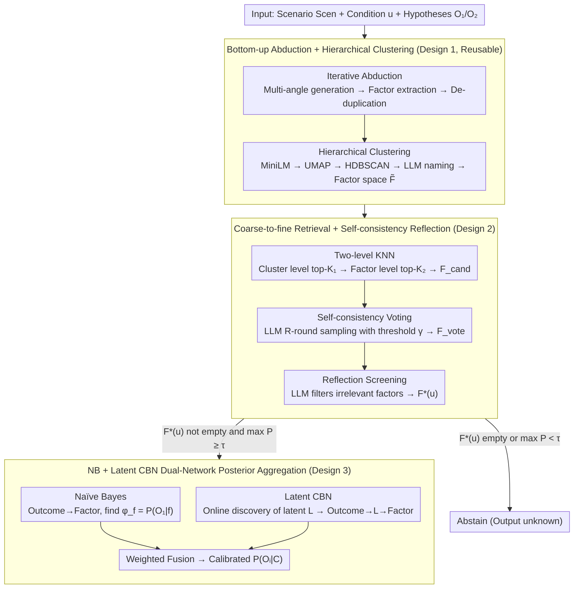

# ANCHOR: Abductive Network Construction with Hierarchical Orchestration for Reliable Probability Inference in Large Language Models

**Conference**: ICML 2026  
**arXiv**: [2605.10328](https://arxiv.org/abs/2605.10328)  
**Code**: Not released  
**Area**: LLM Reasoning / Probability Inference / Causal Bayesian Networks  
**Keywords**: abductive reasoning, Bayesian inference, LLM uncertainty, causal Bayesian network, hierarchical factor space

## TL;DR
ANCHOR utilizes "bottom-up abduction + hierarchical clustering" to construct a dense factor space. It performs coarse-to-fine retrieval for downstream conditions to obtain sparse relevant factor sets and then performs posterior aggregation by combining Naïve Bayes with a query-level latent variable Causal Bayesian Network (CBN). This significantly reduces "unknown" predictions and improves probability calibration in high-risk LLM decision-making scenarios.

## Background & Motivation

**Background**: In high-risk decision-making scenarios such as emergency response and infrastructure planning, there is a need for reliable conditional probability $P(O_i|C)$ estimations from LLMs. Mainstream solutions (e.g., BIRD) adopt a two-stage "abduction + Bayesian" approach—the LLM first generates a discrete factor set $F=\{F_1,\dots,F_N\}$ and their values from a scenario *Scen*, and then marginalization is performed via Naïve Bayes: $P(O_i|C)=\sum_f P(O_i|f)\prod_j P(f_j|C)$.

**Limitations of Prior Work**: A dual dilemma exists: (a) Forward abduction tends to generate sparse factor spaces, causing downstream conditions $u$ to map to zero factors, leading the model to output "unknown"; (b) Forcing an expansion of the factor set introduces noise and creates spurious correlations (e.g., "cold weather" and "wearing thick clothes" are highly correlated), which violates the conditional independence assumption of Naïve Bayes.

**Key Challenge**: There is a trade-off between factor space coverage (to avoid "unknown") and independence (to avoid spurious correlations). Furthermore, numerical confidence scores provided by LLMs themselves are often overconfident and uninterpretable, precluding their direct use as probabilities.

**Goal**: (1) Construct a factor space that is both dense and structured to balance coverage and noise; (2) Design a reliable "condition → relevant factors" retrieval mechanism; (3) Explicitly model latent variable dependencies between factors during the probability inference stage to mitigate the distortion of the Naïve Bayes independence assumption.

**Key Insight**: Reverse traditional "top-down abduction" into **bottom-up abduction**—first generate a large volume of supporting/opposing sentences freely and then extract factors, finally using clustering and LLM-based topic naming to organize factors into a two-level hierarchy. Additionally, use the LLM for online inference of latent variable structures to create a query-level Causal Bayesian Network (CBN) specifically for the current condition $u$.

**Core Idea**: Transform "abduction → factor extraction → retrieval → probability aggregation" into an end-to-end four-stage pipeline. In each stage, the LLM performs tasks it excels at (generation, extraction, naming, causal discovery, flexible priors), while probability computations are handled by two lightweight models—NB and CBN—which are finally fused via weighting.

## Method

### Overall Architecture
ANCHOR receives a scenario description *Scen*, a downstream condition $u$, and two candidate hypotheses $O_1, O_2$, with the goal of outputting a calibrated $P(O_i|C)$. The process is split into four steps: first, a one-time bottom-up abduction constructs a dense hierarchical factor space $\tilde{F}$ (reusable across multiple queries). Once a condition $u$ arrives, coarse-to-fine retrieval and LLM-based self-consistency reflection are performed on $\tilde{F}$ to obtain a sparse relevant factor set $F^*(u)$. Then, the LLM flexibly provides factor-level posteriors and latent variable parameters, while simultaneously building a Naïve Bayes network and a Causal Bayesian Network (CBN) with latent variables. Finally, the posteriors from both networks are weight-fused. If $F^*(u)$ is empty or $\max_i P(O_i|C)<\tau$, the model abstains instead of forcing an answer.

### Key Designs

**1. Bottom-up Abduction + Hierarchical Clustering: Generating Mass Factors Before Structuring**

Forward abduction schemes like BIRD derive factors directly from the scenario, but are limited by prompt context, leading to few factors and causing downstream "unknown" outputs. ANCHOR reverses this: starting from an empty set $F^{(0)}=\emptyset$, it iterates for $T_{max}$ rounds. Each round uses few-shot prompts to let the LLM generate $b$ supporting/opposing sentences from various angles, extracts factors, and merges them into $F$ until convergence. Theoretically, the error rate of the recovered factor set is bounded by $\exp(-2m(q-0.5)^2)$ (where $q$ is single-round accuracy and $m$ is votes), ensuring exponential convergence. After accumulating enough factors, structure is applied: MiniLM embeddings → UMAP → HDBSCAN clustering (no preset $K$) → LLM-based topic naming (e.g., "Economic Feasibility") and redundancy pruning. Each factor is labeled as supports $O_1$ / supports $O_2$ / neutral, resulting in a two-level hierarchy $\tilde{F}$. Decoupling "comprehensiveness" (generation) from "organization" (clustering) ensures both coverage and reusable structure.

**2. Coarse-to-fine Hierarchical Retrieval + Self-consistency Reflection: Mapping $u$ to High-Precision Factor Subsets**

Once the factor space is dense, brute-force comparison for every $u$ becomes computationally expensive, and retrieved factors often include spurious correlations. ANCHOR calculates a prototype embedding for each cluster $\tilde{C}_j=\alpha\cdot e_{theme}+(1-\alpha)\cdot \frac{1}{|F_j|}\sum_{f\in F_j} e_f$, mixing topic semantics with member means via $\alpha$. It then uses two-level KNN—first selecting top-$K_1$ clusters, then selecting top-$K_2$ factors within those clusters as candidate set $F_{cand}(u)$, reducing complexity to $O(K_1 K_2)$. This is followed by two complementary LLM screening stages: first, $R$ LLM calls identify factors "directly supported by $u$," counting votes $v_f(u)=\sum_r \mathbf{1}[f\in m^{(r)}(u)]$ to keep those above threshold $\gamma$ as $F_{vote}(u)$; second, a reflection prompt explicitly removes remaining irrelevant factors to reach $F^*(u)$. "Voting" handles stochastic noise, while "reflection" fixes systematic retrieval bias.

**3. NB + Latent Variable CBN Dual-Network Posterior Aggregation: Balancing Simplicity and Correlation**

Pure Naïve Bayes assumes conditional independence, but factors within themes (e.g., "Economy") are often highly correlated, biasing probabilities when the assumption fails. ANCHOR constructs two networks simultaneously. The NB side is simple: Outcome ($O_1/O_2$) connects directly to each factor $f_j$, querying the LLM for $\phi_f=P(O_1|f)$ and using symmetric priors $P(f|O_1)\approx\phi_f$ and $P(f|O_2)\approx 1-\phi_f$. On the CBN side, the LLM acts as a causal discovery engine: given the factor list, it outputs latent variables $L=\{L_1,\dots,L_k\}$ and their respective factor groupings. The graph becomes Outcome $\to L_i \to f_j$. The LLM then flexibly fills conditional probability tables like $P(L_i=1|O_k)$ and $P(f_j|L_i,O_k)$. Latent variables absorb intra-class correlations purely through LLM priors without training data. Posteriors $P^{NB}(O_i|C)$ and $P^{CBN}(O_i|C)$ are weight-fused: NB favors simplicity, while CBN captures correlation. The latent variables are inferred per query, providing custom CBNs and avoiding "mismatched shared latent structures."

### Loss & Training
ANCHOR does not train neural networks; all probability parameters are obtained flexibly from LLMs. Hyperparameters include: $K_1, K_2$ for clustering, $\alpha$ for cluster prototypes, $R$ and $\gamma$ for self-consistency, $\tau$ for abstention, $T_{max}$ for iteration, $N_{target}$ for factors, and NB-CBN fusion weights. Experiments utilized GPT-4 series / Qwen models.

## Key Experimental Results

### Main Results
The authors claim ANCHOR achieves SOTA on a preference-based pairwise benchmark (multiple LLM-driven decision tasks) consistent with BIRD. Representative metrics (summarized from text/tables):

| Method | "unknown" Rate ↓ | Alignment w/ Human Preference ↑ | Inference Time ↓ | Token Usage ↓ |
|------|-------------------|--------------------|----------|--------------|
| Direct LLM Estimation | Low | Low (Overconfident) | Low | Low |
| BIRD (Forward Abduction + NB) | High (Sparse factors) | Moderate | Medium | Medium |
| BIRD + Expanded Factor Set | Moderate | Moderate-Low (Noise) | High | High |
| **ANCHOR (Full)** | **Significantly Reduced** | **SOTA** | **Significantly Reduced** | **Significantly Reduced** |

### Ablation Study

| Configuration | Phenomenon | Insight |
|------|------|------|
| Only Bottom-up Space + NB | "unknown" rate drops significantly vs BIRD, but prob. is biased | Dense factors solve sparsity |
| + Hierarchical Retrieval (No Refl.) | High recall but poor factor precision | Retrieval alone is insufficient |
| + Self-consistency Voting | Precision recovers | Voting removes stochastic noise |
| + Reflection Prompt | Further filters irrelevant factors | Two-stage screening is complementary |
| Pure NB Inference | Biased on highly correlated factors | Independence assumption fails |
| Pure CBN Inference | Unstable structure, prone to over-parameterization | Sensitive to latent mismatch |
| **NB + CBN Fusion** | Best calibration | Complementary noise reduction |

### Key Findings
- Reducing "unknown" while lowering inference cost is ANCHOR's primary engineering contribution—one factor space construction can be reused across multiple queries.
- $R$ for self-consistency is sensitive for recall-precision trade-offs; reflection prompts are more effective than simply increasing $R$.
- Latent variables are inferred online per query rather than learned globally, avoiding structure mismatch across scenarios.

## Highlights & Insights
- **Clean Division of Labor**: High-level tasks (generation, extraction, causal discovery) go to the LLM; mathematical logic (probability computation) goes to NB+CBN. This "Probability Engine + LLM Knowledge Base" split is an excellent paradigm.
- **Reusable Structure vs. One-off Inference**: The hierarchy $\tilde{F}$ is built once. Downstream queries use cheap vector retrieval instead of expensive LLM generation, making the system engineering-friendly.
- **Abstention as a First-Class Citizen**: Explicitly treating "unknown" as a valid output is responsible for high-risk scenarios.
- **On-demand Causal Inference**: Traditional inference requires stable structures; ANCHOR allows CBN to change per query, effectively performing "on-demand causal inference."

## Limitations & Future Work
- Parameters rely on LLM flexibility; if LLM conditional probabilities $\phi_f$ are systematically biased, the whole framework follows.
- CBN structures lack formal validity checks, posing a risk of "hallucinated latent variables."
- Bottom-up abduction quality varies with LLM diversity; niche scenarios might still result in sparse factors.
- Evaluation relies on preference-based pairwise metrics without ground-truth probabilities, making it hard to verify actual numerical calibration.
- NB+CBN fusion weights are manually specified rather than adaptive.

## Related Work & Insights
- **vs BIRD (Feng et al. 2025)**: BIRD uses forward abduction + NB, suffering from sparsity and independence violations. ANCHOR addresses both via bottom-up hierarchy and CBN.
- **vs CoT / ToT / Belief Graph**: These are reactive decompositions; ANCHOR is proactive by pre-building a reusable factor space.
- **vs Graph RAG / Hierarchical RAG**: Traditional RAG indexes existing docs; ANCHOR generates the knowledge source (factors) from scratch for decision scenarios.

## Rating
- Novelty: ⭐⭐⭐⭐ Bottom-up abduction + on-demand CBN + NB-CBN fusion is a novel organic combination.
- Experimental Thoroughness: ⭐⭐⭐ Comprehensive ablations, but lacks ground-truth probability calibration and large-scale cross-domain tests.
- Writing Quality: ⭐⭐⭐⭐ Clear logical chain from motivation to pipeline.
- Value: ⭐⭐⭐⭐ Successfully addresses "unknowns + calibration + cost" simultaneously for high-risk LLM decisions.

<!-- RELATED:START -->

## Related Papers

- [\[ACL 2026\] From Static Inference to Dynamic Interaction: A Survey of Streaming Large Language Models](../../ACL2026/llm_nlp/from_static_inference_to_dynamic_interaction_a_survey_of_streaming_large_languag.md)
- [\[ICML 2026\] Scheduling LLM Inference with Uncertainty-Aware Output Length Predictions](scheduling_llm_inference_with_uncertainty-aware_output_length_predictions.md)
- [\[ICML 2026\] Compute as Teacher: Turning Inference Compute Into Reference-Free Supervision](compute_as_teacher_turning_inference_compute_into_reference-free_supervision.md)
- [\[ACL 2025\] Turning Trash into Treasure: Accelerating Inference of Large Language Models with Token Recycling](../../ACL2025/llm_nlp/token_recycling.md)
- [\[ICML 2026\] Resting Neurons, Active Insights: Robustify Activation Sparsity for Large Language Models](resting_neurons_active_insights_robustify_activation_sparsity_for_large_language.md)

<!-- RELATED:END -->
