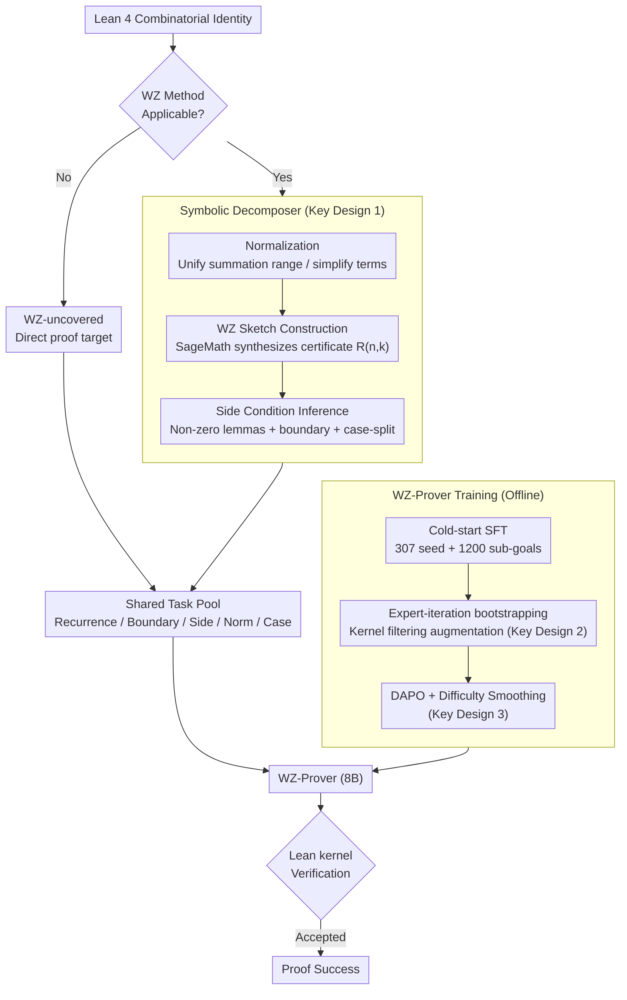

# Automated Formal Proofs of Combinatorial Identities via Wilf–Zeilberger Guidance and LLMs

**Conference**: ICML 2026  
**arXiv**: [2605.04472](https://arxiv.org/abs/2605.04472)  
**Code**: Not yet public  
**Area**: LLM Reasoning / Automated Theorem Proving / Neuro-symbolic  
**Keywords**: Lean 4, Combinatorial Identities, Wilf-Zeilberger, Neuro-symbolic, DAPO

## TL;DR
WZ-LLM compiles the classic Wilf–Zeilberger symbolic proof pipeline into an executable proof skeleton (recurrence + boundary conditions + side conditions) in Lean 4. These components are discharged by WZ-Prover, a specialized model trained via SFT + expert-iteration + DAPO. On 100 classic combinatorial identities, it improves the pass@32 from Goedel-Prover-V2's 9% to 34%.

## Background & Motivation

**Background**: LLM-based Automated Theorem Proving (ATP) has achieved competition-level performance in interactive proof assistants such as Lean and Isabelle (e.g., DeepSeek-Prover-V2, Kimina, Goedel-Prover-V2). However, combinatorics is widely regarded as one of the most difficult domains for ATP, and "combinatorial identities" represent a fundamental and ubiquitous class of propositions.

**Limitations of Prior Work**: 1) Proving combinatorial identities requires long-range planning; without a global roadmap, LLMs fall into unlimited search and combinatorial explosion. 2) Training data for combinatorics in Lean is extremely scarce. 3) Pure symbolic methods (WZ, creative telescoping) are efficient in CAS (Computer Algebra Systems), but their outputs cannot be directly translated into proof assistants—requiring the reconstruction of telescoping arguments, boundary conditions, normalization, and various non-zero side conditions, which makes the "formalization cost" exceed the original proof cost. 4) Existing whole-proof LLMs lack intermediate verifier signals, while tactic-by-tactic models suffer from branch explosion.

**Key Challenge**: Long-range proofs requires explicit planning, which LLMs lack; symbolic methods inherently provide planning, but their output is non-formalizable. These two routes each have distinct strengths but remain disconnected.

**Goal**: To integrate the "planning capability" of WZ with the "formalization capability" of LLMs, enabling the resolution of identities that neither pure symbolic methods nor pure LLMs can solve independently.

**Key Insight**: The authors observe that the WZ method naturally provides a "sketch"—after constructing the WZ pair $G(n,k)=R(n,k)F(n,k)$, the identity automatically decomposes into a set of machine-verifiable sub-goals: "recurrence lemma + boundary conditions + side conditions + normalization + case-split". This structure is ideal for Lean 4; using it as an intermediate scaffold for LLMs reduces the search space and provides verifier signals.

**Core Idea**: Replace pure LLM or pure symbolic methods with a dual-path neuro-symbolic system consisting of **"WZ Symbolic Decomposition (external CAS generates sketch) + specially trained WZ-Prover (discharges sketch sub-goals + handles WZ-uncovered identities)"**.

## Method

### Overall Architecture
WZ-LLM addresses combinatorial identities that pure symbolic methods and pure LLMs both fail to solve by integrating them into two paths. Given a Lean 4 formalization of an identity, **Symbolic Decomposition** first performs normalization, then invokes SageMath's WZ algorithm to synthesize a certificate. If successful, the problem is decomposed into a set of structured Lean sub-goals $\mathcal{T}=\mathcal{T}_{\text{rec}}\cup\mathcal{T}_{\text{bd}}\cup\mathcal{T}_{\text{side}}\cup\mathcal{T}_{\text{norm}}\cup\mathcal{T}_{\text{case}}$ (recurrence/boundary/side conditions/normalization/case-split). If it fails, the problem enters the "direct proof pool." Both types of tasks are assigned to **WZ-Prover**—a specialized 8B Lean 4 prover initialized from Goedel-Prover-V2 and trained through three stages—to discharge them term-by-term. Finally, the Lean kernel provides the definitive verification; the proof is successful only if the kernel accepts it.

### Key Designs

**1. WZ Symbolic Decomposer: Translating symbolic certificates into Lean obligations**

The primary bottleneck in formalizing combinatorial identities in Lean is not the main telescoping argument, but rather the implicit obligations such as boundaries and side conditions—certificates provided by CAS are mathematically correct but cannot be mechanically inserted into a proof assistant. The decomposer explicitly exposes these obligations through three steps. First, **Normalization** unifies `Icc/Ico` into `Finset.range`, shifts indices to start from 0, and flattens syntax variants of factorials, binomials, and powers. Piecewise predicates such as parity are structurally case-split. Next, **Sketch Construction** uses SageMath's `F.WZ_certificate(n,k)` to synthesize the rational function $R(n,k)$, ensuring $G(n,k)=R(n,k)F(n,k)$ satisfies the WZ equation $F(n+1,k)-F(n,k)=G(n,k+1)-G(n,k)$, reducing the original identity to a "recurrence lemma + boundary obligation". Finally, **Side Condition Inference** uses symbolic simplification to identify zero denominators or negative factorial parameters beforehand, generating non-vanishing lemmas (`∀n,k, A(n,k)≠0`) and boundary sub-goals. Exposing these small targets is the key to transforming a sketch from "mathematically correct" to "machine-executable."

**2. Expert-in-the-loop Bootstrapping: High-fidelity data augmentation via kernel filtering**

Formal Lean data for combinatorics is scarce, and manual annotation does not scale, while LLM self-generation is prone to hallucinations. This method uses the kernel as a filter. Stage 1 involves cold-start SFT on 307 manual identities + 1200 sub-goals. Stage 2 runs WZ-LLM on 1020 unlabeled candidate identities; **only proofs strictly verified by the Lean kernel** enter the training set. Round 1 yielded 5139 lemma proofs + 32 full proofs; Round 2 added 532 + 79, resulting in ~5418 expanded SFT samples. By using the kernel as a hard constraint, noise is naturally filtered, ensuring the training distribution is not polluted by model errors.

**3. DAPO with Difficulty-Smoothing: Concentrating compute on "solvable but non-trivial" problems**

Under sparse binary kernel rewards, naive RL often overfits easy problems and fails on difficult ones. Following SFT, this step enhances robustness for hard problems and long-chain lemmas. **Difficulty Smoothing** is first applied: since many sketch lemmas are short, rollouts estimate the pass-rate for each problem, and both trivial and near-zero success rate samples are pruned to leave a medium-to-hard distribution. **DAPO optimization** follows, with the reward defined as:

$$R(\pi;G)=R_{\text{out}}(\pi;G)+\lambda_{\text{len}}R_{\text{len}}(\pi)$$

where $R_{\text{out}}\in\{+1,-1\}$ is the signal from the Lean kernel, and $R_{\text{len}}$ is a penalty applied as those approaching the token budget, preventing false negative rewards due to hard truncation.

### Loss & Training
The three-stage pipeline consists of: (i) SFT on 307 seeds + 1200 lemmas; (ii) expert-iteration expanding to ~5418 verified samples; (iii) DAPO RL with rule-based outcome rewards + soft punishment for overlong proofs. Training took 16 GPU-days and evaluation took 9 GPU-days on a 4× L40s-48GB setup for an 8B model.

## Key Experimental Results

### Main Results
End-to-end proof success rate (pass@32) on LCI-Test (100 classic combinatorial identities formalized in Lean 4):

| Method | Model | LCI-Test pass@32 |
|------|------|------|
| DeepSeek-V3 | 685B | 1/100 |
| Gemini-3.1-Pro-Preview | — | 16/100 |
| Kimina-Prover-Distill | 7B | 6/100 |
| DeepSeek-Prover-V2 | 7B | 6/100 |
| Goedel-Prover-V2 (baseline) | 8B | 9/100 |
| WZ-Sketch + Goedel-Prover-V2 | 8B | 9/100 |
| WZ-Prover (only direct) | 8B | 12/100 |
| WZ-Sketch + WZ-Prover | 8B | 29/100 |
| **WZ-LLM (Combined Path)** | **8B** | **34/100** |

Cross-dataset generalization: Performance on CombiBench increased from 12 to 16/100, and on PutnamBench-Comb from 0 to 3/36, outperforming all baselines.

### Ablation Study

| Training Stage | pass@1 | pass@8 | pass@32 |
|----------|--------|--------|---------|
| SFT (seed only) | 1/100 | 3/100 | 9/100 |
| + expert-iteration | 3/100 | 6/100 | 10/100 |
| + DAPO refinement | 4/100 | 6/100 | 12/100 |

Lemma-level diagnosis (1178 sub-goals extracted from sketches):

| Model | #Proved / 1178 | Acc | E2E #Solved / 46 |
|------|-----|-----|------|
| Goedel-Prover-V2 | 564 | 47.88% | 0 |
| WZ-Prover | 864 | 73.34% | 29 |

### Key Findings
- **Sketch alone is insufficient**: Applying sketches to the non-specialized Goedel-V2 yielded no gain (9→9) because an end-to-end proof requires discharging **all** sketch lemmas; a 47.88% lemma accuracy leads to zero full-proof completions. Improving this to 73.34% unlocked 29 problems, showing that a specialized prover and specialized sketch must coexist.
- **Direct + sketch paths are complementary**: 5 hard identities unsuitable for WZ were solved directly by WZ-Prover (which symbolic methods alone cannot do), while 29 WZ-suitable problems were completed via the sketch path, totaling 34.
- **DAPO gains are concentrated in pass@32**: Pass@1 only increased by 1, while pass@32 increased by 2, indicating that RL primarily enables "long-tail hard problems" to be captured under higher sampling budgets.

## Highlights & Insights
- Using classic symbolic methods as "executable sketch generators" provides a clear composite approach: it bypasses the weak long-range planning of LLMs and the non-formalizable output of CAS, making their respective strengths additive.
- "Verifier-filtered bootstrapping" is a robust data augmentation strategy in kernel-checked environments like Lean, allowing the model to approach its performance ceiling through self-generation and strict filtering.
- The combination of DAPO and difficulty smoothing provides a reusable recipe for scenarios with sparse binary rewards, avoiding reliance on manual difficulty grading by using rollout-based binning.

## Limitations & Future Work
- While the 8B model and 16 GPU-day training are accessible, 66 problems on LCI-Test remain unsolved, and only 3/36 were solved on PutnamBench-Comb, indicating that the ceiling for long-range combinatorial proof capability is far from reached.
- The pipeline is sensitive to the evolution of the Lean 4 mathlib API; the sketch component is highly coupled with current `Finset/Nat.factorial` interfaces.
- The WZ method only covers hypergeometric/holonomic identities; new symbolic engines are required for non-hypergeometric identities (e.g., q-series, involutive arguments).

## Related Work & Insights
- **vs whole-proof LLMs (DeepSeek-Prover-V2, etc.)**: These rely on end-to-end generation without explicit planning; WZ-LLM outsources "long-range planning" to mature symbolic algorithms.
- **vs tactic-level search (InternLM-2.5-StepProver, etc.)**: These search in the tactic space, facing branch explosion; WZ-LLM plans at a higher sketch level and uses a whole-proof prover for each sub-goal.
- **vs Harrison’s HOL Light work**: While the idea of CAS-generated certificates is similar, Harrison's approach involved manual embedding; WZ-LLM modernizes this by delegating the labor-intensive formalization to an LLM-Prover.

## Rating
- Novelty: ⭐⭐⭐⭐ The framing of "compiling symbolic sketches into LLM-provable Lean sub-goals" is an innovative contribution to ATP.
- Experimental Thoroughness: ⭐⭐⭐⭐ Evaluation across three benchmarks and dual ablations on components and training stages are comprehensive.
- Writing Quality: ⭐⭐⭐⭐ The neuro-symbolic architecture and training pipeline are clearly explained with sufficient mathematical background.
- Value: ⭐⭐⭐⭐ Provides a reusable recipe for "symbolic-guided LLM discharge" in Lean that could generalize to other CAS-heavy domains like integration and ODEs.

<!-- RELATED:START -->

## Related Papers

- [\[ICLR 2026\] Rethinking Code Similarity for Automated Algorithm Design with LLMs](../../ICLR2026/llm_nlp/rethinking_code_similarity_for_automated_algorithm_design_with_llms.md)
- [\[CVPR 2026\] Single-step Diffusion-based Video Coding with Semantic-Temporal Guidance](../../CVPR2026/llm_nlp/single-step_diffusion-based_video_coding_with_semantic-temporal_guidance.md)
- [\[ACL 2025\] Can LLMs Reason About Program Semantics? A Comprehensive Evaluation of LLMs on Formal Specification Inference](../../ACL2025/llm_nlp/can_llms_reason_about_program_semantics_a_comprehensive_evaluation_of_llms_on_fo.md)
- [\[ACL 2025\] Hierarchical Attention Generates Better Proofs](../../ACL2025/llm_nlp/hierarchical_attention_generates_better_proofs.md)
- [\[ICML 2025\] RULEBREAKERS: Challenging LLMs at the Crossroads between Formal Logic and Human-like Reasoning](../../ICML2025/llm_nlp/rulebreakers_challenging_llms_at_the_crossroads_between_formal_logic_and_human-l.md)

<!-- RELATED:END -->
