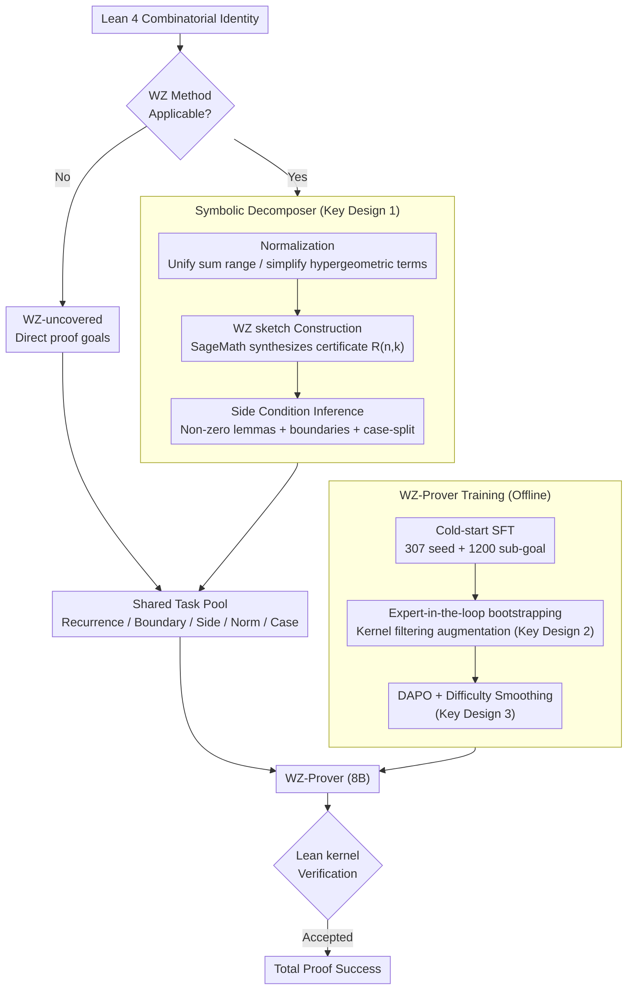

# Automated Formal Proofs of Combinatorial Identities via Wilf–Zeilberger Guidance and LLMs

**Conference**: ICML 2026  
**arXiv**: [2605.04472](https://arxiv.org/abs/2605.04472)  
**Code**: Not yet public  
**Area**: LLM Reasoning / Automated Theorem Proving / Neuro-symbolic  
**Keywords**: Lean 4, Combinatorial Identities, Wilf-Zeilberger, Neuro-symbolic, DAPO

## TL;DR
WZ-LLM compiles the classic Wilf–Zeilberger symbolic proof process into executable proof sketches in Lean 4 (recurrence + boundary conditions + side conditions). These are then discharged term-by-term by WZ-Prover, a model specifically trained via SFT + expert-iteration + DAPO. On 100 classic combinatorial identities, it improves the pass@32 from Goedel-Prover-V2's 9% to 34%.

## Background & Motivation

**Background**: LLM-based Automated Theorem Proving (ATP) has achieved competition-level performance in interactive proof assistants like Lean and Isabelle (e.g., DeepSeek-Prover-V2, Kimina, Goedel-Prover-V2). However, combinatorics is widely considered one of the most difficult domains for ATP, and "combinatorial identities" are a foundational and pervasive class of propositions within it.

**Limitations of Prior Work**: 1) Proving combinatorial identities requires long-range planning; without a global roadmap, LLMs fall into unlimited search and combinatorial explosion. 2) Training data for combinatorics in Lean is extremely scarce. 3) Pure symbolic methods (WZ, creative telescoping) are highly efficient in CAS (Computer Algebra Systems), but their outputs cannot be directly translated into proof assistants—reconstructing telescoping arguments, boundary conditions, normalization steps, and non-zero side conditions creates a "formalization cost" that outweighs the original proof effort. 4) Existing whole-proof LLMs lack intermediate verifier signals, while tactic-by-tactic models suffer from branch explosion.

**Key Challenge**: Long-range proofs require explicit planning, which LLMs lack; symbolic methods inherently possess planning, but their products are non-formalizable. These two pathways excel in different areas but are mutually incompatible.

**Goal**: Weld the "planning capability" of WZ with the "formalization capability" of LLMs to cover a class of identities that neither pure symbolic methods nor pure LLMs can handle effectively.

**Key Insight**: The authors observe that the WZ method naturally provides a "sketch"—after constructing the WZ pair $G(n,k)=R(n,k)F(n,k)$, the identity automatically decomposes into a set of machine-verifiable sub-goals: "recurrence lemma + boundary conditions + side conditions + normalization + case-split." This structure aligns perfectly with Lean 4, where using it as an intermediate scaffold for LLMs reduces the search space and provides verifier signals.

**Core Idea**: Replace pure LLM or pure symbolic methods with a dual-path neuro-symbolic system consisting of **"WZ Symbolic Decomposition (external CAS generates sketch) + Specially trained WZ-Prover (discharging sketch sub-goals + fallback for WZ-uncovered identities)."**

## Method

### Overall Architecture
WZ-LLM solves combinatorial identities by welding symbolic and LLM pathways together. Given a Lean 4 identity, **Symbolic Decomposition** first performs normalization and calls SageMath's WZ algorithm to synthesize a certificate. If successful, it decomposes the problem into a set of structured Lean sub-goals $\mathcal{T}=\mathcal{T}_{\text{rec}}\cup\mathcal{T}_{\text{bd}}\cup\mathcal{T}_{\text{side}}\cup\mathcal{T}_{\text{norm}}\cup\mathcal{T}_{\text{case}}$ (recurrence/boundary/side conditions/normalization/case-split). If it fails, the problem enters a "direct proof pool." Both task types are handled by **WZ-Prover**—a specialized 8B Lean 4 prover initialized from Goedel-Prover-V2 and trained in three stages. Finally, the Lean kernel validates the result.

### Key Designs

**1. WZ Symbolic Decomposer: Translating symbolic certificates into closed-loop Lean obligations**  
The main bottleneck in formalizing combinatorial identities in Lean is often implicit obligations like boundaries and side conditions rather than the core telescoping argument. The decomposer makes these obligations explicit. First, **Normalization** unifies `Icc/Ico` into `Finset.range`, shifts indices to start from 0, and flattens syntax variants of factorials, binomials, and powers to provide a clean interface for subsequent tactics. Second, **Sketch Construction** uses SageMath's `F.WZ_certificate(n,k)` to synthesize a rational function $R(n,k)$ such that the WZ pair $G(n,k)=R(n,k)F(n,k)$ satisfies $F(n+1,k)-F(n,k)=G(n,k+1)-G(n,k)$, reducing the original identity to a set of sub-goals. Finally, **Side Condition Inference** uses symbolic simplification to identify zero denominators or negative factorial parameters that would stall tactics like `field_simp`, generating non-vanishing lemmas (`∀n,k, A(n,k)≠0`) and boundary obligations.

**2. Expert-in-the-loop bootstrapping: High-fidelity data augmentation via kernel filtering**  
Lean training data for combinatorics is extremely scarce and difficult to scale manually, while LLM-generated data can contain hallucinations. WZ-LLM resolves this by using the kernel as a filter. In the first stage, it performs cold-start SFT on 307 manually formalized identities and their 1200 sketch-derived sub-goals. In the second stage, it runs both WZ-LLM paths on 1020 unlabelled candidate identities. **Only proofs strictly verified by the Lean kernel** are added to the training pool. This process naturally filters out noise, ensuring the training distribution is not contaminated by model errors.

**3. DAPO with Difficulty-Smoothing: Concentrating compute on "non-trivial but solvable" problems**  
Under sparse binary kernel rewards, naive RL often overfits easy problems and collapses on hard ones. After SFT, the authors refine the model's robustness. First, **Difficulty Smoothing** uses rollouts to estimate the pass rate for each identity under the current policy, removing trivial and near-zero success tasks to retain a medium-to-hard distribution. Second, **DAPO Optimization** is applied with the reward:
$$R(\pi;G)=R_{\text{out}}(\pi;G)+\lambda_{\text{len}}R_{\text{len}}(\pi)$$
where $R_{\text{out}}\in\{+1,-1\}$ is the Lean kernel validation signal, and $R_{\text{len}}$ is a progressive penalty for proofs nearing the token budget. This prevents long proofs from being truncated while wrongly receiving negative rewards.

### Loss & Training
The three stages are sequenced as: (i) SFT on 307 seed + 1200 lemmas; (ii) expert-iteration expanding to ~5418 verified samples; (iii) DAPO RL with rule-based outcome rewards and soft overlong punishment. Training took 16 GPU-days on 4× L40s-48GB.

## Key Experimental Results

### Main Results
Pass@32 end-to-end proof success rate on LCI-Test (100 classic combinatorial identities formalized in Lean 4):

| Method | Model | LCI-Test pass@32 |
|------|------|------|
| DeepSeek-V3 | 685B | 1/100 |
| Gemini-3.1-Pro-Preview | — | 16/100 |
| Kimina-Prover-Distill | 7B | 6/100 |
| DeepSeek-Prover-V2 | 7B | 6/100 |
| Goedel-Prover-V2 (baseline) | 8B | 9/100 |
| WZ-Sketch + Goedel-Prover-V2 | 8B | 9/100 |
| WZ-Prover (only direct) | 8B | 12/100 |
| WZ-Sketch + WZ-Prover | 8B | 29/100 |
| **WZ-LLM (Combined)** | **8B** | **34/100** |

Cross-dataset generalization: Improved from 12→16/100 on CombiBench and 0→3/36 on PutnamBench-Comb.

### Ablation Study

| Training Stage | pass@1 | pass@8 | pass@32 |
|----------|--------|--------|---------|
| SFT (seed only) | 1/100 | 3/100 | 9/100 |
| + expert-iteration | 3/100 | 6/100 | 10/100 |
| + DAPO refinement | 4/100 | 6/100 | 12/100 |

Lemma-level diagnosis (1178 sub-goals from sketches):

| Model | #Proved / 1178 | Acc | End-to-end #Solved / 46 |
|------|-----|-----|------|
| Goedel-Prover-V2 | 564 | 47.88% | 0 |
| WZ-Prover | 864 | 73.34% | 29 |

### Key Findings
- **Sketch alone is insufficient**: Applying sketches to an unspecialized model like Goedel-V2 yielded no gain (9→9), because a total proof requires **all** sketch lemmas to be discharged. The increase in lemma accuracy from 47.88% to 73.34% was required to unlock 29 end-to-end successful proofs.
- **Direct + sketch paths are complementary**: 5 hard identities outside the WZ scope were proved directly by WZ-Prover, while 29 WZ-applicable identities were completed via the sketch path.
- **DAPO gains are concentrated in pass@32**: Pass@1 improved by only +1, while pass@32 improved by +2, suggesting RL helps the model capture "long-tail" difficult problems with larger sampling budgets.

## Highlights & Insights
- Treating classic symbolic methods as "executable sketch generators" is a clean hybrid approach: it bypasses the planning weaknesses of LLMs and the formalization hurdles of CAS, making the strengths of both additive.
- "Verifier-filtered bootstrapping" is a highly effective data augmentation strategy in kernel-checked environments like Lean; the training set scales with the model's own capabilities while remaining noise-free.
- The combination of DAPO and difficulty smoothing provides a reusable recipe for sparse binary reward scenarios: segmenting the task pool by difficulty before RL avoids gradient noise from impossible tasks.

## Limitations & Future Work
- While efficient, the 8B model still leaves 66 identities unsolved in LCI-Test and only solves 3/36 in PutnamBench-Comb, indicating a significant remaining gap in long-range combinatorial reasoning.
- The pipeline is sensitive to Lean 4 mathlib API evolution; changes in `Finset` or `Nat.factorial` interfaces require re-aligning normalization rules.
- WZ is limited to hypergeometric/holonomic identities; new symbolic engines are needed for non-hypergeometric identities such as q-series or involution arguments.

## Related Work & Insights
- **vs. DeepSeek-Prover-V2**: These rely on end-to-end generation without explicit planning; WZ-LLM out-sources "planning" to mature symbolic algorithms.
- **vs. InternLM-2.5-StepProver**: These search through the tactic space and suffer from branch explosion; WZ-LLM plans at the higher level of sketches.
- **vs. Harrison's work in HOL Light**: While the idea of formalizing WZ certificates is similar, Harrison used manual embedding; WZ-LLM automates the most labor-intensive formalization steps using an LLM-prover.

## Rating
- Novelty: ⭐⭐⭐⭐ The framing of "compiling symbolic sketches into provable Lean sub-goals" is a fresh take on ATP.
- Experimental Thoroughness: ⭐⭐⭐⭐ Solid evaluations across three benchmarks and dual ablations (components and training stages).
- Writing Quality: ⭐⭐⭐⭐ Clear descriptions of the neuro-symbolic architecture and training pipeline.
- Value: ⭐⭐⭐⭐ Provides a reusable recipe for "symbolic guidance + LLM discharge" that can be applied to other CAS-supported domains like integration or ODEs.

<!-- RELATED:START -->

## Related Papers

- [\[ICLR 2026\] Rethinking Code Similarity for Automated Algorithm Design with LLMs](../../ICLR2026/llm_nlp/rethinking_code_similarity_for_automated_algorithm_design_with_llms.md)
- [\[ACL 2025\] Can LLMs Reason About Program Semantics? A Comprehensive Evaluation of LLMs on Formal Specification Inference](../../ACL2025/llm_nlp/can_llms_reason_about_program_semantics_a_comprehensive_evaluation_of_llms_on_fo.md)
- [\[ACL 2025\] Hierarchical Attention Generates Better Proofs](../../ACL2025/llm_nlp/hierarchical_attention_generates_better_proofs.md)
- [\[ICML 2025\] RULEBREAKERS: Challenging LLMs at the Crossroads between Formal Logic and Human-like Reasoning](../../ICML2025/llm_nlp/rulebreakers_challenging_llms_at_the_crossroads_between_formal_logic_and_human-l.md)
- [\[ACL 2026\] Solver-Independent Automated Problem Formulation via LLMs for High-Cost Simulation-Driven Design](../../ACL2026/llm_nlp/solver-independent_automated_problem_formulation_via_llms_for_high-cost_simulati.md)

<!-- RELATED:END -->
